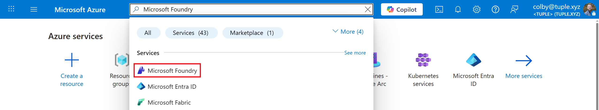
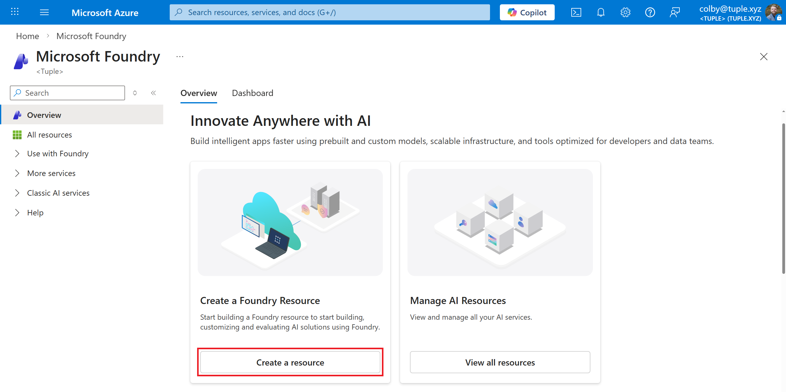
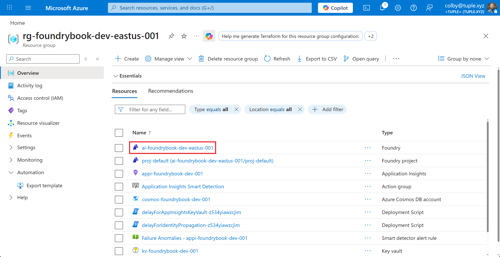
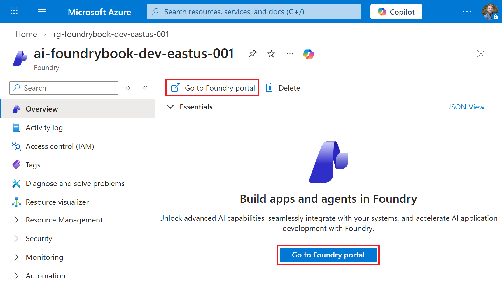
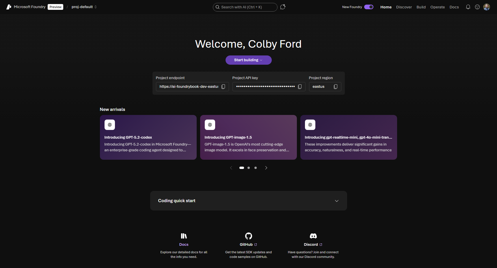
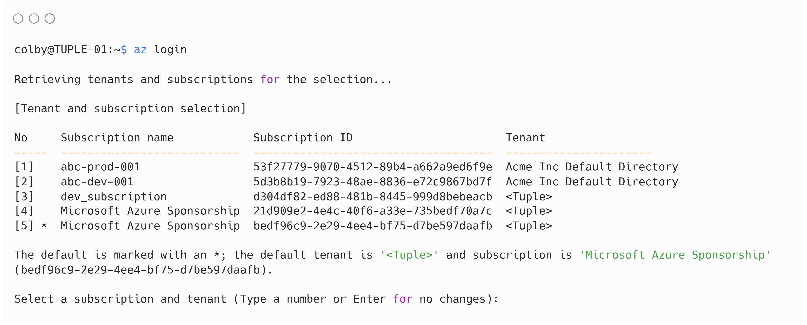

# Introduction

In this chapter, we will get introduced to the Microsoft Foundry service and learn how to create their first Project resource in Azure.

## What is Microsoft Foundry?

**Microsoft Foundry** is a unified Azure platform-as-a-service offering for enterprise AI operations, model builders, and application development. This new platform, announced at the Microsoft Ignite Conference in November 2025, combines production-grade AI deployment options with a low-code interface, enabling developers to focus on building applications rather than managing AI infrastructure.

Microsoft Foundry unifies agents, models, and tools under a single management grouping with built-in enterprise-readiness capabilities including tracing, monitoring, evaluations, and customizable enterprise setup configurations. The platform provides streamlined management through unified Role-based access control (RBAC), networking, and policies under one Azure resource provider namespace.

### Key Capabilities

Microsoft Foundry delivers a modernized experience with powerful enhancements designed for flexibility and scale:

* **Multi-Agent Orchestration and Workflows** – Build advanced automation using SDKs for C# and Python that enable collaborative agent behavior and complex workflow execution.
* **Expanded Integration Options** – Publish agents to Microsoft 365 and Teams, plus leverage containerized deployments for greater portability.
* **Expanded Tool Access** – Access the Foundry tool catalog (preview) with a public tool catalog and your own private catalogs, connecting over 1,400 tools in Microsoft Foundry.
* **Enhanced Memory Capabilities** – Use memory to help your agent retain and recall contextual information across interactions. Memory maintains continuity, adapts to user needs, and delivers tailored experiences without requiring repeated input.
* **Knowledge Integration** – Connect your agent to a Foundry IQ (powered by Azure AI Search) knowledge base to ground responses in enterprise or web content.
* **Real-Time Observability** – Monitor performance and governance using built-in metrics and model tracking tools.
* **Centralized AI asset management** - Observe, optimize, and manage 100% of your AI assets (agents, models, tools) in one place, the **Operate** section.

##	Exploration of frontier models, open-source models

Microsoft Foundry provides access to a wide variety of AI models from multiple sources:

### Models Provided Directly on Foundry

These models are offered and supported directly by Microsoft and include:

* **Azure OpenAI Models** - GPT 5, Sora 2, GPT-4o, and other OpenAI models
* **Microsoft Models** - Phi family models (e.g., Phi-4) and other specialized models from Microsoft and Microsoft Research such as MedImageParse, EvoDiff, Aurora, etc.
* **Third-Party Models** - Mistral, Claude, xAI, DeepSeek, and other models provided directly on Azure
* **Hugging Face Models** - Over 10,000 models from huggingface.co


##	Deploying Foundry resources/projects

Microsoft Foundry utilizes two services in Azure: the Foundry Resource and the Foundry Project.


A Foundry Resource can organize the items you create for multiple use cases, and is typically shared between a team of developers that work on use cases in a similar business or data domain. We manage security and governance and broad access controls at the Resource level.

A Foundry Project is where you do most of your development work. You can think of Projects as folders to group related work. Projects provide developers with self-serve capabilities to independently create new environments for exploring ideas and building prototypes, while managing data in isolation. Projects act as secure units of isolation and collaboration where agents share file storage, thread storage (conversation history), and search indexes. We manage more specific items at the Project-level, including deployments, RBAC to specific models, monitoring agents, etc.

Next, we'll start by creating both a Foundry Resource and Project.

### Prerequisites

Before creating a Foundry Resource and Project, ensure you have:

* Access to the [Azure Portal](https://portal.azure.com) with an active Azure Subscription
* Permissions to create a Foundry resource (such as an **Owner** or **Contributor** role in your Subscription, or a custom role with the `Microsoft.CognitiveServices/accounts/write` permission granted.)
* Access to the Foundry portal at [https://ai.azure.com](https://ai.azure.com)

###	Exercise: Deploy an AI Project in Azure

Follow these steps to create your first Foundry project:

1. Navigate to the Azure Portal: [https://portal.azure.com](https://portal.azure.com)

At the top of the Azure Portal, you may see some of the previous services that you've accessed. Above this line of icons, click inside the search box.


In the search box, simply type "Microsoft Foundry". In the search results, locate the **Microsoft Foundry** option under the **Services** section and click on it.



A new panel will open for Microsoft Foundry. Feel free to explore. If you're using your work or school account, you may see other Foundry Projects that others in your organization have deployed. Under the **Dashboard** tab, you may also see some metrics around AI usage across all Foundry Resources in your Azure Tenant.

If you don't see anything, don't worry. We're going to start creating our own Foundry Resource now.

2. Click the **Create a resource** button in the **Create a Foundry Resource** box.



In the **Create a Foundry resource** form that opens, you'll begin by either selecting or creating a new Resource Group to house your Foundry Resource, Project, and other services that will get deployed. It's probably best to start with a fresh Resource Group since you'll be following along in the tutorials in this book. So, I'd suggest you click the **Create new** link under the **Resource group** box and make a new one.

You'll also give the Foundry Resource a name in the **Name** box. Also, you leave the **Default project name** as "proj-default".

::: {.callout-note}
Many organizations adopt a naming convention for all resources that get deployed in Azure. I usually use following format:

```
<resource type>-<application or group name>-
<environment (dev|stg|prd)>-<region>-<number>
```

For example, here are my resource names for the items I deployed in this process:

- Resource Group: `rg-foundrybook-dev-eastus-001`

- Foundry Resource: `ai-foundrybook-dev-eastus-001`

- Key Vault: `kv-foundrybook-dev-001`

- Application Insights: `appi-foundrybook-dev-001`

- Cosmos DB: `cosmos-foundrybook-dev-001`

- Search Service: `srch-foundrybook-dev-001`

- Storage Account: `stfoundrybookdev001`

Feel free to remove hyphens or region names if they're unnecessary or make the name too long.

Also, you will need a unique name for your services. Change the number suffix or add your initials in the name to keep it separate from others in your Tenant or other readers that are following this same tutorial.

- To learn more about naming conventions, visit the following Microsoft Learn page: [https://learn.microsoft.com/en-us/azure/cloud-adoption-framework/ready/azure-best-practices/resource-naming](https://learn.microsoft.com/en-us/azure/cloud-adoption-framework/ready/azure-best-practices/resource-naming)
:::


Next, click the **Next** button at the bottom of the screen or navigate to the **Storage** tab at the top of the screen. On this tab, you'll choose to either connect to or create various other resources that Foundry will use. I recommend creating new resources for all of the items.

- Under the **Credential storage and application login** section, create a new Key Vault and Application Insights service.

- Under the **Agent service** section, click the **+ Select Resources** button and create a new Cosmos DB database, AI Search service, and Storage Account.

- For the **Speech and Language service**, you can ignore the Storage Account selection.

Click the **Review + create** button at the bottom or tab at the top.


Azure will now run a validation check to make sure it will be able to deploy the requested items. This may take a few seconds. If it fails, simply go back and fix the items based on the failure message. Once the validation passes, click the **Create** button at the bottom of the screen.


Azure will then show a Deployment Overview page that lists the items that are being deployed along with their statuses. This may take a couple minutes for all the resources to be provisioned.


Once the deployment completes, locate your newly deployed Resource Group in the Azure Portal. You'll now see lots of difference resources inside.

Locate the Foundry Resource and click on it.




On the Foundry Resource page, this is where you can manage various components of the service. For example, you can control who has access using RBAC, limit network access, view and rotate access keys, view some metrics, and more. For now, simply click the **Go to Foundry portal** on the **Overview** page.



This will open a new tab to your Foundry Resource and show the default Project. From now on, you can simply come to the Foundry page at [https://ai.azure.com/](https://ai.azure.com/) without going through the Azure Portal.




Now that your Foundry Project has been created, you'll have access to:

* The project home page with quick start guides
* Model catalog for deploying AI models
* Agent builder for creating intelligent agents
* Tools and connections for integrating data sources
* Monitoring and evaluation capabilities

Before we start deploying models and agents, let's first walk through the Foundry UI and talk about what all we'll be exploring in this book.

##	Introduction to the Foundry UI and purpose

The Microsoft Foundry portal provides an intuitive interface organized into several key sections:

### Navigation Structure

* **Home** - Quick access to recent projects, tutorials, and getting started resources
* **Build** - Create and manage agents, test in playgrounds, and develop applications
* **Models** - Browse and deploy models from the catalog
* **Tools** - Connect to data sources and external services using MCP (Model Context Protocol) servers
* **Evaluate** - Test and evaluate your AI applications for quality, safety, and performance
* **Operate** - Monitor, manage, and optimize your deployed agents and models

### Project Selector

The project you're working with appears in the upper-left corner of most pages. You can easily switch between projects or view all your Foundry projects by clicking on the project name. For the purposes of this book, we'll just be using the default project (`proj-default`).

### Key Features

* **Playground** - Interactive environment for testing models and agents with real-time responses
* **Agent Builder** - Visual interface for creating and configuring AI agents
* **Deployment** - Deploy agents to production environments, including Microsoft 365, Teams, and containerized deployments
* **Observability** - Built-in monitoring and tracing to understand agent behavior and performance
* **Governance** - Centralized controls for security, compliance, and policy enforcement

The Foundry UI is designed to support the full lifecycle of AI application development, from initial exploration through production deployment and ongoing management.


## Deploying via the Azure CLI

It's always a good idea to learn how to deploy Azure services from the command line, either through infrastructure as code (e.g. Bicep or Terraform) or directly using the Azure CLI. The Azure Command-Line Interface (CLI) is a cross-platform tool that allows you to connect to Azure and deploy resources, execute commands, and manage your cloud environment right from the command line.

::: {.callout-warning}
## Optional

This section is optional and is simply showing how to deploy items via the Azure CLI. If you deployed your Foundry Resource and Project using the Azure Portal UI, you do not have to redeploy via code.
:::

### Installing the Azure CLI

For many users, the Azure CLI can be installed with a single command on most operating systems. Find yours below:

- Windows: `winget install --exact --id Microsoft.AzureCLI`
- Linux: `curl -sL https://aka.ms/InstallAzureCLIDeb | sudo bash`
- macOS: `brew update && brew install azure-cli`

For more information about how to install the Azure CLI on various operating systems (and more installation options), visit the following Microsoft Learn page: [https://learn.microsoft.com/en-us/cli/azure/install-azure-cli?view=azure-cli-latest](https://learn.microsoft.com/en-us/cli/azure/install-azure-cli?view=azure-cli-latest)

Once the Azure CLI has been successfully installed, log into your Azure environment using one of the following commands: 

```azurecli
## In an interactive desktop environment, this command will open a browser window for you to select your Microsoft account and log in
az login

## In a terminal environment with no browser, this comment will generate a device code that can be entered manually at https://microsoft.com/devicelogin
az login --use-device-code
```

Once you get logged in, the CLI will let you pick the Subscription under which it will operate. Simply type the number of the Subscription you wish to use and press Enter.



Alternatively, you can change the Subscription at any time using the following command:

```bash
az account set --subscription "<SUBSCRIPTION ID or SUBSCRIPTION NAME>"
```

Now that we're logged in and have our desired Subscription selected, we can proceed with deploying a Foundry Resource and Project.

### Deploy a Foundry Resource and Project

1. Create a Resource Group. For example, if I want to create a Resource Group named `rg-foundrybook-dev-eastus-001` in the `eastus` region:

   ```bash
   az group create --name rg-foundrybook-dev-eastus-001 --location eastus
   ```

2. Create the Foundry Resource. For example, I can use `ai-foundrybook-dev-eastus-001` as the Foundry Resource name in the `rg-foundrybook-dev-eastus-001` resource group:

   ```bash
   az cognitiveservices account create \
       --name ai-foundrybook-dev-eastus-001 \
       --resource-group rg-foundrybook-dev-eastus-001 \
       --kind AIServices \
       --sku s0 \
       --location eastus \
       --allow-project-management
   ```

   The `--allow-project-management` flag enables project creation within this resource.


3. Create the Project. For example, use the default Project name, `proj-default`, in the `ai-foundrybook-dev-eastus-001` Resource:

   ```bash
   az cognitiveservices account project create \
       --name ai-foundrybook-dev-eastus-001 \
       --resource-group rg-foundrybook-dev-eastus-001 \
       --project-name proj-default \
       --location eastus
   ```

5. Lastly, verify the Project was created:

   ```bash
   az cognitiveservices account project show \
       --name ai-foundrybook-dev-eastus-001 \
       --resource-group rg-foundrybook-dev-eastus-001 \
       --project-name proj-default
   ```

   The output displays the project properties, including its resource ID.
