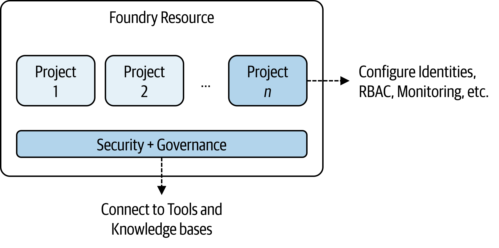
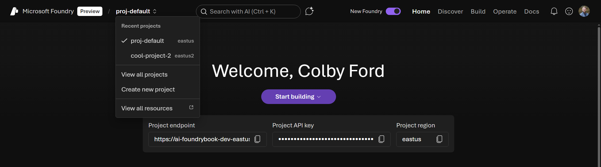
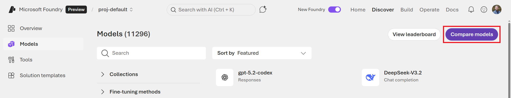
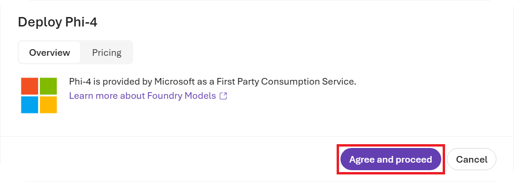
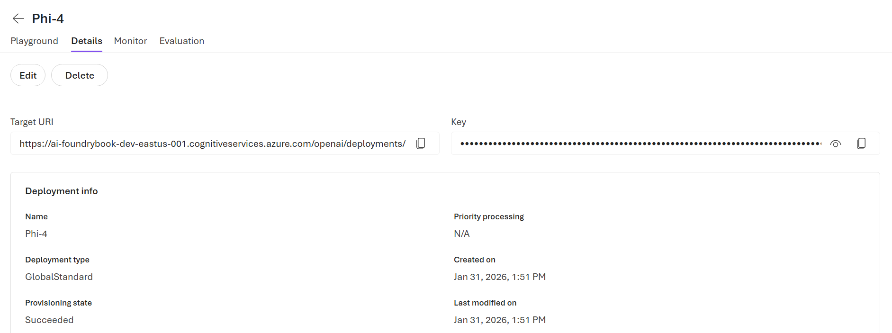

# Introduction

In this chapter, we will get introduced to the Microsoft Foundry service and learn how to create their first Project resource in Azure.


## What is Microsoft Foundry?

**Microsoft Foundry** is Azure’s unified platform-as-a-service for building, deploying, and operating enterprise-grade AI systems. Introduced at Microsoft Ignite in November 2025, Foundry brings together production-ready AI infrastructure and a low-code development experience, allowing teams to concentrate on delivering intelligent applications instead of managing the underlying complexity of AI platforms.

At its core, Microsoft Foundry provides a single control plane for agents, models, and tools, designed with enterprise readiness in mind. Built-in capabilities such as tracing, monitoring, evaluation, and customizable organizational configurations support reliable AI operations at scale. By consolidating role-based access control (RBAC), networking, and policy management under a single Azure resource provider namespace, Foundry simplifies governance and operational consistency across the AI application lifecycle.


### Key Capabilities

Microsoft Foundry delivers a modernized experience with powerful enhancements designed for flexibility and scale:

* **Multi-Agent Orchestration and Workflows** – Build advanced automation using SDKs for C# and Python that enable collaborative agent behavior and complex workflow execution.
* **Expanded Integration Options** – Publish agents to Microsoft 365 and Teams, plus leverage containerized deployments for greater portability.
* **Expanded Tool Access** – Access the Foundry tool catalog (preview) with a public tool catalog and your own private catalogs, connecting over 1,400 tools in Microsoft Foundry.
* **Enhanced Memory Capabilities** – Use memory to help your agent retain and recall contextual information across interactions. Memory maintains continuity, adapts to user needs, and delivers tailored experiences without requiring repeated input.
* **Knowledge Integration** – Connect your agent to a Foundry IQ (powered by Azure AI Search) knowledge base to ground responses in enterprise or web content.
* **Real-Time Observability** – Monitor performance and governance using built-in metrics and model tracking tools.
* **Centralized AI asset management** - Observe, optimize, and manage 100% of your AI assets (agents, models, tools) in one place, the **Operate** section.


### Models Provided Directly on Foundry

Microsoft Foundry provides access to a wide variety of AI models from multiple sources. These models are offered and supported directly by Microsoft and include:

* **Azure OpenAI Models** - GPT 5, Sora 2, GPT-4o, o3, and other OpenAI models
* **Microsoft Models** - Phi family models (e.g., Phi-4) and other specialized models from Microsoft and Microsoft Research such as MedImageParse, EvoDiff, Aurora, etc.
* **Third-Party Models** - Mistral, Anthropic's Claude, xAI's Grok, DeepSeek, and other models provided directly on Azure
* **Hugging Face Models** - Over 10,000 models from huggingface.co

Note that the availability of specific models may vary by region and over time as new models are added and older ones are deprecated. You can view the current catalog of available models in the Foundry Portal under the **Discover** section. Also, note that there is a variety in the capabilities of these models, with some being better suited for certain tasks than others. For example, some models may be optimized for reasoning tasks, while others may excel at coding or image generation. The Foundry Portal provides tools to help you compare models across various benchmarks and capabilities to assist you in selecting the best model for your use case.

##	Deploying Foundry resources/projects

Microsoft Foundry utilizes two services in Azure: the Foundry Resource and the Foundry Project.



A Foundry Resource can organize the items you create for multiple use cases, and is typically shared between a team of developers that work on use cases in a similar business or data domain. We manage security and governance and broad access controls at the Resource level.

A Foundry Project is where you do most of your development work. You can think of Projects as folders to group related work. Projects provide developers with self-serve capabilities to independently create new environments for exploring ideas and building prototypes, while managing data in isolation. Projects act as secure units of isolation and collaboration where agents share file storage, thread storage (conversation history), and search indexes. We manage more specific items at the Project-level, including deployments, RBAC to specific models, monitoring agents, etc.

Next, we'll start by creating both a Foundry Resource and Project.

### Prerequisites

Before creating a Foundry Resource and Project, ensure you have:

* Access to the [Azure Portal](https://portal.azure.com) with an active Azure Subscription
* Permissions to create a Foundry resource (such as an **Owner** or **Contributor** role in your Subscription, or a custom role with the `Microsoft.CognitiveServices/accounts/write` permission granted.)
* Access to the Foundry portal at [https://ai.azure.com](https://ai.azure.com)

###	Exercise: Deploy an AI Project in Azure

Follow these steps to create your first Foundry project:

1. Navigate to the Azure Portal: [https://portal.azure.com](https://portal.azure.com)

At the top of the Azure Portal, you may see some of the previous services that you've accessed. Above this line of icons, click inside the search box.


In the search box, simply type "Microsoft Foundry". In the search results, locate the **Microsoft Foundry** option under the **Services** section and click on it.


A new panel will open for Microsoft Foundry. Feel free to explore. If you're using your work or school account, you may see other Foundry Projects that others in your organization have deployed. Under the **Dashboard** tab, you may also see some metrics around AI usage across all Foundry Resources in your Azure Tenant.

If you don't see anything, don't worry. We're going to start creating our own Foundry Resource now.

2. Click the **Create a resource** button in the **Create a Foundry Resource** box.


In the **Create a Foundry resource** form that opens, you'll begin by either selecting or creating a new Resource Group to house your Foundry Resource, Project, and other services that will get deployed. It's probably best to start with a fresh Resource Group since you'll be following along in the tutorials in this book. So, I'd suggest you click the **Create new** link under the **Resource group** box and make a new one.

You'll also give the Foundry Resource a name in the **Name** box. Also, you leave the **Default project name** as "proj-default".



::: {.callout-note}
Many organizations adopt a naming convention for all resources that get deployed in Azure. I usually use following format:

```
<resource type>-<application or group name>-
   <environment (dev|stg|prd)>-<region>-<number>
```

For example, here are my resource names for the items I deployed in this process:

- Resource Group: `rg-foundrybook-dev-eastus-001`

- Foundry Resource: `ai-foundrybook-dev-eastus-001`

- Key Vault: `kv-foundrybook-dev-001`

- Application Insights: `appi-foundrybook-dev-001`

- Cosmos DB: `cosmos-foundrybook-dev-001`

- Search Service: `srch-foundrybook-dev-001`

- Storage Account: `stfoundrybookdev001`

Feel free to remove hyphens or region names if they're unnecessary or make the name too long.

Also, you will need a unique name for your services. Change the number suffix or add your initials in the name to keep it separate from others in your Tenant or other readers that are following this same tutorial.

- To learn more about naming conventions, visit the following Microsoft Learn page: [https://learn.microsoft.com/en-us/azure/cloud-adoption-framework/ready/azure-best-practices/resource-naming](https://learn.microsoft.com/en-us/azure/cloud-adoption-framework/ready/azure-best-practices/resource-naming)
:::


Next, click the **Next** button at the bottom of the screen or navigate to the **Storage** tab at the top of the screen. On this tab, you'll choose to either connect to or create various other resources that Foundry will use. I recommend creating new resources for all of the items.

- Under the **Credential storage and application login** section, create a new Key Vault and Application Insights service.

- Under the **Agent service** section, click the **+ Select Resources** button and create a new Cosmos DB database, AI Search service, and Storage Account.

- For the **Speech and Language service**, you can ignore the Storage Account selection.

Click the **Review + create** button at the bottom or tab at the top.


Azure will now run a validation check to make sure it will be able to deploy the requested items. This may take a few seconds. If it fails, simply go back and fix the items based on the failure message. Once the validation passes, click the **Create** button at the bottom of the screen.


Azure will then show a Deployment Overview page that lists the items that are being deployed along with their statuses. This may take a couple minutes for all the resources to be provisioned.


Once the deployment completes, locate your newly deployed Resource Group in the Azure Portal. You'll now see lots of difference resources inside.

Locate the Foundry Resource and click on it.


On the Foundry Resource page, this is where you can manage various components of the service. For example, you can control who has access using RBAC, limit network access, view and rotate access keys, view some metrics, and more. For now, simply click the **Go to Foundry portal** on the **Overview** page.


This will open a new tab to your Foundry Resource and show the default Project. From now on, you can simply come to the Foundry page at [https://ai.azure.com/](https://ai.azure.com/) without going through the Azure Portal.


Now that your Foundry Project has been created, you'll have access to:

* The project home page with quick start guides
* Model catalog for deploying AI models
* Agent builder for creating intelligent agents
* Tools and connections for integrating data sources
* Monitoring and evaluation capabilities

Before we start deploying models and agents, let's first walk through the Foundry Portal UI and talk about what all we'll be exploring in this book.

##	Introduction to the Foundry UI and purpose

The Microsoft Foundry portal provides an intuitive interface organized into several key sections, accessible via the portal header:



### Project Selector

The Project you're working with appears in the upper-left corner of most pages. You can easily switch between projects or view all your Foundry Projects by clicking on the Project name. For the purposes of this book, we'll just be using the default Project (`proj-default`).

### Navigation Structure

* **Home** - Provides quick access to your Project endpoint, API key, and region information. This page also lists some new models that have been released on the platform along with links to documentation and sample code.

* **Discover** - This is where you can start exploring models to deploy. This page lists out some featured tools, which will allow you to interact with other services using MCP (Model Context Protocol) servers.

* **Build** - This section holds most of the functionality once you get a model deployed. Here, you can create and manage agents, workflows, and connect to data. Also, this is where you'll go to set up model evaluations and guardrails.

* **Operate** - When you need to monitor agent usage and list out all models and tools that are in use, this is the place to go. You can also implement policies and guardrails for controling model behavior.

* **Docs** - Lastly, the Docs page provides a ton of resources for how to perform that various functions in Foundry. This is a good place to find sample code and quickstart guides for lots of different agentic tasks.

<!-- ### Key Features

* **Playground** - Interactive environment for testing models and agents with real-time responses
* **Agent Builder** - Visual interface for creating and configuring AI agents
* **Deployment** - Deploy agents to production environments, including Microsoft 365, Teams, and containerized deployments
* **Observability** - Built-in monitoring and tracing to understand agent behavior and performance
* **Governance** - Centralized controls for security, compliance, and policy enforcement -->

The Foundry Portal is designed to support the full lifecycle of AI application development, from initial exploration through production deployment and ongoing management, in a very low-code manner. That is, you can deploy models, build agents, and connect them to data, all without writing much code at all.

However, there are SDKs for Python, C#, JavaScript/TypeScript, and Java that allow you to perform all of these action using code. In the next section, we'll go over some examples in Python, which is think is most popular choice for many AI engineers and data scientists.

## Interacting with the Foundry Python SDK

If you're planning on integrating agents with your applications at the enterprise-level, you'll be better off using code to do so. This improves visibility and reproducibility for the agent and other resources that you deploy and connect.

The Foundry SDK for Python provides an easy interface into your Foundry Project and any models that you've deployed.

To install from PyPI, run the following command:

```bash
pip install azure-ai-projects>=2.0.0 azure-identity openai
```

Now, go back to the Foundry Portal and copy your Project endpoint.


It will look something like this:
- `https://<resource-name>.services.ai.azure.com/api/projects/<project-name>`

Now we're ready to connect to the Project from Python.

The SDK exposes two client types because Foundry and OpenAI have different API shapes:

- **Project client** – Use for Foundry-native operations where OpenAI has no equivalent. For example, list the agent's connections, retrieving project properties, or enabling tracing.

- **OpenAI-compatible client** – Use for Foundry functionality that builds on OpenAI concepts. The Responses API, agents, evaluations, and fine-tuning all use OpenAI-style request and response patterns. This client also gives you access to Foundry direct models (non-Azure-OpenAI models hosted in Foundry, such as Claude). The project endpoint serves this traffic on the `/openai` route.

It's common for apps to use some of both clients. For example, you might use the Project client to set up and configure agents. If you want to use your normal Azure account, you can login from your command line using Azure CLI (see Section @sec-az-cli). Then, the `DefaultAzureCredential()` in the Python SDK will grab those credentials from your local environment.

```python
from azure.ai.projects import AIProjectClient

## To use your local Azure credential (from the Azure CLI)
from azure.identity import DefaultAzureCredential

project = AIProjectClient(
  endpoint="https://<resource-name>.services.ai.azure.com/\
               api/projects/<project-name>",
  credential=DefaultAzureCredential()
  )
```

Once you have this main `project` object, you may with to use the OpenAI-compatible client to call models or run agents programmatically.

```python
openai_client = project.inference \
    .get_azure_openai_client(api_version="2024-10-21")

response = openai_client.responses.create(
    model="gpt-5.2",
    input="Tell me a joke about a robot named Bob.",
)

print(response.output_text)
```

## Cost Management

As with most things in the cloud, the services we're working with aren't free. Many of the facets of Foundry, such as the AI models, are charged based on usage. For other services, we'll pay for the hosting or the amount of data that we process and store..

Let's take the Microsoft Phi-4 model (in the East US region) as an example. If we simply deploy an instance of the model, we'll get charged $0.000125/1,000 tokens of input and $0.0005/1,000 tokens of output. So, we pay for the inferencing and nothing will be charged if we don't use it.

If we were to fine-tune a Phi-4 model, however, we would be charged $0.80/hour to host the tuned model (and that's after paying $0.003/1,000 tokens for training) plus the inferencing costs as above.

Knowing how cloud services are billed is a skill, but keeping up with costs will help you avoid awkward conversations with your boss about surprise bills. As we go through the individual components of Foundry over the coming chapters, I'll explain the pricing and purchasing options along the way.

::: {.callout-note}
In all of the tutorials and examples in this book, we'll try and keep costs low. However, for parts where we have to use GPUs for a bit of time or spin up pricier data services, I'll let you know to be on the lookout.

**Pro tip:** Remember to delete unneeded services after you're done with them to avoid unexpected costs.
:::


## Deploying Foundry Projects via the Azure CLI

It's always a good idea to learn how to deploy Azure services from the command line, either through infrastructure as code (e.g. Bicep or Terraform) or directly using the Azure CLI. The Azure Command-Line Interface (CLI) is a cross-platform tool that allows you to connect to Azure and deploy resources, execute commands, and manage your cloud environment right from the command line.

::: {.callout-warning}
## Optional

This section is optional and is simply showing how to deploy items via the Azure CLI. If you deployed your Foundry Resource and Project using the Azure Portal UI, you do not have to redeploy via code.
:::

### Installing the Azure CLI {#sec-az-cli}

For many users, the Azure CLI can be installed with a single command on most operating systems. Find yours below:

- Windows: `winget install --exact --id Microsoft.AzureCLI`
- Linux: `curl -sL https://aka.ms/InstallAzureCLIDeb | sudo bash`
- macOS: `brew update && brew install azure-cli`

For more information about how to install the Azure CLI on various operating systems (and more installation options), visit the following Microsoft Learn page: [https://learn.microsoft.com/en-us/cli/azure/install-azure-cli?view=azure-cli-latest](https://learn.microsoft.com/en-us/cli/azure/install-azure-cli?view=azure-cli-latest)

Once the Azure CLI has been successfully installed, log into your Azure environment using one of the following commands: 

```azurecli
## In an interactive desktop environment, this command will open a browser
## window for you to select your Microsoft account and log in

az login

## In a terminal environment with no browser, this comment will generate
## a device code that can be entered manually at:
## https://microsoft.com/devicelogin

az login --use-device-code
```

Once you get logged in, the CLI will let you pick the Subscription under which it will operate. Simply type the number of the Subscription you wish to use and press Enter.


Alternatively, you can change the Subscription at any time using the following command:

```bash
az account set --subscription "<SUBSCRIPTION ID or SUBSCRIPTION NAME>"
```

Now that we're logged in and have our desired Subscription selected, we can proceed with deploying a Foundry Resource and Project.

### Deploy a Foundry Resource and Project via Code

1. Create a Resource Group. For example, if I want to create a Resource Group named `rg-foundrybook-dev-eastus-001` in the `eastus` region:

   ```bash
   az group create --name rg-foundrybook-dev-eastus-001 --location eastus
   ```

2. Create the Foundry Resource. For example, I can use `ai-foundrybook-dev-eastus-001` as the Foundry Resource name in the `rg-foundrybook-dev-eastus-001` resource group:

   ```bash
   az cognitiveservices account create \
       --name ai-foundrybook-dev-eastus-001 \
       --resource-group rg-foundrybook-dev-eastus-001 \
       --kind AIServices \
       --sku s0 \
       --location eastus \
       --allow-project-management
   ```

   The `--allow-project-management` flag enables project creation within this resource.


3. Create the Project. For example, use the default Project name, `proj-default`, in the `ai-foundrybook-dev-eastus-001` Resource:

   ```bash
   az cognitiveservices account project create \
       --name ai-foundrybook-dev-eastus-001 \
       --resource-group rg-foundrybook-dev-eastus-001 \
       --project-name proj-default \
       --location eastus
   ```

5. Lastly, verify the Project was created:

   ```bash
   az cognitiveservices account project show \
       --name ai-foundrybook-dev-eastus-001 \
       --resource-group rg-foundrybook-dev-eastus-001 \
       --project-name proj-default
   ```

   The output displays the project properties, including its resource ID.


## Explore Models in the Foundry Portal

Next, we'll learn how to explore and deploy various AI models from the Foundry Models registry. They will also explore the pre-built MCP tools to connect to data sources.

From the Foundry Portal, navigate to the **Discover** tab at the top of the screen.


You'll see a list of featured models can be deployed. You may notice that some are popular proprietary models like OpenAI's GPT-5.2 and Anthropic's Claude Opus 4.5 and others may be open-source models from Hugging Face or Microsoft.

But why deploy a model like GPT or Claude on Foundry when we can just can use them for free online? The most simple answer to that is: privacy. When you use ChatGPT or other free models online, your inputs can be used for training future models. While this may be fine personally for writing cover letters or generating recipes, this may not sit well in the enterprise space with proprietary data. Thus, deploying instances of these foundation models in your own Azure Tenant give you much more control over where your data ends up. Plus, as you'll see soon, we have a lot more control over model behavior with Foundry-deployed models over the public versions of these models.

Once you're done browsing the Discover page, click on **Models** on the left-hand menu.


This will take you to the full list of models currently available in Foundry. There are currently over 10,000 models that you can deploy and the list is continuously growing. You'll quickly notice that Foundry isn't just for LLMs. There are models for image generation, audio generation, document analysis, text classification, 3D object generation, translations, and even protein modeling!

On this page, you can filter by source (the company or group that produced the model), capabilities (like reasoning or if the model can accept images as an input), inferencing task (such as text or image generation), and other features. Spend some time playing with these filters and exploring the vast variety models that you can deploy with Foundry.


As you're exploring, you may be overwhelmed with the number of choices that you have, even for the same type of task. Let's learn how to compare models to pick the best one for your needs.

At the top right of the screen, you'll notice two buttons: **View leaderboard** and **Compare models**. Click on the **Compare models** button.



On the **Compare models** screen, you can compare up to three different models across various benchmarks (e.g., quality, safety, costs, and throughput). Click any of the dropdown boxes and select three different models. You can also look at the differences in what the models accept as inputs and produce as outputs along with metrics about their context size. This is helpful if you're trying to figure out which model you should deploy for a given use case. I find this especially helpful when choosing between versions of the same base model with confusing names/suffixes (for example, `gpt-5.2` vs. `gpt-5.2-chat` vs. `gpt-5.2-codex`). 


Once you've gotten familiar with the model comparison tool, go back to the **Models** page and click on the **View leaderboard** button.


On this page, you can see how different models rank across the same benchmarks you saw in the model comparison screen: quality, safety, cost, and throughput.

- **Quality:** An index across various benchmark tests that evaluate how well a model performs on core tasks such as reasoning, knowledge, question answering, math, and coding. (Higher is better/more capable.)
- **Safety:** A score that indicates the success rate of attack prompts causing the model to produce harmful or disallowed responses. For example, producing hate speech or leaking copyrighted material. (Lower is better/safer.)
- **Throughput:** The rate at which the model can generate its output, measured in tokens per second. Behind the scenes, models are also evaluated on latency, rate limit (in tokens per minute), etc. (Higher is better/faster.)
- **Cost:** The cost per 1 million tokens. This is a blended cost estimate that assumes a three-to-one ratio between input and output token costs. (Lower is better/cheaper.)


This is a good page to visit often to see at how the latest models stack up to their predecessor version or competitor models.

Clicking on any of the models will take you to the model's page where you can learn more. On the **Benchmarks** tab, you can see the benchmarking data for a model. Often, this benchmarking is performed by Microsoft, but they also post publish other public benchmarks of the model if available.


Scrolling down on this page, you'll find the more detailed view of the summary metrics from before, including more drilled-down results for the overall composite scores. This is a good place to look at the specific aspects that are important to your deployment. For example, if you were building a simple chat agent for your online store, you might pick a faster (lower latency) model than one that gets a top-notch score for coding capabilities.


When choosing a model, consider:

* **Task requirements** - Different models excel at different tasks (chat, completion, embedding, etc.)
* **Context window size** - How much text the model can process at once
* **Performance vs. cost** - Larger models typically offer better performance but at higher cost
* **Latency requirements** - Some deployment options offer lower latency than others

From a model's page, you can also see any deployments of the model that have been created, learn more about the responsible AI approaches that were taken, read the licensing details, go through the technical specifications, and more. Plus, you can even deploy the model right from this page.

Now that we've explored all that the **Models** page has to offer and learned how to compare and select between models, it's time to finally deploy our first model!

##	Deploying your First Model

If you were to try and deploy a Large Language Models (LLM) using infrastructure services in Azure, you would have to first deploy a Virtual Machine (VM) with multiple GPUs, deploy the model, write the logic for handling the incoming API requests to and from the model, manage the authentication, manage the networking and scaling logic, etc. While this is certainly possible, it's a lot to manage on your own. Microsoft Foundry offers a more managed solution for model deployment that gets you up and running in just a few clicks or a few lines of code. The best part: no need to manage the infrastructure at all, which provides enterprise security while eliminating the need for manually maintaining compute resources on your Azure Subscription. Models are consumed through a simple API endpoint.

### Exercise: Deploy a Microsoft Phi-4 model

We'll be deploying a Microsoft Phi-4 model and then turning it into an agent. Phi-4 is an open-source, decoder-only transformer model from Microsoft Research. It is a 14-billion parameter model that was trained on a blend of synthetic datasets, data from websites in the public domain, academic books, and Q&A datasets. Phi-4 is a good foundation model to start with as it is quite fast and capable for its size and costs less than other models that are larger and/or proprietary.

To start, navigate back to the **Models** page in the Foundry Portal.

Search for "Phi-4" in the model catalog. Click on the `Phi-4` option (not `Phi-4-mini` or other variants).


You can read more about the Phi-4 model, its benchmark performance, etc. When you're ready to deploy, click the **Deploy** button in the top right.

There are two options: **Default settings** and **Custom settings**. Go with the **Default settings**.

If you had chosen **Custom settings**, it allows you to specify the version of Phi-4 to deploy and which Guardails to use. We'll learn more about Guardrails in Chapter 5.


A box will pop up that allows you to read the terms of the consumption-based deployment of the model. You can also view pricing and legal information on the **Pricing** tab. Click the **Agree and proceed** button to start the deployment.



The deployment process should only take a couple minutes, and you'll be brought to the **Playground** page for the Phi-4 deployment.


On the main **Playground** tab, you can now start interacting with the model.

#### Testing Your Deployment

Let's see if we can have some fun with the behavior of the model. In the following example, I turn our model into a galactic friend that seems to know how to cook up a cosmic meal.

1. Enter a system message in the **Instructions** box: `You are an alien named Zorki from outer space who wants to share some out of this world recipes.`
2. Try a sample prompt in the **Chat with the model...** input: `Do you have any good recipes for an intergalactic pizza?`
3. Review the model's response


As you can see, we can modify the model's behavior by simply giving a few of instructions. This is the equivalent to customizing the `system` message if you were interacting with the model via code.

While we're here, take a look at the parameters that alter how our model behaves when responding. 

Click on the **Parameters** icon button to the right of the model name. Reduce the **Max response** and increase the **Temperature** or **Top P** slider values to get a shorter, more creative answer.


This time, our alien friend Zorki gave me a more interstellar recipe with slightly less realistic items. Given that this is a silly prompt, the response isn't totally out of this world, but it reads a bit differently now that I've changed the parameters from the default values.



Here are some notes about these parameters:

* **Max response:** Sets a limit on the number of tokens that can be generated in the model response. This number of tokens is shared between the prompt (system message, examples, message history, and user query) and the model's latest response.
* **Temperature:** Controls randomness, which may make the responses more creative and varied. Lowering the temperature means that the model will produce more repetitive and deterministic responses.
* **Top P:** Also controls randomness, but uses a different method. Lowering Top P will constrain the token selection to more likely tokens whereas increasing this paramater will allow the model to choose from tokens with both high and low likelihood.
* **Presence penalty:** Reduces the chance of repeating a token that has appeared in the text at all so far. Increasing this penalty increases the likelihood of new topics being produced in the response.
* **Frequency penalty:** Reduces the chance of repeating a token proportionally based on how often it has appeared in the text so far. Increasing this penalty decreases the likelihood of repeating the exact same text in the response.

In the following example, I was able to have Zorki respond with new terms and completely ficticious ingredients, all while keeping the responses short yet pleasant and conversational.

::: {.callout-tip}
## Example

// Parameters

- Max response: 2000
- Temperature: 0.15
- Presence penalty: 2
- Frequency penalt: 2

// Prompt

How long should I cook gazorbazorp fruit?

// Response

Ah, the delightful gazorbazorp fruit! A staple in many intergalactic cuisines. Here's how to prepare it for your cosmic pizza:

1. **Preparation:**
   - Wash and slice the gazorbazorp fruit into thin rounds.
   - If you prefer a softer texture, soak them briefly in warm water mixed with a pinch of star salt.

2. **Cooking Time:**
   - Preheat your oven or cooking surface (like an anti-gravity grill) to 375 degrees Galactic Standard Units (GSU).
   
3. **Roasting Gazobrazorps:**
   - Place slices on a baking sheet lined with parchment paper from Xylophar-7 leaves.
   - Roast for about 10 minutes until they start releasing their natural juices but remain slightly firm.

4. **Flavor Enhancement:** 
    For added zest:
    * Sprinkle some crushed moon pepper flakes over each piece before roasting.
    
5. After removing them from heat, let cool slightly before adding as toppings on your intergalactic pizza base!

Enjoy crafting this celestial delight! 🍕✨
:::

Spend some time changing these parameters around to see how they affect the responses. Depending on what you what your AI agent to do, tweaking these parameters can help your agent feel more natural or well-suited to the task at hand. Perhaps you want short responses because the AI a shopping helper chatbot on a online retail site or maybe the agent is supposed to help you write marketing materials and thus needs to be more verbose and creative.

::: {.callout-note}
Any instruction prompts or parameters that you change in the Playground are not saved. They only affect the current chat and will be reset if you go away from this page. When we make an actual Agent out of this Deployment, we'll be able to set these items for real.
:::

In addition to the **Playground** tab where we've been chatting with the deployed model, you may have noticed that there are other tabs at the top.

On the **Details** tab, you'll find:

* A **Target URI**, which is where you can access the deployment's API endpoint
* A **Key** for authentication with the endpoint
* **Deployment info**, which includes the Deployment's name and type, creation date, state, etc.


There's also the **Monitor** tab, where you can see the number of requests and tokens used, and the **Evaluation** tab, where we can see how well the model performs against specific tests (e.g., custom chat completions). We'll talk more about monitoring and evaluation in future chapters.

Now that you know how to deploy a model, such as Phi-4, let's create our first Agent!




## Summary

In this chapter, you were introduced to **Microsoft Foundry**, Microsoft's unified Azure platform for building, deploying, and operating enterprise-grade AI applications. We explored how Foundry brings together models, agents, tools, and governance under a single resource provider, simplifying AI development while maintaining the security, observability, and control required in production environments.

You learned how Foundry is organized around two core Azure resources: the Foundry Resource, which provides shared governance, security, and infrastructure for a team or organization, and the Foundry Project, which serves as an isolated workspace for development, experimentation, and collaboration. We walked through creating both using the Azure Portal and discussed best practices for naming, resource grouping, and access control.

We demonstrated how to interact with a Foundry Project programmatically using the Foundry Python SDK, explained the distinction between the Project client and the OpenAI-compatible client, and showed how Foundry resources can be provisioned via the Azure CLI for repeatable, automated deployments.

The chapter showcased the breadth of models available in Foundry, including Azure OpenAI, Microsoft-built models, other third-party offerings, and open-source models from Hugging Face, highlighting Foundry's role as a central hub for model exploration and deployment. You were introduced to the Foundry portal UI, its navigation structure, and how it supports the full AI lifecycle from discovery and building to operation and governance. Plus, we showed how easy it is to deploy your first model and interact with it in the Model Playground.

With a Foundry Project now up and running, you're ready to start deploying other models, building agents, connecting data sources, and implementing guardrails. In the next Chapter, we'll be deploying our first Agent into our Project. Are you excited yet!?