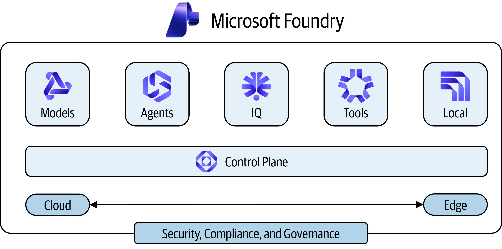
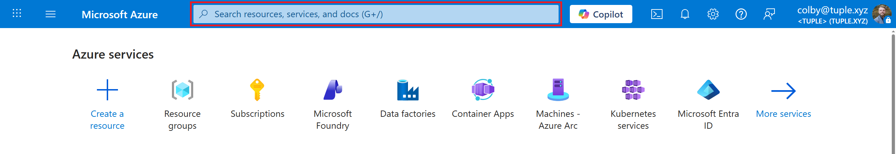
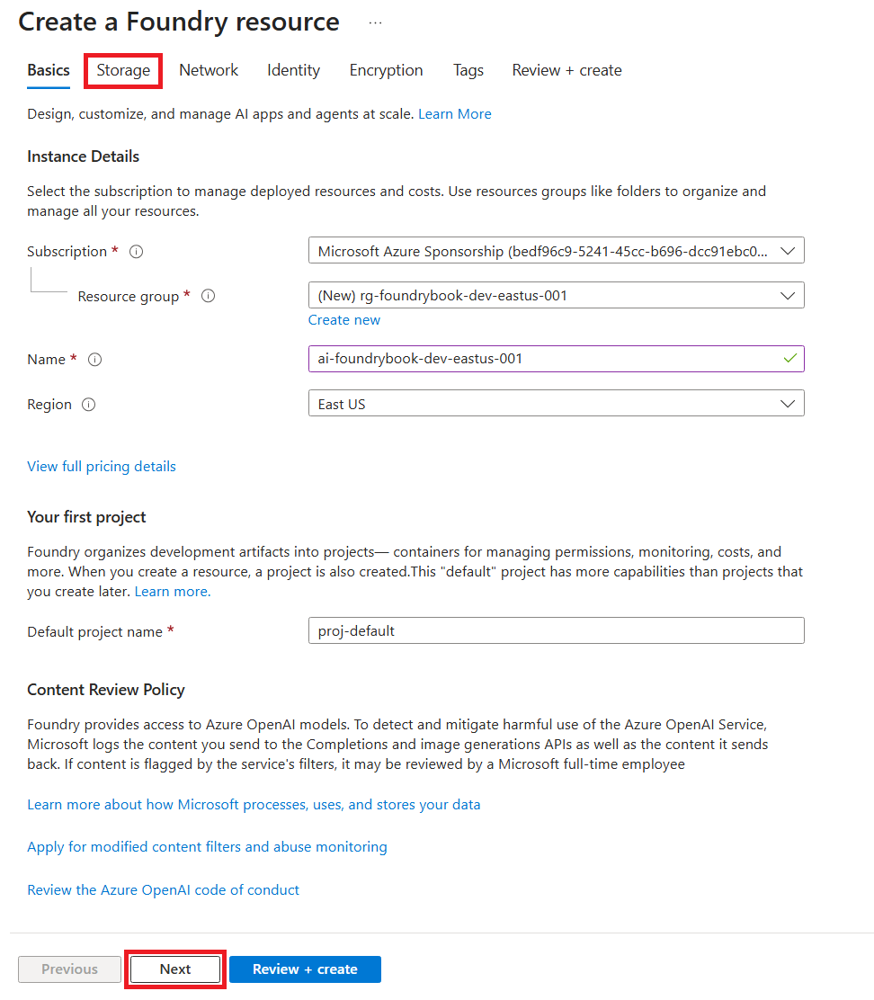
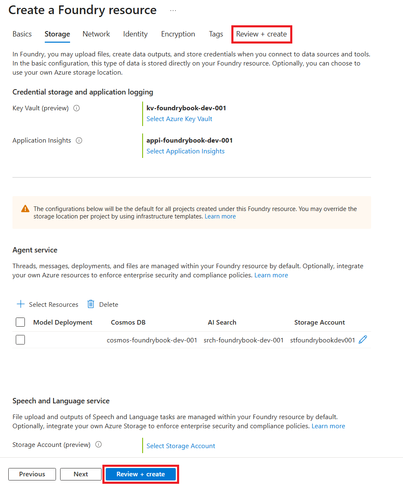
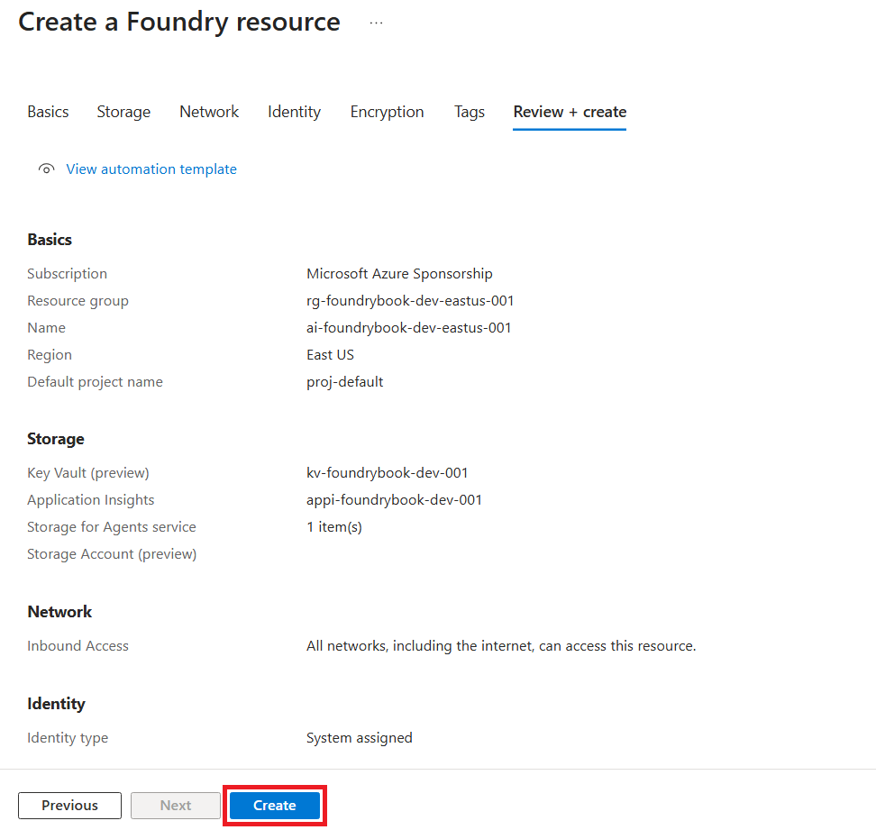
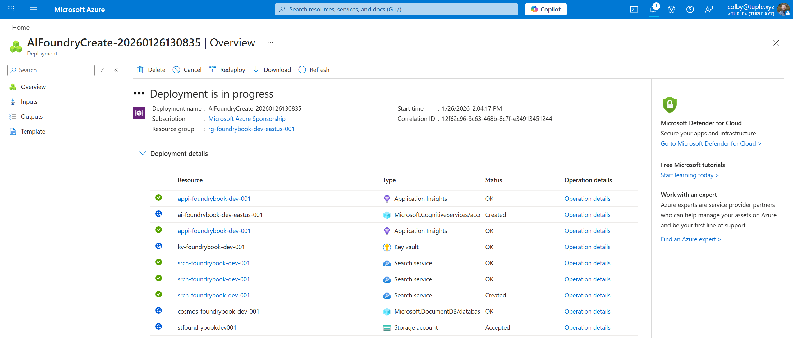
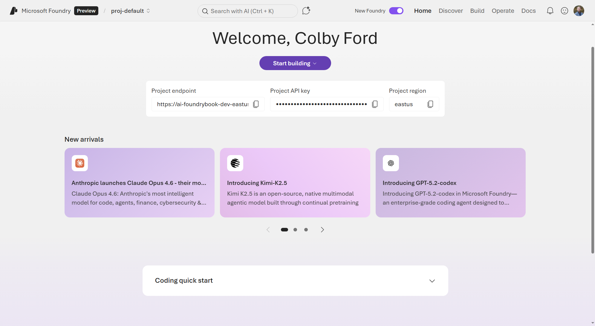
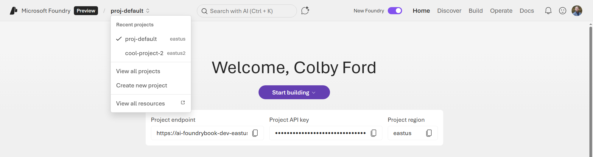
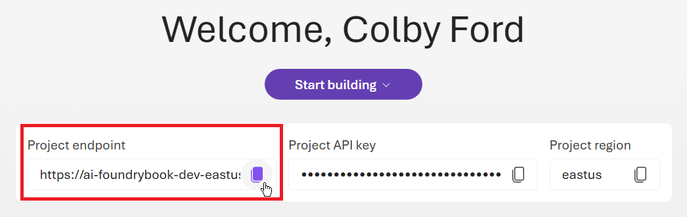

# Introduction {#sec-chapter-1}

In this chapter, we will get introduced to the Microsoft Foundry service and learn how to create your first Project resource in Azure.

**Microsoft Foundry** is Azure’s unified platform-as-a-service for building, deploying, and operating enterprise-grade AI systems. At its core, Microsoft Foundry provides a single control plane for agents, models, and tools, designed with enterprise readiness in mind. Built-in capabilities such as tracing, monitoring, evaluation, and customizable organizational configurations support reliable AI operations at scale. By consolidating role-based access control (RBAC), networking, and policy management under a single Azure resource provider namespace, Foundry simplifies governance and operational consistency across the AI application lifecycle.

## A Brief History
If you have used Azure services for machine learning and artificial intelligence over the past few years, you may have noticed that Microsoft has had a few services that fall under this umbrella. First, Azure Machine Learning has been around for a while as Microsoft’s primary service for training and deploying machine learning models. More recently, the Azure OpenAI Service was launched to provide access to OpenAI’s language models directly through Azure. Then, Azure AI Foundry provided a way to deploy models and fine-tune them. However, there was a bigger need to enable agentic capabilities (connecting models to data and tools) and to allow enterprises to more easily govern and manage deployed AI systems. This is where Microsoft Foundry comes in.

Introduced at the Microsoft Ignite conference in November 2025, Microsoft Foundry brings together production-ready AI infrastructure and a low-code development experience, allowing teams to concentrate on delivering intelligent applications instead of managing the underlying complexity of AI platforms.


### Facets of Foundry

Microsoft Foundry delivers multiple capabilities to manage enterprise agentic solutions at scale and from end to end. As shown in @fig-4C72, these include:

* **Multi-Agent Orchestration and Workflows** – Build advanced automation using SDKs for C# and Python that enable collaborative agent behavior and complex workflow execution.
* **Expanded Integration Options** – Publish agents to Microsoft 365 and Teams, plus leverage containerized deployments for greater portability.
* **Expanded Tool Access** – Access the Foundry tool catalog with a public tool catalog and your own private catalogs, connecting over 1,400 tools in Microsoft Foundry.
* **Enhanced Memory Capabilities** – Use memory to help your agent retain and recall contextual information across interactions. Memory maintains continuity, adapts to user needs, and delivers tailored experiences without requiring repeated input.
* **Knowledge Integration** – Connect your agent to a Foundry IQ (powered by Azure AI Search) knowledge base to ground responses in enterprise or web content.
* **Real-Time Observability** – Monitor performance and governance using built-in metrics and model-tracking tools.
* **Centralized AI asset management** - Observe, optimize, and manage 100% of your AI assets (agents, models, tools) in one place, the **Operate** section.
* **Locally hosted models** - Run models locally on servers or your laptop using Foundry Local, which provides models and optimizes them for your local hardware, alleviating the need to worry about token usage.

{#fig-4C72}


### Models Provided Directly on Foundry

Microsoft Foundry provides access to a wide variety of AI models from multiple sources. These models are offered and supported directly by Microsoft and include:

* **Azure OpenAI Models** - GPT 5, Sora 2, GPT-4o, o3, and other OpenAI models
* **Microsoft Models** - Phi family models (e.g., Phi-4) and other specialized models from Microsoft and Microsoft Research such as MedImageParse, EvoDiff, Aurora, etc.
* **Third-Party Models** - Mistral, Anthropic's Claude, xAI's Grok, DeepSeek, and other models provided directly on Azure
* **Hugging Face Models** - Over 10,000 models from huggingface.co

Note that the availability of specific models may vary by region and change over time as new models are added and older ones are deprecated. You can view the current catalog of available models at [https://ai.azure.com/catalog](https://ai.azure.com/catalog) or in the [Foundry portal](https://ai.azure.com) under the **Discover** section. Also, note that there is a variety in the capabilities of these models, with some being better suited for certain tasks than others. For example, some models may be optimized for reasoning tasks, while others may excel at coding or image generation. The Foundry portal provides tools to help you compare models across various benchmarks and capabilities to assist you in selecting the best model for your use case.

## Deploying Foundry Resources/Projects

Microsoft Foundry utilizes two services in Azure: the Foundry Resource and the Foundry Project. See @fig-3498 for a visual of how these two services are related to one another.

{#fig-3498}


A Foundry Resource can organize the items you create for multiple use cases, and is typically shared between a team of developers that work on use cases in a similar business or data domain. We manage security and governance and broad access controls at the Resource level.

A Foundry Project is where you do most of your development work. You can think of Projects as folders to group related work. Projects provide developers with self-serve capabilities to independently create new environments for exploring ideas and building prototypes, while managing data in isolation. Projects act as secure units of isolation and collaboration where agents share file storage, thread storage (conversation history), and search indexes. We manage more specific items at the Project level, including deployments, RBAC to specific models, monitoring agents, etc.

Next, we'll start by creating both a Foundry Resource and Project.

### Prerequisites

Before creating a Foundry Resource and Project, ensure that you have:

* Access to the [Azure portal](https://portal.azure.com) with an active Azure Subscription
* Permissions to create a Foundry resource (such as an **Owner** or **Contributor** role in your Subscription, or a custom role with the `Microsoft.CognitiveServices/accounts/write` permission granted).
* Access to the Foundry portal at [https://ai.azure.com](https://ai.azure.com)

### Exercise: Deploy an AI Project in Azure

Follow these steps to create your first Foundry project:

1. Navigate to the Azure portal: [https://portal.azure.com](https://portal.azure.com)

At the top of the Azure portal, you may see some of the previous services that you've accessed. Above this line of icons, click inside the search box as shown in @fig-693E.

{#fig-693E}


In the search box, simply type "Microsoft Foundry". In the search results, locate the **Microsoft Foundry** option under the **Services** section and click on it as shown in @fig-992A.

{#fig-992A}


A new panel will open for Microsoft Foundry. Feel free to explore. If you're using your work or school account, you may see other Foundry Projects that others in your organization have deployed. Under the **Dashboard** tab, you may also see some metrics around AI usage across all Foundry Resources in your Azure Tenant.

If you don't see anything, don't worry. We're going to start creating our own Foundry Resource now.

2. Click the **Create a resource** button in the **Create a Foundry Resource** box, shown in @fig-927.

{#fig-927}


In the **Create a Foundry resource** form that opens, shown in @fig-3901, you'll begin by either selecting or creating a new Resource Group to house your Foundry Resource, Project, and other services that will get deployed. It's probably best to start with a fresh Resource Group since you'll be following along in the tutorials in this book. So, I'd suggest you click the **Create new** link under the **Resource group** box and make a new one.

You'll also give the Foundry Resource a name in the **Name** box. Also, you leave the **Default project name** as "proj-default".



::: {.callout-note}
Many organizations adopt a naming convention for all resources that get deployed in Azure. I usually use following format:

```
<resource type>-<application or group name>-
   <environment (dev|stg|prd)>-<region>-<number>
```

For example, here are my resource names for the items I deployed in this process:

- Resource Group: `rg-foundrybook-dev-eastus-001`

- Foundry Resource: `ai-foundrybook-dev-eastus-001`

- Key Vault: `kv-foundrybook-dev-001`

- Application Insights: `appi-foundrybook-dev-001`

- Cosmos DB: `cosmos-foundrybook-dev-001`

- Search Service: `srch-foundrybook-dev-001`

- Storage Account: `stfoundrybookdev001`

Feel free to remove hyphens or region names if they're unnecessary or make the name too long.

Also, you will need a unique name for your services. Change the number suffix or add your initials in the name to keep it separate from others in your Tenant or other readers who are following this same tutorial.

- To learn more about naming conventions, visit the following Microsoft Learn page: [https://learn.microsoft.com/en-us/azure/cloud-adoption-framework/ready/azure-best-practices/resource-naming](https://learn.microsoft.com/en-us/azure/cloud-adoption-framework/ready/azure-best-practices/resource-naming)
:::

{#fig-3901}


Next, click the **Next** button at the bottom of the screen or navigate to the **Storage** tab at the top of the screen. On this tab, you'll choose to either connect to or create various other resources that Foundry will use. I recommend creating new resources for all of the items to help keep the services isolated from other services your organization may have already deployed. (This also helps for easier cleanup when you're done with the tutorials.) See @fig-A90C for which items to create.

- Under the **Credential storage and application login** section, create a new Key Vault and Application Insights service.

- Under the **Agent service** section, click the **+ Select Resources** button and create a new Cosmos DB database, AI Search service, and Storage Account.

- For the **Speech and Language service**, you can ignore the Storage Account selection as we won't need it.

Click the **Review + create** button at the bottom or tab at the top.

{#fig-A90C}


Azure will now run a validation check to make sure it will be able to deploy the requested items. This may take a few seconds. If it fails, simply go back and fix the items based on the failure message. Once the validation passes, click the **Create** button at the bottom of the screen as shown in @fig-5918.

{#fig-5918}


Azure will then show a Deployment Overview page, as seen in @fig-CC82, which lists the items that are being deployed along with their statuses. This may take a couple of minutes for all the resources to be provisioned.

{#fig-CC82}


Once the deployment completes, locate your newly deployed Resource Group in the Azure portal. You'll now see lots of different resources inside.

Locate the Foundry Resource and click on it. See @fig-3954.

{#fig-3954}


On the Foundry Resource page, this is where you can manage various components of the service. For example, you can control who has access using RBAC, limit network access, view and rotate access keys, view some metrics, and more. For now, simply click the **Go to Foundry portal** button on the **Overview** page, as shown in @fig-A959.

{#fig-A959}


This will open a new tab to your Foundry Resource and show the default Project. See @fig-7B65. From now on, you can simply come to the Foundry page at [https://ai.azure.com/](https://ai.azure.com/) without going through the Azure portal.

{#fig-7B65}


Now that your Foundry Project has been created, you'll have access to:

* The project home page with quick start guides
* Model catalog for deploying AI models
* Agent builder for creating intelligent agents
* Tools and connections for integrating data sources
* Monitoring and evaluation capabilities

Before we start deploying models and agents, let's first walk through the Foundry portal UI and talk about what we'll explore in this book.

## Introduction to the Foundry UI and Purpose

The Microsoft Foundry portal provides an intuitive interface organized into several key sections, accessible via the portal header, shown in @fig-B78E.

{#fig-B78E}


### Project Selector

The Project you're working with appears in the upper-left corner of most pages. You can easily switch between projects or view all your Foundry Projects by clicking on the Project name. For the purposes of this book, we'll just be using the default Project (`proj-default`).

### Navigation Structure

The Foundry portal is designed to support the full lifecycle of AI application development, from initial exploration through production deployment and ongoing management, in a very low-code manner. That is, you can deploy models, build agents, and connect them to data, all without writing much code at all. At the top of the Foundry portal, you'll find the main navigation menu with the following sections:


* **Home** - Provides quick access to your Project endpoint, API key, and region information. This page also lists some new models that have been released on the platform along with links to documentation and sample code.

* **Discover** - This is where you can start exploring models to deploy. This page lists out some featured tools, which will allow you to interact with other services using MCP (Model Context Protocol) servers.

* **Build** - This section holds most of the functionality once you get a model deployed. Here, you can create and manage agents, workflows, and connect to data. Also, this is where you'll go to set up model evaluations and guardrails.

* **Operate** - When you need to monitor agent usage and list out all models and tools that are in use, this is the place to go. You can also implement policies and guardrails for controlling model behavior.

* **Docs** - Lastly, the Docs page provides a ton of resources for how to perform various functions in Foundry. This is a good place to find sample code and quickstart guides for lots of different agentic tasks.

<!-- ### Key Features

* **Playground** - Interactive environment for testing models and agents with real-time responses
* **Agent Builder** - Visual interface for creating and configuring AI agents
* **Deployment** - Deploy agents to production environments, including Microsoft 365, Teams, and containerized deployments
* **Observability** - Built-in monitoring and tracing to understand agent behavior and performance
* **Governance** - Centralized controls for security, compliance, and policy enforcement -->


In addition to a UI-based interface, there are SDKs for Python, C#, JavaScript/TypeScript, and Java that allow you to perform all of these actions using code. In the next section (and throughout the book), we'll go over some examples in Python, which is the most popular choice for many AI engineers and data scientists.

::: {.callout-note}
You can learn more about the SDKs and code samples in other languages in the Foundry documentation here: [https://learn.microsoft.com/en-us/azure/foundry/how-to/develop/sdk-overview](https://learn.microsoft.com/en-us/azure/foundry/how-to/develop/sdk-overview).
:::

## Interacting with the Foundry Python SDK

If you're planning on integrating agents with your applications at the enterprise level, you'll be better off using code. This improves visibility and reproducibility for the agent and other resources that you deploy and connect.

The Foundry SDK for Python provides an easy interface into your Foundry Project and any models that you've deployed.

To install from PyPI, run the following command:

```bash
pip install azure-ai-projects>=2.0.0 azure-identity openai
```

Now, go back to the Foundry portal and copy your Project endpoint. As shown in @fig-5C7B, you can click the copy icon to copy the URL to your clipboard.

{#fig-5C7B}


It will look something like this:

`https://<resource-name>.services.ai.azure.com/api/projects/<project-name>`

Now we're ready to connect to the Project from Python.

The SDK exposes two client types because Foundry and OpenAI have different API shapes:

- **Project client** – Use for Foundry-native operations where OpenAI has no equivalent. For example, listing the agent's connections, retrieving project properties, or enabling tracing.

- **OpenAI-compatible client** – Use for Foundry functionality that builds on OpenAI concepts. The Responses API, agents, evaluations, and fine-tuning all use OpenAI-style request and response patterns. This client also gives you access to Foundry direct models (non-Azure-OpenAI models hosted in Foundry, such as Claude). The project endpoint serves this traffic on the `/openai` route.

It's common for apps to use some of both clients. For example, you might use the Project client to set up and configure agents. If you want to use your normal Azure account, you can login from your command line using Azure CLI (see Section @sec-az-cli). Then, the `DefaultAzureCredential()` in the Python SDK will grab those credentials from your local environment.

```python
from azure.ai.projects import AIProjectClient

## To use your local Azure credential (from the Azure CLI)
from azure.identity import DefaultAzureCredential

project = AIProjectClient(
  endpoint="https://<resource-name>.services.ai.azure.com/ \
               api/projects/<project-name>",
  credential=DefaultAzureCredential()
  )
```

Once you have this main `project` object, you may wish to use the OpenAI-compatible client to call models or run agents programmatically.

```python
openai_client = project.inference \
    .get_azure_openai_client(api_version="2024-10-21")

response = openai_client.responses.create(
    model="gpt-5.2",
    input="Tell me a joke about a robot named Bob.",
)

print(response.output_text)
```

## Cost Management

As with most things in the cloud, the services we're working with aren't free. Many of the facets of Foundry, such as the AI models, are charged based on usage. For other services, we'll pay for the hosting or the amount of data that we process and store.

Let's take the Microsoft Phi-4 model (in the East US region) as an example. If we simply deploy an instance of the model, we'll get charged $0.000125/1,000 tokens of input and $0.0005/1,000 tokens of output. So, we pay for the inferencing and nothing will be charged if we don't use it.

If we were to fine-tune a Phi-4 model, however, we would be charged $0.80/hour to host the tuned model (and that's after paying $0.003/1,000 tokens for training) plus the inferencing costs as above.

Knowing how cloud services are billed is a skill, but keeping up with costs will help you avoid awkward conversations with your boss about surprise bills. As we go through the individual components of Foundry over the coming chapters, I'll explain the pricing and purchasing options along the way.

::: {.callout-note}
In all of the tutorials and examples in this book, we'll try and keep costs low. However, for parts where we have to use GPUs for a bit of time or spin up pricier data services, I'll let you know to be on the lookout.

**Pro tip:** Remember to delete unneeded services after you're done with them to avoid unexpected costs.
:::


## Deploying Foundry Projects via the Azure CLI

It's always a good idea to learn how to deploy Azure services from the command line, either through infrastructure as code (e.g., Bicep or Terraform) or directly using the Azure CLI. The Azure Command-Line Interface (CLI) is a cross-platform tool that allows you to connect to Azure and deploy resources, execute commands, and manage your cloud environment right from the command line.

::: {.callout-note}
## Optional

This section is optional and is simply showing how to deploy items via the Azure CLI. If you deployed your Foundry Resource and Project using the Azure portal UI, you don't have to redeploy via code.
:::

### Installing the Azure CLI {#sec-az-cli}

For many users, the Azure CLI can be installed with a single command on most operating systems. Find yours in the following list:

- Windows: `winget install --exact --id Microsoft.AzureCLI`
- Linux: `curl -sL https://aka.ms/InstallAzureCLIDeb | sudo bash`
- macOS: `brew update && brew install azure-cli`

For more information about how to install the Azure CLI on various operating systems (and more installation options), visit the following Microsoft Learn page: [https://learn.microsoft.com/en-us/cli/azure/install-azure-cli?view=azure-cli-latest](https://learn.microsoft.com/en-us/cli/azure/install-azure-cli?view=azure-cli-latest).

Once the Azure CLI has been successfully installed, log into your Azure environment using one of the following commands: 

```bash
## In an interactive desktop environment, this command will open a browser
## window for you to select your Microsoft account and log in

az login

## In a terminal environment with no browser, this comment will generate
## a device code that can be entered manually at:
## https://microsoft.com/devicelogin

az login --use-device-code

## You also may need the `cognitiveservices` extension to deploy Foundry resources
az extension add -n cognitiveservices
```

Once you get logged in, the CLI will let you pick the Subscription under which it will operate. Simply type the number of the Subscription you wish to use and press Enter. For example, my list of subscriptions is shown in @fig-360B, and I would type `5` to select the "Microsoft Azure Sponsorship" subscription.

{#fig-360B}


Alternatively, you can change the Subscription at any time using the following command:

```bash
az account set --subscription "<SUBSCRIPTION ID or SUBSCRIPTION NAME>"
```

Now that we're logged in and have our desired Subscription selected, we can proceed with deploying a Foundry Resource and Project.

### Deploy a Foundry Resource and Project via Code

1. Create a Resource Group. For example, if you want to create a Resource Group named `rg-foundrybook-dev-eastus-001` in the `eastus` region:

```bash
az group create --name rg-foundrybook-dev-eastus-001 --location eastus
```

2. Create the Foundry Resource. For example, you can use `ai-foundrybook-dev-eastus-001` as the Foundry Resource name in the `rg-foundrybook-dev-eastus-001` resource group:

```bash
az cognitiveservices account create \
      --name ai-foundrybook-dev-eastus-001 \
      --resource-group rg-foundrybook-dev-eastus-001 \
      --kind AIServices \
      --sku s0 \
      --location eastus \
      --allow-project-management
```

   The `--allow-project-management` flag enables project creation within this resource.


3. Create the Project. For example, use the default Project name, `proj-default`, in the `ai-foundrybook-dev-eastus-001` Resource:

```bash
az cognitiveservices account project create \
      --name ai-foundrybook-dev-eastus-001 \
      --resource-group rg-foundrybook-dev-eastus-001 \
      --project-name proj-default \
      --location eastus
```

5. Lastly, verify that the Project was created:

```bash
az cognitiveservices account project show \
      --name ai-foundrybook-dev-eastus-001 \
      --resource-group rg-foundrybook-dev-eastus-001 \
      --project-name proj-default
```

   The output displays the project properties, including its resource ID.




## Summary

In this chapter, you were introduced to **Microsoft Foundry**, Microsoft's unified Azure platform for building, deploying, and operating enterprise-grade AI applications. We explored how Foundry brings together models, agents, tools, and governance under a single resource provider, simplifying AI development while maintaining the security, observability, and control required in production environments.

You learned how Foundry is organized around two core Azure resources: the Foundry Resource, which provides shared governance, security, and infrastructure for a team or organization, and the Foundry Project, which serves as an isolated workspace for development, experimentation, and collaboration. We walked through creating both using the Azure portal and discussed best practices for naming, resource grouping, and access control.

We demonstrated how to interact with a Foundry Project programmatically using the Foundry Python SDK, explained the distinction between the Project client and the OpenAI-compatible client, and showed how Foundry resources can be provisioned via the Azure CLI for repeatable, automated deployments.

With a Foundry Project now up and running, you're ready to start deploying models, building agents, connecting data sources, and implementing guardrails. In the next chapter, we'll be deploying our first model into our Project. Are you excited yet!?