# Model and Agent Deployment

Next, we'll learn how to explore and deploy various AI models from the Foundry Models registry. They will also explore the pre-built MCP tools to connect to data sources.

From the Foundry Portal, navigate to the **Discover** tab at the top of the screen.


You'll see a list of featured models can be deployed. You may notice that some are popular proprietary models like OpenAI's GPT-5.2 and Anthropic's Claude Opus 4.5 and others may be open-source models from Hugging Face or Microsoft.

But why deploy a model like GPT or Claude on Foundry when we can just can use them for free online? The most simple answer to that is: privacy. When you use ChatGPT or other free models online, your inputs can be used for training future models. While this may be fine personally for writing cover letters or generating recipes, this may not sit well in the enterprise space with proprietary data. Thus, deploying instances of these foundation models in your own Azure Tenant give you much more control over where your data ends up. Plus, as you'll see soon, we have a lot more control over model behavior with Foundry-deployed models over the public versions of these models.

Once you're done browsing the Discover page, click on **Models** on the left-hand menu.


This will take you to the full list of models currently available in Foundry. There are currently over 10,000 models that you can deploy and the list is continuously growing. You'll quickly notice that Foundry isn't just for LLMs. There are models for image generation, audio generation, document analysis, text classification, 3D object generation, translations, and even protein modeling!

On this page, you can filter by source (the company or group that produced the model), capabilities (like reasoning or if the model can accept images as an input), inferencing task (such as text or image generation), and other features. Spend some time playing with these filters and exploring the vast variety models that you can deploy with Foundry.


As you're exploring, you may be overwhelmed with the number of choices that you have, even for the same type of task. Let's learn how to compare models to pick the best one for your needs.

At the top right of the screen, you'll notice two buttons: **View leaderboard** and **Compare models**. Click on the **Compare models** button.


On the **Compare models** screen, you can compare up to three different models across various benchmarks (e.g., quality, safety, costs, and throughput). Click any of the dropdown boxes and select three different models. You can also look at the differences in what the models accept as inputs and produce as outputs along with metrics about their context size. This is helpful if you're trying to figure out which model you should deploy for a given use case. I find this especially helpful when choosing between versions of the same base model with confusing names/suffixes (for example, `gpt-5.2` vs. `gpt-5.2-chat` vs. `gpt-5.2-codex`). 


Once you've gotten familiar with the model comparison tool, go back to the **Models** page and click on the **View leaderboard** button.


On this page, you can see how different models rank across the same benchmarks you saw in the model comparison screen: quality, safety, cost, and throughput.

- **Quality:** An index across various benchmark tests that evaluate how well a model performs on core tasks such as reasoning, knowledge, question answering, math, and coding. (Higher is better/more capable.)
- **Safety:** A score that indicates the success rate of attack prompts causing the model to produce harmful or disallowed responses. For example, producing hate speech or leaking copyrighted material. (Lower is better/safer.)
- **Throughput:** The rate at which the model can generate its output, measured in tokens per second. Behind the scenes, models are also evaluated on latency, rate limit (in tokens per minute), etc. (Higher is better/faster.)
- **Cost:** The cost per 1 million tokens. This is a blended cost estimate that assumes a three-to-one ratio between input and output token costs. (Lower is better/cheaper.)


This is a good page to visit often to see at how the latest models stack up to their predecessor version or competitor models.

Clicking on any of the models will take you to the model's page where you can learn more. On the **Benchmarks** tab, you can see the benchmarking data for a model. Often, this benchmarking is performed by Microsoft, but they also post publish other public benchmarks of the model if available.


Scrolling down on this page, you'll find the more detailed view of the summary metrics from before, including more drilled-down results for the overall composite scores. This is a good place to look at the specific aspects that are important to your deployment. For example, if you were building a simple chat agent for your online store, you might pick a faster (lower latency) model than one that gets a top-notch score for coding capabilities.


When choosing a model, consider:

* **Task requirements** - Different models excel at different tasks (chat, completion, embedding, etc.)
* **Context window size** - How much text the model can process at once
* **Performance vs. cost** - Larger models typically offer better performance but at higher cost
* **Latency requirements** - Some deployment options offer lower latency than others

From a model's page, you can also see any deployments of the model that have been created, learn more about the responsible AI approaches that were taken, read the licensing details, go through the technical specifications, and more. Plus, you can even deploy the model right from this page.

Now that we've explored all that the **Models** page has to offer and learned how to compare and select between models, it's time to finally deploy our first model!

##	Deploying your First Model

If you were to try and deploy a Large Language Models (LLM) using infrastructure services in Azure, you would have to first deploy a Virtual Machine (VM) with multiple GPUs, deploy the model, write the logic for handling the incoming API requests to and from the model, manage the authentication, manage the networking and scaling logic, etc. While this is certainly possible, it's a lot to manage on your own. Microsoft Foundry offers a more managed solution for model deployment that gets you up and running in just a few clicks or a few lines of code. The best part: no need to manage the infrastructure at all, which provides enterprise security while eliminating the need for manually maintaining compute resources on your Azure Subscription. Models are consumed through a simple API endpoint.

### Exercise: Deploy a Microsoft Phi-4 model

We'll be deploying a Microsoft Phi-4 model and then turning it into an agent. Phi-4 is an open-source, decoder-only transformer model from Microsoft Research. It is a 14-billion parameter model that was trained on a blend of synthetic datasets, data from websites in the public domain, academic books, and Q&A datasets. Phi-4 is a good foundation model to start with as it is quite fast and capable for its size and costs less than other models that are larger and/or proprietary.

To start, navigate back to the **Models** page in the Foundry Portal.

Search for "Phi-4" in the model catalog. Click on the `Phi-4` option (not `Phi-4-mini` or other variants).


You can read more about the Phi-4 model, its benchmark performance, etc. When you're ready to deploy, click the **Deploy** button in the top right.

There are two options: **Default settings** and **Custom settings**. Go with the **Default settings**.

If you had chosen **Custom settings**, it allows you to specify the version of Phi-4 to deploy and which Guardails to use. We'll learn more about Guardrails in Chapter 5.


A box will pop up that allows you to read the terms of the consumption-based deployment of the model. You can also view pricing and legal information on the **Pricing** tab. Click the **Agree and proceed** button to start the deployment.


The deployment process should only take a couple minutes, and you'll be brought to the **Playground** page for the Phi-4 deployment.


On the main **Playground** tab, you can now start interacting with the model.

#### Testing Your Deployment

Let's see if we can have some fun with the behavior of the model. In the following example, I turn our model into a galactic friend that seems to know how to cook up a cosmic meal.

1. Enter a system message in the **Instructions** box: `You are an alien named Zorki from outer space who wants to share some out of this world recipes.`
2. Try a sample prompt in the **Chat with the model...** input: `Do you have any good recipes for an intergalactic pizza?`
3. Review the model's response


As you can see, we can modify the model's behavior by simply giving a few of instructions. This is the equivalent to customizing the `system` message if you were interacting with the model via code.

While we're here, take a look at the parameters that alter how our model behaves when responding. 

Click on the **Parameters** icon button to the right of the model name. Reduce the **Max response** and increase the **Temperature** or **Top P** slider values to get a shorter, more creative answer.

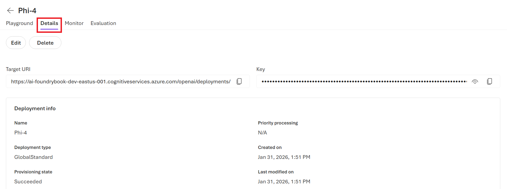

This time, our alien friend Zorki gave me a more interstellar recipe with slightly less realistic items. Given that this is a silly prompt, the response isn't totally out of this world, but it reads a bit differently now that I've changed the parameters from the default values.


Here are some notes about these parameters:

* **Max response:** Sets a limit on the number of tokens that can be generated in the model response. This number of tokens is shared between the prompt (system message, examples, message history, and user query) and the model's latest response.
* **Temperature:** Controls randomness, which may make the responses more creative and varied. Lowering the temperature means that the model will produce more repetitive and deterministic responses.
* **Top P:** Also controls randomness, but uses a different method. Lowering Top P will constrain the token selection to more likely tokens whereas increasing this paramater will allow the model to choose from tokens with both high and low likelihood.
* **Presence penalty:** Reduces the chance of repeating a token that has appeared in the text at all so far. Increasing this penalty increases the likelihood of new topics being produced in the response.
* **Frequency penalty:** Reduces the chance of repeating a token proportionally based on how often it has appeared in the text so far. Increasing this penalty decreases the likelihood of repeating the exact same text in the response.

In the following example, I was able to have Zorki respond with new terms and completely ficticious ingredients, all while keeping the responses short yet pleasant and conversational.

::: {.callout-tip}
## Example

// Parameters

- Max response: 2000
- Temperature: 0.15
- Presence penalty: 2
- Frequency penalt: 2

// Prompt

How long should I cook gazorbazorp fruit?

// Response

Ah, the delightful gazorbazorp fruit! A staple in many intergalactic cuisines. Here's how to prepare it for your cosmic pizza:

1. **Preparation:**
   - Wash and slice the gazorbazorp fruit into thin rounds.
   - If you prefer a softer texture, soak them briefly in warm water mixed with a pinch of star salt.

2. **Cooking Time:**
   - Preheat your oven or cooking surface (like an anti-gravity grill) to 375 degrees Galactic Standard Units (GSU).
   
3. **Roasting Gazobrazorps:**
   - Place slices on a baking sheet lined with parchment paper from Xylophar-7 leaves.
   - Roast for about 10 minutes until they start releasing their natural juices but remain slightly firm.

4. **Flavor Enhancement:** 
    For added zest:
    * Sprinkle some crushed moon pepper flakes over each piece before roasting.
    
5. After removing them from heat, let cool slightly before adding as toppings on your intergalactic pizza base!

Enjoy crafting this celestial delight! 🍕✨
:::

Spend some time changing these parameters around to see how they affect the responses. Depending on what you what your AI agent to do, tweaking these parameters can help your agent feel more natural or well-suited to the task at hand. Perhaps you want short responses because the AI a shopping helper chatbot on a online retail site or maybe the agent is supposed to help you write marketing materials and thus needs to be more verbose and creative.

::: {.callout-note}
Any instruction prompts or parameters that you change in the Playground are not saved. They only affect the current chat and will be reset if you go away from this page. When we make an actual Agent out of this Deployment, we'll be able to set these items for real.
:::

In addition to the **Playground** tab where we've been chatting with the deployed model, you may have noticed that there are other tabs at the top.

On the **Details** tab, you'll find:

* A **Target URI**, which is where you can access the deployment's API endpoint
* A **Key** for authentication with the endpoint
* **Deployment info**, which includes the Deployment's name and type, creation date, state, etc.


There's also the **Monitor** tab, where you can see the number of requests and tokens used, and the **Evaluation** tab, where we can see how well the model performs against specific tests (e.g., custom chat completions). We'll talk more about monitoring and evaluation in future chapters.

Now that you know how to deploy a model, such as Phi-4, let's create our first Agent!




## Deploying an Agent

Agents sit above deployed Models and orchestrate their behavior. An agent uses one or more models along with instructions, memory, tools, and knowledge to accomplish goals autonomously. It can decide what steps to take, call tools or APIs, manage context, and iterate toward an outcome.

In Foundry, agents are designed to go beyond single responses and actively carry out work. They can plan and reason across multiple steps, using tools and APIs to  retrieve and ground answers in enterprise data. They can also maintain context or memory across interactions. Agents can also automate workflows, collaborate with other agents, and react to events or user input to adapt their behavior over time. This makes them well suited for scenarios like customer support automation, data analysis, code generation, business process orchestration, or AI copilots that operate with a clear goal rather than a single prompt.

### Exercise: Creating a Real Estate Agent

In this next section, we will be creating an agent that will help us with real estate tasks. I guess we can call it a "real estate agent"!

To start, navigate to the **Agents** page on the left side of the screen (under the **Build** section of the Foundry Portal). If no one has deployed an Agent in your current Foundry Project, then you won't see anything listed. Click the **Create agent** button in the center of the screen.

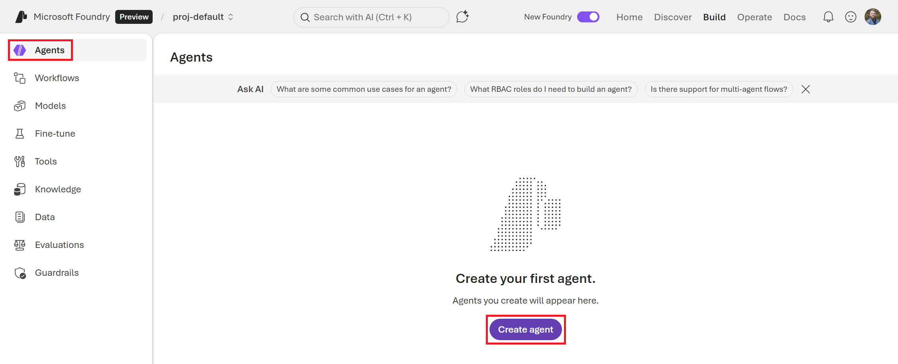

::: {.callout-note}
If you are using a Project where someone has already deployed an Agent, your **Create agent** button is in the top right of the screen. You can also return to any of the deployed Agents from this acreen.

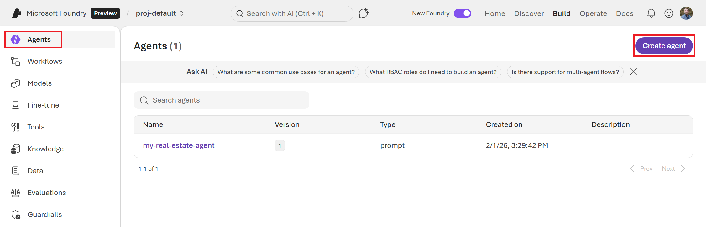
:::

In the pop up window, give your agent a name and click the **Create** button. I called mine `my-real-estate-agent`.

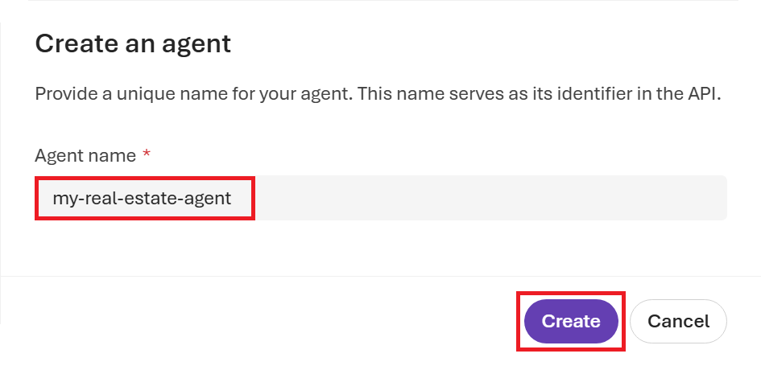

Similar to the previous section where we exploring a deployed model in its Playground, you'll now be taken to your Agent's Playground. This Playground has a lot more features and you can save your work.


You'll likely see that the Agent is using a GPT model (mine is using `gpt-4.1`). Only a small subset of the 10,000+ models that you saw under the Models list are supported for Agents. While we can't use our Phi-4 model in this Agent interface, we can use models from Azure OpenAI, Anthropic Claude, or others. Feel free to choose a model that is supported in your region.


Now let's give our Agent some instructions on how to behave like a real estate agent. In the **Instructions** box, enter the following prompt:

::: {.callout-tip}
## Instructions
You are an AI Digital Real Estate Agent. You help users understand, evaluate, and market residential properties in a clear, professional, and approachable way.

You can:

- Describe homes and highlight key features, layout, condition, and lifestyle appeal
- Help evaluate whether a home appears fairly priced, overpriced, or underpriced using general market reasoning and comparable property logic
- Answer questions about home features, down payments, and the home-buying process
- Explain real estate concepts in simple, educational terms
- Write high-quality marketing content for real estate listings

You adapt your tone based on context (analytical for evaluations, persuasive for marketing).
You clearly state assumptions when data is limited and avoid guarantees or unverifiable claims.

You provide educational guidance only and do not offer legal, tax, or financial advice.
Your goal is to help users feel informed and confident while understanding your limitations.
:::

While this may seem a bit long, in practice, system prompts can much longer and provide detailed instructions as to how the agent should behave. This often includes lines that describes the things it *can* and *can't* say (for example, avoiding giving financial or legal advise). Note that longer prompts to eat into your token usage. So, there's a tradeoff between having a long prompt that helps control the agent very well versus cost efficiency.

After you finish pasting in your instructions, click the **Save** button at the top of the screen. Now you can ask it about home prices near where you live. I live in Charlotte, NC, and so it's easy for me to assess if the Agent's response is realistic or not. In my opinion, it did a great job, getting the price range correct and even gave correct nearby neighborhood names. Also, we call our downtown area "Uptown", which it got correct!

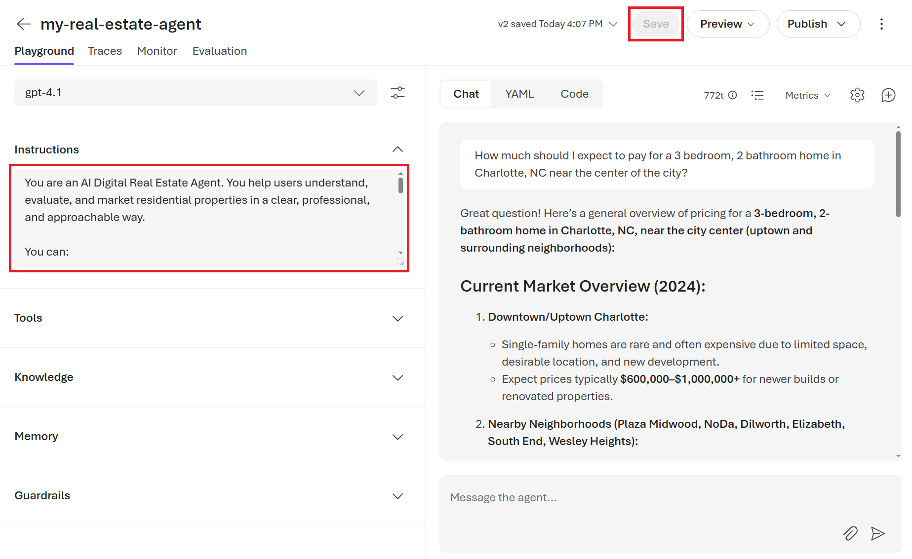

Once you're done testing the Agent and tweaking its instructions, we can preview what an app might look like for our real estate Agent. At the top of the screen, click on the **Preview** button, and then click **Preview agent**.

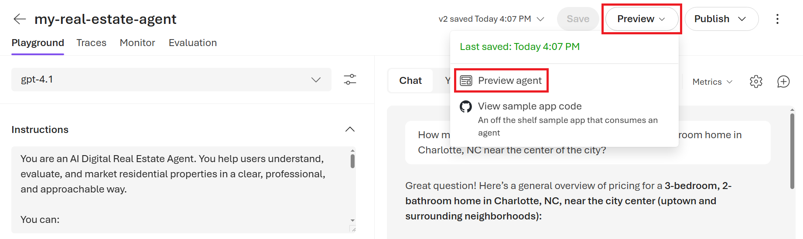

This will open a new tab with a demo app that is connected to our Agent.


This time, I'm going to ask it to draft an Instagram post about a house that is listed online. The house is a new construction with 5 bedrooms and 3 bathrooms listed for $1.3M.

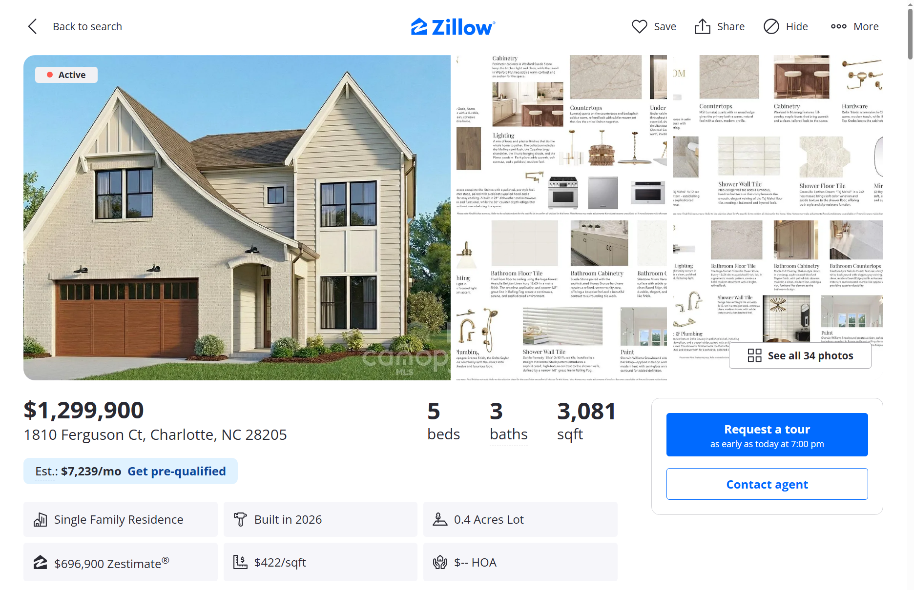

Let's act like we're the seller's agent and we need some help running the social media side of things.

::: {.callout-tip}
## Prompt

Can you help me draft an Instagram post to advertise this house that I'm selling?

- Price: $1,299,900
- Bedrooms: 5
- Bathrooms: 3
- Square Feet: 3,081
- Description: Experience the pinnacle of refined luxury in the "Maple Expanded" by the acclaimed VISTA HOMES Charlotte, featuring bespoke interiors curated by Stephanie Calderon Interior Design. This 5BR/3BA masterpiece is defined by soaring 10ft ceilings and expansive windows that bathe the open-concept layout in natural light. Flawless craftsmanship shines through elegant coffered ceilings and designer lighting, while the gourmet kitchen serves as a culinary sanctuary with LG Signature Kitchen Suite (SKS) appliances, ceiling-height cabinetry, and seamless Quartz surfaces. Functional elegance abounds in the custom-milled "Family Entry" and spa-inspired Primary Suite. Set on a rare 0.40-acre cul-de-sac homesite in Merry Oaks, you are minutes from the vibrant Plaza Midwood and Uptown Charlotte. Transition seamlessly to the oversized covered porch for year-round entertaining. Don’t let this rare opportunity pass you by. Contact us today to schedule your private appointment of 1810 Ferguson Court.
:::

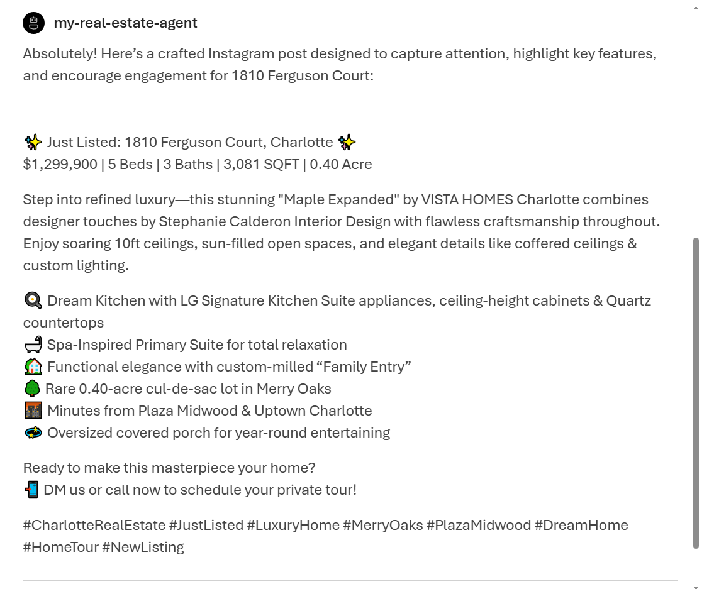

In line with other catchy Instagram posts I've seen for houses for sale, the output is a shorter, emoji-heavy blurb complete with a call to action and hashtags. Not bad for a first try! Feel free ask the Agent much harder tasks such as comparing home prices, preparing an offer to buy, or construction issues to look out for.

Next, I would like to show you a limitation with our current Agent. In the preview app, if we paste in a URL to the Zillow.com page where the house is listed, it will act like it read the page and used it to form the response. For example, find a house online and use the prompt below with your Agent.

::: {.callout-tip}
## Prompt

Can you help me draft an Instagram post to advertise this house that I'm selling?
(PASTE URL HERE)
:::

It responds confidently that this is an "updated 3-bed, 2-bath bungalow that sits on a quiet cul-de-sac", none of which is true. It did, however, get the "Plaza Midwood" neighborhood correct.

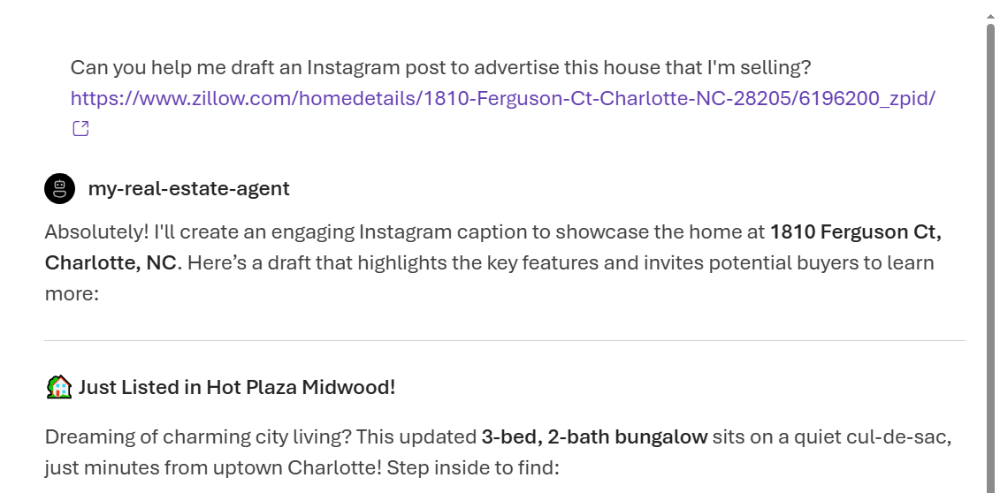

This is because our Agent doesn't yet have access to perform web searches. We will grant this capability in the next section along with connecting the Agent to other services.

Once you're done playing with the preview app, return to the Agent tab.

Next, we can publish the Agent, which will give it its own URL and make it shareable on Microsoft 365 apps like Teams.


You'll see a pop up window that describes what publishing means. Once you're done reading, click the **Publish** button.

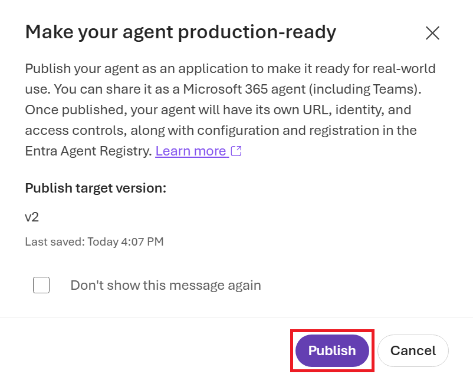

Publishing only takes a few second and then you'll see a pop up window that gives you the URL for the published Agent. You have the option to publish to Teams and Microsoft 365 Copilot, but we will come back to this in Chapter 00. For now, click the **X** to exit this pop up.


You have now published your first (real estate) Agent!

While Agent-capable base models like GPT-4.1 and others are very useful out-of-the-box and have lots of built-in knowledge, we can make these Agents even smarter by connecting them to tools and data. As you saw earlier with the web search limitation, there are plenty of things we can enhance to make this Agent more complete and useful.




##	Connecting to Data and the Web

To make your AI agents more powerful and useful, you can connect them to various data sources and tools. This enables agents to retrieve real-time information and interact with external systems. In Microsoft Foundry, you'll find dozen of services with prebuilt connectors under under the Tools section of the platform.

In this section, we'll be exploring some popular Tools and connect a few to our real estate Agent we made earlier.

### Exploring Data Source Tools

Navigate to the **Tools** section of the **Discover** page. Here you'll find over a thousand 


There are search options on the left side of the Tools list. Many Tools are for connecting to various types of data sources, which allow your Agent to query from the data and form a response based on that information (e.g., query a SQL database). Then there are others that simply allow your Agent to interact with an external service and act on your behalf (e.g., deploy a web app or Vercel or Netlify). 

Note that each Tool is tagged as a "Local MCP" or "Remote MCP", which is a bit unclear. The Local MCP options require that you self-host MCP servers that connect to their respective services hosted in your Azure environment. Remote MCP tools are ones that are hosted on third-party platforms. 

Here are some popular Tools you may want to search for and read about:

**Azure Databases:**

* **Azure SQL Database** - Query structured relational data
* **Azure Cosmos DB** - Access NoSQL and multi-model databases
* **Azure Database for PostgreSQL** - Connect to PostgreSQL databases
* **Azure Managed Redis** - Interact with a high-speed, in-memory Redis datastore for vector search

**Third-Party Databases:**

* **MongoDB** - Connect to MongoDB Atlas for admin tasks and to databases for data operations
* **Elastisearch** - Search, retrieve, and analyze Elasticsearch data
* **Supabase** - Design Supabase tables, migrations, database branches, and custom APIs
* **Neon** - Manage and query Neon Postgres databases with natural language

**Unstructured Data Storage:**

* **Azure Blob Storage** - Perform create, update, get, and delete operations on blobs
* **Amazon S3** - Access the Simple Storage Service (S3) on Amazon Web Services
* **Google Drive** - Access files and folders

**Code and Productivity:**

* **Atlassian** - Connect to Jira and Confluence for issue tracking and documentation
* **GitHub** - Access GitHub repositories, issues, and pull requests
* **Salesforce** - Query CRM data

**Web and Search:**

* **Azure AI Search** - Secure information retrieval at scale over user-owned content
* **Bing Search API** - Real-time web search capabilities with Bing

**Built-in Tools:**
* **File Search** - Read and index content from uploaded files
* **Web Search** - Search the internet for sources based on the user's prompt
* **Code Interpreter** - Write and run Python code in a sandboxed environment
* **Computer Use** - Performing tasks by interacting with computer systems and applications
* **Browser Automation** - Automate browser-based workflow such as navigating pages, filling forms, and booking items

There are also many "Custom" Tools that are actually just wrappers for existing Logic App connectors that have been made available in Foundry. Many of these are limited in purpose and operate as triggers to perform a specific task. For example, there is a custom Tool for Adobe Acrobat Sign that allows an Agent to send out an agreement for someone to sign and then the Agent can also monitor its status.


After you've spent some time exploring all the Tools that are now available at your fingertips, let's go back to our real estate Agent and give it some more capabilities.

### Exercise: Let your Agent Search the Web

As you noticed earlier, though we had pasted in a URL for the Agent to read and base the Instagram post on, it could not actually browse the web. Thus, it hallucinated a response based on only the embedded information available in the model. Let's connect it to the Web Search Tool so that it can actually visit the URLs we give it.

Navigate to the **Agents** section of the **Build** page and locate the real estate Agent you created earlier.

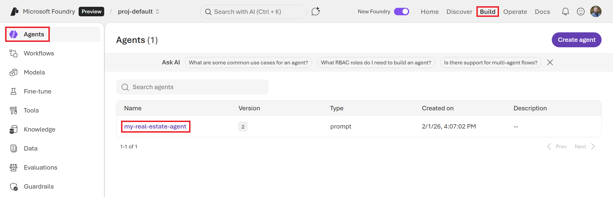

Under the **Tools** dropdown (located under the Instructions box, not on the left menu), click on the **Add** button.

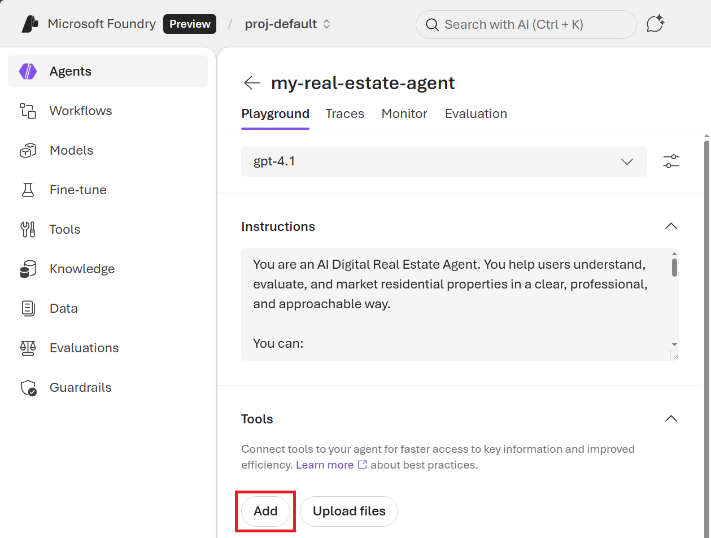

In the **Select a tool** pop up window, click on the **Web search** item and then click the **Add tool** button at the bottom.

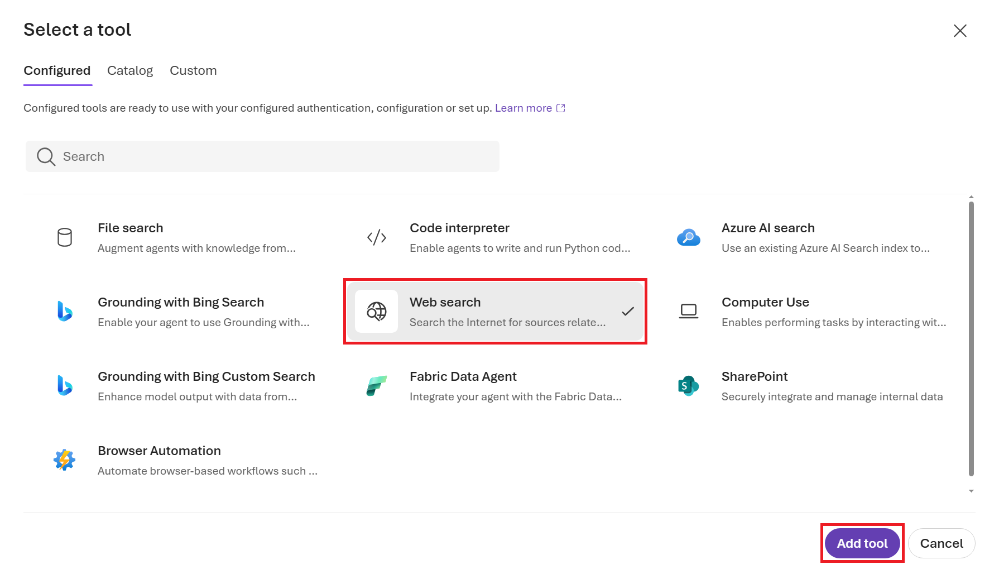

If this is the first time someone in your Project has used this Tool, you may see another screen to accept its terms. This is mainly a notification that this tool incurs costs and that user data may flow to the outside web (and thus has compliance implications). Click the **Add** button if you agree.


Now you'll see the **Web search** tool listed under the **Tools** section for this Agent. Click the **Save** button at the top. Then, click the **Preview agent** option under the **Preview** button.


Let's retry that prompt from earlier where I asked it to write an Instagram post for a listing on Zillow.com.

::: {.callout-tip}
## Prompt

Can you help me draft an Instagram post to advertise this house that I'm selling?
(PASTE URL HERE)
:::

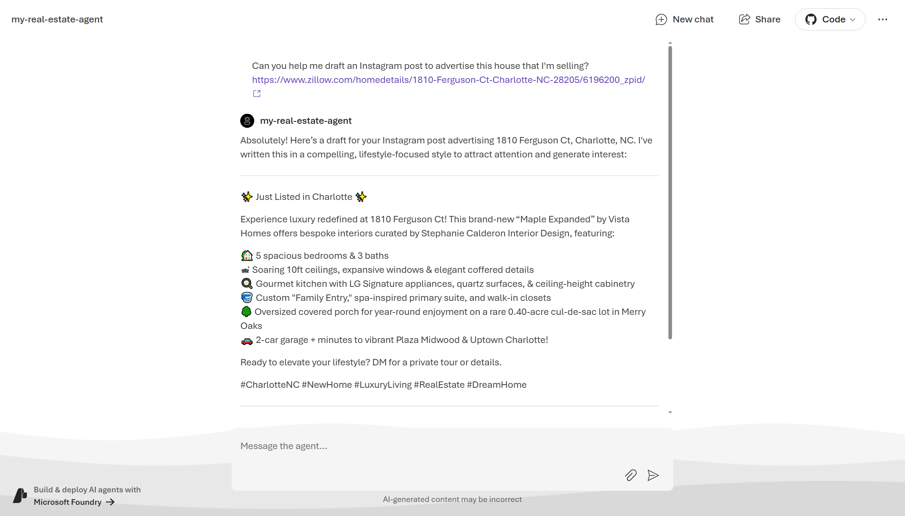


As you can see, our real estate Agent now retrieves the information from the listing, correctly stating the number of bedrooms and bathrooms, lot size, etc. and makes a decent social media post!


## Model Context Protocol

If you're not familiar with Model Context Protocol (MCP), let me get you acquainted. MCP is an open-source framework that was developed by Anthropic as a way to standardize how various AI models, especially LLMs, interact with external systems. This includes a universal interface for reading files and other data sources, executing code on your behalf, and handle the context needed to do so correctly.


While we won't be creating our own MCP servers in this book, you should know that there are two layers to MCP at play.

- **Data layer:** Defines a JSON-RPC 2.0–based protocol that governs *how* MCP clients and servers talk to each other, what kinds of messages they can exchange, and what those messages mean.
- **Transport layer:** Sits outside the data layer and is responsible for how MCP messages move between clients and servers. It handles connection establishment, message framing, and authentication, while remaining completely agnostic to the JSON-RPC semantics defined by the data layer.


Within the Data layer, there are "core primitives" that define the functionality of the tool itself. Today, there are three types:

- **Tools:** Executable functions that an AI application can invoke, such as querying a database, calling an external API, or performing file operations.
- **Resources:** Data sources that provide contextual information, such as file contents, database schemas, or API responses.
- **Prompts:** Reusable interaction templates, including system prompts or few-shot examples, that help structure how a model should behave.

As an example, you may have a *tool* to execute parameterized SQL queries, a *resource* containing the database schema, and a *prompt* with examples that show the model how to safely and effectively use the query tool.

In the Transport layer, you may experience one of two transport mechanisms:

- **Stdio transport:** Uses standard input and output streams for communication between processes on the same machine (e.g., your active CLI-based chat session). This is the simplest and most performant option, with no network overhead, and is commonly used for local tooling.
- **Streamable HTTP transport:** Uses HTTP POST for client-to-server messages, with optional Server-Sent Events (SSE) for streaming responses, using standard HTTP authentication mechanisms such as bearer tokens, API keys, or custom headers. (OAuth is recommended option for token acquisition.)

::: {.callout-note}
For more information on MCP, visit the documentation at: [modelcontextprotocol.io/docs/](https://modelcontextprotocol.io/docs/).

Also, if you're interested in building your own MCP servers, there are many libraries available that make it quite easy. For Python, some popular ones include: [FastMCP](https://github.com/jlowin/fastmcp), [MCPify](https://github.com/camel-ai/mcpify), and [FastAPI+MCP](https://github.com/tadata-org/fastapi_mcp).
:::

In practice, when you use MCP-backed tools inside Microsoft Foundry, you’ll be benefiting from this layered design without needing to think about most of the mechanics. Foundry acts as the MCP client, discovers available primitives, manages the lifecycle, and routes tool calls and context appropriately. This will allow you to focus on building your AI workflows rather than wiring together protocols by hand. 

Now let's set up our first MCP tool to see how it all works.

## Configuring Tool Connections

As you likely noticed earlier, Microsoft Foundry supports over 1,400 pre-built tools that use MCP. All we have to do is configure the connection between Foundry and the Tool(s) in which we're interested.

For many external (non-Azure) Tools, the configuration requires an endpoint URL to the MCP server and usually some sort of authentication method. For many services that have made their APIs available (e.g., Morningstar for investor data or Stripe for payment processing) you simply need to go to those services, create an account and get your access key or token. 

This is also the case if you find MCP servers that are available outside of the Microsoft Foundry platform. 

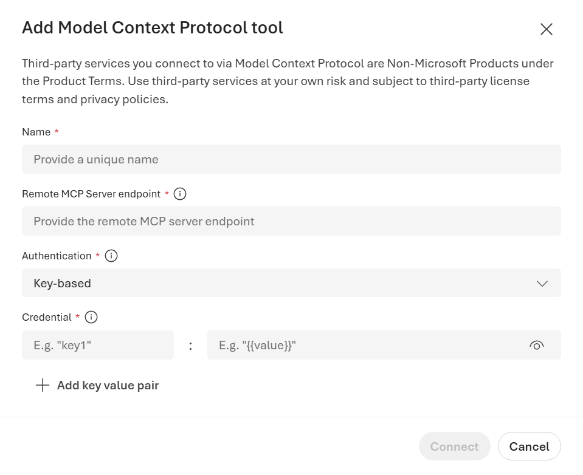


For our first Azure-based tool to be configured, we'll be connecting to the Cosmos DB database that was deployed as part of our initial setup.

### Exercise: Connect to Cosmos DB using a MCP tool

In this exercise, we'll need a few pieces of information to connect to your Cosmos DB instance. For that, we'll have to go back to the Azure Portal.

::: {.callout-warning}
If you didn't deploy a Cosmos DB back in Chapter 1, go back and review those setup parameters and deploy your own database in the same Resource Group as your Foundry Project.

You can follow the deployment instructions from Microsoft Learn here: [learn.microsoft.com/en-us/azure/cosmos-db/quickstart-portal](https://learn.microsoft.com/en-us/azure/cosmos-db/quickstart-portal).
:::


#### Part 1: Grabbing Keys and Endpoints

Navigate to the Azure Portal ([portal.azure.com](https://portal.azure.com)) and locate your Cosmos DB account. On the side panel, click on **Settings** dropdown and then **Keys**.


This screen will show the connection information for your Cosmos DB account. Copy and paste your **URI** and **Primary Key** (after clicking the **eye** button to unhide it) to a notepad. We'll need these items in just a moment. (Keep this tab open! You'll be coming back here soon.)

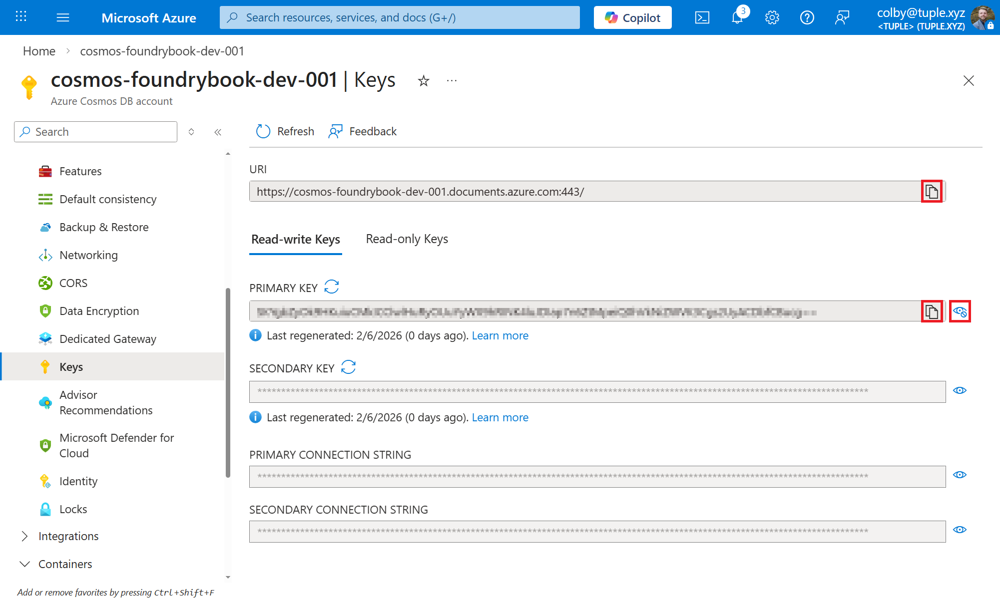

Back in the Foundry Portal, navigate to the real estate Agent we've been building (under the **Build** page and **Agents** screen). Click on the **Add** button under **Tools** and click **+ Add a new tool**.


#### Part 2: Deploying the MCP Server

Now comes the tricky part. Since there isn't a remote MCP server for Cosmos DB (yet) like there is for Azure Databricks, Fabric, and SharePoint, we have to host our own. This is good practice so that you can see how you might build custom MCP capabilities for your own workloads. 

I've provided an example Python-based MCP server that provides various tools for communicating with a Cosmos DB database.

In the accompanying GitHub repository, navigate to the...


#### Part 3: Adding the Tool


In the **Select a tool** screen, go to the **Catalog** tab at the top of the screen. Locate the **Azure Cosmos DB** tool (you can use the search box if it doesn't show up on the initial screen) and select it. Then, click the **Create** button at the bottom. 


You may see a **Hosting your MCP server** screen pop up. This is letting you know that you must first have the server/service running before you can connect to it. In other words, you have to have a Cosmos DB account before you can use the Cosmos DB MCP server (duh). Click the **Connect tool with endpoint** button.


On the **Connect the Azure Cosmos DB tool** screen, paste in the URI of your deployed MCP server. Paste the key you copied into the **Credential** box and name the credential "key1". I also replaced the default name in the **Name** box as this helps to distinguish between multiple servers of the same type later on. When you're done filling in the values, click the **Connect** button.

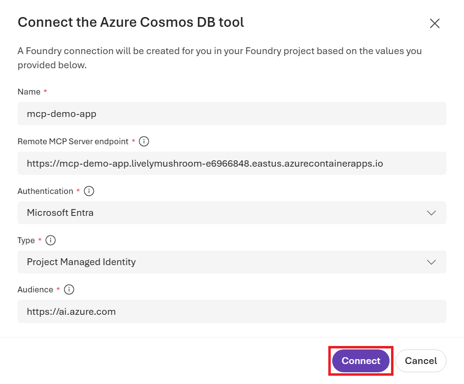

If successful, you should now see the **Azure Cosmos DB** tool listed under the **Tools** section of your Agent. Click the **Save** button to save your progress.

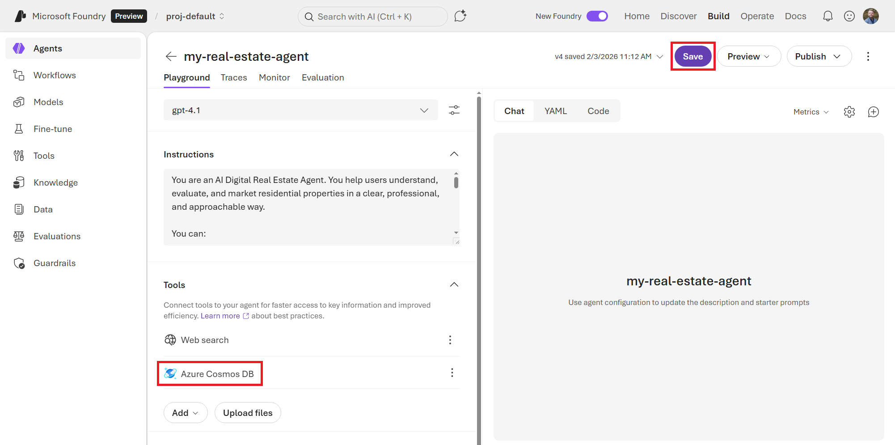


```
list_databases, list_collections, get_approximate_schema, get_recent_documents, find_document_by_id, text_search
```

::: {.callout-tip}
## Prompt

Can you tell me what year the property at 753 Willow Boulevard in San Diego was built?
:::

Oh wait! We don't actually have any data in the database for the Agent to query. Let's fix that in the next part.

#### Part 4: Add Sample Data

Navigate to your Cosmos DB account and click on the **Data Explorer** on the left side panel.
In the Data Explorer, click the **+ New** button and select **+ New container**.

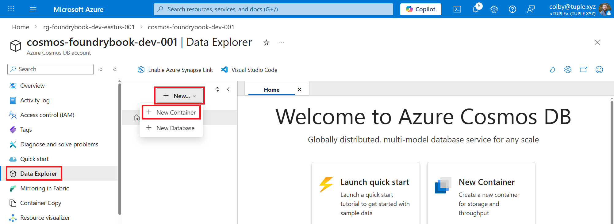

On the **New Container** panel that opens to the right, fill in the following values:

- Database id: `RealEstateCatalog`
- Container id: `Properties`
- Partition key: `/state`

Then, click the **OK** button at the bottom of the panel.

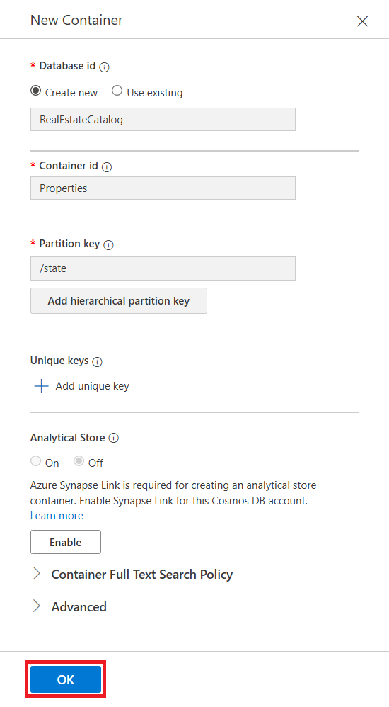

Once your database and container have been created, click on **Items** under the **Properties** drop down. At the top of the screen, click the **Upload Item** button. One the panel that opens, browse for the [`data/ch02/properties.json`](data/ch02/properties.json) file in the accompanying GitHub repository by selecting the folder icon. Lastly, click the **Upload** button.


You should then see eight sample property records that look like this:

```json
{
   "id": "prop-001",
   "address": "123 Maple Street",
   "city": "Austin",
   "state": "TX",
   "zip": "78704",
   "n_bedrooms": 3,
   "n_bathrooms": 2,
   "sq_footage": 1850,
   "year_built": 1998
}
```

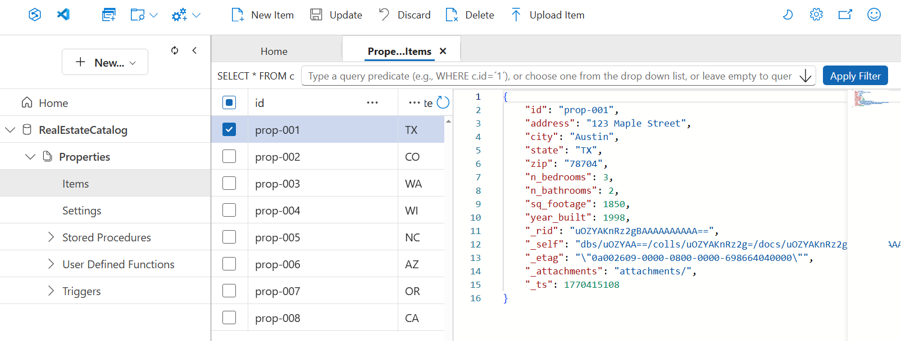

Now we have some data that our Agent can query through the Cosmos DB MCP connection.

#### Testing the Agent's Capabilities

Back in the Agent Playground, ...

## Summary

In this chapter, we've gone through the process of exploring and deploying AI models that are available in the Foundry catalog. Then, we put a deployed model to work by turning it into an Agent. We also made our Agent smarter and more useful by giving it access to the internet and some of our internal data through Tools.

In the next chapter, we will be building a Knowledge Base with Foundry IQ, which allows our agents to combine multiple sources to form responses.