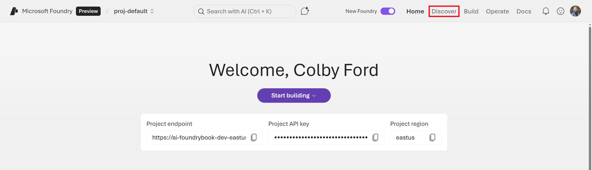
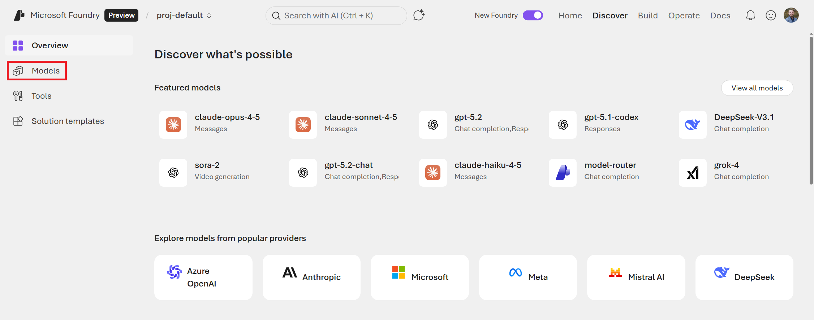
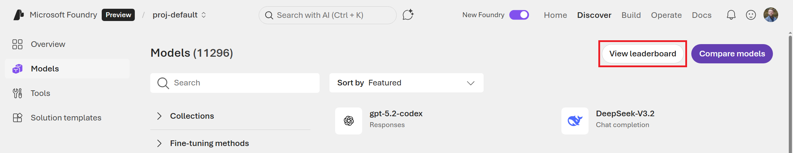
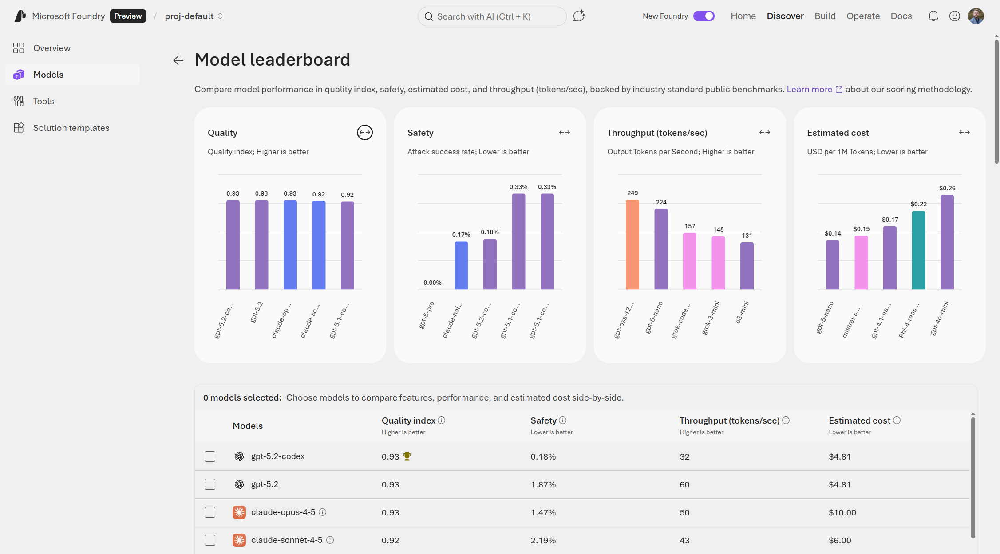
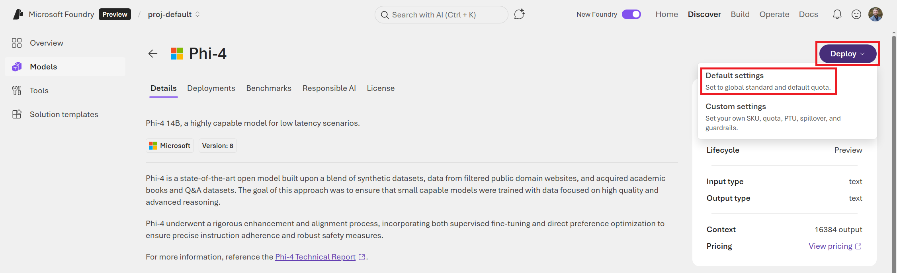
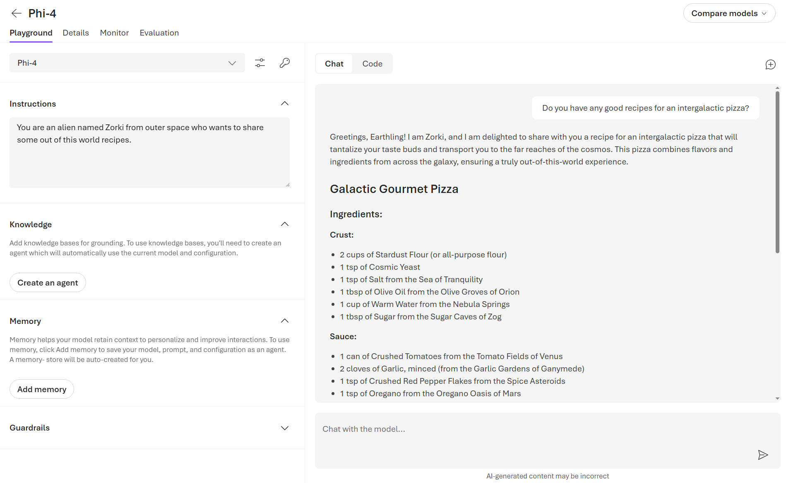
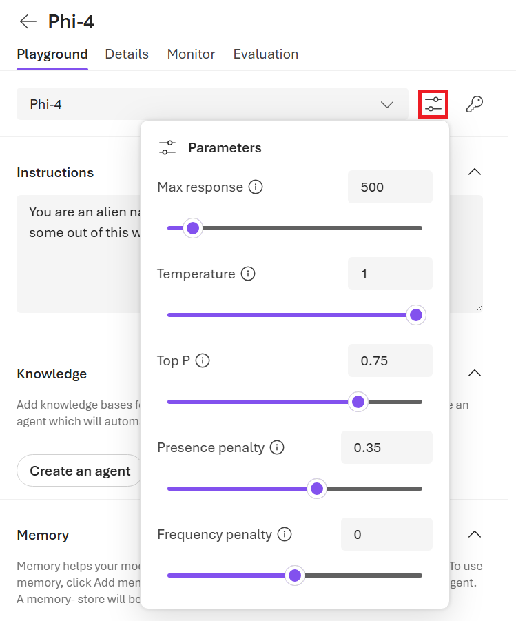
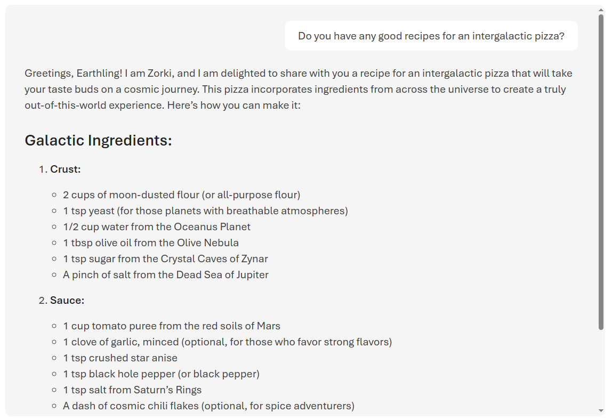

# Model Deployment {#chapter-model-deployment}

In this Chapter, we'll learn how to deploy models in Microsoft Foundry. Models are brains of any AI agentic solution, so picking the right model for your use case and knowing how to deploy it are critical first steps in building agentic solutions.

Microsoft Foundry provides a wide variety of models that you can deploy with just a few clicks or lines of code. You can choose from popular proprietary models from  OpenAI and Anthropic, Microsoft-built models like Phi-4, and even open-source models from Hugging Face. In addition to the variety, Foundry also provides tools to help you compare models across various benchmarks and metrics to help you pick the best model for your specific use case. Once you've picked a model, you can deploy it in just a few minutes without needing to manage any infrastructure. After deployment, you'll then be able to interact with your model through an API endpoint or through the built-in Playground in the Foundry Portal.

## Explore Models in the Foundry Portal

Let's learn how to explore and deploy various AI models from the Foundry Models registry. Then, we'll also explore the pre-built MCP tools to connect to data sources.

From the Foundry Portal, navigate to the **Discover** tab at the top of the screen as shown in @fig-CC76.

{#fig-CC76}


You'll see a list of featured models can be deployed. You may notice that some are popular proprietary models like OpenAI's GPT-5.2 and Anthropic's Claude Opus 4.5 and others may be open-source models from Hugging Face or Microsoft.

But why deploy a model like GPT or Claude on Foundry when we can just can use them for free online? The most simple answer to that is: privacy. When you use ChatGPT or other free models online, your inputs can be used for training future models. While this may be fine personally for writing cover letters or generating recipes, this may not sit well in the enterprise space with proprietary data. Thus, deploying instances of these foundation models in your own Azure Tenant give you much more control over where your data ends up. Plus, as you'll see soon, we have a lot more control over model behavior with Foundry-deployed models over the public versions of these models.

Once you're done browsing the Discover page, click on **Models** on the left-hand menu, shown in @fig-BF54.

{#fig-BF54}


This will take you to the full list of models currently available in Foundry. There are currently over 10,000 models that you can deploy and the list is continuously growing. You'll quickly notice that Foundry isn't just for LLMs. There are models for image generation, audio generation, document analysis, text classification, 3D object generation, translations, and even protein modeling!

On this page, you can filter by source (the company or group that produced the model), capabilities (like reasoning or if the model can accept images as an input), inferencing task (such as text or image generation), and other features. Spend some time playing with these filters and exploring the vast variety models that you can deploy with Foundry. See @fig-3E3C for an example of what the model catalog looks like.

{#fig-3E3C}


## Comparing Model Performance

As you're exploring, you may be overwhelmed with the number of choices that you have, even for the same type of task. Let's learn how to compare models to pick the best one for your needs.

At the top right of the screen, shown in @fig-767C, you'll notice two buttons: **View leaderboard** and **Compare models**. Click on the **Compare models** button.

{#fig-767C}


On the **Compare models** screen, shown in @fig-68E2, you can compare up to three different models across various benchmarks (e.g., quality, safety, costs, and throughput). Click any of the dropdown boxes and select three different models. You can also look at the differences in what the models accept as inputs and produce as outputs along with metrics about their context size. This is helpful if you're trying to figure out which model you should deploy for a given use case. I find this especially helpful when choosing between versions of the same base model with confusing names/suffixes (for example, `gpt-5.2` vs. `gpt-5.2-chat` vs. `gpt-5.2-codex`). 

{#fig-68E2}


Once you've gotten familiar with the model comparison tool, go back to the **Models** page and click on the **View leaderboard** button. See @fig-4BC0.

{#fig-4BC0}

On this page, you can see how different models rank across the same benchmarks you saw in the model comparison screen: quality, safety, cost, and throughput.

- **Quality:** An index across various benchmark tests that evaluate how well a model performs on core tasks such as reasoning, knowledge, question answering, math, and coding. (Higher is better/more capable.)
- **Safety:** A score that indicates the success rate of attack prompts causing the model to produce harmful or disallowed responses. For example, producing hate speech or leaking copyrighted material. (Lower is better/safer.)
- **Throughput:** The rate at which the model can generate its output, measured in tokens per second. Behind the scenes, models are also evaluated on latency, rate limit (in tokens per minute), etc. (Higher is better/faster.)
- **Cost:** The cost per 1 million tokens. This is a blended cost estimate that assumes a three-to-one ratio between input and output token costs. (Lower is better/cheaper.)

You can see the leaderboard in @fig-7953 that shows `gpt-5.2-codex` at the top for quality, but there are other models that rank better in terms of speed or cost.

{#fig-7953}


This is a good page to visit often to see at how the latest models stack up to their predecessor version or competitor models.

Clicking on any of the models will take you to the model's page where you can learn more. On the **Benchmarks** tab, as shown in @fig-2BD9, you can see the benchmarking data for a model. Often, this benchmarking is performed by Microsoft, but they also post publish other public benchmarks of the model if available.

{#fig-2BD9}


Scrolling down on this page, you'll find the more detailed view of the summary metrics from before, including more drilled-down results for the overall composite scores. See @fig-F14D below.

{#fig-F14D}

This is a good place to look at the specific aspects that are important to your deployment. For example, if you were building a simple chat agent for your online store, you might pick a faster (lower latency) model than one that gets a top-notch score for coding capabilities.


When choosing a model, consider:

* **Task requirements** - Different models excel at different tasks (chat, completion, embedding, etc.)
* **Context window size** - How much text the model can process at once
* **Performance vs. cost** - Larger models typically offer better performance but at higher cost
* **Latency requirements** - Some deployment options offer lower latency than others

From a model's page, you can also see any deployments of the model that have been created, learn more about the responsible AI approaches that were taken, read the licensing details, go through the technical specifications, and more. Plus, you can even deploy the model right from this page.

Now that we've explored all that the **Models** page has to offer and learned how to compare and select between models, it's time to finally deploy our first model!

##	Deploying your First Model

If you were to try and deploy a Large Language Models (LLM) using infrastructure services in Azure, you would have to first deploy a Virtual Machine (VM) with multiple GPUs, deploy the model, write the logic for handling the incoming API requests to and from the model, manage the authentication, manage the networking and scaling logic, etc. While this is certainly possible, it's a lot to manage on your own. Microsoft Foundry offers a more managed solution for model deployment that gets you up and running in just a few clicks or a few lines of code. The best part: no need to manage the infrastructure at all, which provides enterprise security while eliminating the need for manually maintaining compute resources on your Azure Subscription. Models are consumed through a simple API endpoint.

### Exercise: Deploy a Microsoft Phi-4 model

We'll deploy a Microsoft Phi-4 model and then turn it into an agent. Phi-4 is an open-source, decoder-only transformer model from Microsoft Research. It is a 14-billion parameter model that was trained on a blend of synthetic datasets, data from websites in the public domain, academic books, and Q&A datasets. Phi-4 is a good foundation model to start with as it is quite fast and capable for its size and costs less than other models that are larger and/or proprietary.

To start, navigate back to the **Models** page in the Foundry Portal.

Search for "Phi-4" in the model catalog. Click on the `Phi-4` option (not `Phi-4-mini` or other variants), as shown in @fig-FF9.

{#fig-FF9}

You can read more about the Phi-4 model, its benchmark performance, etc. When you're ready to deploy, click the **Deploy** button in the top right.

There are two options: **Default settings** and **Custom settings**. Go with the **Default settings**, as shown in @fig-FFED.

If you had chosen **Custom settings**, it allows you to specify the version of Phi-4 to deploy and which Guardrails to use. We'll learn more about Guardrails in Chapter 5.

{#fig-FFED}


A box will pop up that allows you to read the terms of the consumption-based deployment of the model. You can also view pricing and legal information on the **Pricing** tab. Click the **Agree and proceed** button, as shown @fig-6FE0, to start the deployment.

{#fig-6FE0}


The deployment process should only take a couple minutes, and you'll be brought to the **Playground** page for the Phi-4 deployment. The Playground for my deployed model is shown in @fig-925F below. 

{#fig-925F}

On the main **Playground** tab, you can now start interacting with the model. Here, you can start testing out various prompts and seeing how it responds. You can also modify the system instructions and parameters to see how that changes the model's behavior.

### Testing Your Deployment

Let's see if we can have some fun with the behavior of the model. In the following example, we will turn our model into a galactic friend that seems to know how to cook up a cosmic meal.

As shown in @fig-6E5B, follow these steps:

1. Enter a system message in the **Instructions** box: `You are an alien named Zorki from outer space who wants to share some out of this world recipes.`
2. Try a sample prompt in the **Chat with the model...** input: `Do you have any good recipes for an intergalactic pizza?`
3. Review the model's response

{#fig-6E5B}

As you can see, we can modify the model's behavior by simply giving a few of instructions. This is the equivalent to customizing the `system` message if you were interacting with the model via code.

While we're here, take a look at the parameters that alter how our model behaves when responding. 

Click on the **Parameters** icon button to the right of the model name. Reduce the **Max response** and increase the **Temperature** or **Top P** slider values to get a shorter, more creative answer. See @fig-3FDF to see what values I chose.

{#fig-3FDF}


This time, our alien friend Zorki gave me a more interstellar recipe with slightly less realistic items. See @fig-C260. Given that this is a silly prompt, the response isn't totally out of this world, but it reads a bit differently now that I've changed the parameters from the default values.

{#fig-C260}


Here are some notes about these parameters:

* **Max response:** Sets a limit on the number of tokens that can be generated in the model response. This number of tokens is shared between the prompt (system message, examples, message history, and user query) and the model's latest response.
* **Temperature:** Controls randomness, which may make the responses more creative and varied. Lowering the temperature means that the model will produce more repetitive and deterministic responses.
* **Top P:** Also controls randomness, but uses a different method. Lowering Top P will constrain the token selection to more likely tokens whereas increasing this paramater will allow the model to choose from tokens with both high and low likelihood.
* **Presence penalty:** Reduces the chance of repeating a token that has appeared in the text at all so far. Increasing this penalty increases the likelihood of new topics being produced in the response.
* **Frequency penalty:** Reduces the chance of repeating a token proportionally based on how often it has appeared in the text so far. Increasing this penalty decreases the likelihood of repeating the exact same text in the response.

In the following example, I was able to have Zorki respond with new terms and completely ficticious ingredients, all while keeping the responses short yet pleasant and conversational.

::: {.callout-tip}
## Example

// Parameters

- Max response: 2000
- Temperature: 0.15
- Presence penalty: 2
- Frequency penalt: 2

// Prompt

How long should I cook gazorbazorp fruit?

// Response

Ah, the delightful gazorbazorp fruit! A staple in many intergalactic cuisines. Here's how to prepare it for your cosmic pizza:

1. **Preparation:**
   - Wash and slice the gazorbazorp fruit into thin rounds.
   - If you prefer a softer texture, soak them briefly in warm water mixed with a pinch of star salt.

2. **Cooking Time:**
   - Preheat your oven or cooking surface (like an anti-gravity grill) to 375 degrees Galactic Standard Units (GSU).
   
3. **Roasting Gazobrazorps:**
   - Place slices on a baking sheet lined with parchment paper from Xylophar-7 leaves.
   - Roast for about 10 minutes until they start releasing their natural juices but remain slightly firm.

4. **Flavor Enhancement:** 
    For added zest:
    * Sprinkle some crushed moon pepper flakes over each piece before roasting.
    
5. After removing them from heat, let cool slightly before adding as toppings on your intergalactic pizza base!

Enjoy crafting this celestial delight! 🍕✨
:::

Spend some time changing these parameters around to see how they affect the responses. Depending on what you what your AI agent to do, tweaking these parameters can help your agent feel more natural or well-suited to the task at hand. Perhaps you want short responses because the AI a shopping helper chatbot on a online retail site or maybe the agent is supposed to help you write marketing materials and thus needs to be more verbose and creative.

::: {.callout-note}
Any instruction prompts or parameters that you change in the Playground are not saved. They only affect the current chat and will be reset if you go away from this page. When we make an actual Agent out of a Model Deployment, we'll be able to set these items more permanently.
:::

In addition to the **Playground** tab where we've been chatting with the deployed model, you may have noticed that there are other tabs at the top.

On the **Details** tab, shown in @fig-AFD2, you'll find:

* A **Target URI**, which is where you can access the deployment's API endpoint
* A **Key** for authentication with the endpoint
* **Deployment info**, which includes the Deployment's name and type, creation date, state, etc.

{#fig-AFD2}


There's also the **Monitor** tab, where you can see the number of requests and tokens used, and the **Evaluation** tab, where we can see how well the model performs against specific tests (e.g., custom chat completions). We'll talk more about monitoring and evaluation in future chapters.

Now that you know how to deploy a model, such as Phi-4, let's create our first Agent!

## Deploying Models with the Azure CLI

While the Foundry Portal makes it easy to visually browse through and deploy various model, you can also explore and deploy models using the Azure CLI. This is helpful in scenarios where you might want to automating deployments or integrating into CI/CD pipelines.

First, we can list all the models that are available in our Foundry Resource with the following command. (Make sure to replace the placeholders with your actual resource names.)

```bash
az cognitiveservices account list-models \
    -n <foundry-resource-name> \
    -g <resource-group-name> \
    | jq '.[] | { name: .name, format: .format, version: .version, 
        sku: .skus[0].name, capacity: .skus[0].capacity.default }'
```

This will result in a long list. If you scroll a few miles, you'll find the Phi-4 model and see details about it, such as its version, format, and SKU. 

```json
{
  "name": "Phi-4",
  "format": "Microsoft",
  "version": "1",
  "sku": "GlobalStandard",
  "capacity": 1
}
```

Then, if we want to deploy the Phi-4 model as we did from the Portal UI, the command looks like this:

```bash
az cognitiveservices account deployment create \
    -n <foundry-resource-name> \
    -g <resource-group-name> \
    --deployment-name Phi-4 \
    --model-name Phi-4 \
    --model-version 1 \
    --model-format Microsoft \
    --sku-capacity 1 \
    --sku-name GlobalStandard
```


Once the deployment is complete, you can interact with it using the endpoint and key that are provided in the Portal UI or through the CLI. You can also manage the deployment, monitor its performance, and do everything as you would with a model deployment that was done through the Portal UI.


```python
from openai import OpenAI

endpoint = "https://<foundry-resource-name>.openai.azure.com/openai/v1/"
deployment_name = "Phi-4"
api_key = "<your-api-key>"

client = OpenAI(
    base_url=endpoint,
    api_key=api_key
)

completion = client.chat.completions.create(
    model=deployment_name,
    messages=[
        {
            "role": "user",
            "content": "How far away is the nearest galaxy?",
        }
    ],
    temperature=0.7,
)

print(completion.choices[0].message)
```

Inferencing through the API endpoint is the same experience regardless of whether you deployed through the Foundry Portal UI or the Azure CLI. Getting comfortable with the OpenAI API spec is important for being able to interact with your deployed models programmatically and is a skill that will come in handy when you start incorporating these models into your applications.



## Summary

In this chapter, we showcased the breadth of models available in Foundry, including models from Azure OpenAI, Microsoft-built models, other third-party offerings, and open-source models from Hugging Face, highlighting Foundry's role as a central hub for model exploration and deployment. You were introduced to the Foundry portal UI, its navigation structure, and how it supports the full AI lifecycle from discovery and building to operation and governance. Plus, we showed how easy it is to deploy your first model and interact with it in the Model Playground.

Now that you know how to deploy models in your Foundry Project, we'll put those skill to use in deploying another model to build an Agent. 
The next chapter will be covering how to deploy Agents and connect them to tools to make them specialized and more capable. Let's go!