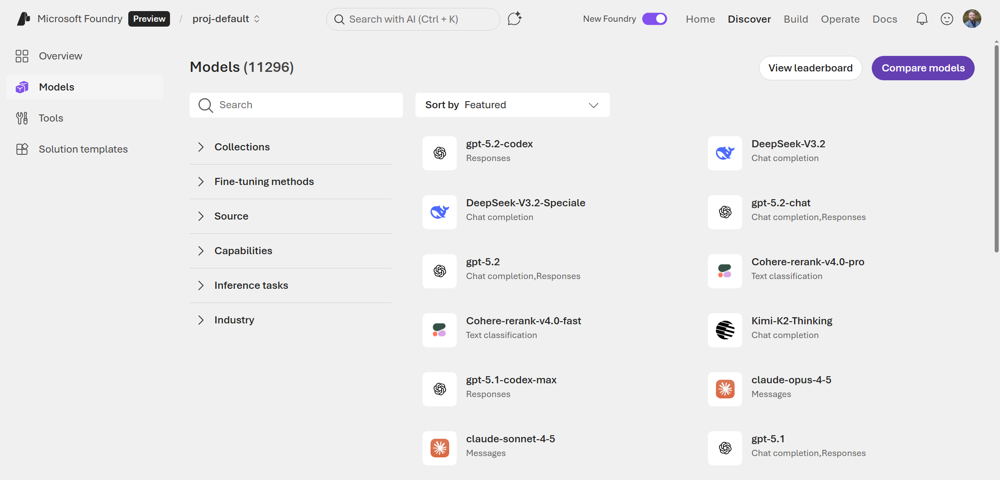
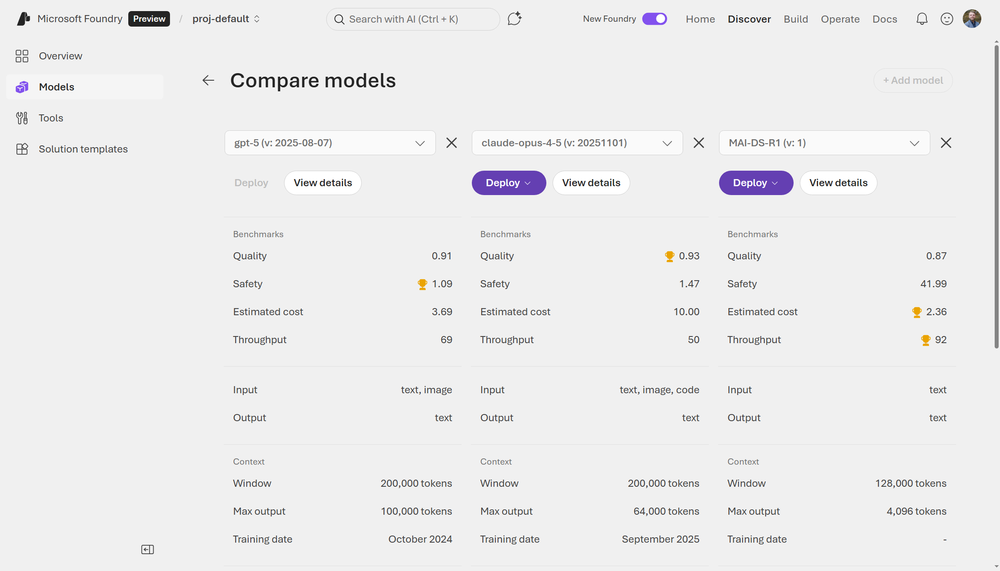
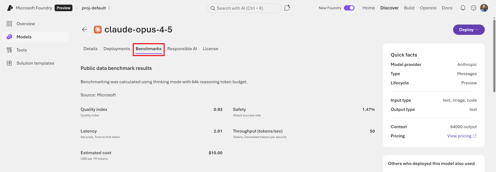
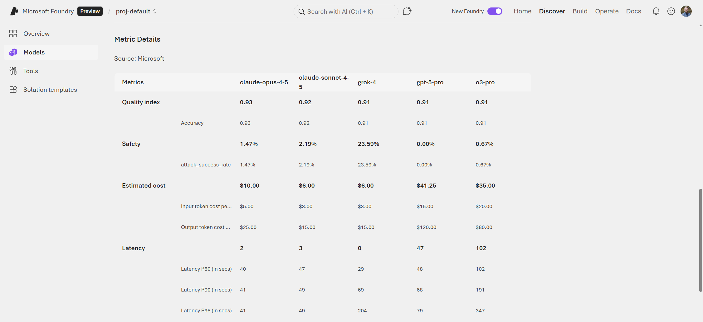
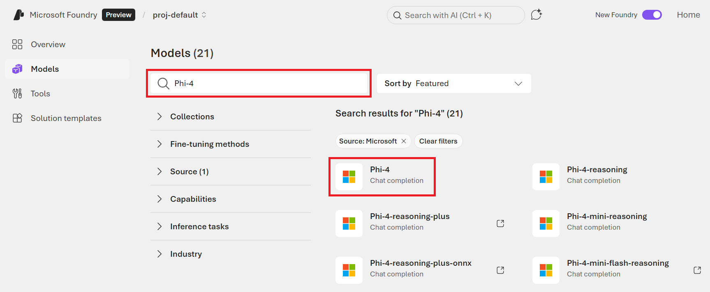
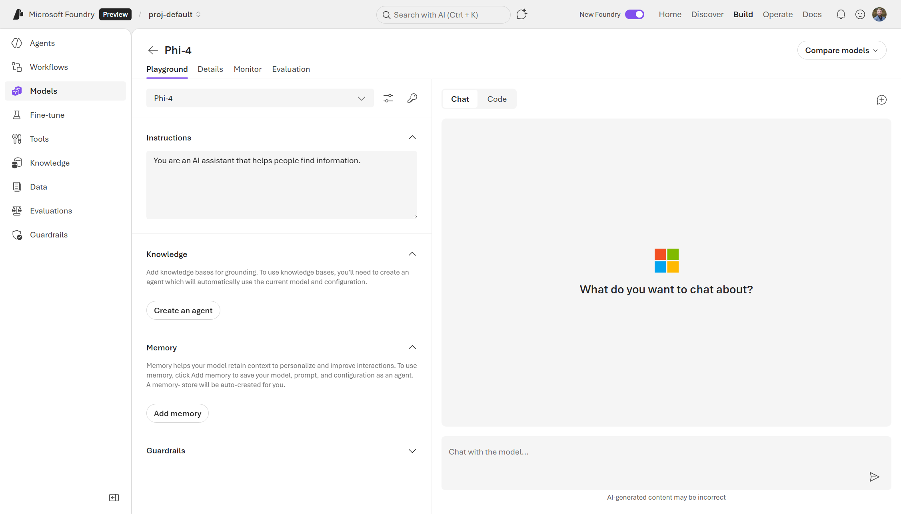

# Model Deployment

Next, we'll learn how to explore and deploy various AI models from the Foundry Models registry. They will also explore the pre-built MCP tools to connect to data sources.

From the Foundry Portal, navigate to the **Discover** tab at the top of the screen.


You'll see a list of featured models can be deployed. You may notice that some are popular proprietary models like OpenAI's GPT-5.2 and Anthropic's Claude Opus 4.5 and others may be open-source models from Hugging Face or Microsoft.

But why deploy a model like GPT or Claude on Foundry when we can just can use them for free online? The most simple answer to that is: privacy. When you use ChatGPT or other free models online, your inputs can be used for training future models. While this may be fine personally for writing cover letters or generating recipes, this may not sit well in the enterprise space with proprietary data. Thus, deploying instances of these foundation models in your own Azure Tenant give you much more control over where your data ends up. Plus, as you'll see soon, we have a lot more control over model behavior with Foundry-deployed models over the public versions of these models.

Once you're done browsing the Discover page, click on **Models** on the left-hand menu.


This will take you to the full list of models currently available in Foundry. There are currently over 10,000 models that you can deploy and the list is continuously growing. You'll quickly notice that Foundry isn't just for LLMs. There are models for image generation, audio generation, document analysis, text classification, 3D object generation, translations, and even protein modeling!

On this page, you can filter by source (the company or group that produced the model), capabilities (like reasoning or if the model can accept images as an input), inferencing task (such as text or image generation), and other features. Spend some time playing with these filters and exploring the vast variety models that you can deploy with Foundry.



As you're exploring, you may be overwhelmed with the number of choices that you have, even for the same type of task. Let's learn how to compare models to pick the best one for your needs.

At the top right of the screen, you'll notice two buttons: **View leaderboard** and **Compare models**. Click on the **Compare models** button.


On the **Compare models** screen, you can compare up to three different models across various benchmarks (e.g., quality, safety, costs, and throughput). Click any of the dropdown boxes and select three different models. You can also look at the differences in what the models accept as inputs and produce as outputs along with metrics about their context size. This is helpful if you're trying to figure out which model you should deploy for a given use case. I find this especially helpful when choosing between versions of the same base model with confusing names/suffixes (for example, `gpt-5.2` vs. `gpt-5.2-chat` vs. `gpt-5.2-codex`). 



Once you've gotten familiar with the model comparison tool, go back to the **Models** page and click on the **View leaderboard** button.


On this page, you can see how different models rank across the same benchmarks you saw in the model comparison screen: quality, safety, cost, and throughput.

- **Quality:** An index across various benchmark tests that evaluate how well a model performs on core tasks such as reasoning, knowledge, question answering, math, and coding. (Higher is better/more capable.)
- **Safety:** A score that indicates the success rate of attack prompts causing the model to produce harmful or disallowed responses. For example, producing hate speech or leaking copyrighted material. (Lower is better/safer.)
- **Throughput:** The rate at which the model can generate its output, measured in tokens per second. Behind the scenes, models are also evaluated on latency, rate limit (in tokens per minute), etc. (Higher is better/faster.)
- **Cost:** The cost per 1 million tokens. This is a blended cost estimate that assumes a three-to-one ratio between input and output token costs. (Lower is better/cheaper.)


This is a good page to visit often to see at how the latest models stack up to their predecessor version or competitor models.

Clicking on any of the models will take you to the model's page where you can learn more. On the **Benchmarks** tab, you can see the benchmarking data for a model. Often, this benchmarking is performed by Microsoft, but they also post publish other public benchmarks of the model if available.



Scrolling down on this page, you'll find the more detailed view of the summary metrics from before, including more drilled-down results for the overall composite scores. This is a good place to look at the specific aspects that are important to your deployment. For example, if you were building a simple chat agent for your online store, you might pick a faster (lower latency) model than one that gets a top-notch score for coding capabilities.



When choosing a model, consider:

* **Task requirements** - Different models excel at different tasks (chat, completion, embedding, etc.)
* **Context window size** - How much text the model can process at once
* **Performance vs. cost** - Larger models typically offer better performance but at higher cost
* **Latency requirements** - Some deployment options offer lower latency than others

From a model's page, you can also see any deployments of the model that have been created, learn more about the responsible AI approaches that were taken, read the licensing details, go through the technical specifications, and more. Plus, you can even deploy the model right from this page.

Now that we've explored all that the **Models** page has to offer and learned how to compare and select between models, it's time to finally deploy our first model!

##	Deploying your First Model

If you were to try and deploy a Large Language Models (LLM) using infrastructure services in Azure, you would have to first deploy a Virtual Machine (VM) with multiple GPUs, deploy the model, write the logic for handling the incoming API requests to and from the model, manage the authentication, manage the networking and scaling logic, etc. While this is certainly possible, it's a lot to manage on your own. Microsoft Foundry offers a more managed solution for model deployment that gets you up and running in just a few clicks or a few lines of code. The best part: no need to manage the infrastructure at all, which provides enterprise security while eliminating the need for manually maintaining compute resources on your Azure Subscription. Models are consumed through a simple API endpoint.

### Exercise: Deploy a Microsoft Phi-4 model

We'll be deploying a Microsoft Phi-4 model and then turning it into an agent. Phi-4 is an open-source, decoder-only transformer model from Microsoft Research. It is a 14-billion parameter model that was trained on a blend of synthetic datasets, data from websites in the public domain, academic books, and Q&A datasets. Phi-4 is a good foundation model to start with as it is quite fast and capable for its size and costs less than other models that are larger and/or proprietary.

To start, navigate back to the **Models** page in the Foundry Portal.

Search for "Phi-4" in the model catalog. Click on the `Phi-4` option (not `Phi-4-mini` or other variants).



You can read more about the Phi-4 model, its benchmark performance, etc. When you're ready to deploy, click the **Deploy** button in the top right.

There are two options: **Default settings** and **Custom settings**. Go with the **Default settings**.

If you had chosen **Custom settings**, it allows you to specify the version of Phi-4 to deploy and which Guardails to use. We'll learn more about Guardrails in Chapter 5.


A box will pop up that allows you to read the terms of the consumption-based deployment of the model. You can also view pricing and legal information on the **Pricing** tab. Click the **Agree and proceed** button to start the deployment.


The deployment process should only take a couple minutes, and you'll be brought to the **Playground** page for the Phi-4 deployment.




On the main **Playground** tab, you can now start interacting with the model.

#### Testing Your Deployment

Let's see if we can have some fun with the behavior of the model.

1. Enter a system message in the **Instructions** box: `You are an alien named Zorki from outer space who wants to share some out of this world recipes.`
2. Try a sample prompt in the **Chat with the model...** input: `Do you have any good recipes for an intergalactic pizza?`
3. Review the model's response


As you can see, we can modify the model's behavior by simply giving a little bit of instructions. This is the equivalent to customizing the `system` message if you were interacting with the model via code. Later on, we'll be using this model in an agent and connecting to some data.

On the **Details** tab, you'll find:
* A **Target URI**, which is where you can access the deployment's for API endpoint
* A **Key** for authentication with the endpoint
* **Deplyment info**, which includes the Deployment's name and type, creation date, state, etc.


## Turning your Deployment into an Agent


##	Connecting to Tools and Data (SQL DB, vector DB, and web search)

To make your AI agents more powerful, you can connect them to various data sources and tools. This enables agents to retrieve real-time information and interact with external systems.

### Supported Data Sources

**Databases:**
* **Azure SQL Database** - Query structured relational data
* **Azure Cosmos DB** - Access NoSQL and multi-model databases
* **Azure Database for PostgreSQL** - Connect to PostgreSQL databases

**Vector Databases:**
* **Azure AI Search** - Full-text and vector search capabilities
* **Cosmos DB for MongoDB vCore** - Vector search in MongoDB
* **Custom vector databases** - Connect to Pinecone, Weaviate, or other vector stores

**Web and Search:**
* **Bing Search API** - Real-time web search capabilities
* **Custom APIs** - Connect to any REST API using OpenAPI specifications
* **SharePoint** - Access corporate knowledge bases

### Setting Up Connections

To connect a data source:

1. Navigate to **Tools** in your Foundry project
2. Click **+ New connection**
3. Select the connection type (e.g., Azure SQL Database)
4. Provide connection details:
   * Connection name
   * Server address
   * Authentication credentials (use Key Vault for production)
5. Test the connection
6. Click **Create**

Once connected, these data sources can be used as tools in your agents, enabling them to query data dynamically during conversations.

##	Explore pre-built tools (MCP servers for Databricks, Cosmos, etc.)

Microsoft Foundry supports the **Model Context Protocol (MCP)**, an open protocol that standardizes how AI models connect to external tools and data sources. The Foundry tool catalog provides access to over 1,400 pre-built tools.

### What is MCP?

The Model Context Protocol (MCP) is an open standard that enables secure, standardized communication between AI models and external tools. MCP servers act as intermediaries that:

* Expose tools and resources to AI models
* Handle authentication and authorization
* Provide consistent interfaces across different data sources
* Enable safe and controlled access to external systems

### Available MCP Servers

**Microsoft Services:**
* **Azure Cosmos DB** - Query NoSQL and multi-model data
* **Azure Databricks** - Execute SQL queries and access data lakehouse
* **Microsoft 365** - Access SharePoint, OneDrive, and other M365 services
* **Azure Storage** - Read and write files in Azure Blob Storage

**Third-Party Services:**
* **Slack** - Send messages and retrieve channel information
* **GitHub** - Access repositories, issues, and pull requests
* **Salesforce** - Query CRM data
* **Google Drive** - Access files and folders

**Development Tools:**
* **File System Access** - Read local files
* **Web Search** - Search the internet
* **Code Execution** - Run code snippets safely

### Using Pre-built Tools

Pre-built MCP tools can be easily added to your agents:

1. In the agent builder, navigate to **Tools**
2. Click **+ Add tool**
3. Browse the tool catalog or search for specific tools
4. Select a tool (e.g., "Azure Cosmos DB")
5. Configure the tool with necessary credentials and settings
6. Click **Add to agent**

The agent will now be able to call this tool during conversations to fetch data or perform actions.

###	Exercise: Deploy Cosmos DB and connect to using a tool

In this exercise, we'll create an Azure Cosmos DB instance and connect it to an agent using MCP:

**Part 1: Create Azure Cosmos DB**

1. In the Azure Portal, click **+ Create a resource**
2. Search for "Azure Cosmos DB" and select it
3. Choose the **NoSQL** API option
4. Configure the account:
   * Subscription: Select your subscription
   * Resource Group: Use your existing group or create new
   * Account Name: Choose a unique name (e.g., "my-foundry-cosmosdb")
   * Location: Select the same region as your Foundry project
   * Capacity mode: Select **Serverless** for this exercise
5. Click **Review + create**, then **Create**
6. Wait for deployment to complete (2-3 minutes)

**Part 2: Add Sample Data**

1. Navigate to your Cosmos DB account
2. Go to **Data Explorer**
3. Click **New Container**
4. Create a database named "ProductCatalog"
5. Create a container named "Products" with partition key "/category"
6. Add sample documents:

```json
{
  "id": "1",
  "name": "TrailWalker Hiking Shoes",
  "category": "footwear",
  "price": 129.99,
  "description": "Durable hiking shoes for all terrains"
}
```

**Part 3: Connect to Foundry Agent**

1. In Foundry portal, go to your project
2. Navigate to **Tools** → **Connections**
3. Click **+ New connection**
4. Select **Azure Cosmos DB**
5. Provide connection details:
   * Connection name: "ProductCatalog"
   * Account endpoint: (from Cosmos DB account)
   * Account key: (from Cosmos DB Keys section)
   * Database name: "ProductCatalog"
6. Click **Create**

**Part 4: Add Tool to Agent**

1. Go to **Build** → **Agents**
2. Create a new agent or select an existing one
3. In the agent configuration, click **Tools**
4. Click **+ Add tool** → **Cosmos DB Query**
5. Select your "ProductCatalog" connection
6. Configure query capabilities
7. Save the agent

**Part 5: Test the Agent**

1. Open the agent in the playground
2. Try a prompt: "What are the TrailWalker hiking shoes and how much do they cost?"
3. The agent should query Cosmos DB and provide the accurate price and description

This demonstrates how agents can access real-time data from external sources to provide accurate, grounded responses.