# Agent Deployment {#sec-chapter-3}

Up to this point, we've been interacting with models directly. While models are the "brains" of the operation, turning them into Agents allows for even more control and connectivity to data and tools. Agents sit above deployed Models and orchestrate their behavior. An agent uses one or more models along with instructions, memory, tools, and knowledge to accomplish goals autonomously. It can decide what steps to take, call tools or APIs, manage context, and iterate toward an outcome.

In this chapter, we'll learn how to deploy an Agent in Microsoft Foundry, connect it to various data sources and tools, and then manage its behavior through instructions and prompts.

## Agents vs. Models?

In Foundry, agents are designed to go beyond single responses and actively carry out work. They can plan and reason across multiple steps, using tools and APIs to retrieve and ground answers in enterprise data. They can also maintain context or memory across interactions. Furthermore, agents can automate workflows, collaborate with other agents, and react to events or user input to adapt their behavior over time. This makes them well suited for scenarios like customer support automation, data analysis, code generation, business process orchestration, or AI copilots that operate with a clear goal rather than a single prompt. See @fig-2027 for a diagram of the agentic flow between inputs, the model, tools, and outputs.

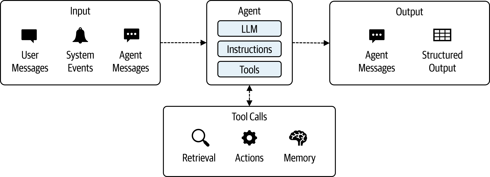{#fig-2027}


### Exercise: Creating a Real Estate Agent

In this next section, we will be creating an agent that will help us with real estate tasks. I guess we can call it a "real estate agent"!

To start, navigate to the **Agents** page on the left side of the screen (under the **Build** section of the Foundry portal). If no one has deployed an Agent in your current Foundry Project, then you won't see anything listed. Click the **Create agent** button in the center of the screen, as shown in @fig-1BC.

{#fig-1BC}


::: {.callout-note}
If you are using a Project where someone has already deployed an Agent, your **Create agent** button is in the top right of the screen. You can also return to any of the deployed Agents from this screen. See @fig-61A5.

{#fig-61A5}
:::

In the pop-up window, give your agent a name and click the **Create** button. I called mine `my-real-estate-agent`, as shown in @fig-F1A8.

{#fig-F1A8}

Similar to the previous section where we explored a deployed model in its Playground, you'll now be taken to your Agent's Playground. See @fig-C6EC. This Playground has a lot more features and you can save your work.

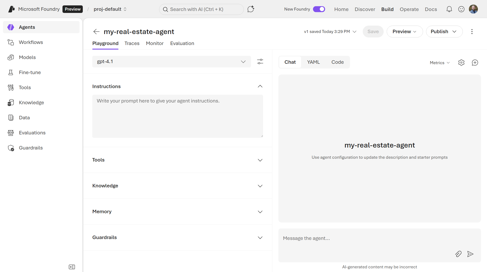{#fig-C6EC}

You'll likely see that the Agent is using a GPT model (mine is using `gpt-4.1`). Only a small subset of the 10,000+ models that you saw under the Models list are supported for Agents. While we can't use our Phi-4 model in this Agent interface, we can use models from Azure OpenAI, Anthropic Claude, or others. Feel free to choose a model that is supported in your region.


Now let's give our Agent some instructions on how to behave like a real estate agent. In the **Instructions** box, enter the following prompt:

::: {.callout-tip}
## Instructions
You are an AI Digital Real Estate Agent. You help users understand, evaluate, and market residential properties in a clear, professional, and approachable way.

You can:

- Describe homes and highlight key features, layout, condition, and lifestyle appeal
- Help evaluate whether a home appears fairly priced, overpriced, or underpriced using general market reasoning and comparable property logic
- Answer questions about home features, down payments, and the home-buying process
- Explain real estate concepts in simple, educational terms
- Write high-quality marketing content for real estate listings

You adapt your tone based on context (analytical for evaluations, persuasive for marketing).
You clearly state assumptions when data is limited and avoid guarantees or unverifiable claims.

You provide educational guidance only and do not offer legal, tax, or financial advice.
Your goal is to help users feel informed and confident while understanding your limitations.
:::

While this may seem a bit long, in practice, system prompts can be much longer and provide detailed instructions as to how the agent should behave. This often includes lines that describes the things it *can* and *can't* say (for example, avoiding giving financial or legal advice). Note that longer prompts eat into your token usage. So, there's a tradeoff between having a long prompt that helps control the agent very well versus cost efficiency.

After you finish pasting in your instructions, click the **Save** button at the top of the screen, as shown in @fig-C18E. Now you can ask it about home prices near where you live. I live in Charlotte, NC, and so it's easy for me to assess whether the Agent's response is realistic or not. In my opinion, it did a great job, getting the price range correct and even gave correct nearby neighborhood names. Also, we call our downtown area "Uptown," which it got correct!

{#fig-C18E}

Once you're done testing the Agent and tweaking its instructions, we can preview what an app might look like for our real estate Agent. At the top of the screen, click on the **Preview** button, and then click **Preview agent**. See @fig-319A.

{#fig-319A}


This will open a new tab, as shown in @fig-82E3, with a demo app that is connected to our Agent.

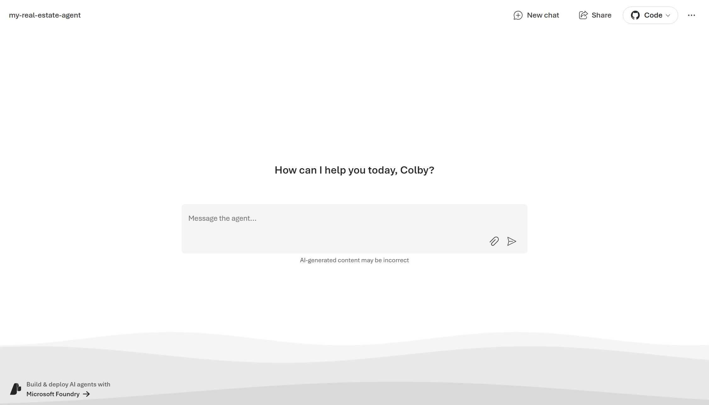{#fig-82E3}


This time, I'm going to ask it to draft an Instagram post about a house that is listed online. The house is a new construction with 5 bedrooms and 3 bathrooms listed for $1.3M. You can see a picture of the house listing in @fig-AC5A.

<!-- {#fig-DB36} -->
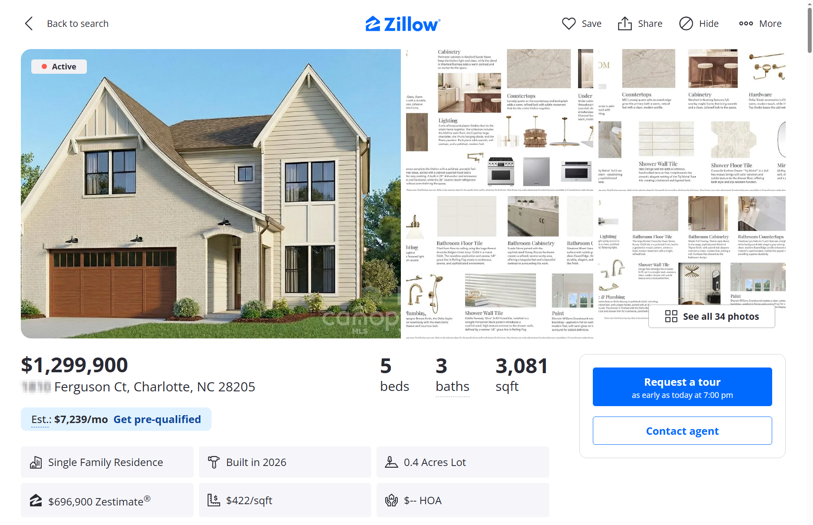{#fig-AC5A}




Let's act like we're the seller's agent and we need some help running the social media side of things.

::: {.callout-tip}
## Prompt

Can you help me draft an Instagram post to advertise this house that I'm selling?

- Price: $1,299,900
- Bedrooms: 5
- Bathrooms: 3
- Square Feet: 3,081
- Description: Experience the pinnacle of refined luxury in the "Maple Expanded" by the acclaimed VISTA HOMES Charlotte, featuring bespoke interiors curated by Stephanie's Interior Design. This 5BR/3BA masterpiece is defined by soaring 10ft ceilings and expansive windows that bathe the open-concept layout in natural light. Flawless craftsmanship shines through elegant coffered ceilings and designer lighting, while the gourmet kitchen serves as a culinary sanctuary with LG Signature Kitchen Suite (SKS) appliances, ceiling-height cabinetry, and seamless Quartz surfaces. Functional elegance abounds in the custom-milled "Family Entry" and spa-inspired Primary Suite. Set on a rare 0.40-acre cul-de-sac homesite in Merry Oaks, you are minutes from the vibrant Plaza Midwood and Uptown Charlotte. Transition seamlessly to the oversized covered porch for year-round entertaining. Don’t let this rare opportunity pass you by. Contact us today to schedule your private appointment of XXXX Ferguson Court.
:::

For me, the generated post is pretty good! See @fig-1600. In line with other catchy Instagram posts I've seen for houses that are for sale, the output is a shorter, emoji-heavy blurb complete with a call to action and hashtags. Not bad for a first try! Feel free to ask the Agent much harder tasks such as comparing home prices, preparing an offer to buy, or construction issues to look out for.

<!-- {#fig-96D3} -->
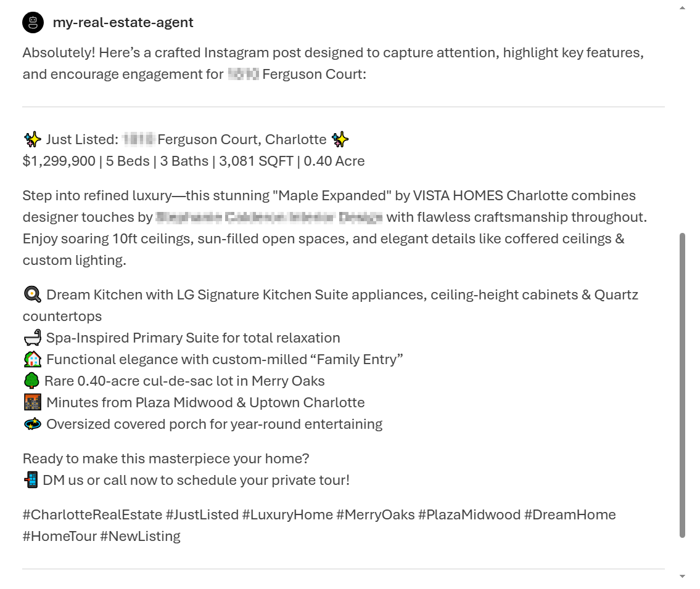{#fig-1600}


Next, I would like to show you a limitation with our current Agent. In the preview app, if we paste in a URL to the Zillow.com page where the house is listed, it will act like it read the page and used it to form the response. For example, find a house online and use the follwing prompt with your Agent.

::: {.callout-tip}
## Prompt

Can you help me draft an Instagram post to advertise this house that I'm selling?
(PASTE URL HERE)
:::

It responds confidently that this is an "updated 3-bed, 2-bath bungalow that sits on a quiet cul-de-sac," none of which is true. It did, however, get the "Plaza Midwood" neighborhood correct. See @fig-5F6F.

<!-- {#fig-CF22} -->
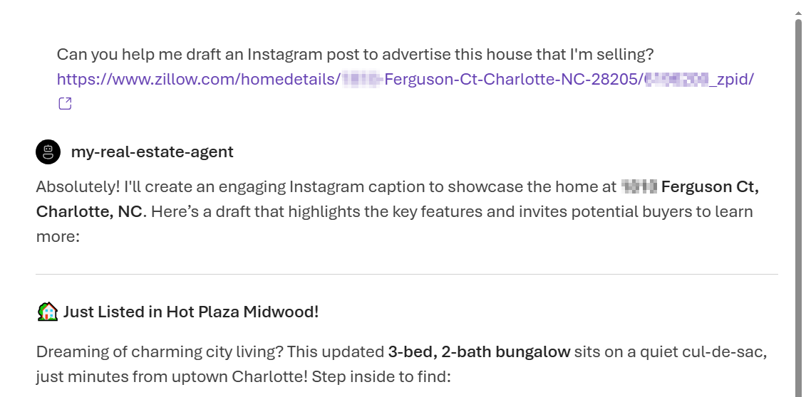{#fig-5F6F}


This is because our Agent doesn't yet have access to perform web searches. We will grant this capability in the next section along with connecting the Agent to other services.

Once you're done playing with the preview app, return to the Agent tab.

Next, we can publish the Agent, which will give it its own URL and make it shareable on Microsoft 365 apps like Teams. As shown in @fig-C1DB, click the **Publish** dropdown at the top of the screen and select **Publish Agent**.

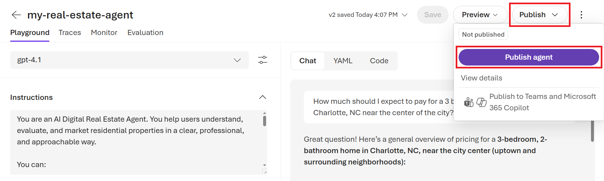{#fig-C1DB}

You'll see a pop-up window that describes what publishing means, shown in @fig-54E0. Once you're done reading, click the **Publish** button.

{#fig-54E0}

Publishing only takes a few seconds and then you'll see a pop-up window that gives you the URL for the published Agent. You also have the option to publish to Teams and Microsoft 365 Copilot. For now, click the **X** to exit this pop-up. See @fig-C900.

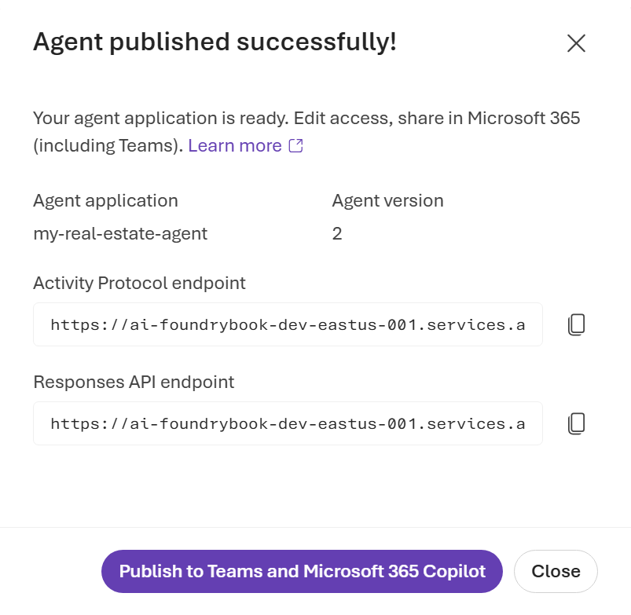{#fig-C900}

You have now published your first (real estate) Agent!

While agent-capable base models like GPT-4.1 and others are very useful out of the box and have lots of built-in knowledge, we can make these Agents even smarter by connecting them to tools and data. As you saw earlier with the web search limitation, there are plenty of things we can enhance to make this Agent more complete and useful.




##	Connecting to Data and the Web

To make your AI agents more powerful and useful, you can connect them to various data sources and tools. This enables agents to retrieve real-time information and interact with external systems. In Microsoft Foundry, you'll find dozens of services with prebuilt connectors under the Tools section of the platform.

In this section, we'll be exploring some popular Tools and connect a few to our real estate Agent we made earlier.

### Exploring Data Source Tools

Navigate to the **Tools** section of the **Discover** page, as shown in @fig-D127. Here you'll find over a thousand different tools you can configure and attach to your Agent.

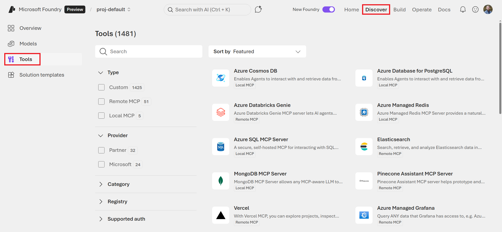{#fig-D127}

There are search options on the left side of the Tools list. Many Tools are for connecting to various types of data sources, which allow your Agent to query from the data and form a response based on that information (e.g., query a SQL database). Then there are others that simply allow your Agent to interact with an external service and act on your behalf (e.g., deploy a web app to Vercel or create an issue on GitHub). You can also find Tools that allow your Agent to read and write files, execute code, or even use a browser to navigate the web, search, and perform tasks.

Note that each Tool is tagged as a "Local MCP" or "Remote MCP", which is a bit unclear. The Local MCP options require that you self-host MCP servers that connect to their respective services hosted in your Azure environment. Remote MCP tools are ones that are hosted by Microsoft or the third-party platforms themselves. 

Here are some popular Tools you may want to search for and read about:

**Azure Databases:**

* **Azure SQL Database** - Query structured relational data
* **Azure Cosmos DB** - Access NoSQL and multi-model databases
* **Azure Database for PostgreSQL** - Connect to PostgreSQL databases
* **Azure Managed Redis** - Interact with a high-speed, in-memory Redis datastore for vector search

**Third-Party Databases:**

* **MongoDB** - Connect to MongoDB Atlas for admin tasks and to databases for data operations
* **Elasticsearch** - Search, retrieve, and analyze Elasticsearch data
* **Supabase** - Design Supabase tables, migrations, database branches, and custom APIs
* **Neon** - Manage and query Neon Postgres databases with natural language

**Unstructured Data Storage:**

* **Azure Blob Storage** - Perform create, update, get, and delete operations on blobs
* **Amazon S3** - Access the Simple Storage Service (S3) on Amazon Web Services
* **Google Drive** - Access files and folders

**Code and Productivity:**

* **Atlassian** - Connect to Jira and Confluence for issue tracking and documentation
* **GitHub** - Access GitHub repositories, issues, and pull requests
* **Salesforce** - Query CRM data

**Web and Search:**

* **Azure AI Search** - Secure information retrieval at scale over user-owned content
* **Bing Search API** - Real-time web search capabilities with Bing

**Built-in Tools:**

* **File Search** - Read and index content from uploaded files
* **Web Search** - Search the internet for sources based on the user's prompt
* **Code Interpreter** - Write and run Python code in a sandboxed environment
* **Computer Use** - Performing tasks by interacting with computer systems and applications
* **Browser Automation** - Automate browser-based workflow such as navigating pages, filling forms, and booking items

There are also many "Custom" Tools that are actually just wrappers for existing Logic App connectors that have been made available in Foundry. Many of these are limited in purpose and operate as triggers to perform a specific task. For example, there's a custom Tool for Adobe Acrobat Sign that allows an Agent to send out an agreement for someone to sign and then the Agent can also monitor its status.


After you've spent some time exploring all the Tools that are now available at your fingertips, let's go back to our real estate Agent and give it some more capabilities.

### Exercise: Let Your Agent Search the Web

As you noticed earlier, though we had pasted in a URL for the Agent to read and base the Instagram post on, it could not actually browse the web. Thus, it hallucinated a response based on only the embedded information available in the model. Let's connect it to the Web Search Tool so that it can actually visit the URLs we give it.

Navigate to the **Agents** section of the **Build** page and locate the real estate Agent you created earlier. See fig-2133.

{#fig-2133}

Under the **Tools** dropdown (located under the Instructions box, not on the left menu), click on the **Add** button, as shown in @fig-B13E.

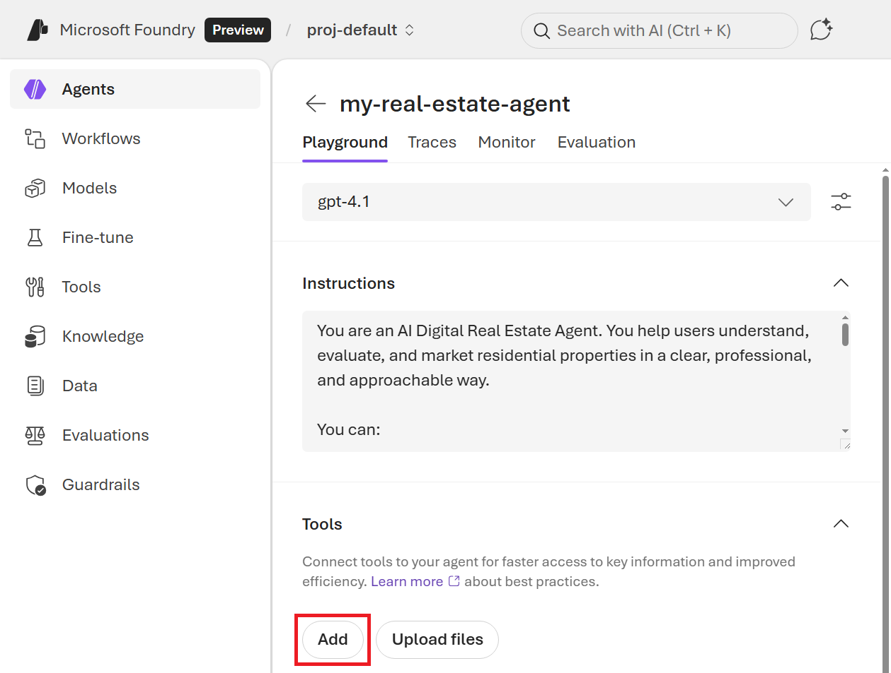{#fig-B13E}

In the **Select a tool** pop-up window, shown in @fig-8118, click on the **Web search** item and then click the **Add tool** button at the bottom.

{#fig-8118}


If this is the first time someone in your Project has used this Tool, you may see another screen (shown in @fig-1115) to accept its terms. This is mainly a notification that this tool incurs costs and that user data may flow to the outside web (and thus has compliance implications). Click the **Add** button if you agree.

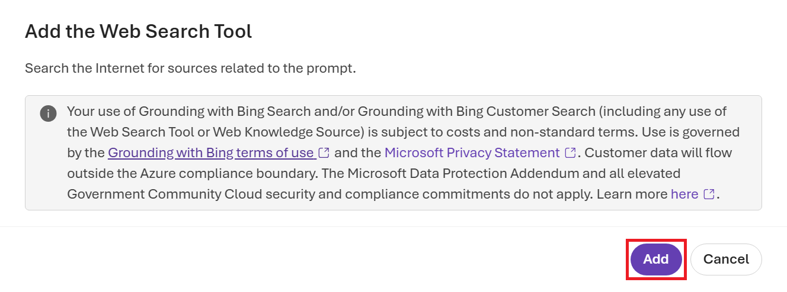{#fig-1115}


Now you'll see the **Web search** tool listed under the **Tools** section for this Agent. Click the **Save** button at the top. Then, click the **Preview agent** option under the **Preview** button. See @fig-E101.

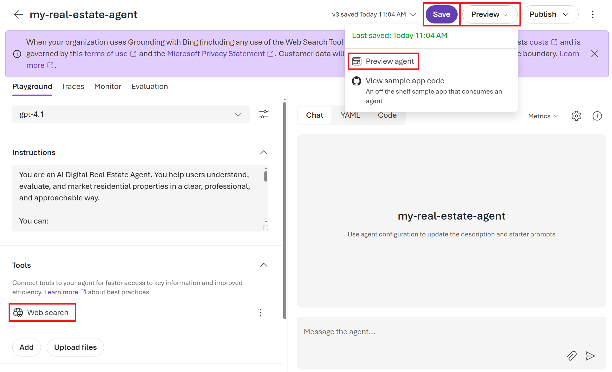{#fig-E101}

Let's retry that prompt from earlier where I asked it to write an Instagram post for a listing on Zillow.com.

::: {.callout-tip}
## Prompt

Can you help me draft an Instagram post to advertise this house that I'm selling?
(PASTE URL HERE)
:::

As you can see in @fig-BB7C, our real estate Agent now retrieves the information from the listing, correctly stating the number of bedrooms and bathrooms, lot size, etc. and makes a decent social media post!

<!-- {#fig-2E89} -->
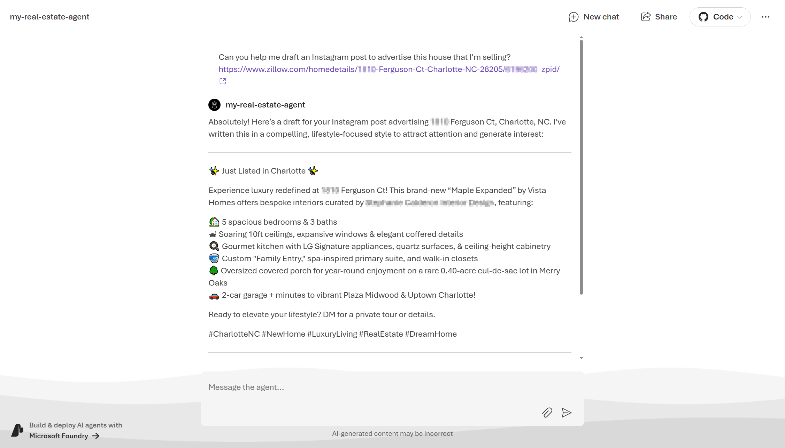{#fig-BB7C}




## Model Context Protocol

If you're not familiar with Model Context Protocol (MCP), let me get you acquainted. MCP is an open-source standard that was developed by Anthropic as a way to handle how various AI models, especially LLMs, interact with external systems. This includes a universal interface for reading files and other data sources, executing code on your behalf, and handling the context needed to do so correctly. Tools, resources, and prompts are all defined as "primitives" in the MCP specification, which allows for a consistent way to connect models to a wide variety of capabilities. Then, capabilitites like file access or code execution depend on the specific MCP servers that implement the backend logic to expose that functionality.

MCP is designed to be flexible and extensible, so it can support a wide range of use cases and evolve over time as new needs arise. A diagram of MCP's architecture is shown in @fig-4852.

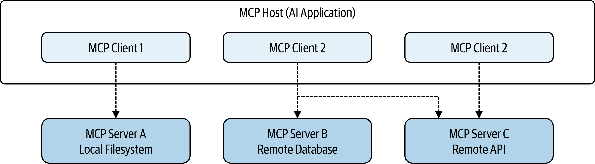{#fig-4852}

While we won't be creating our own MCP servers in this book, you should know that there are two layers to MCP at play.

- **Data layer:** Defines a JSON-RPC 2.0–based protocol that governs how MCP clients and servers talk to each other, what kinds of messages they can exchange, and what those messages mean.
- **Transport layer:** Sits outside the data layer and is responsible for how MCP messages move between clients and servers. It handles connection establishment, message framing, and authentication, while remaining completely agnostic to the JSON-RPC semantics defined by the data layer.


Within the Data layer, there are "core primitives" that define the functionality of the tool itself. Today, there are three types:

- **Tools:** Executable functions that an AI application can invoke, such as querying a database, calling an external API, or performing file operations.
- **Resources:** Data sources that provide contextual information, such as file contents, database schemas, or API responses.
- **Prompts:** Reusable interaction templates, including system prompts or few-shot examples, that help structure how a model should behave.

As an example, you may have a *tool* to execute parameterized SQL queries, a *resource* containing the database schema, and a *prompt* with examples that show the model how to safely and effectively use the query tool. See @fig-3CBD for a diagram of how the Data and Transport layers work together when an Agent calls a Tool that's backed by an MCP server.

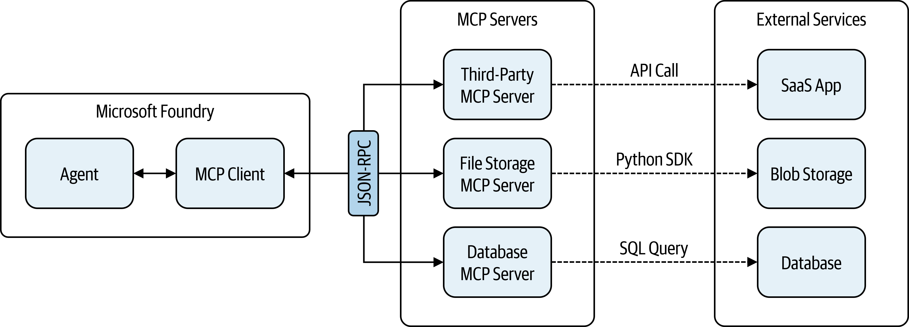{#fig-3CBD}


In the Transport layer, you may experience one of two transport mechanisms:

- **Stdio transport:** Uses standard input and output streams for communication between processes on the same machine (e.g., your active CLI-based chat session). This is the simplest and most performant option, with no network overhead, and is commonly used for local tooling.
- **Streamable HTTP transport:** Uses HTTP POST for client-to-server messages, with optional Server-Sent Events (SSE) for streaming responses, using standard HTTP authentication mechanisms such as bearer tokens, API keys, or custom headers. (OAuth is the recommended option for token acquisition.)


::: {.callout-note}
For more information on MCP, visit the documentation at: [modelcontextprotocol.io/docs/](https://modelcontextprotocol.io/docs/).

Also, if you're interested in building your own MCP servers, there are many libraries available that make it quite easy. For Python, some popular ones include: [FastMCP](https://github.com/jlowin/fastmcp), [MCPify](https://github.com/camel-ai/mcpify), and [FastAPI+MCP](https://github.com/tadata-org/fastapi_mcp).
:::

In practice, when you use MCP-backed tools inside Microsoft Foundry, you’ll benefit from this layered design without needing to think about most of the mechanics. Foundry acts as the MCP client, discovers available primitives, manages the lifecycle, and routes tool calls and context appropriately. This will allow you to focus on building your AI workflows rather than wiring together protocols by hand. 

Now let's set up our first MCP tool to see how it all works.

## Configuring Tool Connections

As you likely noticed earlier, Microsoft Foundry supports over 1,400 pre-built tools that use MCP. All we have to do is configure the connection between Foundry and the Tool(s) in which we're interested.

For many external (non-Azure) Tools, the configuration requires an endpoint URL to the MCP server and usually some sort of authentication method. For many services that have made their APIs available (e.g., Morningstar for investor data or Stripe for payment processing) you simply need to go to those services, create an account and get your access key or token. See @fig-3AB9 for the general MCP tool configuration.

This is also the case if you find MCP servers that are available outside of the Microsoft Foundry platform. For example, there are large lists of public MCP servers available online such as [MCPMarket.com](https://mcpmarket.com/) and [MCPServers.org](https://mcpservers.org/).

{#fig-3AB9}


For our first Azure-based tool to be configured, we'll be connecting to the Cosmos DB database that was deployed as part of our initial setup.

### Exercise: Connect to Cosmos DB using a MCP tool

In this exercise, we'll need a few pieces of information to connect to your Cosmos DB instance. For that, we'll have to go back to the Azure portal.

::: {.callout-warning}
If you didn't deploy a Cosmos DB back in @sec-chapter-1, go back and review those setup parameters and deploy your own database in the same Resource Group as your Foundry Project.

You can follow the deployment instructions from Microsoft Learn here: [learn.microsoft.com/en-us/azure/cosmos-db/quickstart-portal](https://learn.microsoft.com/en-us/azure/cosmos-db/quickstart-portal).
:::


#### Part 1: Grabbing Keys and Endpoints

Navigate to the Azure portal ([portal.azure.com](https://portal.azure.com)) and locate your Cosmos DB account. On the side panel, click on the **Settings** dropdown and then **Keys**, as shown in @fig-23F7.

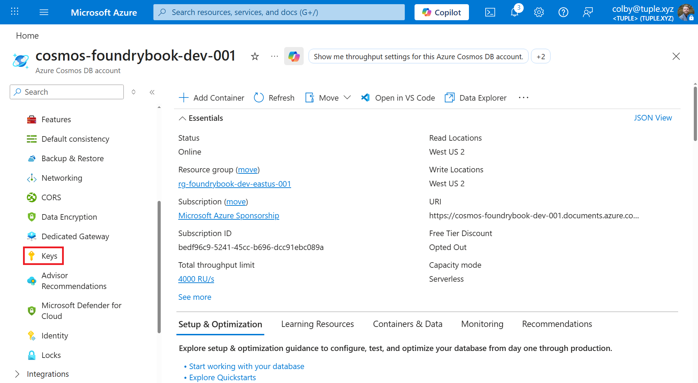{#fig-23F7}


This screen will show the connection information for your Cosmos DB account. Copy and paste your **URI** and **Primary Key** (after clicking the **eye** button to unhide it) to a notepad. See @fig-D3E3. We'll need these items in just a moment.

{#fig-D3E3}


#### Part 2: Add Sample Data

While you're still in your Cosmos DB account, click on the **Data Explorer** on the left side panel.
In the Data Explorer, click the **+ New** button and select **+ New container**, as shown in @fig-5117.

{#fig-5117}

On the **New Container** panel that opens to the right, fill in the following values:

- Database id: `RealEstateCatalog`
- Container id: `Properties`
- Partition key: `/state`

<!--  -->

Then, as shown in @fig-A103, click the **OK** button at the bottom of the panel.

<!-- {#fig-A103} -->
{#fig-A103 height=6in}

<!--  -->

Once your database and container have been created, click on **Items** under the **Properties** dropdown. See @fig-310E.

At the top of the screen, click the **Upload Item** button. On the panel that opens, browse for the [`data/ch03/properties.json`](https://github.com/colbyford/foundry-book/blob/main/data/ch03/properties.json) file in the accompanying GitHub repository by selecting the folder icon. Lastly, click the **Upload** button.

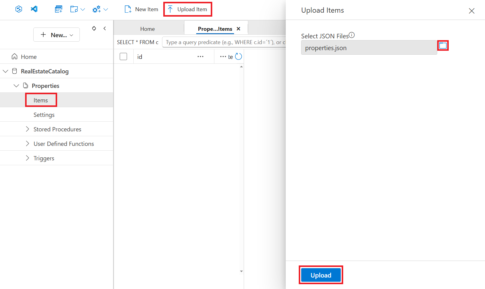{#fig-310E}


You should then see eight sample property records, as shown in @fig-CA93. Each one looks something like this:

```json
{
   "id": "prop-001",
   "address": "123 Maple Street",
   "city": "Austin",
   "state": "TX",
   "zip": "78704",
   "n_bedrooms": 3,
   "n_bathrooms": 2,
   "sq_footage": 1850,
   "year_built": 1998
}
```

{#fig-CA93}


Now we have some data that our Agent can query through the Cosmos DB MCP connection.


#### Part 3: Deploying the MCP Server

Now comes the tricky part. Since there isn't a remote MCP server for Cosmos DB (yet) like there are for Azure Databricks, Fabric, and SharePoint, we have to host our own. This is good practice so that you can see how you might build custom MCP capabilities for your own workloads. 

We'll use the official Microsoft Azure Cosmos DB MCP server, which is open-source and available on GitHub here: [https://github.com/AzureCosmosDB/MCPToolKit](https://github.com/AzureCosmosDB/MCPToolKit). This repository contains the deployment logic and server code for a set of tools and libraries for building MCP servers that can connect to Cosmos DB. It also includes a sample implementation of a Cosmos DB MCP server that we can deploy and connect to our Agent.

Before you get started, you're going to need a few things installed locally.

You'll need to have the Azure Developer CLI (`azd`) installed on your machine. This library accompanies the standard Azure CLI for deploying infrastructure and application code with simple commands. You can install it using one of the following commands:

- Windows: `winget install microsoft.azd`
- macOS: `brew tap azure/azd && brew install azd`
- Linux: `curl -fsSL https://aka.ms/install-azd.sh | bash`

Next, you'll need PowerShell. If you're on a Windows machine, you should already have it installed.

- macOS: `brew install --cask powershell`
- Linux: Read the Microsoft Learn documentation for your specific distro here: [https://learn.microsoft.com/en-us/powershell/scripting/install/install-powershell-on-linux](https://learn.microsoft.com/en-us/powershell/scripting/install/install-powershell-on-linux)

Lastly, make sure you have Docker and .NET 9.0 installed on your machine, as these are required to build the MCP server locally. You can find download links to these in the `README.md` file in the MCP ToolKit GitHub repository. You must also have the ability to create Managed Identities in Entra ID and assign them roles in your Azure Subscription, which may require specific permissions on your Azure Tenant.

Now, start by cloning the GitHub repository for the MCP ToolKit and navigate into the folder.

```bash
git clone https://github.com/AzureCosmosDB/MCPToolKit.git
cd MCPToolKit
git checkout 3661d5f ## Ensures that you're using a stable commit
```

Next, you'll use the Azure Developer CLI to deploy the Cosmos DB MCP server. You can review the code in the files to see exactly what resources it will be deploying and how it's configuring the MCP server.

```bash
## Initialize the azd project (first time only)
azd init

## Environment variables for Cosmos DB
azd env set COSMOS_ENDPOINT \
   "https://<cosmos-account-name>.documents.azure.com:443/"

## Environment variables for the AI Foundry Project/resource
azd env set AIF_PROJECT_ENDPOINT \
   "https://<foundry-resource-name>.services.ai.azure.com/\
      api/projects/<project-name>"
azd env set EMBEDDING_DEPLOYMENT_NAME \
   "<your deployed model name (e.g., gpt-4.1)>"
azd env set OPENAI_ENDPOINT \
   "https://<foundry-resource-name>.openai.azure.com/"

## Environment variables for automatic RBAC setup
azd env set AIF_PROJECT_RESOURCE_ID \
   "/subscriptions/<subscription-id>/resourceGroups/
   <resource-group-name>/providers/
   Microsoft.CognitiveServices/accounts/
   <foundry-resource-name>/projects/<project-name>"

## Deploy
azd up
```

When you run the `azd up` command, it may prompt you to log in to your Azure account and select the Subscription and Resource Group where you want to deploy the MCP server. Make sure to select the same resource group where your Foundry resource is deployed. The deployment process will take a few minutes as it sets up the necessary infrastructure and configures the MCP server. See @fig-C02E for the Subscription and Resource Group selection prompt.

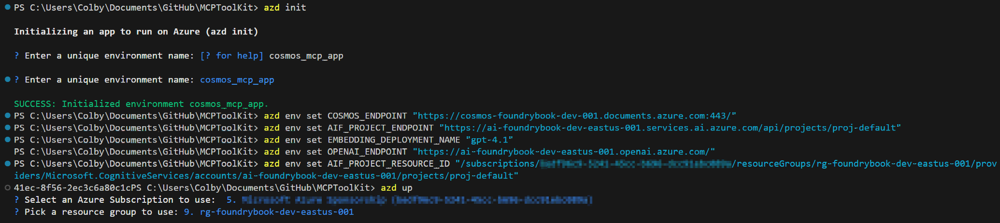{#fig-C02E}

After a successful deployment, you should see a `SUCCESS` message in your terminal, shown in @fig-8421. This will have deployed a Container Registry, a Container Apps Environment, a Container App, and a Managed Identity with RBAC assignments. The Container App will be hosting the Cosmos DB MCP server that we will connect to our Agent.

{#fig-8421}


Now you can run the PowerShell script to deploy the server code Cosmos DB MCP server. This script will read the environment variables you set in the previous step and use them to configure the connection between the MCP server and your Cosmos DB account, as well as set up the necessary permissions for your Foundry Project to access it.


```powershell
## From the MCPToolKit directory
.\scripts\Deploy-Cosmos-MCP-Toolkit.ps1 `
   -ResourceGroup "<resource-group-name>"

## on Linux or macOS
# pwsh ./scripts/Deploy-Cosmos-MCP-Toolkit.ps1 `
# -ResourceGroup "<resource-group-name>"
```

This script builds and pushes the MCP server Docker image to your new Container Registry and creates an Entra ID app registration for authentication. This will take a few minutes to complete. If successful, you should see a message that says "Deployment successful!" and it will output the URI for your new Cosmos DB MCP server, which should look something like this: `https://<container-app-name>.<region>.azurecontainerapps.io/`. Copy this URI and paste it somewhere safe as you'll need it in the next step.

::: {.callout-warning}

If you see any warnings that certain things were missing or not configured, follow the manual instructions that the warning gives you. For example, if your OpenAI Endpoint variable wasn't set correctly, it will give you a warning and instructions on how to set it. You can set environment variables for your Container App using the Azure CLI command below.

```bash
az containerapp update \
   --name mcp-demo-app \
   --resource-group <resource-group-name> \
   --set-env-vars 'OPENAI_ENDPOINT=<openai-endpoint>'
```
:::

A successful deployment will look something like @fig-B89C.

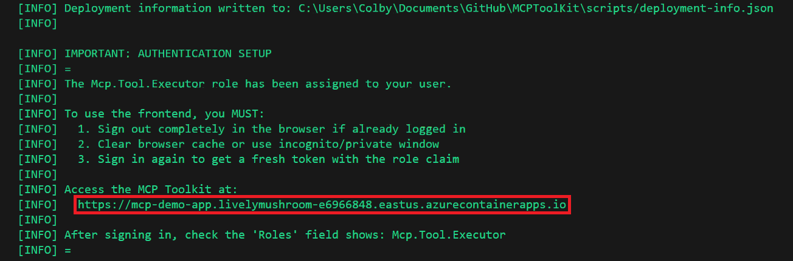{#fig-B89C}

As the message says, it might be best to log out and log back in to your Azure portal. This will refresh your permissions and allow you to see the new app registration and the Container App that were just deployed.

We're almost done with this part, I promise! Next, we just have to authenticate the MCP server with our user credentials.
Navigate to the URL for the MCP ToolKit that was outputted at the end of the PowerShell script.

Locate your Entra App ID and your Tenant ID using the `az` commands shown on the web page. (You can also find these values in the Azure portal in Entra ID). Copy and paste these values into the respective boxes on the web page and click the **Sign in with Microsoft Entra** button, as shown in @fig-88BA.

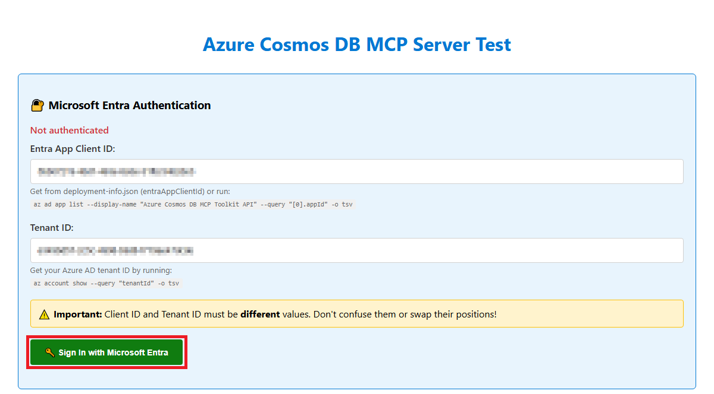{#fig-88BA}


A pop-up window will open that prompts you to log in with your Azure credentials. Make sure to log in with the same account that you've been using to access the Foundry Project and the Cosmos DB account. Click the **Consent on behalf of your organization** checkbox and then click the **Accept** button to grant the necessary permissions to the MCP ToolKit app. See @fig-18B7.

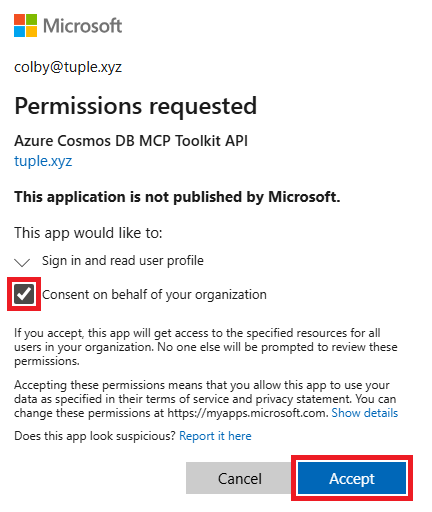{#fig-18B7}


After you successfully log in, you should see an **Authenticated** message at the top of the MCP ToolKit web page, shown in @fig-E8A3. This means that the MCP server is now authenticated and can be accessed using your credentials by your Foundry Agent.

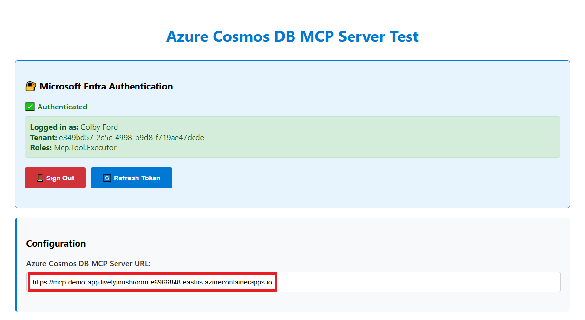{#fig-E8A3}

Copy the MCP Server URL somewhere safe as you'll need it in the next step.


#### Part 4: Adding the Tool

Now we have the MCP server deployed and working, we just need to connect it to our Agent by creating a new connection in Foundry. You can run the PowerShell script from the MCP ToolKit repository that will automate the process of creating a new connection in Foundry with the correct parameters for your MCP server. Just make sure to fill in the correct names for your Foundry workspace and Project.

```powershell
.\Setup-AIFoundry-Connection.ps1 `
   -AIFoundryProjectName "<foundry-project-name>" `
   -AIFoundryAccountName "<foundry-account-name>" `
   -ConnectionName "cosmos-mcp-connection"
```

Behind the scenes, this script is also granting the Foundry Project the `MCP Tool Executor` role, which allows your Agents to communicate with the MCP server. If you want to do this manually, you can follow the instructions in the `README.md` file in the MCP ToolKit repository.

I also want to show you how to create this connection manually. Navigate back to the Foundry portal and to your real estate Agent's Playground. See @fig-43EE.

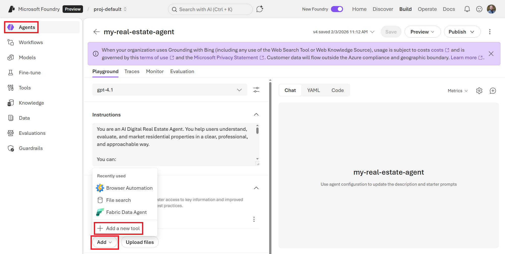{#fig-43EE}


In the **Select a tool** screen, shown in @fig-73C8, go to the **Catalog** tab at the top of the screen. Locate the **Azure Cosmos DB** tool (you can use the search box if it doesn't show up on the initial screen) and select it. Then, click the **Create** button at the bottom. 

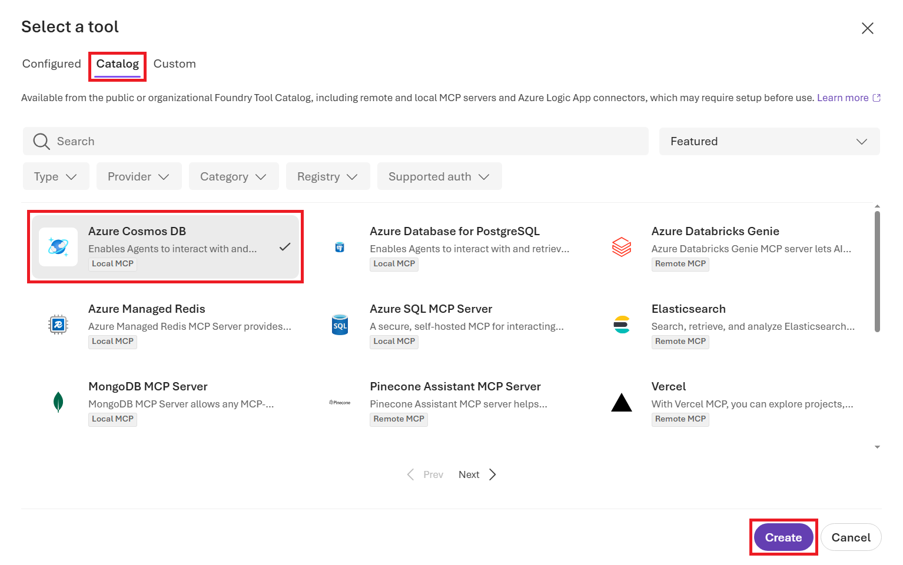{#fig-73C8}


You may see a **Hosting your MCP server** screen pop-up, shown in @fig-E3C5. This is letting you know that you must first have the server/service running before you can connect to it. In other words, you have to have a Cosmos DB account before you can use the Cosmos DB MCP server (duh). Click the **Connect tool with endpoint** button.

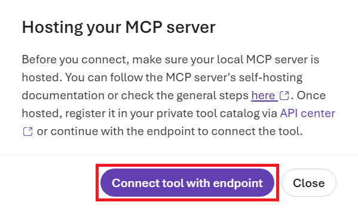{#fig-E3C5}


On the **Connect the Azure Cosmos DB tool** screen, shown in @fig-13D1, give this tool a name. Paste the URL to your MCP server in the **Remote MCP Server endpoint** box (remember to add `/mcp` at the end). Then, for the other values fill in with the following:

- **Authentication**: Microsoft Entra
- **Type**: Project Managed Identity
- **Audience**: (Your Entra App ID for the MCP ToolKit app. This is the `ENTRA_APP_CLIENT_ID` value from the `deployment-info.json` PowerShell script output.)

When you're done filling in the values, click the **Connect** button. See @fig-13D1.

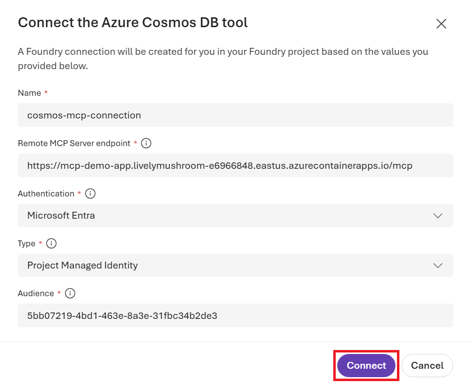{#fig-13D1}


If successful, you should now see the **Azure Cosmos DB** tool listed under the **Tools** section of your Agent. Click the **Save** button to save your progress. See @fig-83DC.

{#fig-83DC}


#### Part 5: Testing the Agent's Capabilities

Now you can test the Agent's new capabilities by asking it questions that require it to query the Cosmos DB database. Let's improve the instructions a bit to let it know that it can use the Cosmos DB tool to query the database for information about the properties. Go back to the **Instructions** box and add the following lines at the end of the existing instructions.

::: {.callout-tip}
## Instructions
For Cosmos DB, use the RealEstateCatalog database and the Properties container for all queries.

A sample record looks like this:

```json
{
    "id": "prop-001",
    "address": "123 Maple Street",
    "city": "Austin",
    "state": "TX",
    "zip": "78704",
    "n_bedrooms": 3,
    "n_bathrooms": 2,
    "sq_footage": 1850,
    "year_built": 1998
}
```

Where `year_built` is the year the property was built, `sq_footage` is the square footage of the house, `n_bedrooms` is the number of bedrooms, and `n_bathrooms` is the number of bathrooms.
:::


Then, ask it a few questions about the properties in the database.

::: {.callout-tip}
## Prompt

Can you tell me what year the property at 753 Willow Boulevard in San Diego was built?
:::

You may be prompted to approve each tool that the Agent uses for the first time. This is a security measure to prevent unauthorized access to your data and services. Make sure to review the tool usage and click the **Approve** button, shown in @fig-739D, if you want to allow the Agent to use the tool.

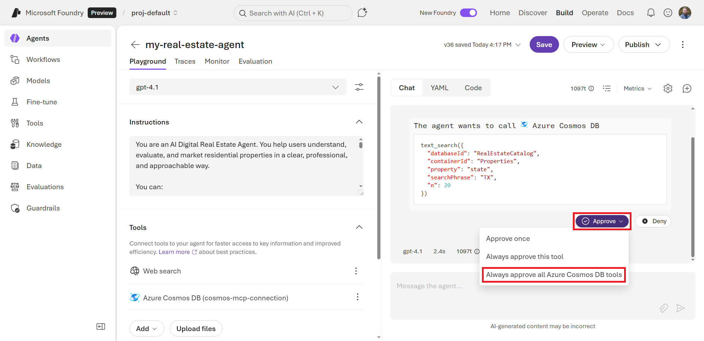{#fig-739D}


As you can see in @fig-8361, the Agent is able to query the Cosmos DB database through the MCP server and retrieve the relevant information to answer the questions.

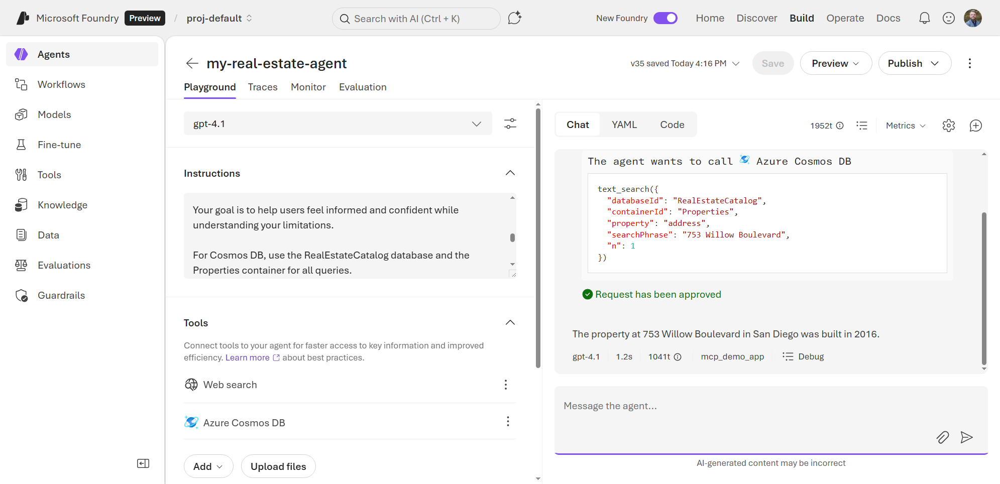{#fig-8361}


You can ask it more complex questions that require it to compare properties, find properties with specific features, or even generate marketing content based on the properties in the database. Spend some time playing with your newly enhanced real estate Agent and see what kind of responses you get!


## Summary

In this chapter, we've gone through the process of exploring and deploying an Agent using an AI model that is available in the Foundry catalog. We also made our Agent smarter and more useful by giving it access to the internet and some of our internal data through Tools.

In the next chapter, we will be building a knowledge base with Foundry IQ, which allows our agents to retrieve data and combine multiple sources of information to form responses.