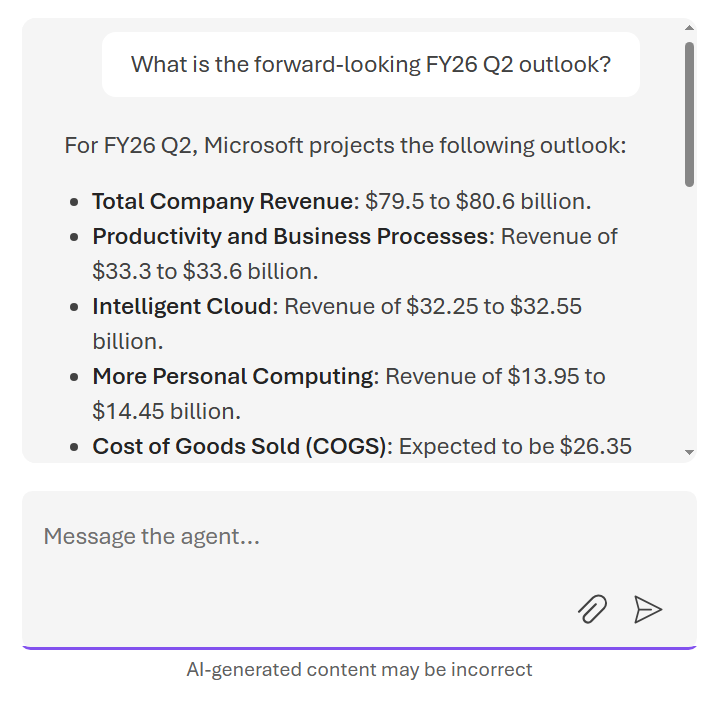

# Building Knowledge Bases {#chapter-knowledge-bases}

Enterprise AI systems may sometimes feel subpar, not because of model quality, but because of *context*. Without reliable access to organizational knowledge, consistent memory across interactions, and visibility into how decisions are made, even the most capable large language models may deliver lackluster responses or untrustworthy answers.

**Foundry IQ** addresses this problem directly. As the knowledge and intelligence layer of **Microsoft Foundry**, Foundry IQ enables AI agents to reason over enterprise and web data, retain context across interactions, and produce responses that are grounded, observable, and auditable. Rather than treating retrieval, memory, and evaluation as bolt-on components, Foundry IQ integrates them into the core lifecycle of AI application development.

This chapter explores Foundry IQ's role within Microsoft Foundry, its architectural principles, and how it enables production-grade, knowledge-aware AI systems.

## What Is Foundry IQ?

**Foundry IQ** is a managed knowledge and memory system for AI agents built on Microsoft Foundry. It enables agents to:

- Ground responses in enterprise and public content
- Maintain conversational and long-term memory
- Produce citation-backed answers
- Support multi-turn, multi-agent reasoning
- Integrate seamlessly with evaluation and observability pipelines

Rather than requiring developers to assemble vector databases, retrieval pipelines, memory stores, and citation logic themselves, Foundry IQ provides these capabilities as first-class platform primitives.

### What is a Knowledge Base?

Knowledge bases encapsulate an information domain for a given area. They are comprised of multiple sources and are structured repositories of information that agents can query to ground their responses.

An information domain could be a specific business function (e.g., customer support), a data type (e.g., product manuals), or a topical area (e.g., financial news). Knowledge bases are designed to be comprehensive, up-to-date, and relevant to the agents that will query them. They are not static dumps of data, but living repositories that evolve as the underlying information changes.

In Foundry IQ, knowledge bases can be built on top of Azure AI Search indexes, allowing developers to ingest and index a wide variety of data sources.

### Knowledge Grounding as a First-Class Capability

At the heart of Foundry IQ is **knowledge grounding**. AI agents rarely operate in a vacuum; they must reason over documents, policies, tickets, emails, manuals, or web content that evolves over time.

Foundry IQ allows developers to connect agents to curated knowledge bases that can include:

- Enterprise documents and internal content
- Indexed datasets and structured sources
- Approved web content
- Hybrid combinations of private and public data

Responses generated by agents can be explicitly grounded in these sources, producing answers that are not only more accurate but also **traceable and explainable**. Citations are generated automatically, enabling downstream auditing and compliance workflows.

### Multi-Agent Systems

As AI systems evolve beyond single-agent designs, coordination becomes a central challenge. Foundry IQ plays a key role in **multi-agent orchestration** by acting as a shared intelligence substrate.

Agents can:

- Access shared knowledge bases
- Contribute observations back into memory
- Reason over the outputs of other agents
- Operate with consistent grounding and context

This enables complex workflows such as research pipelines, incident response automation, and enterprise copilots where multiple agents collaborate toward a shared goal.

### When to Use Foundry IQ

Foundry IQ is particularly well-suited for scenarios such as:

- Enterprise copilots and assistants
- Knowledge-intensive customer support agents
- Internal policy and compliance tools
- Research and analysis workflows
- Multi-agent automation systems

In these cases, correctness, traceability, and continuity matter as much as fluency.

### What is RAG?

Retrieval-Augmented Generation combines:

1. **Retrieval** - Finding relevant information from a knowledge base
2. **Augmentation** - Adding that information to the model's context
3. **Generation** - Using the model to generate responses based on the retrieved data

### Benefits of RAG

* **Accuracy** - Responses are grounded in your actual data
* **Citations** - Provides sources for information
* **Up-to-date** - Can be updated without retraining the model
* **Cost-effective** - No need for expensive fine-tuning
* **Transparency** - Users can verify information sources

### Creating a Knowledge Base

**1. Prepare Your Data**

Foundry IQ supports multiple document types:
* PDF documents
* Word documents (.docx)
* Text files (.txt)
* Markdown files (.md)
* Web pages (via URL)
* SharePoint sites

**2. Create an Index**

1. Navigate to **Tools** → **Indexes** in your Foundry project
2. Click **+ New index**
3. Provide a name (e.g., "product-documentation")
4. Select the index type: **Azure AI Search**
5. Choose or create an Azure AI Search resource

**3. Add Data Sources**

1. In the index configuration, click **+ Add data source**
2. Select the source type:
   * **Upload files** - Upload documents directly
   * **Azure Blob Storage** - Connect to existing storage
   * **SharePoint** - Connect to SharePoint sites
   * **Web crawl** - Crawl public web pages
3. Configure the data source
4. Click **Add**

**4. Configure Chunking and Embedding**

* **Chunking strategy** - How documents are split into searchable pieces
  * Default: 1000 tokens with 100 token overlap
  * Custom: Adjust based on your document structure
* **Embedding model** - Converts text to vectors for semantic search
  * text-embedding-ada-002 (recommended for most cases)
  * Custom embeddings for specialized domains

**5. Build the Index**

1. Review your configuration
2. Click **Create and build**
3. Wait for indexing to complete (time varies by data volume)
4. Monitor progress in the **Indexes** section

### Vector Search

Foundry IQ uses vector search to find semantically similar content:

* Converts queries to embeddings
* Compares query embeddings to document embeddings
* Returns most relevant chunks based on semantic similarity
* Supports hybrid search (combines keyword and vector search)

As shown in @fig-E787, the system will leverage a Foundry IQ knowledge base that contains financial reports and company data along with connectivity to the web and tools for real-time stock updates.

{#fig-E787}

## Exercise: Build your first Knowledge Base

Now that you understand the capabilities of Foundry IQ, the next step is to build your first knowledge base and connect it to an agent. This exercise will walk through how to an Azure AI Search service to ingest and index data from miscellaneous files in a Storage Account. Then, we will create a Foundry IQ knowledge base and configure an agent to use it for grounding responses.

For this exercise, we will build a agent for delivering financial insights into Microsoft that can answer questions about the company's financial performance based on some public earnings-related files.

### Part 1: Uploading Data to Azure Blob Storage

Before we can make a knowledge base, we need to have some data to put in it! For this exercise, I've curated a set of files from Microsoft's public financial documents from their Q1 2026 report in the supplementary materials under [data/ch04/finance_docs](data/ch04/finance_docs/). This data includes earnings reports, financial statements, and transcripts from earnings calls and are in a variety of Office formats (DOCX, PPTX, XLSX). We will upload these files to the Azure Storage Account that was created in Chapter 1. 

Navigate to the Azure Portal and find your Storage Account (mine was called `stfoundrybookdev001`). Then, under *Data storage* on the left-hand panel, as shown in @fig-693E, click on *Containers*. Create a new container by clicking on the *+ Add container* button and name it `data`.

{#fig-693E}

Create a new directory by clicking the *+ Add directory* button and name it `ch04/finance-docs`. (This will actually create two directories, one under the other.) Click through the newly created `ch04` and `finance-docs` directories, and then click the *Upload* button to upload files into this directory. Select all of the files from the [data/ch04/finance_docs](data/ch04/finance_docs/) folder to upload them to the container. See @fig-72EE for an example of what this should look like once the files are uploaded.

{#fig-72EE}

Now that we have some data uploaded to Azure Storage, we can move on to creating an Azure AI Search index and a Foundry IQ knowledge base that connects to this data and makes it available for agents to query.

### Part 2: Create an Azure AI Search Index

To create an Azure AI Search index, navigate to the Azure Portal search for your Azure AI Search service that was created in Chapter 1. (Mine is called `srch-foundrybook-dev-001`.) At the top of the page, shown in @fig-F62E, there is a convenient import wizard that will help us make the index and other components easily. Click on *Import data (new)*.

{#fig-F62E}

On the first page of the wizard, select *Azure Blob Storage* for the built-in indexer, as shown in @fig-63A.

{#fig-63A}

Next, we have some scenario options. There is a *RAG* option that is optimized for retrieval-augmented generation scenarios that handles text or basic images containing text (via OCR). There's also a *Multimodal RAG* option that has capabilities for handling more complex images (such as workflow diagrams and charts). Since we are building a knowledge base for an agent that will answer questions about financial performance based on the clean, more structured documents we uploaded, select the *Keyword search* scenario, as shown in @fig-9637.

{#fig-9637}

On the *Connect to your data* page, select the Azure Storage Account and container where you uploaded the financial documents in Part 1. Definite the *Blob folder* as `ch04/finance_docs` and leave the *Parsing mode* as `Default`, as shown in @fig-20C0. Then, click the *Next* button at the bottom of the page.

{#fig-20C0}

On the *Apply AI enrichments* page, we can select some AI enrichments to apply to the data as it's ingested. These enrichment selections dictate what sorts of things we want to extract from our data and make searchable. For this exercise, we will be selecting the *Extract entities* and *Extract text from images* enrichments, which will allow us to pull out key financial figures and insights from the documents (both Word and Excel files) as well as any text that may be contained in images such as charts and graphs (such as in a Powerpoint slide). There are also some other enrichments that can be useful for different scenarios, such as *Extract phrases* and *Split text*, which can be helpful for organizing and filtering larger textual data in the knowledge base. Click the checkboxes as shown in @fig-6AFC.

{#fig-6AFC}

Selecting the *Gear* icon in the *Extract entities* box, select the entity types that may be useful for the financial questions our eventual Agent will need to answer. You can see my selections in @fig-9AE8. Click the *Save* button after making your selections.

{#fig-9AE8}

For the *Extract text from images* enrichment, click on the *Gear* icon and select the *Generate tags* and *Categorize content* visual features to be extracted, as shown in @fig-AE5. This will ensure that any relevant information contained in charts, graphs, or other visuals in the documents will be pulled into the index and available for retrieval by our Agent. (For other use cases, such as finding information from photos, the other visual features such as *Detect brands* and *Detect objects* can be very useful.) Click the *Save* button after making these selections.

{#fig-AE5}

Click *Next* to move on to the *Preview mappings* page. Here, as shown in @fig-9D86, you can preview the index fields that were auto-generated from the selections in the last step. These are the fields that will be extract from the documents and indexed. You can review the configuration and make adjustments if needed, but we will be leaving everything as default. Click the *Next* button at the bottom of the page.

{#fig-9D86}

On the *Advanced settings* page, you can leave everything as the default, as shown in @fig-AACE. For this exercise, we'll just be running the index process once. However, in a production scenario, perhaps you want to keep your index up to date by scheduling it to run on a regular basis (e.g., every 5 minutes or daily). Click the *Next* button at the bottom of the page.

{#fig-AACE}

Finally, on the *Review and create* page, shown in @fig-5ADA, you can see all of your selections throughout this wizard. Give your index a prefix (e.g., `robo-cfo-search`).Once you're ready to create the index, click the *Create* button to start the indexing process.

{#fig-5ADA}

This will create a few objects in the Azure AI Search service:
- a *Data source* that connects to the Azure Storage container where the documents are located.
- an *Indexer* that defines how and when the data is ingested and indexed (including settings to exclude certain file types or tweak the batch size).
- a *Skillset* that can do things like detect the language, read text from images, and extract entities, etc.
- an *Index* that contains the fields that can be searched.

The Data source, Indexer, and Skillset are all created almost instantly, but the actual Index may take a few minutes. You'll know it's ready when the Index shows a non-zero count for the *Documents* field, which indicates that the data has been ingested and indexed, as shown in @fig-361C. You can also click into the Index and see the individual documents and fields that were extracted from each document.

{#fig-361C}

Now that we have an AI Search Index with our financial documents ingested and ready to go, we can move on to creating a Foundry IQ knowledge base that connects to this index and makes the information available for agents to query.

### Part 3: Create a Foundry IQ Knowledge Base

To begin creating a knowledge base, navigate to the Knowledge section of the Build page of the Foundry Portal. As shown in @fig-33E, we must first connect our Foundry Project to an Azure AI Search resource, which will serve as the underlying index for our knowledge base. Use the existing Azure AI Search resource that you just used in Part 2. For demo purposes, use the API key option for authentication. However, in production scenarios, using the Foundry Project's Entra ID for authentication allows for more granular access control and better security hygiene. Click the *Connect* button after selecting the Azure AI Search resource and the Auth Type.

{#fig-33E}

You'll then be taken to the Foundry IQ page where you will eventually see all of your knowledge bases listed. Since this is your first time here, the list will be empty. Click the *Create a knowledge base* button, shown in @fig-F32A, to get started.

{#fig-F32A}

On the *Choose a knowledge type* screen that pops up, select the *Azure AI Search Index* option and click the *Connect* button, as shown in @fig-6327.

{#fig-6327}

On the *Choose a knowledge source* screen, you'll now select the AI Search Index that you created in Part 2. Give your source a name and provide a description that will help the Agent know what the source contains (shown below). Click the *Create* button, as shown in @fig-6327, to create the source and connect it to the knowledge base.

- **Name:** `robo-cfo-index`
- **Description:** `Microsoft's financial earnings release from the first quarter of the 2026 fiscal year.`
- **Select search index:** `robo-cfo-search` (or whatever you named the index in Part 2)

{#fig-6327}

Now you'll see a *Create a new knowledge base* page. Fill in the values as shown below:

- **Name:** `robo-cfo-kb`
- **Description:** `A knowledge base containing financial insights about Microsoft that can be used by an agent to answer questions about the company's financial performance.` (Doesn't affect the model. This is just for your reference to understand what this knowledge base is about and when to use it.)
- **Chat completions model:** `gpt-4.1` (or whatever model you want to use for grounding responses)
- **Retrieval reasoning effort:** *Medium* (helps the model think more about the retrieved information and how to use it to answer the question)
- **Output mode**: *Answer synthesis* (generates natural language answers rather than just returning retrieved data)
- **Answer instructions:** `Succinct, professional tone for financial insights`
- **Retrieval instructions:** `Prioritize "FinancialStatementFY26Q1" for finance questions and "FY26Q1Transcript" for product and innovation questions.` (guides how your agent searches across multiple knowledge sources)

Click the *Save knowledge base* button at the top of the page to create the knowledge base, as shown in @fig-C30C.

{#fig-C30C}

Now that we have a knowledge base, we can connect it to an agent and start asking questions to see how it grounds its responses in the financial data we uploaded.

### Part 4: Test the Knowledge Base with an Agent

Navigate back to the *Agents* section of the *Build* page and create a new agent. I called mine `robo-cfo-agent`. Feel free to use whatever model you want such as `gpt-4.1`. (If you need a refresher on how to create an agent, refer back to Chapter 3.)

In the agent configuration, under the *Instructions* section, add the following instructions to set the context for the agent and let it know that it has access to a knowledge base with financial data about Microsoft that it can use to answer questions.

::: {.callout-tip}
## Instructions

You are a financial analysis agent that helps answer questions relating to public financial documents about Microsoft. You have access to a knowledge base that contains financial data about Microsoft, including earnings reports, financial statements, and transcripts from earnings calls. Use this information to answer questions about Microsoft's financial performance, ensuring that your responses are grounded in the data from the knowledge base.
:::

Then, under the *Knowledge* section, add the `robo-cfo-kb` knowledge base that you just created, as shown in @fig-1BC. This will allow the agent to use the financial data in the knowledge base to answer questions.

{#fig-1BC}

Now we can test the agent by asking it questions about Microsoft's financial performance. Try asking questions such as:

::: {.callout-tip}
## Prompt

What were Microsoft's total revenue and net income for the fiscal quarter ending in March 2025, and how do these figures compare to the same quarter in the previous year?
:::

If it's able to pull from the knowledge base correctly, it should return $77.7B in total revenue and $27.7 billion in net income for September 2025, and then compare those figures to September 2024, which were $65.6 billion in total revenue and $24.7 billion in net income. See @fig-4EF2 for an example of what the response should look like. 

{#fig-4EF2}

Note that the agent pulled this from the indexed information of the `FinancialStatementFY26Q1.xlsx` file that you uploaded. It is able to ground its response in the financial data from the knowledge base and reason enough to provide a comparison of the year-over-year performance based on that data.

Now let's try to pull information from slides, which is a bit more complex since the relevant information may not be as structured or verbose textually as in an Excel spreadsheet or Word document. Try asking a question such as:

::: {.callout-tip}
## Prompt

What is the forward-looking FY26 Q2 outlook?
:::

The agent should be able to pull relevant information any of the files that you uploaded and indexed. I know that there was a slide with forward-looking statements about Microsoft's outlook for the next quarter. See @fig-B2F6 for an example of what my Robo CFO Agent's response was.

{#fig-B2F6}

As you can see in @fig-C6EC, the agent is able to pull relevant information from the slide 3 of the `OutlookFY26Q2.pptx` PowerPoint deck, which contains a table of revenue and expense forecasts for the next quarter. Oddly enough, this table in the slide is actually just an image and not editable text. This demonstrates how the agent can use the knowledge base to find and extract relevant information even from less structured data sources like PowerPoint slides, which may contain a mix of text, pictures, visuals, and summarized key insights.

{#fig-C6EC}

Since we didn't give this Agent access to the web, its limit will be to information that is contained in the knowledge base. This style may be useful for scenarios where you want to ensure that the agent is only using approved, internal data sources rather than pulling in information from the web that may not be accurate or trustworthy.

Spend some time asking different questions and seeing how the agent is able to ground its responses in the financial data from the knowledge base. You can also experiment with tweaking the knowledge base settings such as the retrieval reasoning effort and answer instructions to see how it affects the agent's responses.


## Summary

Foundry IQ represents a shift in how enterprise AI systems are built. Instead of treating knowledge, memory, and observability as external concerns, it embeds them directly into the platform. By doing so, Microsoft Foundry enables developers to move beyond isolated prompts and toward intelligent systems that reason, remember, and improve over time.

In the next chapter, we’ll explore how Foundry IQ integrates with Foundry Agents and the broader agent lifecycle—from design and orchestration to deployment and continuous evaluation.

