# Building Knowledge Bases {#sec-chapter-4}

Enterprise AI systems may sometimes feel subpar, not because of model quality, but because of *context*. Without reliable access to organizational knowledge, consistent memory across interactions, and visibility into how decisions are made, even the most capable large language models may deliver lackluster responses or untrustworthy answers.

**Foundry IQ** addresses this problem directly. As the knowledge and intelligence layer of **Microsoft Foundry**, Foundry IQ enables AI agents to reason over enterprise and web data, retain context across interactions, and produce responses that are grounded, observable, and auditable. Rather than treating retrieval, memory, and evaluation as bolt-on components, Foundry IQ integrates them into the core lifecycle of AI application development.

This chapter explores Foundry IQ's role within Microsoft Foundry, its architectural principles, and how it enables production-grade, knowledge-aware AI systems.

## What Is Foundry IQ?

**Foundry IQ** is a managed knowledge layer for AI agents built on Microsoft Foundry. It enables agents to:

- Ground responses with enterprise and public content
- Produce citation-backed answers
- Support multi-turn, multi-agent reasoning
- Integrate seamlessly with evaluation and observability pipelines

Rather than requiring developers to assemble vector databases, retrieval pipelines, and citation logic themselves, Foundry IQ provides these capabilities by directly integrating agents with Azure AI Search. With Foundry IQ, we can connect structured and unstructured data across Azure, SharePoint, OneLake, and the web so agents can access various knowledge sources all while obeying granular permissions.

### What Is a Knowledge Base?

Knowledge bases are a top-level resource that orchestrate agentic retrieval in an Azure AI Search service that connect through Microsoft Foundry. They define which knowledge sources to query and parameters that control retrieval behavior, including the retrieval reasoning effort (minimal, low, or medium) for LLM processing.

Knowledge bases encapsulate an information domain for a given area. They are comprised of multiple sources and are structured repositories of information that agents can query to ground their responses.

An information domain could be a specific business function (e.g., customer support), a data type (e.g., product manuals), or a topical area (e.g., financial news). Knowledge bases are designed to be comprehensive, up-to-date, and relevant to the agents that will query them. They are not static dumps of data, but living repositories that evolve as the underlying information changes.

In Foundry IQ, knowledge bases can be built on top of Azure AI Search indexes, allowing developers to ingest and index a wide variety of data sources. Plus, credentials are passed through securely from Foundry to Azure AI Search, so agents can only retrieve information that they are authorized to access based on the permissions set in Azure or the third-party systems.

A knowledge base consists of one or more knowledge sources, which is interfaced with an LLM for query planning and answer synthesis, and parameters that govern retrieval behavior. Each query undergoes planning, decomposition into focused subqueries, parallel retrieval from knowledge sources, semantic re-ranking, and results merging. The three-pronged response is optimized for agent consumption.

Under the hood, agentic retrieval builds on the classic search architecture by adding a context layer (knowledge base) that orchestrates multi-source retrieval. Knowledge sources can be indexed or remote: indexed sources use the same indexing and query engines as classic search, while remote sources bypass indexing and are queried live.

Before we dive into how to build a knowledge base, let's first understand the RAG pattern, which is a key paradigm in enabling LLMs to access and utilize external knowledge. Then, we'll explore how Azure AI Search enables powerful retrieval capabilities for agents.

### Introduction to RAG

Retrieval-Augmented Generation (RAG) is a pattern that extends LLM capabilities by "augmenting" a model's response (a.k.a. "grounding") with relevant information from your internal content. While conceptually simple, as shown in @fig-D293, implementing RAG solutions has garnered lots of attention in the AI community as a powerful way to build knowledge-intensive applications without needing to fine-tune custom models.

Retrieval-Augmented Generation combines:

1. **Retrieval** - Finding relevant information from a knowledge base
2. **Augmentation** - Adding that information to the model's context
3. **Generation** - Using the model to generate responses based on the retrieved data

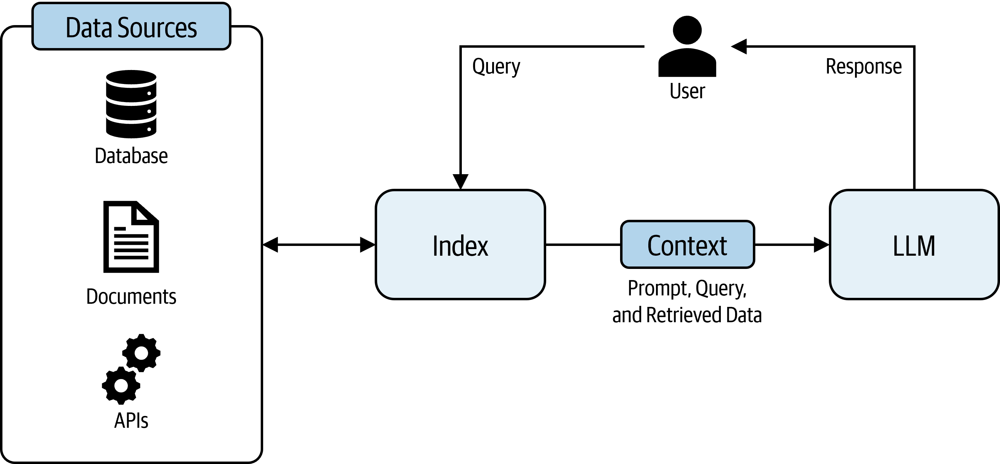{#fig-D293}

To build a RAG-based system, there are a few steps to follow:

1. **Ingest and index your data** - This involves taking your raw data (documents, databases, etc.) and processing it to create an index that can be efficiently searched. This may include steps like tokenization, vectorization, and applying AI enrichments to extract entities or key phrases.
2. **Store the indexed data in a retrievable format** - This typically involves using a vector database or search service that can handle both keyword and semantic search queries.
3. **Implement a retrieval mechanism** - This is the logic that takes a user's query, processes it, and retrieves relevant information from the index. This may involve query understanding, relevance ranking, and handling multi-source retrieval if you have multiple knowledge bases.
4. **Integrate with an LLM for generation** - Once relevant information is retrieved, it needs to be fed into the LLM as context for generating a response. This may involve formatting the retrieved data in a way that the model can understand and use effectively.

There are lots of frameworks that allow you to implement RAG-based solutions, such as [LangChain](https://docs.langchain.com/oss/python/langchain/rag) and [LlamaIndex](https://developers.llamaindex.ai/python/framework/understanding/rag/), or others. However, these frameworks require you to stitch together various components such as vector databases, retrieval pipelines, and citation logic. Some additional challenges with RAG implementations include:

- **Query understanding:** When a user asks complex, conversational, or vague questions with or without a specific context, traditional keyword search fails. The model needs to handle when queries don't match document terminology. So, RAG must understand intent, not just match keywords.
- **Multi-source data access:** In an enterprise setting, data and documents may come from SharePoint, databases, blob storage, OneDrive, or other platforms, all at once. Thus, we must create a search corpus without disrupting normal data operations.
- **Token constraints:** LLMs have limited context windows (meaning they can only accept a limited number of tokens as input). Your retrieval system must avoid being too wordy in its responses. So, it must only return highly relevant, concise results instead of full document dumps.
- **Response time expectations:** No one likes when a chatbot takes forever to respond. The retrieval system must balance accuracy, thoroughness, and speed.
- **Security and governance:** If your LLM needs to access private content, it requires granular access control. Users and agents must only retrieve authorized content.

Foundry IQ alleviates this burden by providing a fully managed knowledge layer that directly integrates with Azure AI Search. Azure AI Search handles a lot of the data indexing and search functionality. Then, Foundry IQ provides a seamless integration that allows you to focus on building your intelligent agents rather than assembling and maintaining the complex RAG infrastructure.

## Azure AI Search

Azure AI Search is a fully managed, cloud-hosted service that connects the dots between data and AI tools. The service brokers access to enterprise and web content so agents and LLMs can use context, chat history, and multi-source signals to produce reliable, grounded answers. This service is useful for when we need to ground agents and chatbots in proprietary, enterprise, or web data for accurate, context-aware responses.

With Azure AI Search, we can access data from Azure Blob Storage, Azure Cosmos DB, Microsoft SharePoint, Microsoft OneLake, and other supported data sources.

Azure AI Search provides two approaches designed specifically for these RAG challenges:

- **Agentic retrieval:** A complete RAG pipeline with LLM-assisted query planning, multi-source access, and structured responses optimized for agent consumption. This mode retrieves from one or more knowledge sources and can respond with an LLM-formulated answer or raw source data, activity log, and references.

- **Classic RAG pattern:** The standard approach using hybrid search and semantic ranking, which is ideal for simpler requirements. This mode is limited to one index defined by a schema and responds with flattened search results based on the schema.

### Knowledge Sources
A knowledge source is any repository of information that can be queried by agents to ground their responses. In the context of Foundry IQ and Azure AI Search, knowledge sources are typically Azure AI Search indexes that have been created from various data sources such as Azure Blob Storage, SharePoint, OneLake, or even web data. As shown in Figure @fig-E63, there are two main types of knowledge sources that can be configured in Azure AI Search:

- **Indexed knowledge sources** are sources that have been ingested and indexed in Azure AI Search. This means that the data has been processed, enriched, and stored in a way that allows for efficient retrieval. Indexed sources are ideal for static or semi-static data that doesn't change super frequently, as the indexing process can be resource-intensive. Some common examples of indexed knowledge sources include Azure Blob Storage and Fabric OneLake.

- **Remote knowledge sources** are sources that are queried live without being indexed. These include services like SharePoint in M365 or Bing Web Search. This is useful for data that changes frequently or is too large to index effectively.

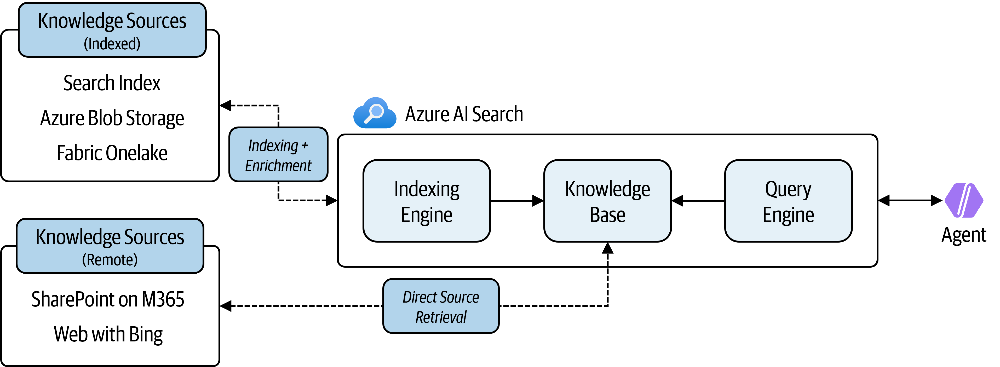{#fig-E63}

When you create a knowledge base in Foundry IQ, you connect it to one or more knowledge sources. Each knowledge source is associated with an Azure AI Search index that contains the indexed information from the underlying data source. The knowledge base then orchestrates how agents query these sources to retrieve relevant information for answering questions.

### Enrichments

In Azure AI Search, an AI enrichment refers to the processing of content that isn't searchable in its raw form. Through enrichment, analysis and inference are used to create searchable content where the previous structure was insufficient or where none previously existed. Enrichment is useful if raw content is unstructured text, images, or other content that needs language detection and translation.

Because Azure AI Search works for text and vector queries, the purpose of AI enrichment is to improve the utility of your content in search-related scenarios. This enrichment process takes image or text content and results in vectorized data that can be indexed and retrieved easily by agents.

AI enrichment is based on the concept of a skillset, which is a collection of extractions and logic that are applied to your content during indexing. Enrichments can be used to extract information from your content, transform it into a more useful format, or even generate new content based on the original. See @fig-3399 for some examples of enrichment tasks that can be applied to documents during indexing.

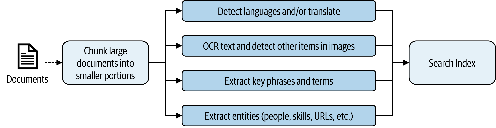{#fig-3399}

Once enrichment takes place, the resulting content is stored in an index and can be retrieved by agents to ground their responses. For example, if you have a PDF document that contains an image with text, you can use the "Extract text from images" enrichment to extract the text from the image and make it searchable. Then, when an agent queries the knowledge base for information related to that document, it can retrieve the extracted text and use it to provide a more accurate and relevant response.

## Multi-Source and Multi-Agent Scenarios

Knowledge bases can be configured to pull from multiple sources, which is useful for scenarios where relevant information may be scattered across different repositories. For example, an agent designed to provide financial insights about a company may need to pull from financial reports in Azure Blob Storage, news articles from the web, and internal communications in SharePoint. By connecting multiple sources to a single knowledge base, the agent can access a richer set of information and provide more comprehensive answers.

Also, some scenarios work well when multiple agents work on different aspects of a question and then combine their insights to produce a final answer. For example, one agent could be responsible for retrieving financial data from the knowledge base, while another agent could be responsible for analyzing that data and generating insights. By orchestrating multiple agents with access to the same knowledge base, you can create more sophisticated and nuanced AI systems that can tackle complex questions and provide more valuable insights.

As shown in @fig-E787, a system can leverage a Foundry IQ knowledge base that contains financial reports and company data along with connectivity to the web and tools for real-time stock updates.

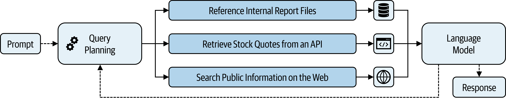{#fig-E787}

Now that we understand the basics of Foundry IQ and how it enables knowledge bases for Agents, let's walk through an exercise to build a knowledge base that connects to an Azure AI Search index and then connect that knowledge base to an agent to see how it can ground responses in the indexed information.

## Exercise: Build Your First Knowledge Base

Now that you understand the capabilities of Foundry IQ, the next step is to build your first knowledge base and connect it to an agent. This exercise will walk through how to use an Azure AI Search service to ingest and index data from miscellaneous files in a Storage Account. Then, we will create a Foundry IQ knowledge base and configure an agent to use it for grounding responses.

For this exercise, we will build an agent for delivering financial insights into Microsoft that can answer questions about the company's financial performance based on some public earnings-related files.

### Part 1: Uploading Data to Azure Blob Storage

Before we can make a knowledge base, we need to have some data to put in it! For this exercise, I've curated a set of files from Microsoft's public financial documents from their Q1 2026 report in the supplementary materials under [data/ch04/finance_docs](https://github.com/colbyford/foundry-book/blob/main/data/ch04/finance_docs/). This data includes earnings reports, financial statements, and transcripts from earnings calls and are in a variety of Office formats (DOCX, PPTX, XLSX). We will upload these files to the Azure Storage Account that was created in @sec-chapter-1. 

Navigate to the Azure portal and find your Storage Account (mine was called `stfoundrybookdev001`). Then, under *Data storage* on the left-hand panel, as shown in @fig-82FA, click on *Containers*. Create a new container by clicking on the *+ Add container* button and name it `data`.

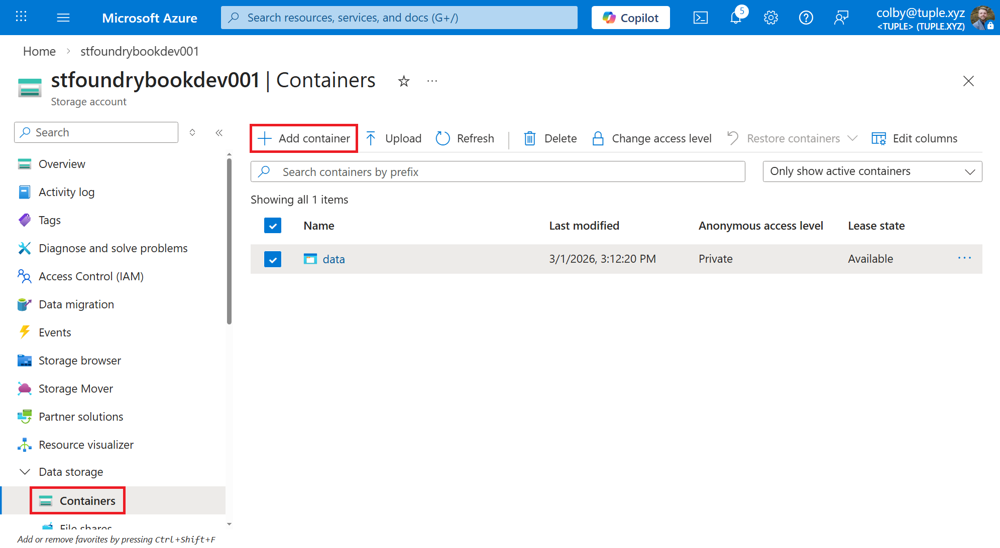{#fig-82FA}

Create a new directory by clicking the *+ Add directory* button and name it `ch04/finance_docs`. (This will actually create two directories, one under the other.) Click through the newly created `ch04` and `finance_docs` directories, and then click the *Upload* button to upload files into this directory. Select all of the files from the [data/ch04/finance_docs](https://github.com/colbyford/foundry-book/blob/main/data/ch04/finance_docs/) folder to upload them to the container. See @fig-72EE for an example of what this should look like once the files are uploaded.

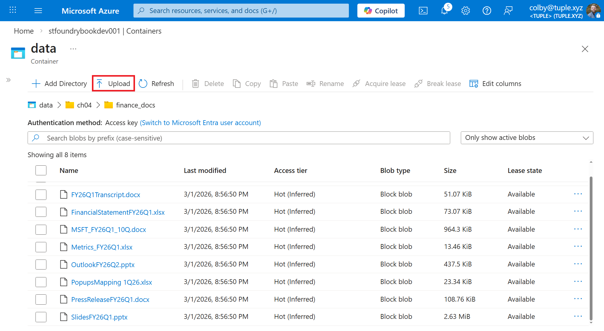{#fig-72EE}

Now that we have some data uploaded to Azure Storage, we can move on to creating an Azure AI Search index and a Foundry IQ knowledge base that connects to this data and makes it available for agents to query.

### Part 2: Create an Azure AI Search Index

To create an Azure AI Search index, navigate to the Azure portal search for your Azure AI Search service that was created in @sec-chapter-1. (Mine is called `srch-foundrybook-dev-001`.) At the top of the page, shown in @fig-F62E, there's a convenient import wizard that will help us make the index and other components easily. Click on *Import data (new)*.

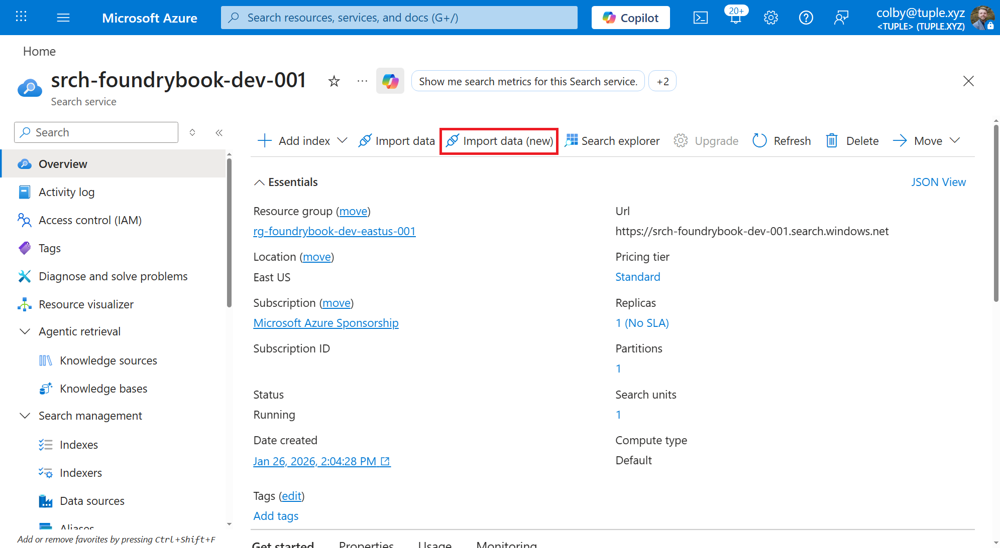{#fig-F62E}

On the first page of the wizard, select *Azure Blob Storage* for the built-in indexer, as shown in @fig-63A.

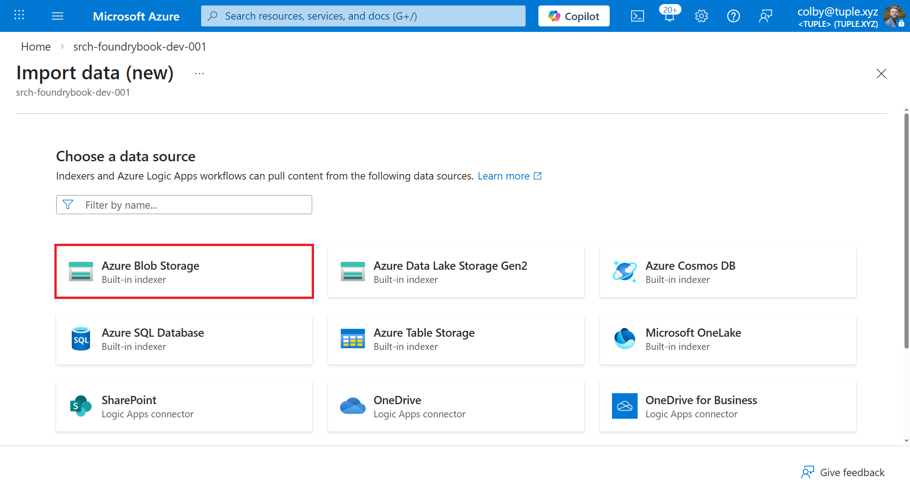{#fig-63A}

Next, we have some scenario options. There is a *RAG* option that is optimized for retrieval-augmented generation scenarios that handles text or basic images containing text (via OCR). There's also a *Multimodal RAG* option that has capabilities for handling more complex images (such as workflow diagrams and charts). Since we are building a knowledge base for an agent that will answer questions about financial performance based on the clean, more structured documents we uploaded, select the *Keyword search* scenario, as shown in @fig-9637.

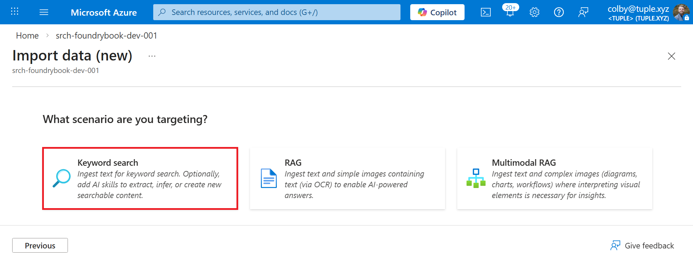{#fig-9637}

On the *Connect to your data* page, select the Azure Storage Account and container where you uploaded the financial documents in Part 1. Define the *Blob folder* as `ch04/finance_docs` and leave the *Parsing mode* as `Default`, as shown in @fig-20C0. Then, click the *Next* button at the bottom of the page.

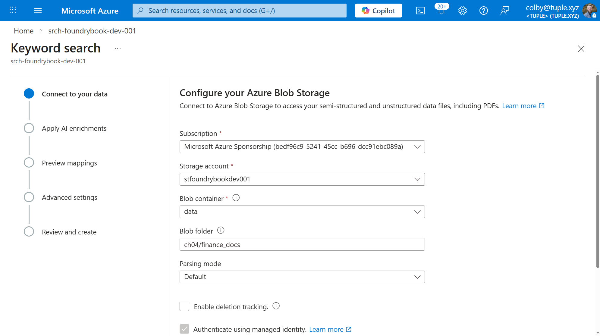{#fig-20C0}

On the *Apply AI enrichments* page, we can select some AI enrichments to apply to the data as it's ingested. These enrichment selections dictate what sorts of things we want to extract from our data and make searchable. For this exercise, we will be selecting the *Extract entities* and *Extract text from images* enrichments, which will allow us to pull out key financial figures and insights from the documents (both Word and Excel files) as well as any text that may be contained in images such as charts and graphs (such as in a PowerPoint slide). There are also some other enrichments that can be useful for different scenarios, such as *Extract phrases* and *Split text*, which can be helpful for organizing and filtering larger textual data in the knowledge base. Click the checkboxes as shown in @fig-6AFC.

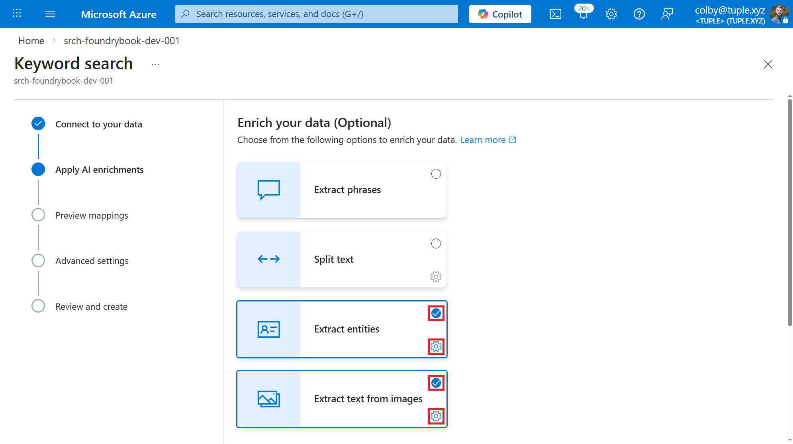{#fig-6AFC}

Select the *Gear* icon in the *Extract entities* box, then select the entity types that may be useful for the financial questions our eventual Agent will need to answer. You can see my selections in @fig-9AE8. Click the *Save* button after making your selections.

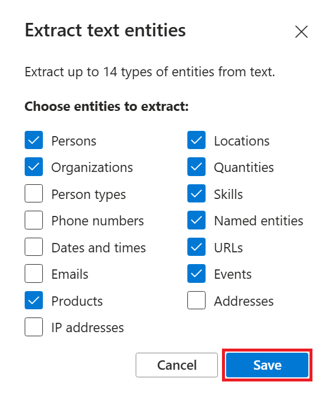{#fig-9AE8}

For the *Extract text from images* enrichment, click on the *Gear* icon and select the *Generate tags* and *Categorize content* visual features to be extracted, as shown in @fig-AE5. This will ensure that any relevant information contained in charts, graphs, or other visuals in the documents will be pulled into the index and available for retrieval by our Agent.

::: {.callout-note}
For other use cases, such as finding information from photos, the other visual features such as *Detect brands* and *Detect objects* can be very useful.
:::

Click the *Save* button after making these selections.

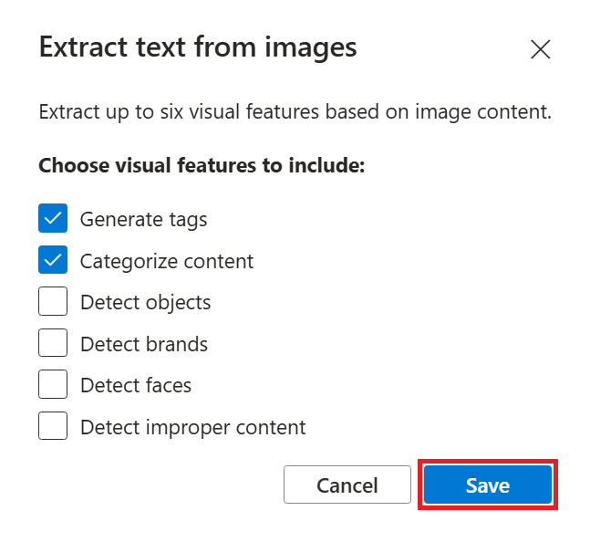{#fig-AE5}

Click *Next* to move on to the *Preview mappings* page. Here, as shown in @fig-9D86, you can preview the index fields that were auto-generated from the selections in the last step. These are the fields that will be extract from the documents and indexed. You can review the configuration and make adjustments if needed, but we will be leaving everything as default. Click the *Next* button at the bottom of the page.

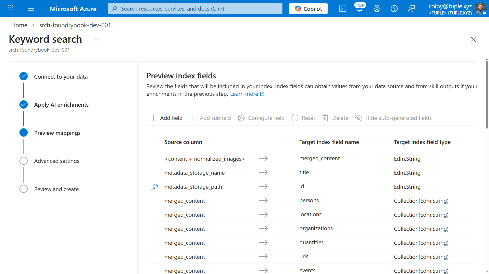{#fig-9D86}

On the *Advanced settings* page, you can leave everything as the default, as shown in @fig-AACE. For this exercise, we'll just be running the index process once. However, in a production scenario, perhaps you want to keep your index up to date by scheduling it to run on a regular basis (e.g., every 5 minutes or daily). Click the *Next* button at the bottom of the page.

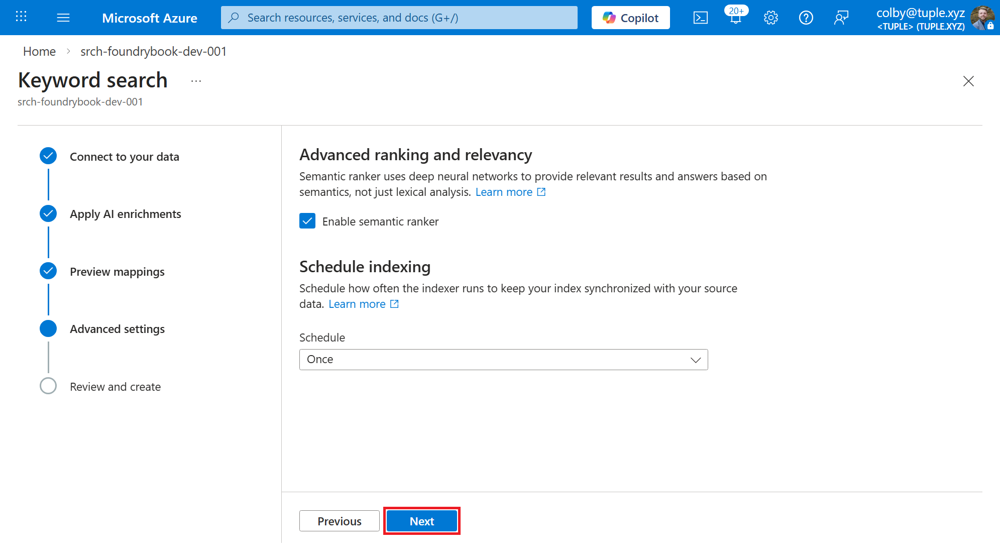{#fig-AACE}

Finally, on the *Review and create* page, shown in @fig-5ADA, you can see all of your selections throughout this wizard. Give your index a prefix (e.g., `robo-cfo-search`).Once you're ready to create the index, click the *Create* button to start the indexing process.

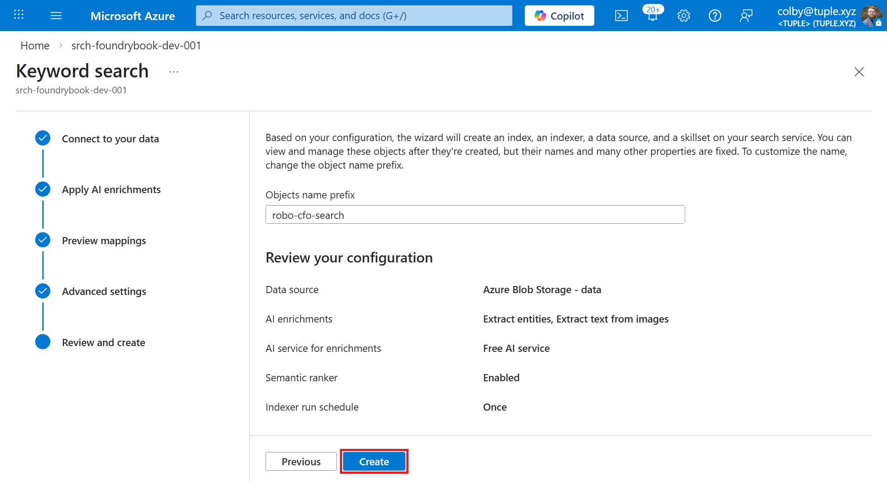{#fig-5ADA}

This will create several objects in the Azure AI Search service:

- a *Data source* that connects to the Azure Storage container where the documents are located.
- an *Indexer* that defines how and when the data is ingested and indexed (including settings to exclude certain file types or tweak the batch size).
- a *Skillset* that can do things like detect the language, read text from images, and extract entities, etc.
- an *Index* that contains the fields that can be searched.

The Data source, Indexer, and Skillset are all created almost instantly, but the actual Index may take a few minutes. You'll know it's ready when the Index shows a non-zero count for the *Documents* field, which indicates that the data has been ingested and indexed, as shown in @fig-361C. You can also click into the Index and see the individual documents and fields that were extracted from each document.

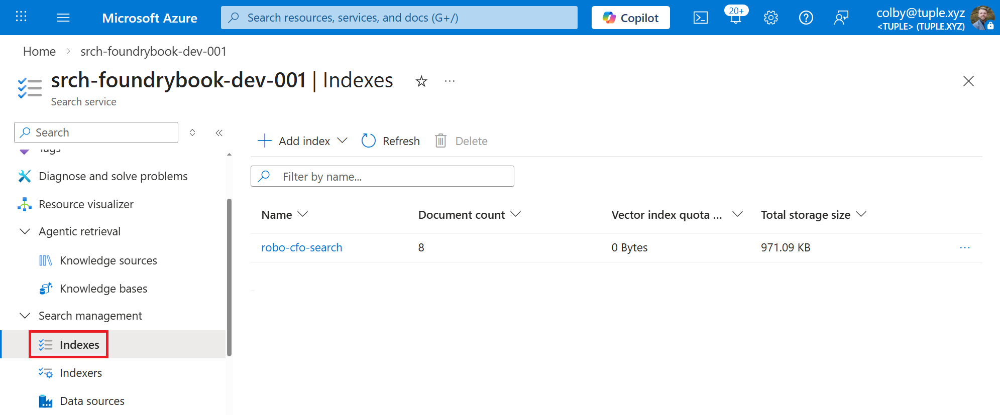{#fig-361C}

Now that we have an AI Search Index with our financial documents ingested and ready to go, we can move on to creating a Foundry IQ knowledge base that connects to this index and makes the information available for agents to query.

### Part 3: Create a Foundry IQ Knowledge Base

To begin creating a knowledge base, navigate to the *Knowledge* section of the *Build* page of the Foundry portal. As shown in @fig-33E, we must first connect our Foundry Project to an Azure AI Search resource, which will serve as the underlying index for our knowledge base. Use the existing Azure AI Search resource that you just used in Part 2. For demo purposes, use the API key option for authentication. However, in production scenarios, using the Foundry Project's Entra ID for authentication allows for more granular access control and better security hygiene. Click the *Connect* button after selecting the Azure AI Search resource and the Auth Type.

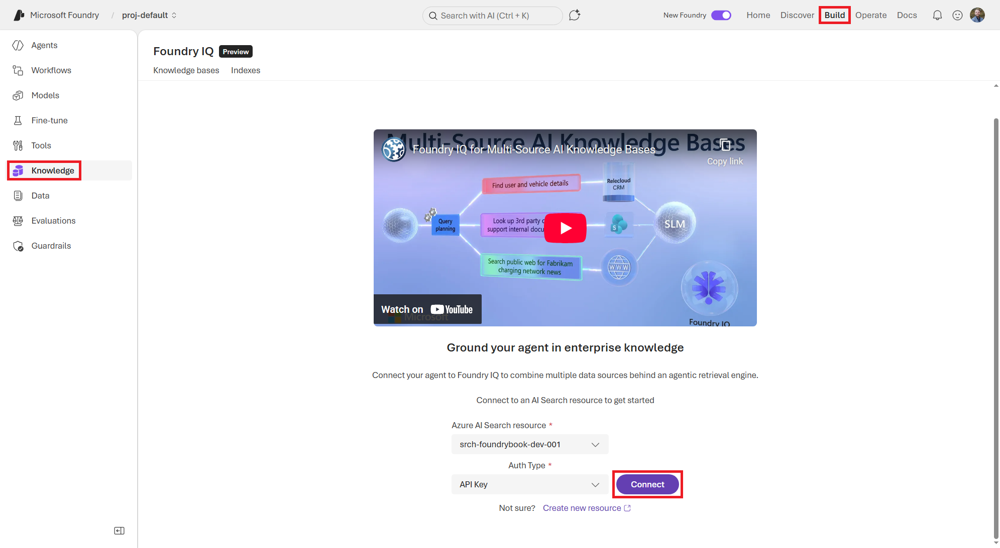{#fig-33E}

You'll then be taken to the Foundry IQ page where you will eventually see all of your knowledge bases listed. Since this is your first time here, the list will be empty. Click the *Create a knowledge base* button, shown in @fig-F32A, to get started.

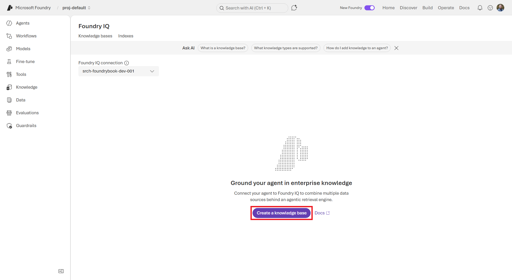{#fig-F32A}

On the *Choose a knowledge type* screen that pops up, select the *Azure AI Search Index* option and click the *Connect* button, as shown in @fig-6327.

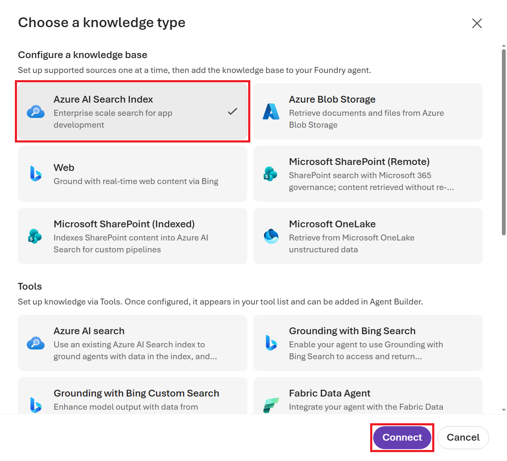{#fig-6327}

On the *Choose a knowledge source* screen, you'll now select the AI Search Index that you created in Part 2. Give your source a name and provide a description that will help the Agent know what the source contains (shown below). Click the *Create* button, as shown in @fig-5301, to create the source and connect it to the knowledge base.

- **Name:** `robo-cfo-index`
- **Description:** `Microsoft's financial earnings release from the first quarter of the 2026 fiscal year.`
- **Select search index:** `robo-cfo-search` (or whatever you named the index in Part 2)

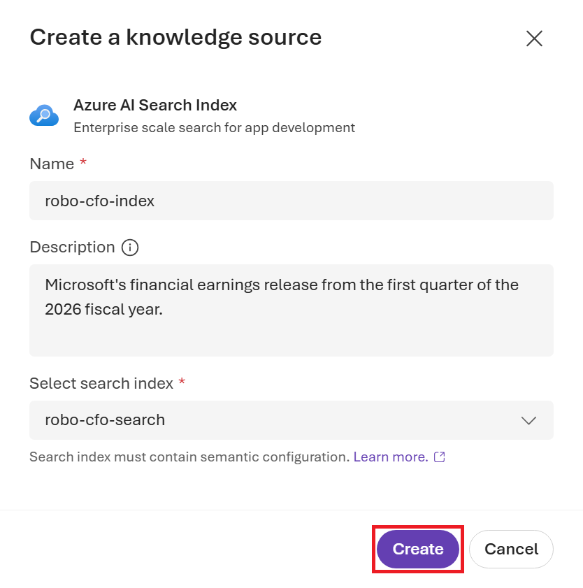{#fig-5301}

Now you'll see a *Create a new knowledge base* page. Fill in the values as shown below:

- **Name:** `robo-cfo-kb`
- **Description:** `A knowledge base containing financial insights about Microsoft that can be used by an agent to answer questions about the company's financial performance.` (Doesn't affect the model. This is just for your reference to understand what this knowledge base is about and when to use it.)
- **Chat completions model:** `gpt-4.1` (or whatever model you want to use for grounding responses)
- **Retrieval reasoning effort:** *Medium* (helps the model think more about the retrieved information and how to use it to answer the question)
- **Output mode**: *Answer synthesis* (generates natural language answers rather than just returning retrieved data)
- **Answer instructions:** `Succinct, professional tone for financial insights`
- **Retrieval instructions:** `Prioritize "FinancialStatementFY26Q1" for finance questions and "FY26Q1Transcript" for product and innovation questions.` (Guides how your agent searches across multiple knowledge sources)

Click the *Save knowledge base* button at the top of the page to create the knowledge base, as shown in @fig-C30C.

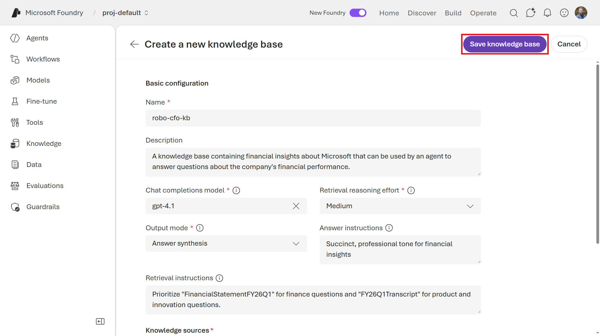{#fig-C30C}

Now that we have a knowledge base, we can connect it to an agent and start asking questions to see how it grounds its responses in the financial data we uploaded.

### Part 4: Test the Knowledge Base with an Agent

Navigate back to the *Agents* section of the *Build* page and create a new agent. I called mine `robo-cfo-agent`. Feel free to use whatever model you want such as `gpt-4.1`. (If you need a refresher on how to create an agent, refer back to @sec-chapter-3.)

In the agent configuration, under the *Instructions* section, add the following instructions to set the context for the agent and let it know that it has access to a knowledge base with financial data about Microsoft that it can use to answer questions.

::: {.callout-tip}
## Instructions

You are a financial analysis agent that helps answer questions relating to public financial documents about Microsoft. You have access to a knowledge base that contains financial data about Microsoft, including earnings reports, financial statements, and transcripts from earnings calls. Use this information to answer questions about Microsoft's financial performance, ensuring that your responses are grounded in the data from the knowledge base.
:::

Then, under the *Knowledge* section, add the `robo-cfo-kb` knowledge base that you just created, as shown in @fig-8BA3. This will allow the agent to use the financial data in the knowledge base to answer questions.

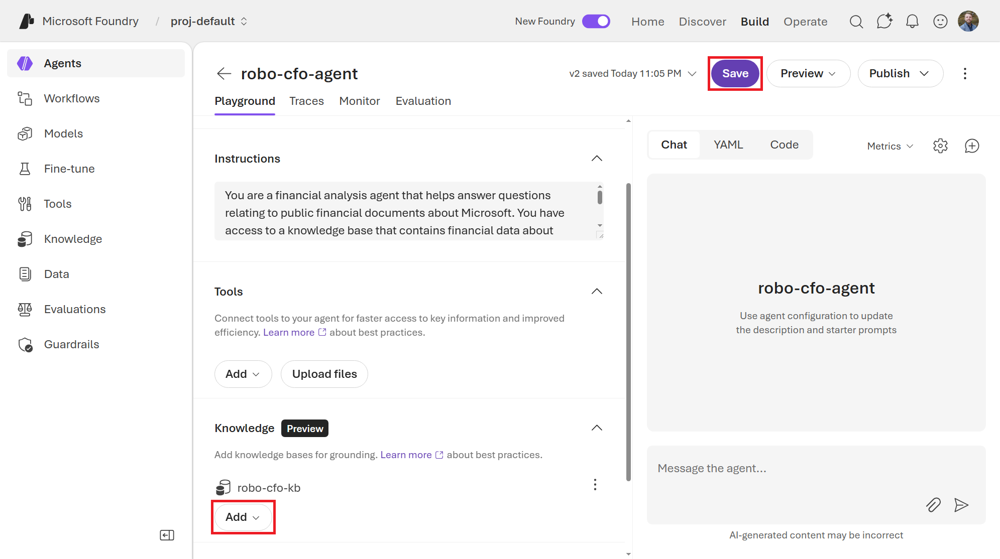{#fig-8BA3}

Now we can test the agent by asking it questions about Microsoft's financial performance. Try asking questions such as:

::: {.callout-tip}
## Prompt

What were Microsoft's total revenue and net income for the fiscal quarter ending in March 2025, and how do these figures compare to the same quarter in the previous year?
:::

If it's able to pull from the knowledge base correctly, it should return $77.7B in total revenue and $27.7 billion in net income for September 2025, and then compare those figures to September 2024, which were $65.6 billion in total revenue and $24.7 billion in net income. See @fig-D97B for an example of what the response should look like. 

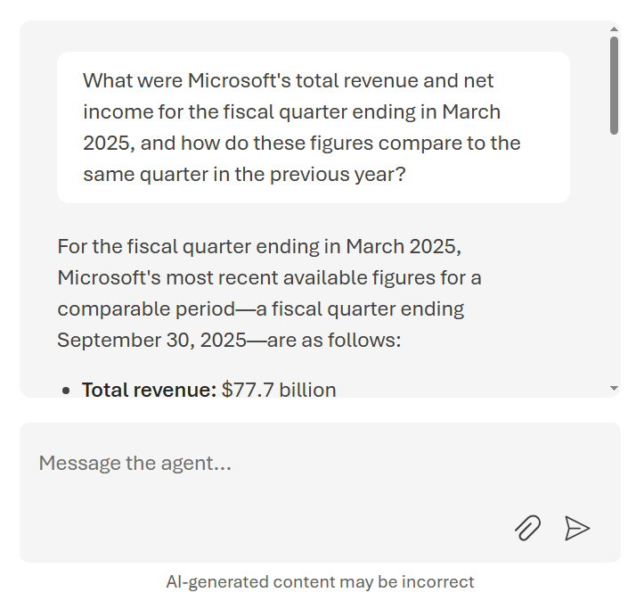{#fig-D97B}

Note that the agent pulled this from the indexed information of the `FinancialStatementFY26Q1.xlsx` file that you uploaded. It is able to ground its response in the financial data from the knowledge base and reason enough to provide a comparison of the year-over-year performance based on that data.

Now let's try to pull information from slides, which is a bit more complex since the relevant information may not be as structured or verbose textually as in an Excel spreadsheet or Word document. Try asking a question such as:

::: {.callout-tip}
## Prompt

What is the forward-looking FY26 Q2 outlook?
:::

The agent should be able to pull relevant information from any of the files that you uploaded and indexed. I know that there was a slide with forward-looking statements about Microsoft's outlook for the next quarter. See @fig-257F for an example of what my Robo CFO Agent's response was.

{#fig-257F}

As you can see in @fig-5165, the agent is able to pull relevant information from slide 3 of the `OutlookFY26Q2.pptx` PowerPoint deck, which contains a table of revenue and expense forecasts for the next quarter. Oddly enough, this table in the slide is actually just an image and not editable text. This demonstrates how the agent can use the knowledge base to find and extract relevant information even from less structured data sources like PowerPoint slides, which may contain a mix of text, pictures, visuals, and summarized key insights.

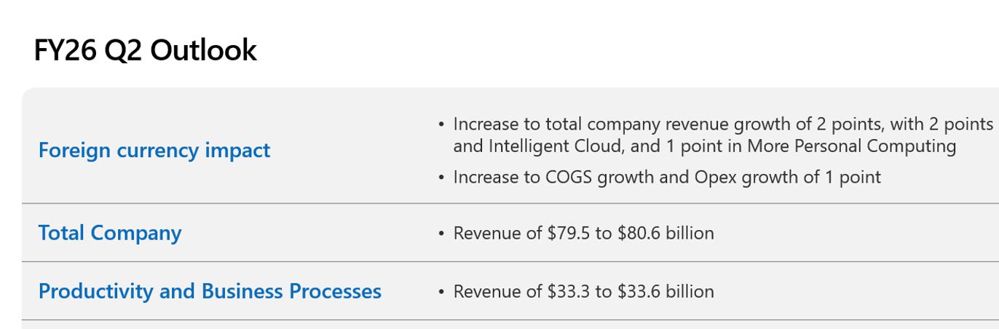{#fig-5165}

Since we didn't give this Agent access to the web, its limit will be to information that is contained in the knowledge base. This style may be useful for scenarios where you want to ensure that the agent is only using approved, internal data sources rather than pulling in information from the web that may not be accurate or trustworthy.

Spend some time asking different questions and seeing how the agent is able to ground its responses in the financial data from the knowledge base. You can also experiment with tweaking the knowledge base settings such as the retrieval reasoning effort and answer instructions to see how it affects the agent's responses.



## Summary

Foundry IQ represents a shift in how enterprise AI systems are built. While custom RAG-based solutions will continue to pop up, Foundry IQ alleviates our need to build them ourselves. Instead of treating knowledge, memory, and observability as external concerns, it embeds them directly into the platform. By doing so, Microsoft Foundry enables developers to move beyond isolated prompts and toward intelligent systems that retrieve data, reason with it, and ground their responses before providing a response.

In the exercise in this chapter, we built a knowledge base that connected to an Azure AI Search index containing financial documents about Microsoft. We then connected that knowledge base to an agent and saw how it could ground its responses in the indexed information to answer questions about Microsoft's financial performance. This is just one example of how Foundry IQ can be used to create knowledge-aware agents, but the possibilities are vast. By connecting agents to the right knowledge sources, we can create AI systems that are not only intelligent but also informed, reliable, and trustworthy.

In the next chapter, we’ll model fine-tuning, which is another powerful way to create more curated agents by customizing the underlying LLM itself with domain-specific data. We’ll explore how fine-tuning differs from retrieval-based approaches and when it may be the right choice for your use case.

