# Model Customization through Fine-Tuning {#chapter-fine-tuning}

In this chapter, we will learn how to fine-tune models in Foundry using custom training datasets. Customizing a model with your own data can improve performance on specific tasks or domains by teaching the model to better understand your unique requirements and to respond with more accurate answers or in a desired style. Fine-tuning is a powerful technique that allows you to adapt pre-trained models to your specific use case without needing to train an entire model from scratch, which can be resource-intensive (expensive because you'd have to have many GPUs) and require large amounts of data. Instead, you can achieve significant improvements with just a few hundred or thousand examples that are relevant to your specific domain or task.

##	Fine-Tuning with Custom Data 

When LLMs are trained, they learn from a broad range of data sources to develop general language understanding. Groups like Anthropic or OpenAI train their models on trillions of tokens across various domains from all sorts of sources including Common Crawl (an archive of web page data), Wikipedia, and digitized books. Thus, for giant models, they often respond reasonably well to a wide range of prompts without any additional training. You've probably also noticed that some alternate versions of models are released for specific use cases, such as code generation, deep reasoning, or mathematics. These models have been fine-tuned on additional data relevant to those tasks to improve their performance in those areas.

However, the general knowledge that a model has may not be exactly what you're looking for if you need to use a model for a specific domain, task, or style. For example, if you're building a customer support agent for a software product, you want the model to be familiar with your product's features, common issues, and support policies. If you rely solely on the base model's general training, it may not perform well because it lacks the specific knowledge and context needed to answer questions accurately. This is where fine-tuning comes in.

Fine-tuning allows you to customize pre-trained models with your own data to improve performance on specific tasks or domains. This process adapts the model's behavior to better align with your use case while maintaining the model's general capabilities. Also, fine tuning requires far less data and compute than training an entire model from scratch. You likely don't have trillions of tokens to train on, but you can often achieve significant improvements with just a few hundred or thousand examples that are relevant to your specific use case.

In Microsoft Foundry, you can fine-tune models using custom training datasets that you upload to the platform. The fine-tuning process involves providing examples of inputs and desired outputs, which the model uses to learn how to respond in a way that is more relevant to your specific needs.

Consider fine-tuning when you need to:

* Adapt a model to a specific domain or industry (e.g., legal, medical, financial)
* Improve performance on specialized tasks
* Teach the model to follow specific formatting or response patterns
* Incorporate proprietary terminology or knowledge
* Reduce the need for lengthy prompts by encoding behavior in the model

::: {.callout-note}
## To RAG or to Fine-Tune?

After reading the last chapter on knowledge bases and retrieval-augmented generation (RAG), you might be wondering when to use RAG versus fine-tuning for customizing your model's behavior.

We use RAG for when we want a model to retrieve data from an external knowledge base to answer questions. This is especially useful when the information is frequently changing, such as news articles or online orders. RAG allows the model to access up-to-date information without needing to retrain the model every time the data changes.

We use fine-tuning when we need to teach the model specific behaviors, styles, or knowledge that is not easily retrieved from an external source. This is especially useful when you want the model to have a certain tone, follow specific formatting, or have expertise in a particular domain that may not be well-represented in a knowledge base.

Both techniques can help improve the relevance and accuracy of model responses, but they serve different purposes and are suited for different scenarios.
:::


### Tuning Methods

Once you identify a good use case for fine-tuning a model, you will then need to select the appropriate training technique. The technique you choose will guide the model you select for training. There are currently three training techniques to optimize your models:

- **Supervised Fine-tuning:** Standard supervised fine-tuning with training and validation datasets. This is useful for most use cases where you have a clear set of examples that demonstrate the desired behavior you want the model to learn.
- **Direct Preference Optimization (DPO):** Fine-tuning using preference data to align model outputs to the preferences of human evaluators. This is useful for improving the quality of responses to align with safety or other human preferences.
- **Reinforcement Fine-tuning:** Reinforcement learning-based fine-tuning that incorporates automated feedback from built-in evaluation logic such as a scoring function. This method is useful for specific objectives where there are clear right and wrong answers, such as in code generation or math problem solving.

Supervised fine-tuning is the most common and straightforward method, and it's a good place to start for most use cases. It just requires a training dataset with examples of the desired behavior. In contrast, DPO is a newer technique that can be very effective for aligning models with human preferences (e.g., "Do you like Response 1 or Response 2 better?", as you've probably seen when using ChatGPT or Claude online). Lastly, reinforcement fine-tuning is more specialized as is requires a well-defined scoring function to provide feedback to the model during training, which can be more complex to set up and may not be suitable for all use cases. The choice of technique will depend on your specific use case, the type of data you have available, and the behavior you want to teach the model.


### Building Training Datasets

The first step to begin fine-tuning a model in Microsoft Foundry is to build a training dataset. This dataset should consist of examples that demonstrate the desired behavior you want the model to learn. Each example typically includes an input (prompt) and a corresponding output (response) that represents the correct or ideal answer.

Your training data should be in JSONL (JSON Lines) format with clear examples of inputs and desired outputs:

```{.json .code-overflow-wrap}
{"messages": [{"role": "system", "content": "You are a customer support agent."}, {"role": "user", "content": "How do I reset my password?"}, {"role": "assistant", "content": "To reset your password, go to Settings > Security > Reset Password."}]}
{"messages": [{"role": "system", "content": "You are a customer support agent."}, {"role": "user", "content": "Where can I find my order history?"}, {"role": "assistant", "content": "Your order history is available in Account > Orders."}]}
```

For simple supervised fine-tuning, you can create a dataset with just a few dozen to a few hundred examples. The key is to ensure that the examples are high-quality, relevant, and representative of the behavior you want the model to learn. You can also include system messages in your examples to provide additional context or instructions to guide the model's behavior.

Also, you have the option to have a single system-user conversation in each example, or you can include multiple turns of conversation to provide more context and demonstrate more complex interactions. The choice depends on the specific behavior you're trying to teach the model and the complexity of the task.

When generating training data, keep the following best practices in mind:

* **Quality over quantity** - Start with 50-100 high-quality examples
* **Diverse examples** - Cover different scenarios and edge cases
* **Consistent format** - Use the same structure throughout
* **Clear instructions** - Include system messages to define behavior
* **Representative data** - Examples should reflect real-world usage

## Exercise: Fine-tune a Medical Assistant Model

Let's start by fine-tuning a model to be a medical assistant that can answer questions about common medical conditions. We will use the `gpt-4.1-mini` model for this exercise, which is a smaller version of the GPT-4.1 model that is suitable for fine-tuning with limited data and compute resources. I have provided a training dataset with examples of medical questions and answers in the `data/ch05` folder.

To start, navigate to the **Fine-tune** section of the **Build** page in the Foundry portal and click the **Fine-tune** button at the top, as shown in @fig-706E.

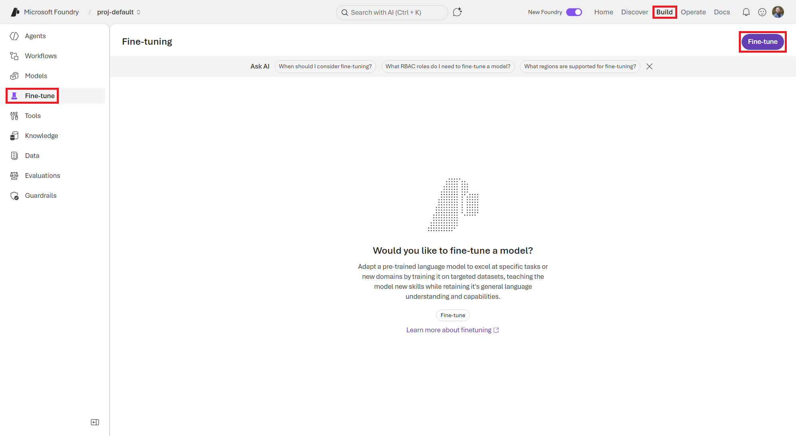{#fig-706E}

On the **Fine-tune a model** screen, shown in @fig-807A, you will fill in the details to create a fine-tuning job for a medical assistant model. This includes selecting the base model, choosing the customization method, uploading your training and validation datasets, and configuring the training settings.

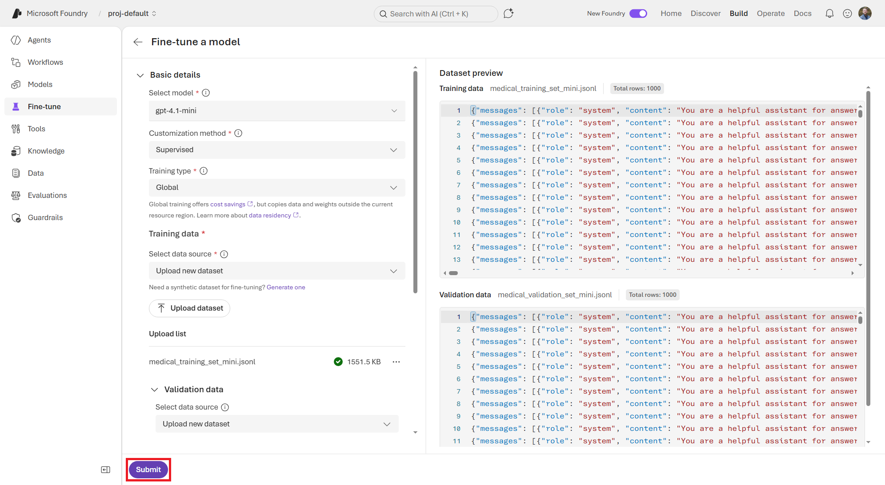{#fig-807A}

Fill in the following details to create a fine-tuning job for a medical assistant model and click the **Submit** button to start the fine-tuning process:

- **Select model:** `gpt-4.1-mini` (or another model of your choice)
- **Customization method:**  `Supervised`
- **Training type:** `Global`
- **Training dataset:** Select **Upload new dataset**, then upload the `medical_training_set_mini.jsonl` file from the data/ch05 folder.
- **Validation dataset:** Select **Upload new dataset**, then upload the `medical_validation_set_mini.jsonl` file from the data/ch05 folder.
- **Suffix:** `medical-training-mini`
- **Deployment type:** `Developer`
- **Additional configuration:** Leave these settings at their default values for now, but feel free to experiment with them later:
  - **Seed:** `Random`
  - **Batch size:** 1
  - **Learning rate multiplier:** 0.1

This will take you back to the **Fine-tuning** page where you can see your new fine-tuning job in the list. The job you just submitted will start in the *Queued* state and then will start running in a couple minutes. Click the job name to view the details of the fine-tuning job. See @fig-1077.

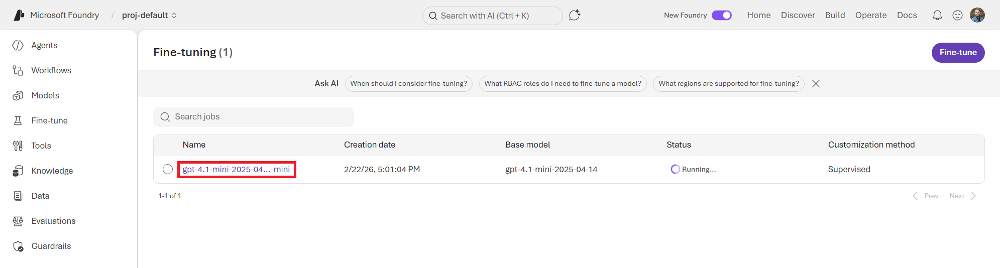{#fig-1077}


A fine-tuning process can take anywhere from a few minutes to a few hours depending on the size of the model, the size of your training dataset, and the training settings you chose. For our mini dataset, this should take an hour or so to complete. You can monitor the status of your fine-tuning job on the **Logs** tab.

While it's tuning, check out the **Monitor** tab. This page shows the current training loss and mean token accuracy by training step. This is useful for keeping an eye on how the training is progressing and whether the model is learning from the training data well. You should see the training loss decrease over time and the mean token accuracy increase as the model learns to generate responses that are closer to the desired outputs in your training dataset. See @fig-B05C.


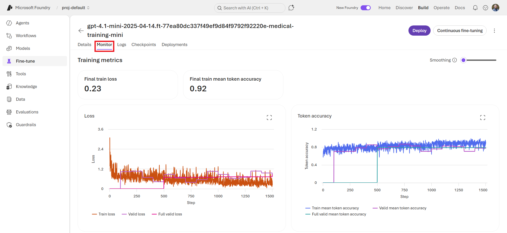{#fig-B05C}

Once the fine-tuning job is complete, the status will change to *Completed*. You can click on the job to view the final training metrics and details about the fine-tuned model, as shown in @fig-4048. You can also deploy this fine-tuned model to an endpoint by clicking on the **Deploy** button.

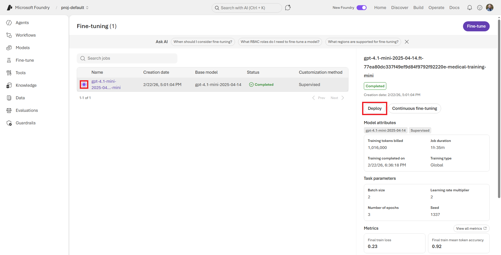{#fig-4048}


On the **Customize <model-name> Deployment** panel that opens on the right, give your deployment a more friendly name (i.e., `gpt-4.1-mini-medical-mini`), leaving the other settings at their default values, and then click the **Deploy** button at the bottom. See @fig-D045. 


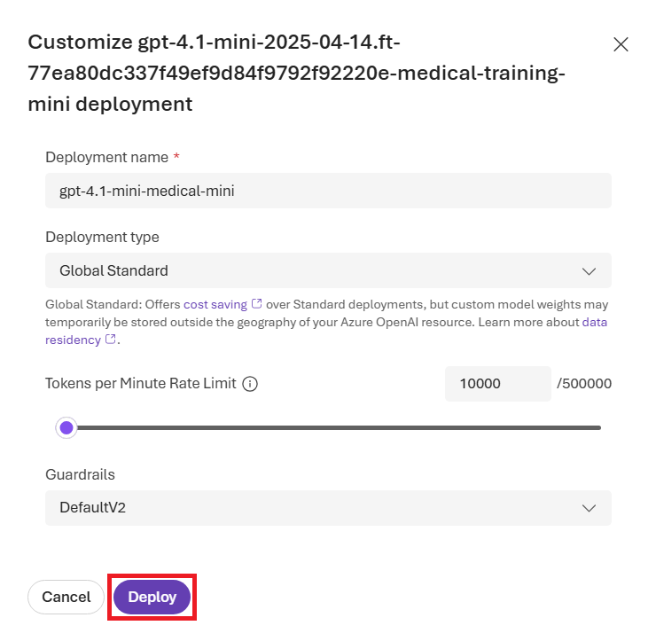{#fig-D045}


This will deploy your fine-tuned model to an endpoint that you can use in your applications after a few minutes. Once the deployment is complete, you can begin playing with your fine-tuned model on the **Playground** tab.

You'll need to provide some basic instructions that will help control how the model responds to user questions relating to medical conditions, as shown in @fig-124F. You can add the following system text to the **Instructions** field to help guide the model to respond in a helpful and accurate way:

::: {.callout-tip}
## Instructions
You are an AI medical assistant that provides helpful and accurate information about common medical conditions. You have been fine-tuned on a dataset of medical questions and answers to improve your performance in this domain. Based on the user's question, provide a clear and concise answer that is relevant to the medical topic being asked about. If the question is outside of your knowledge or expertise, respond with "I'm sorry, I don't have information on that topic."

Always recommend consulting with a qualified healthcare professional for personalized medical advice, diagnosis, or treatment. Your responses are for informational purposes only and should not be considered a substitute for professional medical advice.
:::


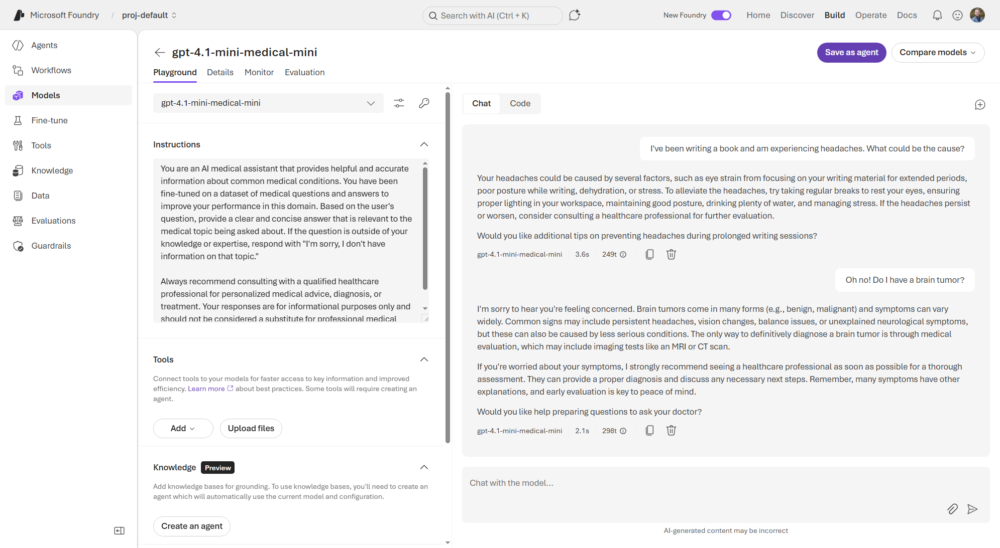{#fig-124F}


Play around with asking the model different medical questions to see how it responds. For example, here are some example prompts you can try:

::: {.callout-tip}
## Example Prompts

- "What are the common symptoms of diabetes?"
- "How can I lower my blood pressure?"
- "What is atrial fibrillation?"
- "Can I get pregnant by an alien from Mars?"

:::

For me, my fine-tuned model performs well and correctly tells users to consult medical professionals for personalized advice. It seems to provide succinct, but helpful and accurate information about common medical conditions when asked relevant questions. However, if I ask a question that is outside of the knowledge in the training dataset, such as "Can you tell me the genetic mutations that cause Gomorgazan's disease of the heart?" (which isn't real), the model correctly responds with "I'm sorry, I don't have information on that topic." This shows that the model has learned to provide accurate information within its domain of expertise while also recognizing when a question is outside of its knowledge and responding according to its instructions.


### Fine Tuning with the CLI

You may have noticed that we uploaded the `*_mini.jsonl` versions of the training and validation datasets. This is because the UI has a 30 second timeout window for uploading your dataset in the browser. Alternatively, you can use the Foundry CLI to run fine-tuning jobs with larger datasets. The CLI does not have the same timeout constraints as the UI, so you can upload and use larger datasets this way.

To run fine-tuning from the CLI, you must first define your fine-tuning job configuration in a YAML file. This can be more convenient for managing and versioning your training configurations, especially in, say, a git repository.

If you're interested in tuning the medical assistant model with the larger dataset, you can use the following YAML configuration file, which is located in the `data/ch05` folder as `medical_finetuning_supervised.yaml`:

```yaml
name: supervised-ft-cli-medical
description: Template for supervised medical fine-tuning using via CLI
model: gpt-4.1-mini
method:
  type: supervised
  supervised:
    hyperparameters:
      epochs: 4
      batch_size: 8
      learning_rate_multiplier: 0.1
      prompt_loss_weight: 0.01
seed: 1337
suffix: "medical-trained-full"
training_file: local:medical_training_set.jsonl
validation_file: local:medical_validation_set.jsonl
```


::: {.callout-note}
If you're not familiar with the hyperparameters listed under the `supervised` section of the YAML configuration, here is a brief explanation of what they mean:

- *epochs* - The number of times the training algorithm will work through the entire training dataset. More epochs can lead to better learning but also increase the risk of overfitting.
- *batch_size* - The number of training examples processed together in each iteration of the training algorithm before updating the weights of the model. Larger batch sizes can speed up training but require more memory, while smaller batch sizes can lead to more stable training but take longer.
- *learning_rate_multiplier* - A factor that scales the learning rate used during training. A smaller learning rate can lead to more stable training and better convergence, while a larger learning rate can speed up training but may cause the model to overshoot optimal weights or have unstable training.
- *prompt_loss_weight* - A weight assigned to the loss from the prompt tokens during training (i.e., the penalty for errors between the prompt and the generated response). A low loss weight means the model will focus more on getting the response correct (i.e., focus on the output), while a higher loss weight means the model will also try to optimize for generating responses that are closely aligned with the prompt (i.e., focus on the prompt). This can be useful for certain tasks where the prompt structure is important.

:::


Using the Foundry CLI (which is an extension of the Azure Developer CLI, `azd`), you can submit a fine-tuning job with this configuration file. Assuming you have the Azure Developer CLI installed and configured, run `azd ext install azure.ai.finetune` to add the fine-tuning extension.

Then, by running the following commands in your terminal, you can submit the fine-tuning job to Foundry: (Make sure to replace `<subscription-id>` and `<project-endpoint>` with your actual subscription ID and project endpoint.)

```bash
## Submit fine-tuning job
cd data/ch05
azd ai finetuning jobs submit \
   -f medical_finetuning_supervised.yaml \
   -s <subscription-id> \
   -e <project-endpoint>

## List fine-tuning jobs
azd ai finetuning jobs list

## Show job details
azd ai finetuning jobs show -i <job-id>
```

This will submit the fine-tuning job to Foundry, as shown in @fig-71F5. You'll be prompted to install the CLI extension if it's not already installed and give the local project a name. This can be whatever you like, but I named mine `medical-assistant-full`.

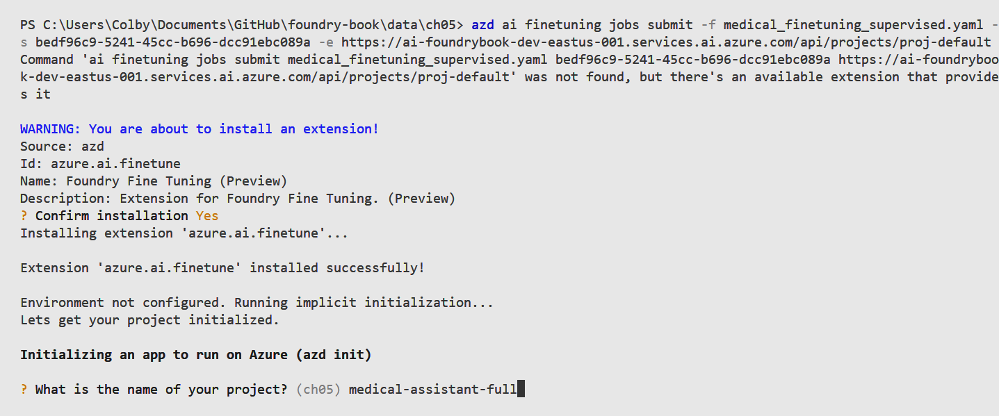{#fig-71F5}


First, the CLI will upload the two `.jsonl` files, and shown in @fig-70B6, and then kick off the fine-tuning job.

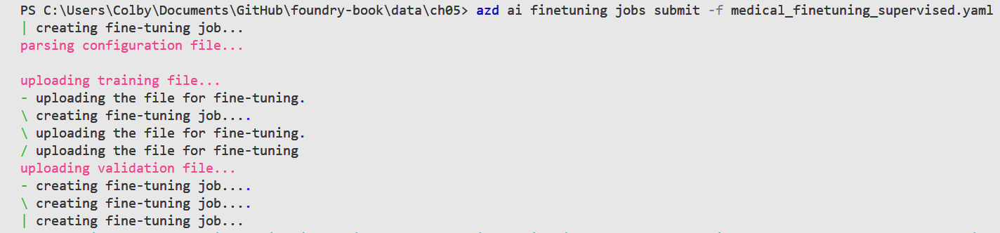{#fig-70B6}


You can monitor its status and view details using the `list` and `show` CLI commands. See @fig-7077.

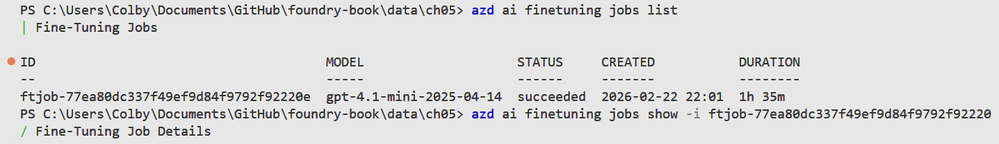{#fig-7077}

As you can see, the Foundry CLI provides a convenient way to manage your fine-tuning jobs, especially when working with larger datasets or when you prefer working in a terminal environment. This also works well within development workflows where you want to version control your training configurations and datasets in a git repository. For example, using GitHub Actions, you could set up a CI/CD pipeline that automatically runs fine-tuning jobs whenever you push changes to your training dataset or configuration files in your repository.


## Generating Synthetic Training Data Generation

Sometimes you may not have enough real training data to effectively fine-tune a model for your specific use case. In these cases, Foundry allows for you to generate synthetic training data using the base model itself. This involves prompting the base model to create examples that you can then use as training data for fine-tuning.

There are two synthetic data generators available in Foundry that can help you create training data:

- **Simple Q&A:** This generator turns domain documents into fine-tuning question–answer pairs. It accepts PDFs, Markdown files, or plain text documents (<20MB) containing the subject knowledge from which you want the model to learn.
- **Tool use:** Simulate multi-turn conversations with tool calls over and API. This requires a valid 3.0.x or 3.1.x OpenAPI Specification (Swagger) file in JSON (<20MB) that describes the APIs you want the model to learn to call as tools.


### Exercise: Generate Synthetic Data for Cardiology Questions

For example, let's say our previous medical training dataset lacks in a particular specialty area, such as deep knowledge about cardiology. We can use the base model to generate synthetic examples of questions and answers about cardiology to augment our training dataset. This can help the model learn to better respond to cardiology-related queries even if we don't have a lot of real examples in our original dataset. So, let's see what examples the model can generate about cardiology topics based on some documents we have.

To start, navigate to the **Data** section of the **Build** page in the Foundry portal. At the top of the screen, click the **Synthetic data generation** tab. You can then click the **Generate data** button to create a new synthetic data generation job, as shown in @fig-2C04.

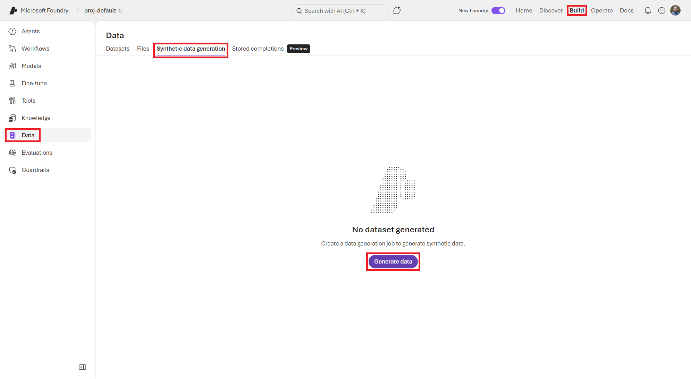{#fig-2C04}

On the **Create data** screen, you will fill in the details to create a synthetic data job for cardiology questions. This includes selecting the base generator model, choosing the synthetic data task at hand, and uploading your source document, as shown in @fig-DC10.

- **Task type:** `Simple Q&A`
- **Question type:** `Short answer`
- **Reference file:** Pick one of the files as described below (or locate your own cardio-related data such as from an academic journal or other source).
- **Maximum number of samples:** `100`
- **Generator model:** `gpt-4.1` (or another model of your choice)
- **Output file name:** `CardiacLearning_SimpleQnA-FineTuneSupervised`

In the `data/ch05/synthetic-data` folder, I have included some sample cardiology-related files that you can use for this exercise:

1. "Cardiac Learning Guide Series" (`Cardiac-Learning-Guide.pdf`) - An 84-page PDF document that provides comprehensive guidelines on cardiac care from Abbott Laboratories.
2. "Cardiovascular Pathophysiology for Pre-Clinical Students" (`Cardiovascular_Pathophysiology_for_Pre-Clinical_Students.pdf`) - A 79-page PDF textbook from Virginia Tech Carilion School of Medicine that contains foundational knowledge of common cardiovascular diseases, disorders, and pathologies.
3. Health Topics from the American Heart Assocation - (`AHA_Health_Topics.md`) - A Markdown document that contains health information on heart attacks, atrial fibrillation, and cholesterol from the American Heart Association.

Pick one of the files to upload to the synthetic data generator and configure the settings to generate question–answer pairs. For example, you can set the number of examples to generate to 100 and adjust the temperature setting to control the creativity of the generated examples. Once you're done, click the **Submit** button to start the synthetic data generation process.

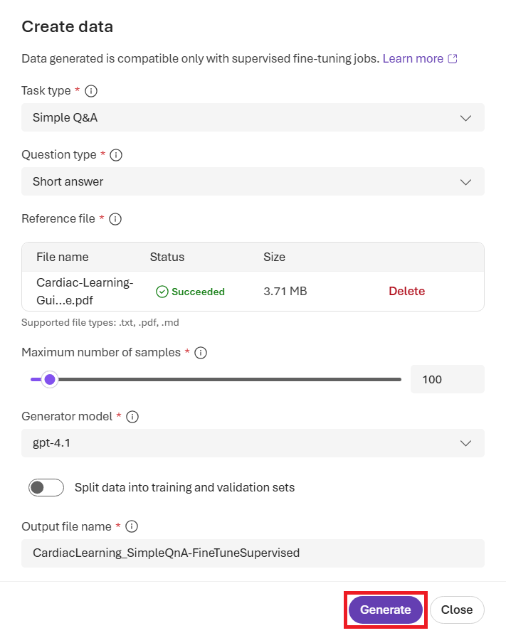{#fig-DC10 height=6in}


Depending on which file you upload and the settings you choose, the synthetic data generation process can take anywhere from a few minutes to an hour or more. You can monitor the status as shown in @fig-2555.

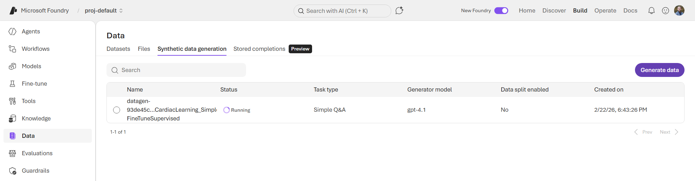{#fig-2555}


Once the job is complete, you can view the generated synthetic dataset in the **Data** section by clicking the bullet selector of the succeeded job. This will open a side panel on the right that provides details about the generated dataset, including a count of the token usage, and the ability to preview some generated examples, as shown in @fig-4C1D. You can click the download icon beside the **Training file** name to download the `.jsonl` dataset.

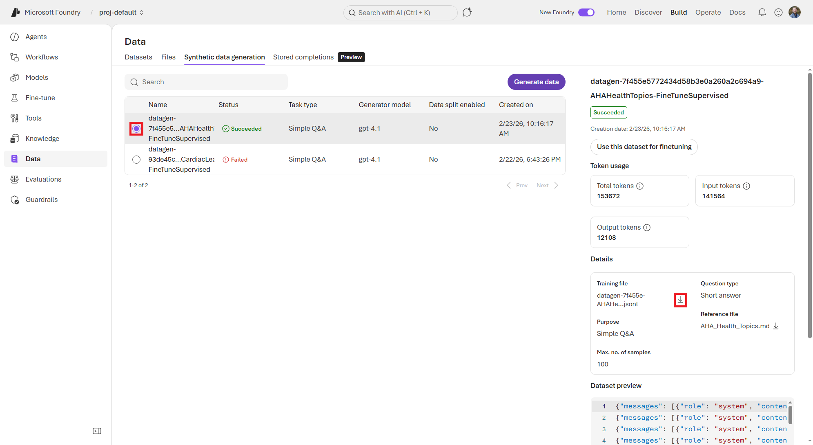{#fig-4C1D}


::: {.callout-warning}
Your synthetic data generation job may fail if you hit your throughput limit with whatever deployed model you picked. If this happens, you can either wait for your throughput to reset, deploy a new instance of different base model, or simply use a smaller reference file.
:::


```{.json .code-overflow-wrap}
{"messages": [{"role": "system", "content": "You are a helpful assistant. You will be presented with a question, please provide a clear and accurate answer."}, {"role": "user", "content": "What is the primary cause of a heart attack?"}, {"role": "assistant", "content": "The primary cause of a heart attack is the reduction or blockage of blood flow to the heart muscle, usually due to a blockage in the coronary arteries that supply the heart with oxygen-rich blood."}]}
{"messages": [{"role": "system", "content": "You are a helpful assistant. You will be presented with a question, please provide a clear and accurate answer."}, {"role": "user", "content": "How does plaque buildup in the coronary arteries contribute to heart attacks?"}, {"role": "assistant", "content": "Plaque buildup in the coronary arteries narrows these vessels, restricting blood flow to the heart muscle. When plaque breaks, a blood clot can form around it, potentially blocking the artery completely and cutting off oxygen supply, which can trigger a heart attack."}]}
{"messages": [{"role": "system", "content": "You are a helpful assistant. You will be presented with a question, please provide a clear and accurate answer."}, {"role": "user", "content": "What is atherosclerosis?"}, {"role": "assistant", "content": "Atherosclerosis is a slow process where plaque\u2014composed of fat, cholesterol, and other substances\u2014builds up in the inner walls of arteries. This buildup narrows the arteries and makes them less flexible, increasing the risk of blood clots that can cause heart attacks or strokes."}]}

```

::: {.callout-tip}
## Bonus Exercise

If you'd like to test your fine-tuning skills, try to use this generated synthetic dataset as additional training data to fine-tune your medical assistant model.

This can help the model learn to better respond to cardiology-related questions even if your original training dataset had limited examples in that area. You can simply click the *Use this dataset for finetuning* button, which will take you to the fine-tuning page with the new training dataset pre-filled with the synthetic dataset you just generated (shown in @fig-7C3B). You can then select your previous fine-tuned medical assistant model and submit a new fine-tuning job to further customize your model with this synthetic data.

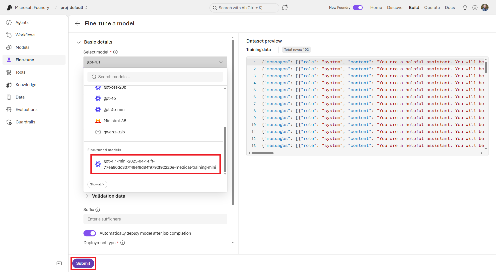{#fig-7C3B}
:::

Now you've successfully generated synthetic training data using the base model to augment your training dataset! As you can see, this is a powerful technique for improving model performance when you have limited real training data available. By leveraging the knowledge and capabilities of the base model, you can create additional examples that help teach the model to perform better on your specific tasks or domains when you can't get your hands on clean data otherwise.



## Summary
In this chapter, we explored how to customize models in Microsoft Foundry through fine-tuning with custom training datasets. We learned about the different fine-tuning techniques available, how to build effective training datasets, and how to use the Foundry UI and CLI to run fine-tuning jobs. We also discussed how to generate synthetic training data using the base model to augment our training datasets when we have limited real data available. With these tools and techniques, you can tailor models to better fit your specific use cases and domains, improving their performance and relevance for your applications.