# Orchestrating Agents with Workflows {#sec-workflows}

In the previous chapters, you learned how to deploy models, configure agents with tools, and fine-tune those agents for specialized tasks. A single, well-tuned agent can carry a conversation, call an API, and synthesize results, but it hits a ceiling quickly when a task requires distinct phases of work, conditional logic, or human sign-off. That is where Workflows come in.

Workflows are Microsoft Foundry's visual orchestration layer. They let you string together multiple agents, data transformations, branching logic, and human checkpoints into a repeatable, auditable process. This is provided as a low-code builder that makes multi-agent workflows approachable. Think of a workflow as a
directed graph: nodes are actions (invoke an agent, set a variable, ask a question), and edges encode order and conditions.

This chapter covers the core orchestration patterns Foundry ships as templates, walks through building a multiagent workflow from scratch, and then
digs into Power Fx, the formula language you will use any time you need more than a straight-line flow.

::: {.callout-note}
Workflows are currently a UI-based, no-code/low-code feature. If you want to manage workflow definitions as code, say, to version them in Git or deploy them through a CI pipeline, see Foundry's VS Code extensions, which surface the same YAML that backs the visual builder. The YAML view and the visual view stay in sync; changes to one appear immediately in the other.

Later on, Workflows may also be exposed as part of the Foundry SDKs. The orchestration logic and patterns should remain the same regardless of the interface you use to author them.
:::

## When to Opt for a Workflow

Not every multi-step task needs a workflow. If you can express the logic inside a single agent's system prompt and tool calls, keep it there, the overhead of a visual orchestration layer is rarely justified for a two-step chain.

Workflows earn their keep when you need at least one of the following:

* *Multiple agents with distinct roles.* - A triage agent that classifies an incoming request, a retrieval agent that fetches relevant documents, and a summarization agent that drafts the response each have a clear boundary of responsibility. Stitching them in a single prompt muddies those boundaries and makes debugging harder.

* *Branching logic that belongs outside the model.* - If your flow depends on structured conditions, "if the customer tier is Enterprise, route to the premium support agent; otherwise, route to the self-serve agent", encode that logic in the workflow, not in a prompt. Prompts are not reliable for controlling flow.

* *Human checkpoints.* - Approval gates, clarifying questions, and escalations all require pausing execution and waiting for a person to respond. Workflows have a dedicated node type for this pattern; there is no clean way to implement it inside a single agent loop.

* *Auditable, reusable pipelines.* - Versioning is built into the workflow engine. Every save creates a new, immutable version. That makes it straightforward to roll back, compare runs across versions, and meet compliance requirements that ask "what logic produced this output?"

## The Three Orchestration Patterns

Foundry provides three template patterns, shown in @fig-965B. While you can start from a blank canvas, these templates cover the common real-world cases.

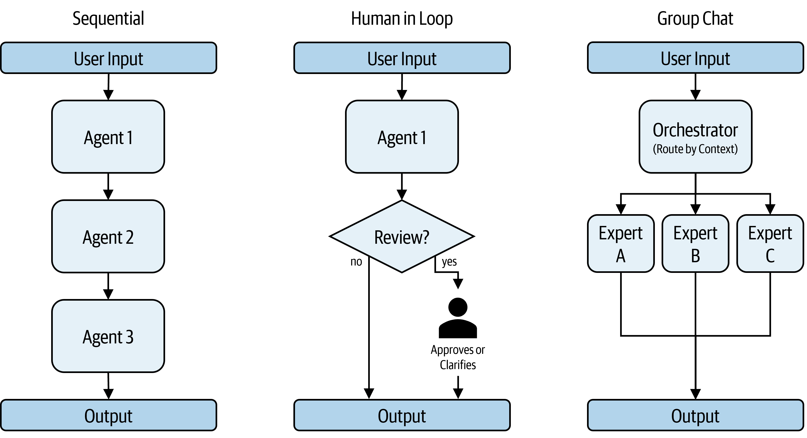{#fig-965B}

### Sequential

The simplest and most common pattern. Each agent receives the output of the previous one and passes its result downstream. The order is fixed at design time.

Sequential workflows are a good choice for *pipeline-style tasks*: ingest → enrich → validate → format → deliver. They are predictable, easy to test step-by-step, and easy to explain to stakeholders.

Use this pattern when the stages of a task are well-defined and the output of one stage is always the input to the next. If the routing between stages depends on content or context, look at the group chat pattern instead.

### Group Chat

The group chat pattern introduces an *orchestrator agent* that routes control to specialist agents dynamically, based on the conversation context or on explicit rules. After a specialist responds, control returns to the orchestrator, which decides the next step.

This is the right pattern for *escalation and handoff scenarios*: a general intake agent that decides whether a request needs a legal reviewer, a compliance checker, or a technical expert. It is also useful when you cannot enumerate all routing paths at design time, the orchestrator's prompt or tools handle the decision at runtime.

The trade-off is observability. A sequential workflow is trivially traceable; the group chat pattern requires you to instrument the orchestrator carefully to understand why the flow went the path it took.

### Human in the Loop

This pattern inserts a pause node at any point in the workflow, Foundry halts execution and waits for a human response before proceeding. The human's input is then available as a variable to downstream nodes.

Common applications include:

- *Approval gates*: a workflow that drafts a contract and then pauses for a authorized reviewer before sending it.
- *Ambiguity resolution*: an intake agent that surfaces a clarifying question to the user when confidence is low.
- *Exception handling*: a monitoring workflow that flags an anomaly and pages an on-call engineer.

Human-in-the-loop steps can be composed freely with the other patterns. A sequential workflow might include one human approval gate; a group chat workflow might escalate to a human as one of its routing paths.

### Other Patterns

Other patterns exist beyond these three, but there aren't templates for them in the Workflow builder (yet). Some other examples include:

* *Concurrent*: Multiple agents to work on the same task in parallel. Each agent processes the input independently, and their results are collected and aggregated before the output is formed. This pattern is useful for "brainstorming" or "voting" scenarios, where you want diverse perspectives on the same input.
* *Handoff*: Agents to transfer control to one another based on the context or user request. This pattern works well in customer support, expert systems, or scenarios requiring dynamic delegation.
* *Group Chat*: Multiple agents collaborate in a shared conversation that is coordinated by an orchestrator agent. The orchestrator routes messages between specialists and may iterate the responses before providing a final response. This pattern is ideal for complex decision-making, multi-domain tasks, or when the flow cannot be predetermined.
* *Magentic*: A manager agent dynamically coordinates specialized agents. The manager assigns tasks, sets goals, and integrates results. This pattern is suitable for complex projects that require high-level planning and adaptability.

## Expressing Logic with Power Fx

Power Fx is the expression language that runs inside workflow nodes. If you have used Excel formulas or Power Automate, the syntax will feel familiar. Power Fx lets you construct conditions, transform strings, parse JSON, and route the flow, all without writing Python or JavaScript.

### Variable Scoping

Every expression that references a variable needs a scope prefix:

- `Local.` for variables defined within this workflow (for example, user responses saved by an Ask-a-question node, or JSON output saved by an agent node).
- `System.` for runtime context provided by the platform (for example,
  `System.LastMessage.Text`, `System.User.Language`, or
  `System.Conversation.Id`).

Forgetting the prefix is the single most common Power Fx mistake. If you see a "Name isn't valid" error, the prefix is almost certainly missing.

### Useful Formulas by Type

The table below maps data types to the Power Fx functions you will reach for most often. This is not exhaustive. The full reference is available in Microsoft's Power Fx documentation, but these will covers most of your workflow expression needs.

| Type | Formulas you will use |
|------|----------------------|
| String | `Upper()`, `Lower()`, `Concat()`, `Len()`, `Text()`, `Find()`, `Substitute()` |
| Boolean | `If()`, `And()`, `Or()`, `Not()`, `Switch()` |
| Number | `Value()`, `Int()`, `Round()` |
| Record / Table | `ParseJSON()`, `JSON()`, `Filter()`, `ForAll()`, `First()`, `LookUp()` |
| Date / Time | `Now()`, `DateAdd()`, `DateDiff()`, `Text()` |
| Blank / Error | `IsBlank()`, `Coalesce()`, `IfError()` |

: Common Power Fx functions by data type. {#tbl-powerfx}

Now that we've covered some of the core design patterns and logical functions, let's build a workflow from scratch to see how the pieces fit together in practice.

## Exercise: Building a Mathematics Coding Workflow

The best way to internalize how workflows are assembled is to build one. This exercise walks through a concrete example: a multi-agent workflow that processes a mathematical problem, breaks it down into steps, and generates Python code to solve it. 

To start, navigate to *Agents* tab of the *Build* section of the Foundry portal. Beside the *Agents* tab at the top, click the *Workflows* tab, as shown in @fig-693E.

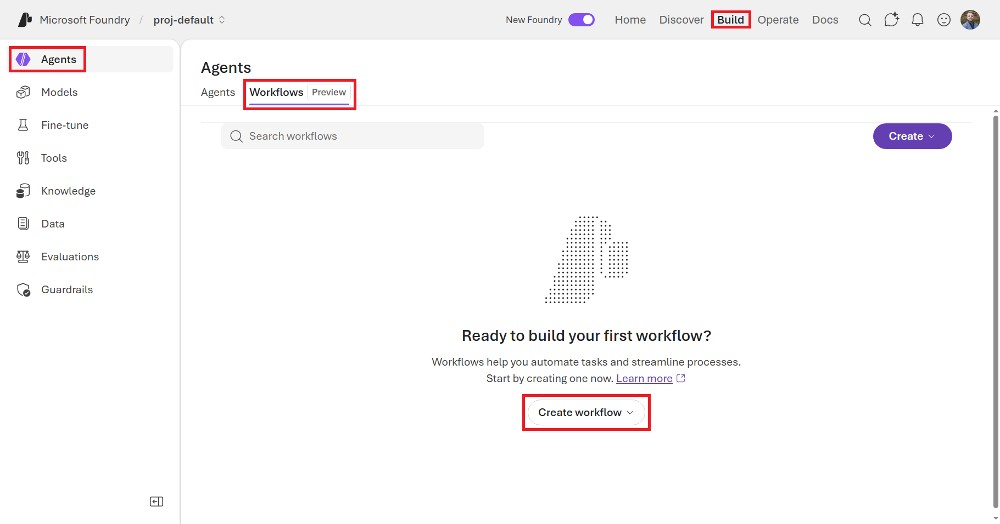{#fig-693E}

Click the *Create workflow* dropdown button and select *Human in loop*. See @fig-992A. This template gives you a head start with the right node types arranged in a common pattern, which we will be modifying to fit our specific use case.

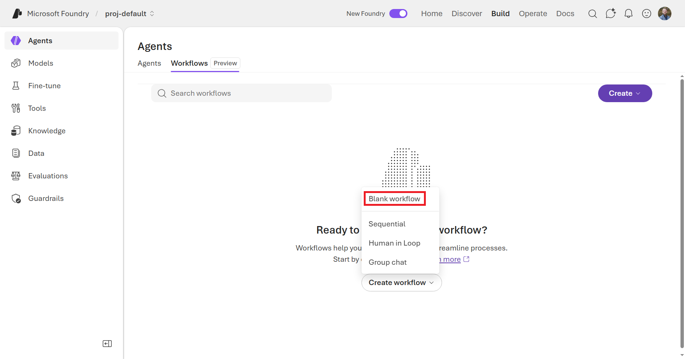{#fig-992A}

Foundry will open the visual builder with a template containing placeholder nodes arranged in a branching chain. See @fig-F349.

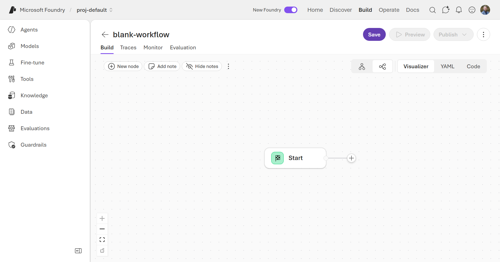{#fig-F349}

::: {.callout-warning}
Foundry does not save workflows automatically. Get into the habit of clicking the *Save* button at the top of the screen after every meaningful change. The versioning system creates a new immutable snapshot on each save, so saving frequently gives you fine-grained rollback points.

The first time you click the *Save* button, Foundry prompts you to name the workflow. I named mine `Math-Coder-Workflow-001`. Click the *Save* button on the popup window to confirm, as shown in @fig-C624. You should then see a "v1 saved Today..." message appear beside the greyed out Save button.

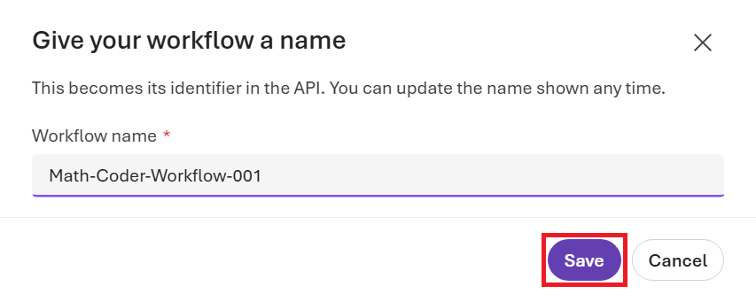{#fig-C624}
:::

Spend a moment familiarizing yourself with the interface and the pre-defined nodes in the chain. Note that there's a *+ New node* button on the top left of the canvas where you can find all the different nodes you can add to the workflow. See @fig-B84E.

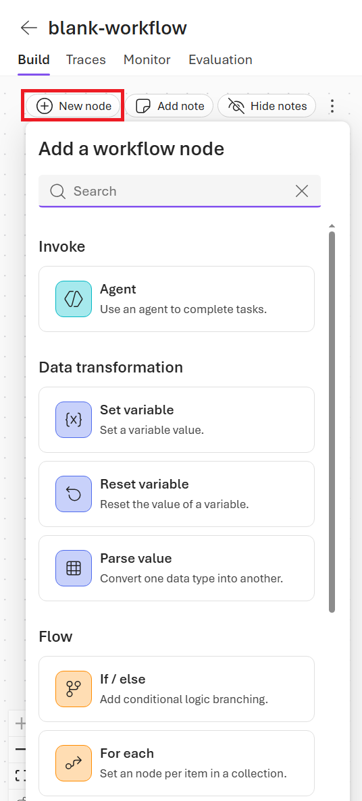{#fig-B84E}

Nodes are the building blocks of any workflow. Each node represents a single action. The common node types you may use most are:

- *Start*: the entry point of the workflow. Every workflow has exactly one Start node.
- *Ask a question*: prompts the user for input and stores the response as a named variable.
- *Deliver a message*: Sends a message to the user without a reply.
- *Set variable*: stores or transforms a value using a Power Fx expression.
- *Agent*: invokes a Foundry agent and passes it an input.
- *If/else*: branches the flow based on a Power Fx condition.
- *For each*: iterates over a list.
- *End*: the exit point of the workflow. Every workflow has at least one End node, but you can have multiple to represent different exit paths.

Now, let's start adding some agents and logic to the workflow to make it functional. (Note: We're going to build half of the workflow using the GUI, and then we'll switch to YAML for the second half to show how both interfaces work.)

The first step is to click the *+* icon after the Start node and select the *Ask as question* node type, shown in @fig-2C1A. This node will capture the user's input problem statement. 

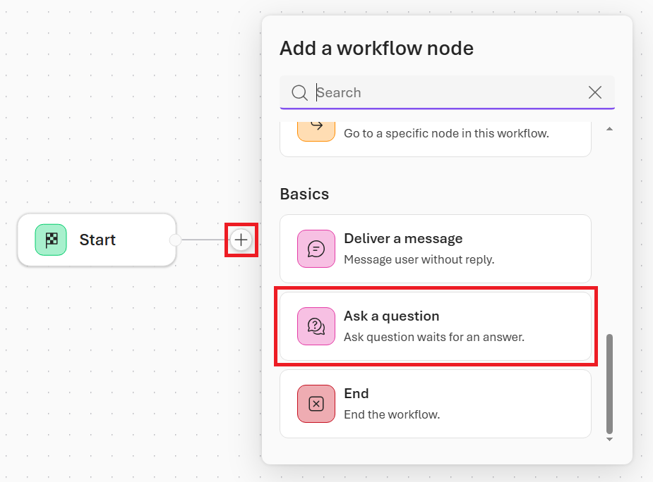{#fig-2C1A}

A node configuration panel will open on the right. Set the following values:

* *Question*: `Please enter your math problem:`
* *Expected input type*: String
* *Save user response as*: Create a new variable called `Local.MathProblem`
* *Node ID*: `question_math_input`

Click the *Done* button to save the node configuration. You should now see the new "Ask a question" node on the canvas, connected to the "Start" node, as shown in @fig-BC17. This node will ask the user to input a math problem when the workflow runs, and it will save their response in a variable called `Local.MathProblem` for downstream nodes to use.

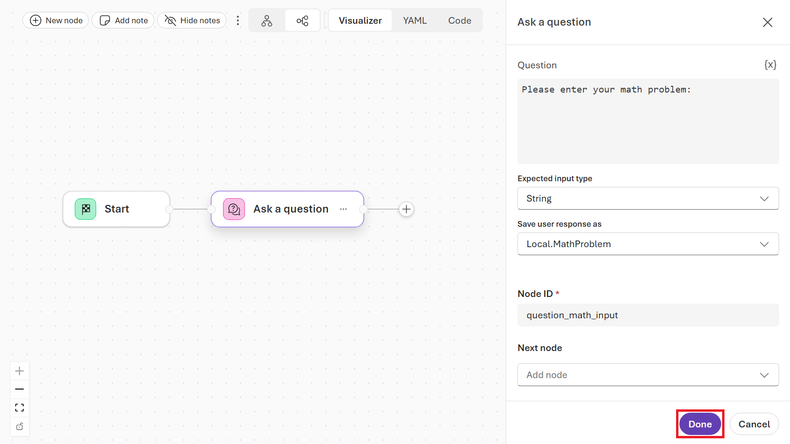{#fig-BC17}

Now we're going to add two variable-setting nodes. One will hold the current problem message (starting with the value from `Local.MathProblem`, but changing as the workflow progresses) and one will hold the turn count (to stop the agent from reiterating indefinitely later on).

Create a new *Set variable* node by clicking the *+* icon after the last "Ask a question" node. Set the following values:

* *Set variable*: Create a new variable called `Local.LatestMessage`
* *To value*: `UserMessage(Local.MathProblem)`
* *Node ID*: `set_variable_input_task`

Click the *Done* button to save the node configuration, as shown in @fig-8C31.

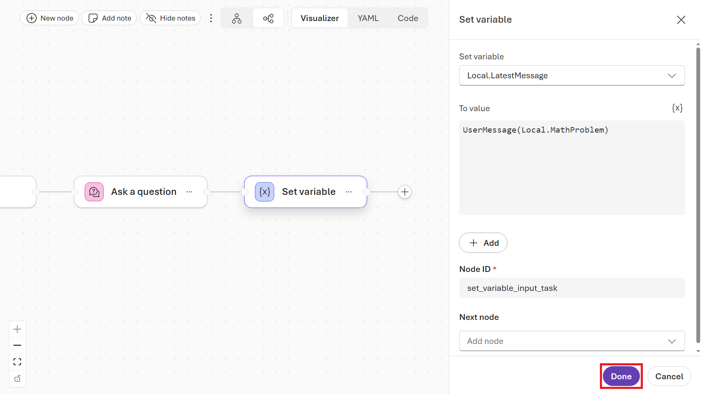{#fig-8C31}

Repeat this process to create another *Set variable* node that initializes `Local.TurnCount` to 0. This will be used to track how many times the agent has attempted to solve the problem, which is important for preventing infinite loops later on.

* *Set variable*: Create a new variable called `Local.TurnCount`
* *To value*: `0`
* *Node ID*: `set_variable_turn_count`

Click the *Done* button to save the node configuration, as shown in @fig-1C3C.

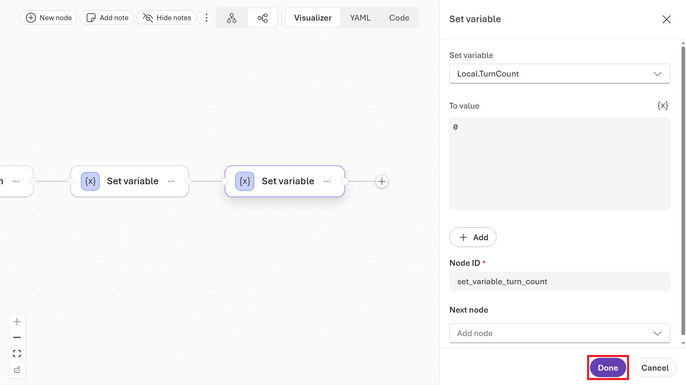{#fig-1C3C}

Now we'll add our first agent node. This agent's job will be to evaluate the user's math problem and break it down into smaller steps. Click the *+* icon after the last "Set variable" node and select the *Agent* node type.

We can either attach an existing agent to this node or create a new one. As shown in @fig-EC28, create an agent called `math-evaluator-agent`and enter the following system prompt under the *Instructions* section:

::: {.callout-tip}
## Prompt

You are an expert mathematician and problem analyst. Your sole responsibility is to receive a mathematical problem from the user and produce a clear, structured solution plan for a Python programmer to implement. You do NOT write code. If you are able to produce a complete and unambiguous solution plan, end with [COMPLETE] to signal the coder agent to begin implementation.
:::

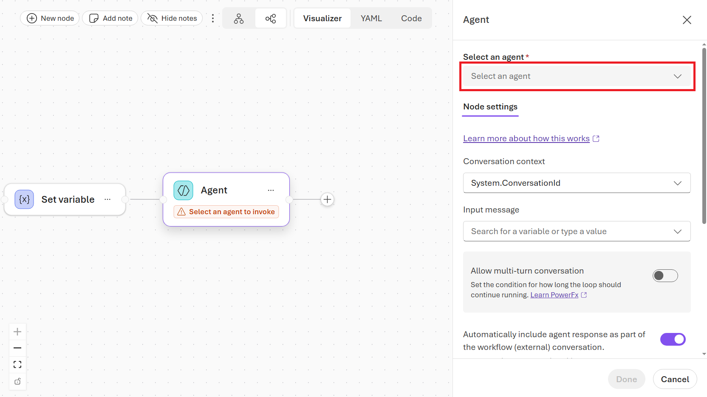{#fig-EC28}

A more complete and verbose version of this prompt is available in the `data/ch06/math_evaluator_agent_prompt.md` file. The expanded prompt better defines how the agent should respond, such as recommending a strategy and Python libraries to use. You can copy and paste it into the system prompt of your new agent. Also, my new agent defaulted to use the `gpt-4o` model. Feel free to experiment with different models to see how it impacts the quality of the solution plan.

Next, on the *Node settings* tab of the configuration panel, set the following values:

* *Save agent output message to variable*: `Local.LatestMessage`
* *Node ID*: `math_evaluator_agent`

As shown in @fig-7C25, click the *Done* button once your instructions and settings are configured.

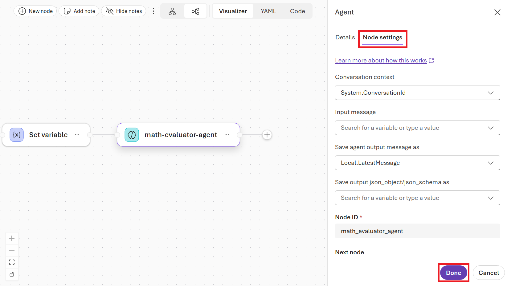{#fig-7C25}

Now we need to handle if the agent is unable to solve the problem. You may have noticed in the prompt that the agent should return `[COMPLETE]` as part of its response if it was able to produce a complete solution plan. We will add a conditional branch that checks if the agent's response contains the `[COMPLETE]` flag. If it does not, it will tell the user that it was unable to solve the problem.

Click on the *+* icon after the "math-evaluator-agent" node and select the *If/else condition* node type. In the configuration panel, set the following value:

* *Node ID*: `check_evaluator_exit`

Under the *If* section, add the following condition:

* *Condition 1*: `=!IsBlank(Find("[COMPLETE]", Upper(Last(Local.LatestMessage).Text)))`
* *Node ID*: `evaluator_flagged_complete`

If you don't see an *If* condition block, click the *+ Add a path* button to add one. This is also where you would add additional *Else if* blocks if you wanted to check for other conditions.

Note that the *Else* node isn't configurable; it is a catch-all for when the *If* conditions (or any *Else if* conditions) aren't met. Click the *Done* button to save the configuration, as shown in @fig-8C64.

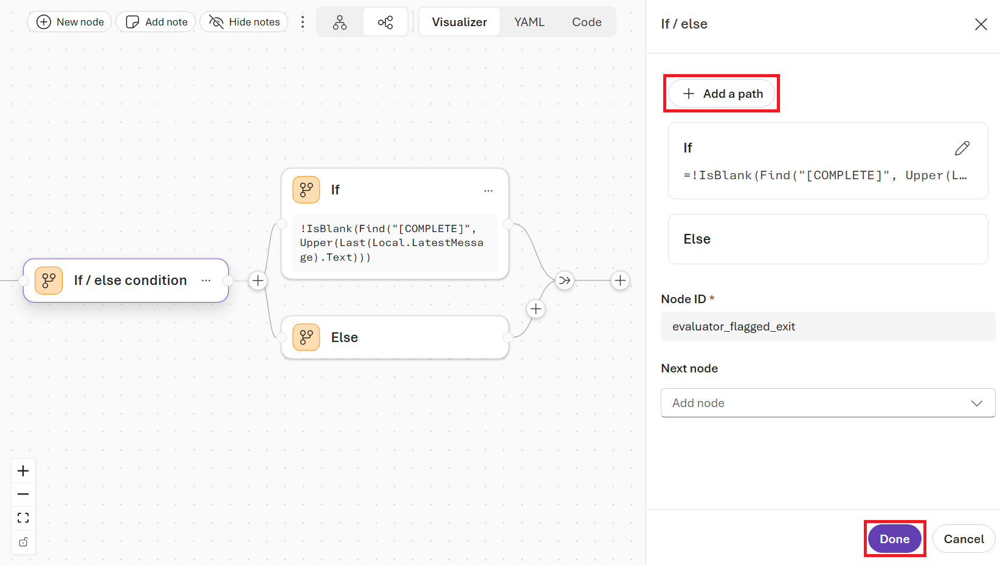{#fig-8C64}

Lastly, we will change the message given to the user depending on whether the evaluator flagged the response as complete.

Click on the *+* icon after the "If" node and select the *Deliver a message* node type. (This shows up as "Send message" on the node itself).
This node will compile a message back to the user in the chat interface without expecting a response. Set the following values:

* *Message*: `The Math Evaluator was unable to proceed: {Last(Local.LatestMessage).Text}`
* *Node ID*: `send_evaluator_exit`

As shown in @fig-1C69, click the *Done* button to save the configuration.

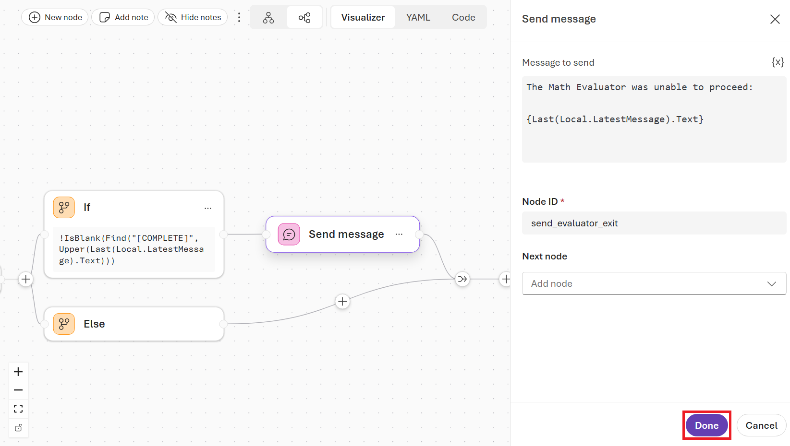{#fig-1C69}

Similarly, click on the *+* icon after the "Else" node and add another *Deliver a message* node. This will be the message sent to the user when the evaluator does flag the response as complete. Set the following values:

* *Message*: `Math Evaluator complete. Handing solution plan to the Python Coder agent...`
* *Node ID*: `send_evaluator_done`

As shown in @fig-8952, click the *Done* button to save the configuration.

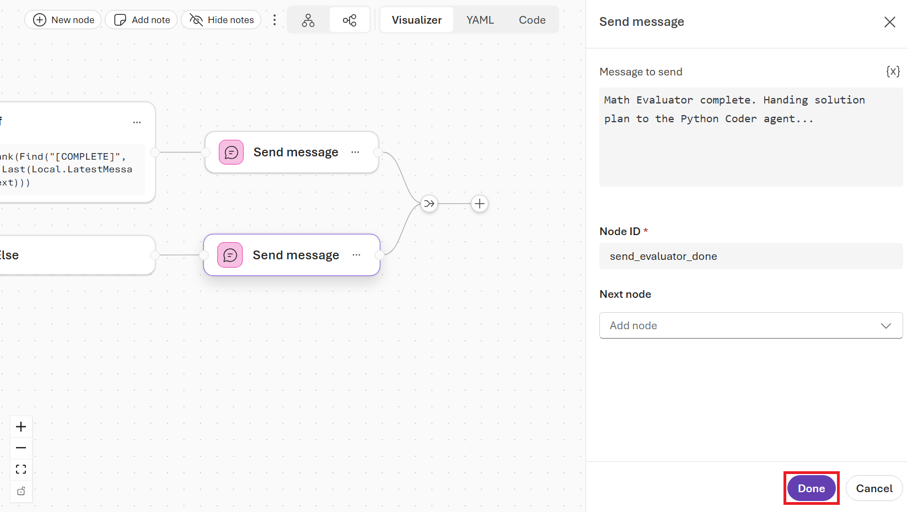{#fig-8952}

Are you tired of making all these nodes by hand yet? Let's zoom out and see what we've built so far, as shown in @fig-30B4. We have a workflow that takes in a math problem, sends it to an agent to evaluate, and then conditionally sends a message back to the user based on whether the agent was able to solve the problem or not.

{#fig-30B4}

We still need another agent to take the solution plan from the evaluator and generate Python code, plus some additional logic to handle multiple turns of evaluation and coding if the problem is complex. Then, we'll need a few nodes to handle the messages back to the user (on success, failure, or waiting on another iteration) and an *End* node.

Let me show you how to do the rest of the workflow using YAML.

### Using YAML for Workflow Authoring

In lieu of using the visual editor, we can also configure Workflows using YAML, which is a text-based way to define workflows that can be faster for complex logic and easier to manage in version control. Plus, coding tools can easily generate YAML, so if you prefer to design your workflow in a language model and then paste it in, YAML is the way to go.

Click on the *YAML* tab at the top right of the canvas, as shown in @fig-E94B. This will switch you from the visual editor to the YAML editor, where you can see the underlying YAML definition of your workflow.

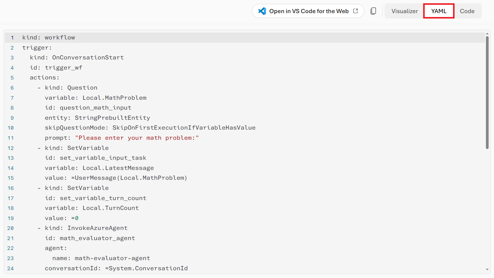{#fig-E94B}

Grab the provided YAML file from `data/ch06/math_coder_workflow.yaml` and paste it into the editor, replacing all of the existing YAML. This file contains the full definition of the workflow we are building, including the second half that we didn't yet build in the visual editor.

Switch back to the *Visualizer* tab to see the full workflow on the canvas. You should see that the YAML you pasted in has rendered as a visual workflow, as shown in @fig-7946. You'll now see a "python-coder-agent" node that will take the solution plan from the evaluator and generates Python code (to be configured next). This is connected to additional nodes that handle multiple turns of evaluation and coding, nodes to handle messages back to the user, and *End* nodes.

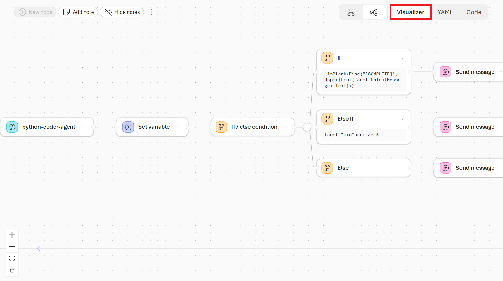{#fig-7946}

We still need to configure the behavior of the new "python-coder-agent" node as agent instructions aren't defined in the YAML. Click on that node to open the configuration panel.

Create a new agent called `python-coder-agent` and enter the following system prompt under the *Instructions* section:

::: {.callout-tip}
## Prompt

You are an expert Python programmer specializing in scientific and mathematical computing. You will receive a conversation thread containing a math problem and its solution plan. Your job is to implement that plan as clean, executable Python code and return the computed result. If you are able to produce a complete and correct implementation, end with [COMPLETE] to signal the workflow to finish and return the result to the user.
:::

As before, I have a more complete and verbose version of this prompt available in the `data/ch06/python_agent_prompt.md` file. You can copy and paste it into the system prompt of your new agent. See @fig-7946.

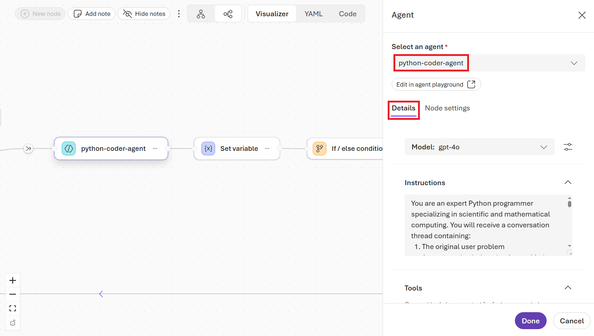{#fig-4960}

Then, on the *Node settings* tab of the configuration panel, set the following values:

* *Save agent output message to variable*: `Local.LatestMessage`
* *Node ID*: `python_coder_agent`

Review the logic in the remaining nodes to understand how the workflow handles multiple turns and messages back to the user. The workflow is designed to loop back to the evaluator agent up to 5 times if the coder agent fails to produce a complete solution, giving the evaluator a chance to revise the solution plan based on the coder's output. 

Note the "Send message" node that handles the desired case where the agents are able to evaluate a problem, generate code, and compute a result successfully, shown in @fig-A1. Then, this node connects to the *End*, which signals the workflow is complete and returns the final message back to the user. 

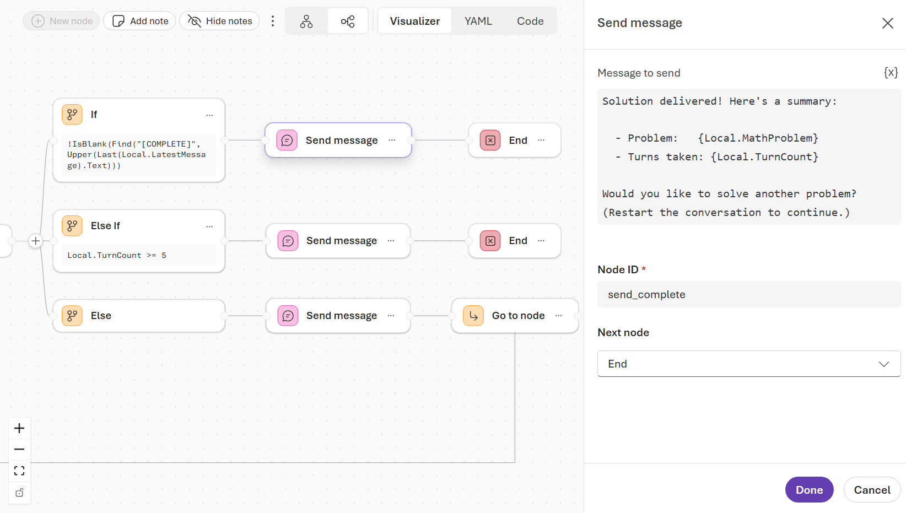{#fig-A1}

Once you're done reviewing the workflow, make sure to click the *Save* button to save all of your changes!

### Playing with your Math Solver Workflow

Click the *Preview* button to open the Preview chat panel on the right. This lets you run the workflow step-by-step and see the output of each node in real time, which is essential for debugging and verifying that your workflow behaves as expected before deploying it to production.

In the chat panel, ask your math solver workflow some questions to see how it performs. Perhaps start with a simple question, like `What is 2+2?`. Then, you cna increase the difficulty of the problems you ask to see how well the agents can break down and solve more complex problems. For example, you could ask some of the provided problems below, or come up with your own.

::: {.callout-tip}
## Example Simple Inputs

### A weird factorial

What is the square root of 5.25!?

### Derivative of a trigonometric function

What is the derivative of sin(x^2)?
:::

::: {.callout-tip}
## Example Advanced Inputs

### Integral with bounds

Solve the integral of e^(x^2) dx from 0 to 1.

### A difficult differential equations

Solve the second-order non-homogeneous ordinary differential equation:

    y'' - 3y' + 2y = e^(2x)

with initial conditions y(0) = 1 and y'(0) = 0.

Then evaluate the definite integral of the solution y(x) over the interval [0, 3], and find any local minima or maxima in that interval.
:::

You'll notice that as you enter inputs into the chat, each node highlights as it executes. As shown in @fig-8A6D, the green checkmarks indicate success. If there were any red X's, you could click on the node to inspect the error logs and debug the issue.

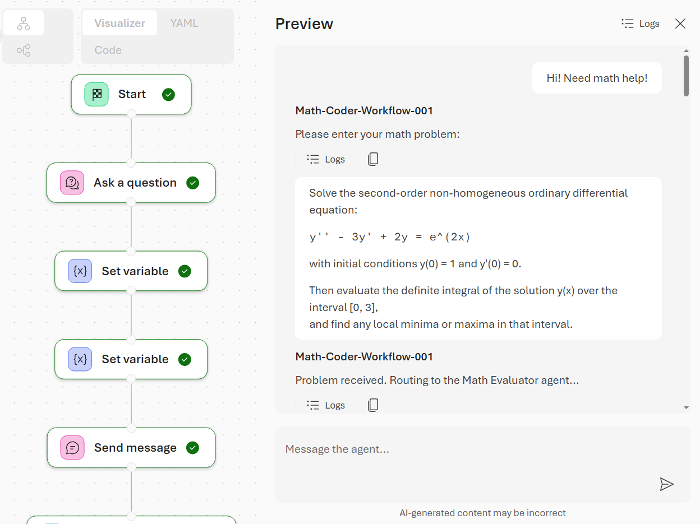{#fig-8A6D}

Check the middle part of the workflow where it is evaluating the math problem and generating a solution plan. You should see the agent's solution strategy in the defined format from our input instructions. See @fig-CE62.

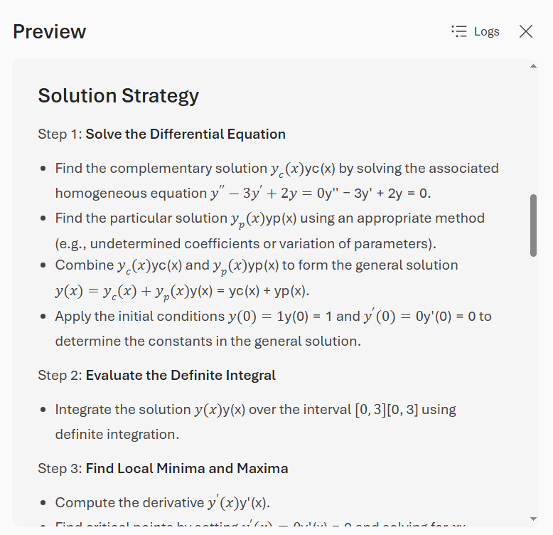{#fig-CE62}

Then, if you gave it a problem it was able to solve, you should see the Python code generated by the coder agent, along with the computed result. See @fig-3266.

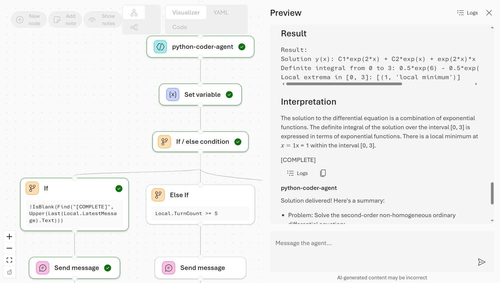{#fig-3266}

Spend some time experimenting with different math problems to see how well the workflow performs. Try to find edge cases that might cause it to fail, and then inspect the logs to understand why. This is a great way to get comfortable with how workflows execute and how to debug (or stress test) them.

### Troubleshooting Common Problems

The logs are your friend when debugging workflows. Each node has its own execution log that captures the inputs, outputs, and any errors that occurred during that node's execution. If a workflow run doesn't behave as expected, start by inspecting the logs of the relevant nodes to identify where things went wrong. For example, as shown in @fig-BBDE, you can see the inputs and outputs of each node and what each invoked, which can help you understand if it is failing to parse the problem correctly or if it's generating a solution plan that doesn't meet the criteria defined in the prompt.

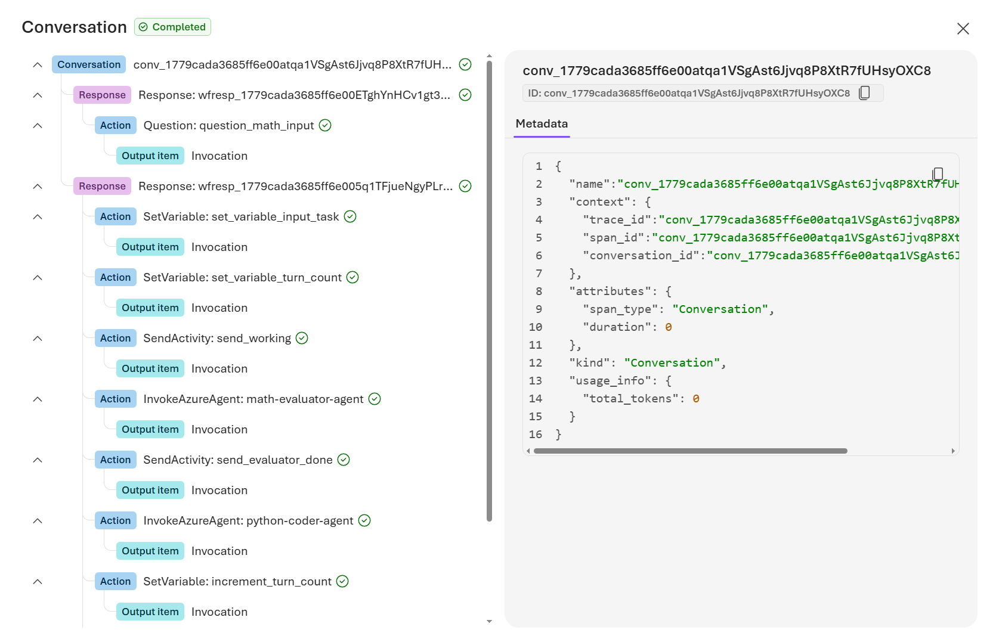{#fig-BBDE}

Other common issues you might encounter include:

* *The Workflows menu is not visible, or you cannot create a workflow.* - You need at minimum the Contributor role on the Foundry project. Check your Azure RBAC assignment. Reader-level access lets you view workflows but not create or edit them.

* *A 400 error or a node produces unexpected output.* - Inspect the run log for that node. The most common causes are: the agent node has no agent assigned, the YAML is syntactically invalid, or some variable is inadvertently empty because an earlier node failed silently.

* *Power Fx formula errors* - When defining formulae, click on the variables from the dropdown menu rather than typing them. Be sure to add the `Local.` or `System.` scope prefix. Foundry does not infer scope automatically. Also, check your data types to make sure they match between steps.

* *The workflow times out.* - Break large, deeply nested workflows into smaller sub-workflows connected by agent calls. Check that any external HTTP calls made by agent tools have reasonable timeouts. A tool that waits indefinitely on a slow API will stall the entire workflow run.

## Summary

Workflows are the orchestration tier that sits above individual agents. They let you coordinate multiple agents in a predictable order (sequential), route dynamically between specialists (group chat), or pause for human input at any point in the process (human in the loop). Power Fx provides the formula language
to express branching logic, transform variables, and route the flow without dropping into code.

The most important design discipline with workflows is to resist the temptation to push control-flow logic into agent prompts. Prompts are for language; the
workflow canvas is for logic. Keep them separate and your workflows will be easier to test, debug, and audit.

In the next chapter, we will will dive deeper into how to manage and monitor your deployed agents and workflows, including best practices for versioning, governing, and rolling out updates with confidence.
