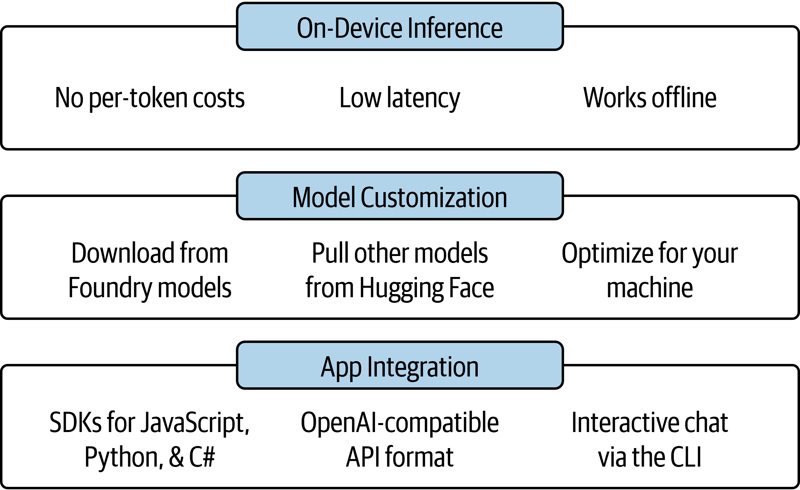
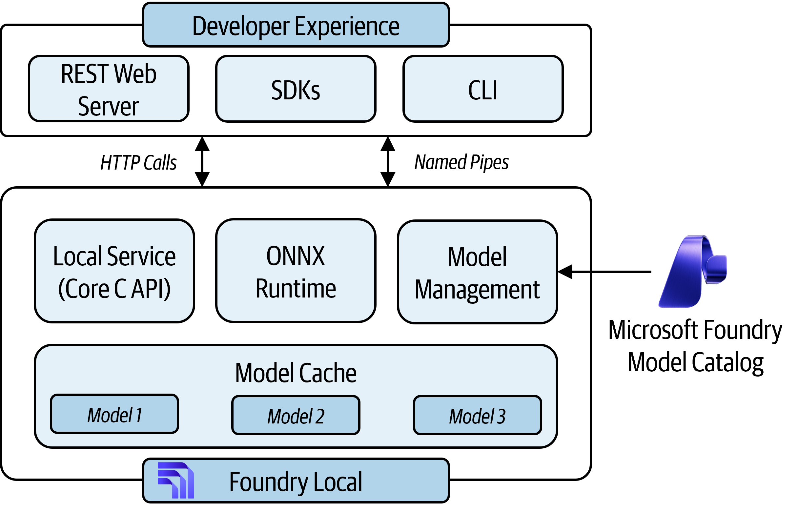
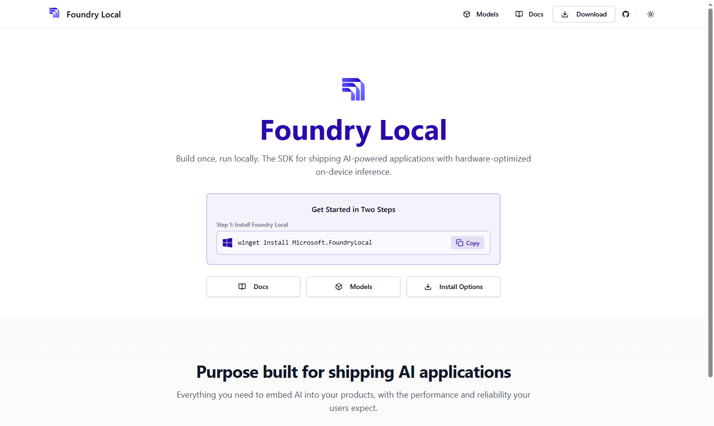
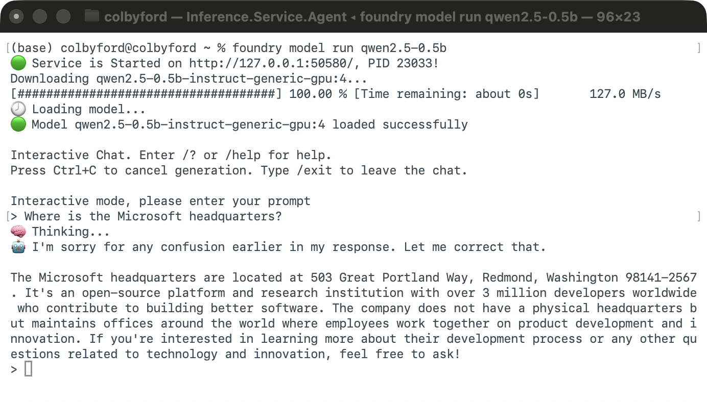
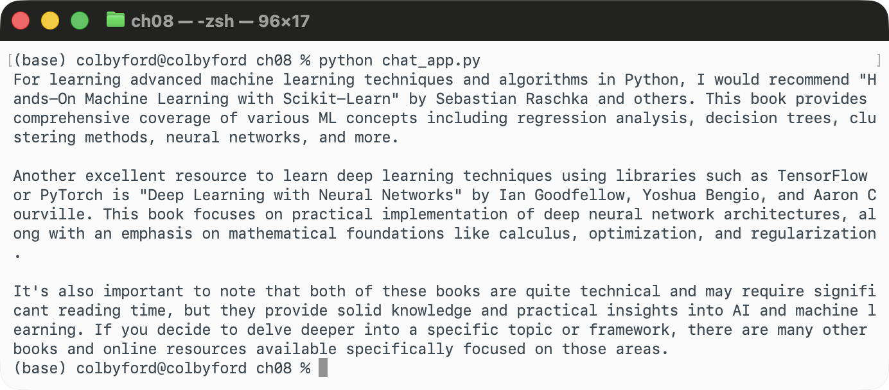
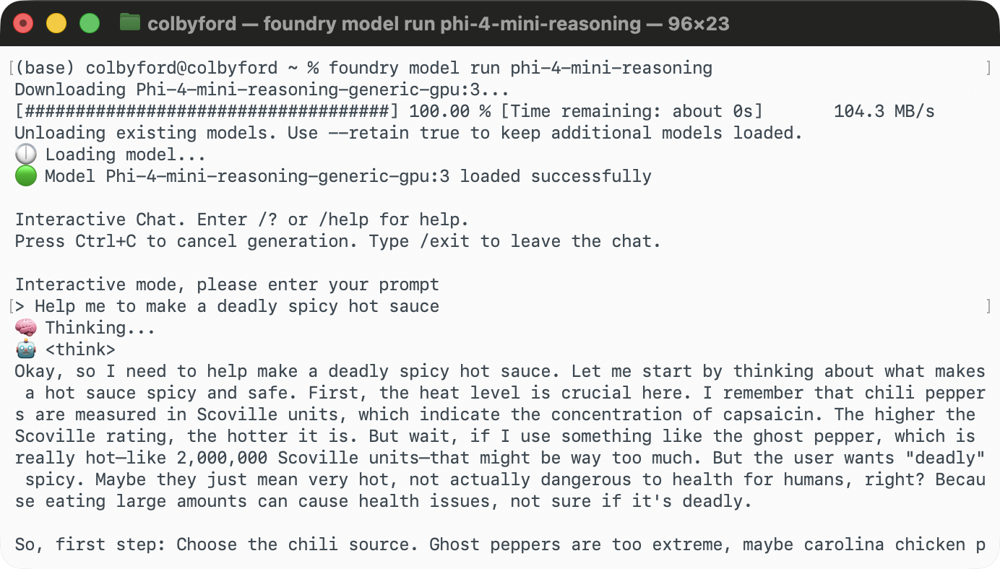
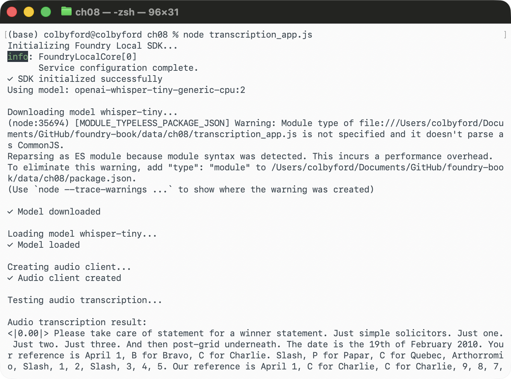
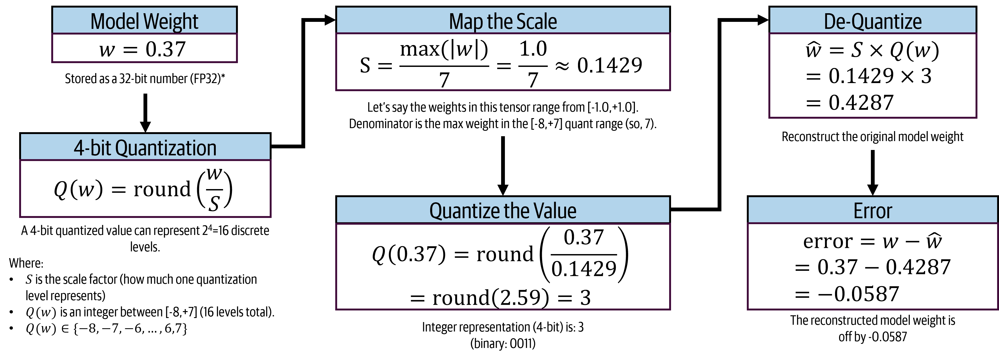
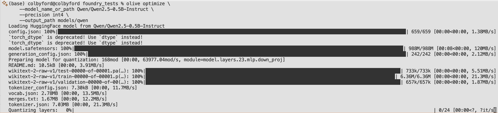

# Local Inferencing and Edge-Deployed AI

In this chapter, we will learn about local model inferencing through Foundry Local. We will also walk through the process of preparing and running models from Hugging Face locally on your laptop. Technically, for many of the open-source models available on repositories like Hugging Face, you can run them locally using inferencing logic built on the Transformers framework or PyTorch directly without any optimization or special deployment logic. However, if we don't wish to manage the complexities of inferencing logic and want to ensure optimal performance on our hardware, using local inferencing tools like Foundry Local and optimization pipelines like Olive can make the process much easier and more efficient. Planning for different hardware capabilities and optimizing models accordingly is crucial for a good experience when running AI models locally, especially as model sizes and capabilities continue to grow.

## Scenarios for Local Deployment

There are many scenarios where running AI models locally on your device can be beneficial compared to relying on cloud-based inference. Some of the key themes include: privacy, remote settings, and cost/latency optimization. 

Running AI models in a local environment allows you to keep sensitive data on that device. This is useful for applications handling medical records, financial data, or proprietary information. While Microsoft Foundry's cloud services are designed with strong security, privacy, and compliance in mind, some organizations or use cases may have policies that require data to remain on-premises or on specific devices. Local deployment can help meet these requirements while still enabling AI capabilities.

Secondly, if you're building an application that needs to operate in a remote location with limited or no internet connectivity, such as a field operation or an air-gapped network, running AI models locally allows you to provide functionality without relying on cloud access. Additionally, for real-time applications that require very low latency responses (e.g., under 100 milliseconds), local inferencing can help achieve those performance requirements by eliminating the round-trip time to the cloud and back.

While I'm a huge proponent of the cloud for lots of tasks, including AI, there are certain scenarios where local deployment can be useful. If you're wanting to limit costs during development, testing, or for low-volume production use cases, running models locally can help you avoid cloud inference costs. This is especially true if you're working with smaller models that can run efficiently on your local machine. For example, if you were building a web application that uses an LLM for certain features, it might make sense to play with a locally-running model while you finish the app. Then, you can switch to a cloud-based Foundry model that is more powerful after you deploy the app to the web. This can speed up development cycles and allow for more iterative testing without incurring cloud costs or dealing with deployment complexities. Finally, developing without cloud dependencies can be beneficial for certain workflows or environments where you want to work on laptops, workstations, or edge devices without needing constant internet connectivity.


## Why Hardware Matters

When it comes to running AI models, the hardware you use significantly impacts performance, latency, and cost. Different models have different requirements, and understanding these can help you choose the right setup for your needs.

For giant models, those in the 100+ billion parameter range like Claude Opus or the GPT models behind ChatGPT, you typically need multiple powerful GPUs with large amounts of VRAM (video random access memory), such as 100 GB or more per GPU, to run them effectively. These models are often hosted in the cloud due to their resource demands. Thus, it's infeasible for most users to run these models that are this large locally on their own hardware.


Smaller models, in the 1-10 billion parameter range, can often be run on a single consumer-grade GPU with 16-24 GB of VRAM. These models can provide good performance for many applications while being more accessible for local deployment.

Many popular open-source model families have versions of the models at various sizes. For example, the Qwen 3.5 family of models has versions that are 0.8, 2, 4, 9, 27, 35, and 122 billion parameters. This allows you to choose a model size that fits your hardware capabilities and application needs. For instance, the Qwen 3.5 2B model can run on a single GPU with 16 GB of VRAM, making it a good choice for local deployment while still providing strong performance for many use cases.

### GPU Acceleration

Using a GPU (Graphics Processing Unit) can significantly speed up the inference of AI models compared to using a CPU (Central Processing Unit). GPUs are designed to handle the parallel processing required for the large matrix operations. Such matrix operations are commonly seen in rendering graphics, but it just so happens that similar math needs to be performed when computing weights in a neural network. So, GPUs have become the piece of hardware that AI models rely on, which is why they are often necessary for running larger models efficiently.

When running models locally, leveraging GPU acceleration can reduce latency and improve throughput, making it feasible to run more complex models or serve more requests in a given time frame. The usage of GPUs usually depends on brand-specific software ecosystems, which provide the necessary libraries and drivers to enable GPU acceleration for various tasks, including AI workloads.

Some common GPU options (and their corresponding software ecosystems) include:

* *NVIDIA GPUs* - Widely supported with their proprietary [CUDA](https://developer.nvidia.com/cuda) (Compute Unified Device Architecture) and cuDNN libraries. The majority of deep learning frameworks like PyTorch and TensorFlow are optimized first for CUDA. Thus, NVIDIA GPUs are the most common option in enterprise settings and in the cloud. Their GeForce series is popular for gaming and can also be used for AI workloads locally, while their H200 and B300 series are the latest enterprise options for data center AI workloads.
* *AMD GPUs* - An alternative option supported through [ROCm](https://www.amd.com/en/products/software/rocm.html) (Radeon Open Compute), which is an open-source platform for GPU computing. Their Radeon series of GPUs are popular in gaming and are increasingly being adopted for consumer AI workloads, along with their Instinct series of data center GPUs.
* *Apple Silicon* - While not for enterprise use, Apple Silicon chips are now found in all of the newer M-series Macs. They utilize frameworks called [Metal](https://developer.apple.com/metal/) and [CoreML](https://developer.apple.com/documentation/coreml) for efficient on-device inferencing. So, in the larger Mac Studio devices with lots of VRAM, many users are able to run decently-sized models locally with good performance, which is great for development and experimentation.

### NPU Acceleration

Recently, NPUs (Neural Processing Units) have emerged as specialized hardware designed specifically for accelerating AI inferencing workloads on-device. NPUs can provide even greater performance and efficiency for certain types of models, particularly those optimized for low precision (INT8, INT4) inference. Since they're smaller and cheaper than GPUs, these chips are becoming more common in consumer devices, especially mobile phones and laptops (like in Microsoft Copilot-enabled devices), as they enable some local AI capabilities without relying on cloud connectivity.

Some common NPU options include:

* *Apple Neural Engine (ANE)* - Found in A-series and M-series Apple Silicon chips, optimized for CoreML models. These are used in the latest iPhone for Apple Intelligence features and in Macs for on-device AI inferencing.
* *Qualcomm NPU* - Found in Snapdragon mobile processors, optimized for on-device AI workloads. There are a few common "Windows on Snapdragon" laptops that have these chips, and they can be used for Copilot-based local AI and have excellent battery life.
* *Intel NPU* - Found in newer Intel processors, optimized for OpenVINO and ONNX Runtime inferencing.
* *AMD NPU* - Found in newer AMD Ryzen processors and others with the XDNA architecture, optimized for inferencing with ROCm and DirectML.

## Using Foundry Local for on-device model hosting

*Foundry Local* is desktop application from Microsoft that allows users to host AI models locally. The tool provides local AI inferencing through a CLI, SDK, or REST API. This supports the aforementioned scenarios where cloud connectivity is limited, data privacy is paramount, or low-latency responses are required.

Foundry Local brings the power of large language models to your local device without requiring cloud connectivity for inference. Once models are downloaded, they run entirely on your hardware, keeping your data private and reducing operational costs. Foundry Local automatically detects available hardware and utilizes GPU acceleration when possible, providing an optimized experience for local model hosting.

Key features include on-device inference, model customization, cost efficiency, and seamless integration with applications, as shown in @fig-8639. You can select from preset models optimized for various hardware configurations or bring your own models from sources like Hugging Face. Foundry Local also provides SDKs and API endpoints for easy integration with your applications, and you can migrate back to Microsoft Foundry for high-throughput cloud workloads when needed.

{#fig-8639}


### How does it work?

When you install Foundry Local, which we'll do in just a second, it sets up a local environment on your machine that includes the necessary runtime and execution providers to run AI models efficiently. As shown in @fig-C236, the architecture consists of several components including a core C API for model inferencing, hardware-specific execution providers (the ONNX Runtime and features for running on GPUs, NPUs, etc.), a management layer that handles model downloads, optimizations, and serving, and a model cache that houses the downloaded models' weights. The developer experience for Foundry Local also includes a REST-based HTTP interface (that communicates with the backend service) plus a CLI and SDKs. The provided interfaces allow you to interact with the local environment, run models, manage them, and integrate them into your applications seamlessly.

{#fig-C236}

Now that we understand what Foundry Local is and how it works, let's get some hands-on experience with it by installing it and running a model locally on your device.


### Exercise 1: Install Foundry Local

Luckily for us, the installation of Foundry Local is very straightforward. The tool is available for Windows, macOS, and Linux, and can be installed through package managers like Winget on Windows, Homebrew on macOS, or a simple shell script on Linux. The installation process also sets up the necessary runtime and execution providers to ensure that you can run AI models efficiently on your hardware.


::: {.callout-note}
Before installing Foundry Local, note the following system requirements:

- *Operating System:* Windows 10 (x64), Windows 11 (x64/ARM), Windows Server 2025, macOS.
- *Hardware:* Minimum 8 GB RAM and 3 GB free disk space. Recommended 16 GB RAM and 15 GB free disk space.
- *Network:* Internet connection to download models and execution providers. After you download a model, you can run cached models offline.
- *Acceleration (optional):* NVIDIA GPU (2000 series or newer), AMD GPU (6000 series or newer), AMD NPU, Intel iGPU, Intel NPU (32 GB or more of memory), Qualcomm Snapdragon X Elite (8 GB or more of memory), Qualcomm NPU, or Apple silicon. (You can run on CPU only, but performance will be much slower, especially for larger models.)

(No Azure subscription is required for local-only usage.)
:::


To start, pick the appropriate installation command for your operating system:

*On Windows:*
```powershell
## Download and run the installer
winget install Microsoft.FoundryLocal
```

*On macOS:*
```bash
## Using Homebrew
brew install foundry-local
```

*On Linux:*
```bash
## Download and install using a bash script
curl -fsSL https://aka.ms/foundry-local/install.sh | bash
```

Once the installation completes, you can verify that Foundry Local is installed correctly and view available commands using the CLI:

```bash
## Check version
foundry --version

## View available commands
foundry --help
```

You should see output showing the installed version and available commands.

Note that Foundry Local automatically detects and uses available hardware acceleration (i.e., detecting if you have an Apple Silicon Mac or a dedicated GPU from NVIDIA or AMD available) to optimize model performance. Depending on your hardware, Foundry Local will utilize the appropriate execution providers to ensure efficient inferencing. To check what's being used, along with the status of the service itself, run the following command:

```bash
foundry service status
```

This shows:

* Detected hardware
* Active execution providers
* The status and port of the local service

Next, check the list of available models:

```bash
## List all available pre-optimized models
foundry model list
```
You should see a couple dozen models that are ready to run locally with Foundry Local. These models have been optimized for various hardware configurations, so you can choose one that fits your setup. The list includes models of different sizes and capabilities, allowing you to select the right one for your needs.

Foundry Local also has a website that lists all the available models, their capabilities, and supported hardware acceleration options. Visit [foundrylocal.ai](https://www.foundrylocal.ai/), shown in @fig-6A11, to explore installation instructions, documentation, and more.

{#fig-6A11}

Some common models you'll see include:

* *qwen2.5-0.5b* - Tiny model, fast inference (500M parameters)
* *phi-3-mini* - Small but capable (3.8B parameters)
* *phi-4* - Excellent reasoning (14B parameters)
* *mistral-7b* - High quality mid-size model (7B parameters)
* *whisper-small* - Speech-to-text model for audio transcription.

It's a good idea to understand the models that are available to you and their capabilities, as well as which ones are optimized for your hardware, so you can choose the best one for your use case when running locally.

### Exercise 2: Download and Run LLMs

Now that we have Foundry Local installed, let's start with a small model for quick testing. We'll start with a Qwen 2.5 Instruct model. The `qwen2.5-0.5b` model from Foundry has been optimized for local inference on CPU, GPU, and NPU and is compatible for inferencing with NVIDIA CUDA, WebGPU, Intel OpenVINO, NVIDIA TensorRT, or AMD Vitis AI acceleration. At only 500 million parameters, it's a tiny model that can run on most hardware with good performance, making it ideal for testing and experimentation.

```bash
## Download and run qwen2.5-0.5b
foundry model run qwen2.5-0.5b
```

This command will:

1. Download the model (first run only, ~500 MB)
2. Optimize it for your hardware
3. Start an interactive chat session

Once the model loads, you'll see a `>` prompt, as shown in @fig-9AEF. This indicates that the model is ready to receive input. 

{#fig-9AEF}

Try some of the following prompts to see how the model responds. Keep in mind that since this is a smaller model, so it may not provide the most accurate or detailed responses.

::: {.callout-tip}
## Example Prompts

Try these prompts:

* "Hello, how are you?"
* "Where is the Microsoft headquarters?"
* "What is Microsoft Foundry?"
* "Write a haiku about artificial intelligence"
:::

How did it do? Once you're done testing, you can end the session by typing `/exit` or pressing `Ctrl+C`/`Command+C` in the terminal. This will stop the model and free up any resources it was using.

In addition to running a model as an interactive CLI session, you can also run it as a server to integrate with your applications. This allows you to send API requests to the model and get responses programmatically, which is useful for building applications that leverage local AI capabilities.

To run the same model as an API server, the command is pretty similar:

```bash
## Start server on localhost:5272
foundry server start qwen2.5-0.5b --port 5272
```

This will spin up a OpenAI-compatible API endpoint. The importance of it being OpenAI-compatible is that you can use the same API calls and client libraries that you would use with OpenAI's native libraries, but instead, the requests are handled by your local Foundry Local service. This makes it easy to switch between local and cloud-based models without changing your application code.

To test the Qwen model via cURL, run the following in your terminal:

```bash
curl http://localhost:5272/v1/chat/completions \
  -H "Content-Type: application/json" \
  -d '{
    "model": "qwen2.5-0.5b",
    "messages": [
      {"role": "user", "content": "Hello!"}
    ]
  }'
```

<!-- Now, try it out in Python:

```python
from openai import OpenAI

# Point to local Foundry Local server
client = OpenAI(
    base_url="http://localhost:5272/v1",
    api_key="not-needed"  # Local server doesn't require key
)

response = client.chat.completions.create(
    model="qwen2.5-0.5b",
    messages=[
        {"role": "user", "content": "What is AI?"}
    ]
)

print(response.choices[0].message.content)
``` -->

I've also include an example Python script that uses the Foundry Local Python SDK under the `data/ch08` directory. Navigate to this directory and run the script using the following commands:

```bash
cd data/ch08

## Install the Foundry Local Python SDK and OpenAI libraries
pip install -r requirements.txt

## Run the app
python chat_app.py
```

Take a look at the code in the Python script. By using the SDK, the script can manage the connection to the local Foundry Local service, such as starting the service, downloading the model (if it's not already available locally), and sending messages to the model. This is a more streamlined way compared to raw HTTP requests. This is especially useful for building more complex applications that need to maintain state or handle multiple interactions with the model. See @fig-22E4 that shows the chat application in action. I asked it "Which O'Reilly book is the best for learning AI skills?" Perhaps one day this book will make the list!


{#fig-22E4}


Lastly, if you'd like to experience a larger, more capable model, give the `phi-4` model a try. The Phi series are open-source models from Microsoft. Phi-4 is a 14 billion parameter model that provides much better reasoning and more detailed responses compared to the smaller Qwen 2.5 model. However, keep in mind that it will require more resources to run, so performance may vary based on your hardware setup.

```bash
## Run the Phi-4 model
foundry model run phi-4
```

In the chat session, try asking it some more complex questions that would benefit from its enhanced reasoning capabilities.

::: {.callout-tip}
## Example Prompts

Try these prompts:

* "Help me make a deadly spicy hot sauce."
* "Explain the reasoning behind the P vs. NP problem in computer science."
* "What are the ethical implications of advanced AI in society?"
:::

I chose the deadly hot sauce one, shown in @fig-DEE0, because I wanted to see if the response would be censored or if it would provide the information. Foundry Local does not have any built-in content filters, so it will provide the information based on the model's training data, capabilities, and inherent censorship level. In this case, it "reasoned" for a considerable amount of time and then eventually provided a recipe.

{#fig-DEE0}

Since the models with reasoning capabilities are larger and more resource-intensive, you may find that the response times are longer (and includes lots of useless thought process text) compared to smaller models. However, the quality of the responses could be significantly better, especially for complex questions that require deeper understanding and reasoning. As always, it's best to try multiple models and pick one that works well for your use case and hardware setup.

### Non-Text models

While most of the models in the Foundry catalog are LLMs, Foundry Local is slowly expanding to support other types of models as well, such as the Whisper series of speech-to-text models.

I've provided some example code that uses the Javascript SDK and runs the `whisper-small` model to transcribe a brief recording of a legal proceeding. From the same `data/ch08` directory, you can run the transcription app with the following commands:

```bash
cd data/ch08

## Install the Foundry Local Javascript SDK and OpenAI packages
npm install foundry-local-sdk
npm install openai

## Run the app
node transcription_app.js
```

As shown in @fig-56FE, the app loads the `whisper-small` model and begins transcribing the audio file. The `whisper-small` model is a smaller version of the Whisper family, which is designed for efficient on-device speech recognition. For me, the transcription was far from perfect. So, in a real scenario, we'd have to keep an eye (or ear) on the audio quality or possibly use a larger Whisper model for better accuracy. However, it's still impressive to see that we can run a speech-to-text model locally on our device using Foundry Local, and it opens up possibilities for building applications that require audio transcription without relying on cloud services.

{#fig-56FE}

As you can see, Foundry Local is starting to support other AI capabilities outside of the standard chat completion tasks. I'll be very excited to see image generation, speech synthesis, and other modalities added in the future, which will unlock a huge variety of powerful on-device AI applications.

Next, let's learn about model optimization, which can help us prepare models for local deployment and get better performance on our hardware.

## Introduction to Model Optimization

When running AI models locally, especially on resource-constrained devices, it's important to optimize the models for performance and efficiency. For the models hosted on the Foundry catalog, this optimization is already done for you, so you can simply download and run them with good performance. Foundry Local picks the most suitable model size and optimization for your hardware. However, if you're bringing your own models from sources like Hugging Face, you'll likely want to optimize them yourself to ensure they run well on your machine. Before we do that, let's learn a bit about quantization and the tools that can help us with optimization, such as ONNX and Olive.

### Precision and Quantization

When LLMs are trained, they typically use higher floating point precision, such as 16-bit (FP16) or 32-bit (FP32) for the weights. That is, each weight in the model is represented using 16 bits. So, a weight like `0.15625` would be stored in a 16-bit format `0011000100000000` (IEEE 754 format).

* For 16-bit precision (FP16), you can represent numbers between ± 5.97e-8 and 65,504.
* For 32-bit precision (FP32), you can represent numbers between ± 1.40e-45 and 3.4e38.

Picking a higher level of precision has a tradeoff between model quality and resource requirements. Using FP16 during training helps to reduce memory usage and speed up computations while still maintaining good model quality.

However, for inference, we can often get away with using lower precision without significantly impacting the quality of the results. This is where quantization comes in. Quantization is the process of converting the model's weights from higher precision (like FP16) to lower precision formats such as 8-bit integers (INT8) or even 4-bit integers (INT4). This can significantly reduce the model's memory footprint and improve inference speed, especially on hardware that supports efficient low-precision computation. So, our `0.15625` weight could be quantized to an 8-bit integer value of `40` (if we use a simple linear quantization scheme), which would be stored as `00101000` in binary. In 4-bit quantization, it could be quantized to `10` (stored as `1010` in binary).

* For 8-bit integer quantization (INT8), each weight is represented using 8 bits, allowing for 256 discrete values. This can reduce the model size by up to 75% compared to FP16.
* For 4-bit integer quantization (INT4), each weight is represented using 4 bits, allowing for 16 discrete values. This can reduce the model size by up to 87.5% compared to FP16.

Quantization isn't simply rounding. It's more like squishing a number into a different/smaller numerical space that can be represented with fewer bits computationally. Fewer bits means smaller model size (needs less VRAM) and faster inference, but you're losing numerical precision, which may impact the quality of the model's outputs. The key is to find the right balance between performance and accuracy for your specific use case and hardware capabilities.

Let's walk through the FP32 to INT4 quantization process for a different number (`0.37`) in a bit more detail, shown in @fig-6908.

{#fig-6908}


* Keep in mind that `0.37` is stored as `0.37000000476837158203125` in FP32, which is represented as `00111110011000000000000000000000` in binary.
* Also, 4-bit quantization can only represent 16 discrete values (`[-8, 7]`). So, we need to determine how to map the range of weights in the model to these 16 values.

1. We first determine the range of values in the model's weights, which is necessary for quantization. Let's say the weights in the model range from `-1.0` to `1.0`. We can then calculate the scale factor for quantization and divide the max value in the quantized space. So, the max of the original range is `1.0` and the max of the quantized space is `max(-8, 7) = 7`, giving a scale factor of `1/7 ≈ 0.1429`.

2. Next, we quantize the weight by dividing it by the scale factor and rounding to the nearest integer. So, `0.37 / 0.1429 ≈ 2.59`, which rounds to `3`. This means that `0.37` in FP32 is quantized to `3` in INT4, which is represented as `0011` in binary.

3. If we want to see how this quantized value maps back to the original range, we can de-quantize it by multiplying the quantized value by the scale factor. So, `3 * 0.1429 ≈ 0.4287`. This means that after quantization and de-quantization, our original weight of `0.37` is approximated as `0.4287`, which is a loss of precision by `-0.0587`, but this allows us to represent the weight using only 4 bits instead of 32 bits.


Over-quantization can lead to significant performance improvements, but it can cause LLMs to erroneously generate outputs or hallucinate more, especially for complex tasks that require nuanced understanding. The key is to experiment with different quantization levels and evaluate the impact on model performance for your specific use case. For some applications, INT8 quantization may provide a good balance between performance and accuracy, while for others, you may need to stick with higher precision or use techniques like mixed-precision quantization to optimize certain parts of the model while keeping critical components at higher precision.

Now that you understand the basics of quantization and how it can help us optimize models for local deployment, let's learn about the tools that can assist us in this process, such as ONNX and Olive.


### ONNX and Olive

ONNX (Open Neural Network Exchange) is an open standard for representing machine learning models that came out in 2017 and is supported by major AI groups including the PyTorch team at Meta, Microsoft, ARM, IBM, and other companies. It enables models to be interoperable between different frameworks (PyTorch, TensorFlow, etc.). Then, using ONNX Runtime, models can be run efficiently on various hardware. You can learn more about ONNX at [onnx.ai](https://onnx.ai/).

Benefits of ONNX and ONNX Runtime:

* *Framework agnostic* - Train in PyTorch or TensorFlow or something else, deploy anywhere
* *Hardware optimized* - Specific runtime inference optimizations for CPUs, GPUs, NPUs
* *Broad support* - Works across Windows, Linux, macOS, mobile, and web

If you were to use ONNX to convert from source framework to ONNX format, the code would look something like this:

```python
## pip install onnx
import torch

## Assume you have a PyTorch model already
model = load_my_model(...)
## Generate a dummy input tensor with the appropriate shape for the model
dummy_input = torch.randn(1, 3, 224, 224)

## Export the model to ONNX format
torch.onnx.export(
    model,
    dummy_input,
    "model.onnx",
    input_names=['input'],
    output_names=['output'],
    dynamic_axes={'input': {0: 'batch_size'}}
)
```

The ONNX exporter runs your model once using some (dummy) data you provide. It traces through the model's logic, exporting the operators which were actually run during this singular run. (Thus, this doesn't work on models that change in behavior based on the input data, such as with control flow or dynamic shapes. For those, you have to use a more advanced exporter that can handle those cases, such as TorchDynamo for PyTorch models.)

Once we have an ONNX-formatted model, we can use ONNX Runtime to run it efficiently on various hardware. ONNX Runtime provides execution providers that are optimized for different types of hardware, operating systems, and programming languages. Plus, there are other ONNX tools that can help with model optimization, simplification, and deployment. Together, this allows you to get the best performance out of your model regardless of your unique setup.

For example, to run inference with an ONNX model using ONNX Runtime in Python, the code would look like this:

```python
import onnxruntime as ort
## Load the model and create InferenceSession
model_path = "model.onnx"
session = ort.InferenceSession(model_path)
## "Load and preprocess the input tensors"
...
## Run inference
outputs = session.run(None, {"input": inputTensor})
print(outputs)
```

But what if we don't want to manually handle the conversion and optimization process? This is where Olive (ONNX Live) comes in.

Olive (ONNX Live) is Microsoft's toolchain for optimizing machine learning models for deployment. Given a model and targeted hardware, Olive composes the best suitable optimization techniques to output the most efficient ONNX model. It applies a sequence of optimizations to improve model performance, reduce size, and ensure compatibility with target hardware. This is useful for inferencing on lower-end hardware, such as in edge deployments, while taking a set of constraints such as accuracy and latency into consideration.


Olive capabilities:

* *Automated pipelines* - Automatically determine the best sequence of optimizations for your model and hardware
* *Quantization* - Reduce model size by using lower precision (INT8, INT4)
* *Pruning* - Remove unnecessary weights to reduce model size
* *Graph optimization* - Simplify model architecture
* *Hardware-specific tuning* - Optimize for specific devices
* *Accuracy validation* - Ensure optimizations don't hurt quality
* *Hugging Face and Foundry Integration* - No need to manually download from repos.

Are you ready to play with Olive? Let's see how we can use it to optimize a model from Hugging Face and run it locally with Foundry Local.

### Exercise 3: Quantize a model from Hugging Face and run locally

We'll be taking a model from Hugging Face, optimizing it with Olive, and running it locally with Foundry Local. This should showcase that you're not limited to just the models in the Foundry catalog for local deployment. You can bring your own models from Hugging Face or other sources, optimize them for your hardware with Olive, and run them locally with Foundry Local. In other words, Foundry Local supports ONNX-formatted models, so you can use Olive to convert and optimize most any model that you want to run locally.

First, make sure you have Olive and the Transformers library from Hugging Face installed:

```bash
## Install Olive (for GPU)
pip install olive-ai[gpu]

## Install Olive (for CPU only)
pip install olive-ai[cpu]

## Install Hugging Face Transformers
pip install transformers
```

Next, let's quantize the 0.5B Qwen 2.5 model that we use used before, but this time we'll make it even smaller with Olive and then run it locally on our CPU.

Run the following command to let Olive handle the optimization for you. This will download the model from Hugging Face, apply quantization and other optimizations, and save the optimized model to your local directory.

```bash
olive auto-opt \
    --model_name_or_path Qwen/Qwen2.5-0.5B-Instruct \
    --trust_remote_code \
    --output_path models/qwen \
    --device cpu \
    --provider CPUExecutionProvider \
    --use_ort_genai \
    --precision int4 \
    --log_level 1
```

As shown in @fig-C0FB, Olive will automatically pull the model weights and tokenizer from Hugging Face. Then it will determine the best optimization techniques for the Qwen 2.5 0.5B model to run efficiently on your CPU. In this case, it applies INT4 quantization to reduce the model size and improve inference speed while maintaining reasonable accuracy for local deployment.

{#fig-C0FB}


Then, there are just a few more steps to run the custom model from HuggingFace using the Foundry Local CLI in your terminal. You'll need to move the optimized model files into a folder and set it as the Foundry Local cache directory. Then,then you can run it just like any other model in the Foundry catalog. The commands below show how to do this. Make sure to adjust the paths if your setup is different.

```bash
## Go into the models/ directory
cd models/qwen

## Move the generically-named 'models/model' folder
## into a more descriptively-named one: 'models/qwen2'.
mv model qwen2-cpu

## Tell Foundry to look in the 'models/' folder for models
foundry cache cd models
## List all the models available in this directory
foundry cache ls  ## Should show qwen2-cpu

## Run the model
foundry model run qwen2-cpu --verbose

```

That's it! We now have a model from Hugging Face running on our local machine. This model has been optimized to run in the local environment on your CPU and you have an easily usable OpenAI-like endpoint with which you can interface using the SDK. Spend some time comparing the performance of this CPU-optimized version of the Qwen model to the original one that we ran without optimization in Exercise 2. You should see a differences in inference speed and resource usage at the expense of output quality, demonstrating the power of model optimization for local deployment.

## Summary

In this chapter, we explored how to run AI models locally using Foundry Local and how to optimize models for on-device inferencing with Olive. We covered installing and using Foundry Local for local model hosting. As can see, Foundry Local provides a powerful way to run AI models on your own hardware, giving you control over data privacy, latency, and costs. We also learned about Olive, Microsoft's tool for optimizing machine learning models for deployment. By following the optimization pipeline, we can take a model from Hugging Face, apply quantization and other optimizations with Olive, and then run it efficiently on our local device with Foundry Local. This enables a wide range of scenarios where cloud inference is not ideal or feasible.