# Potpourri and Conclusion

In this conclusionary chapter, we'll wrap up the book by covering a few other features of Microsoft Foundry that didn't fit elsewhere (what I call "potpourri") and I'll show you some additional open-source tools from Microsoft that are related to agentic workloads. Lastly, I'll be providing some best practices and considerations for designing an Azure cloud architecture that integrates well with Foundry Agents. Plus, I'll leave you with some resources to continue your learning journey beyond this book.

## Additional Features

As you may have noticed throughout this book, Microsoft Foundry has a ton of features, and new features seem to be coming out regularly. In this section, I'll briefly cover some of the features that didn't necessarily fit into the previous chapters, but that are still important to be aware of as you design and build your agents.

### Memory

Traditional LLM interactions are stateless by default. So, if I spin up a new instance of a model and ask it "What is my name?" it won't know the answer because it has no memory of our previous interactions. However, if you've used public AI tools like ChatGPT or Claude, you may have noticed that it seems to learn a bit about you over time. It remembers the context of your previous conversations within a session, and it can even recall some information about you across sessions (e.g., your name, your preferences). This is because these tools have a form of memory that allows them to retain and recall information across interactions.

In Foundry, we can also give our Agents the ability to remember information about our previous chat session. Foundry IQ introduces memory as a managed capability that allows agents to retain and recall context across interactions. Memory in Foundry IQ supports:

- Conversational continuity across sessions
- User preference retention
- Task and workflow state
- Adaptive behavior based on historical interactions

This transforms agents from reactive prompt responders into persistent digital collaborators. Importantly, memory is governed: retention policies, isolation boundaries, and enterprise controls ensure that memory enhances intelligence without compromising security or compliance. See @fig-9BA0 for a high-level illustration of how a memory store works in the context of an agent's interactions with a user.

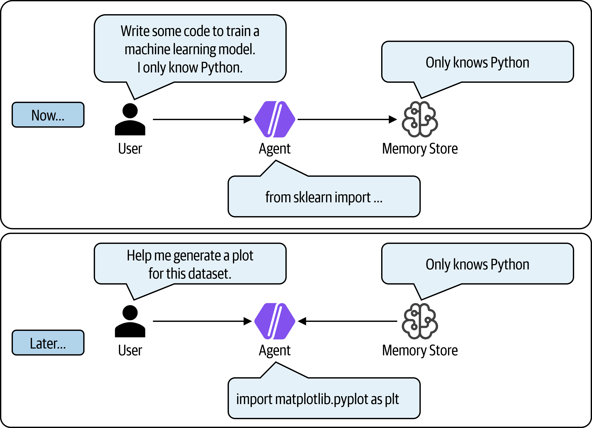{#fig-9BA0}


To add a memory store to your Agent, navigate to the *Memory* section of your Agent's Playground. Click the *Add* button and then select *+ Create memory store*, as shown in @fig-D4BD. You can have multiple memory stores per agent, which can be useful for separating different types of information (e.g., user preferences vs. task state). Each memory store has its own configuration and retention policies. 

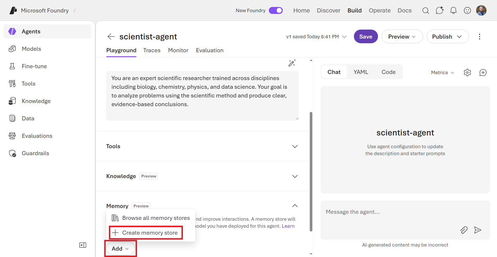{#fig-D4BD}

Then, you can also edit the memory store, as shown in @fig-4132. By default, the scope of the memory is at the `{{$userId}}` level, which provides per-user memory isolation without hard-coding identifiers yourself. If a user identity is not found, it will fall back to the caller's Microsoft Entra token (`{tenant-id}_{object-id}`). You can also edit the update delay, which dictates how long to wait after inactivity to update memories.

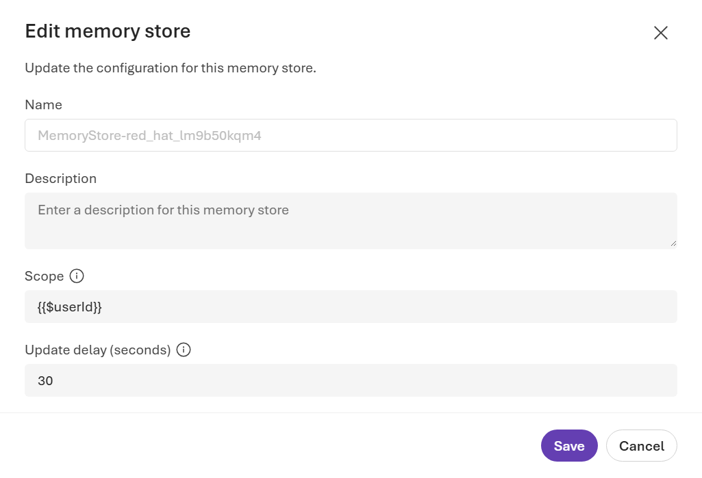{#fig-4132}

Memory stores can be reused between different agents. So, you could have multiple agents that all reference the same memory store if you want them to share information about a given user. You can also choose to have separate memory stores for different agents if you want to keep their contexts isolated. Either way, memory is a really useful capability that can help your agents provide a more personalized and contextually relevant experience for users (that feels similar to what we experience when using AI tools like ChatGPT or Claude).

### Evaluations

If you need to evaluate the quality and safety of your generative AI applications, the *Evaluations* feature in Microsoft Foundry allows you to use multiple industry standard metrics and other evaluators to assess the performance of your agents. You can use this to evaluate your agents during development and testing, and you can also set up ongoing evaluation in production to monitor for any issues or degradation in performance over time.

To test out the Evaluations feature, navigate to the *Evaluations* screen from the left-hand menu of the Foundry Portal under *Build*. Click the *Create* button, as shown in @fig-AB12, to set up a new evaluation.

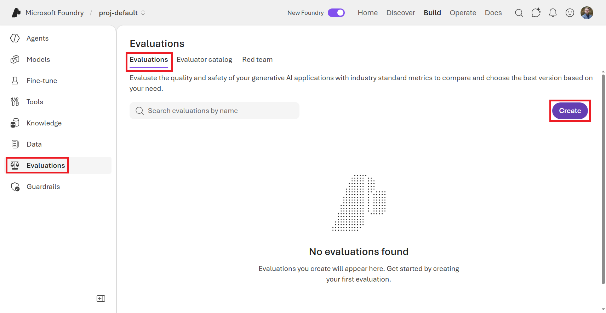{#fig-AB12}

The next screen will allow you to pick whether to evaluate a model, an agent, or a dataset. Then, you can either upload a set of input test prompt or have synthetic data generated for you. Lastly, you'll pick the criteria on which to form the evaluation. This includes a wide variety of standard evaluation metrics such as task adherence, tool call accuracy, fluency, etc. This is shown in @fig-510E. If you were to run the evaluation, you would get a detailed report that breaks down the performance of your agent across the different metrics and test cases. This can be really helpful for identifying areas of strength and weakness in your agent's performance, and for tracking improvements over time as you make changes to your agent's design, the underlying model it uses, or its instructions.

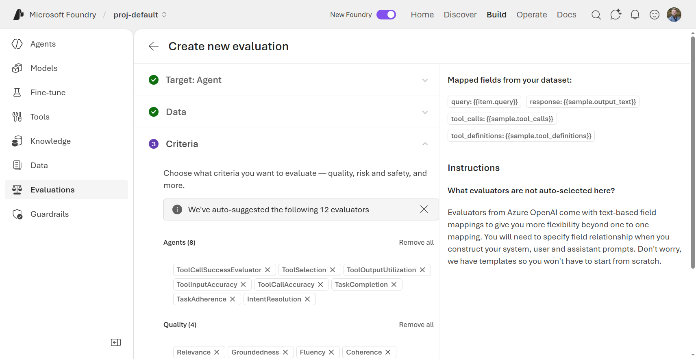{#fig-510E}

Back on the *Evaluations* page, under *Evaluator catalog*, you will see a list of built-in evaluators that you can use to evaluate your agents. These include a wide variety of purpose, from operational evaluations (e.g., "Did the agent follow the instructions and pick the right tool?") and safety evaluations (e.g., "Is the agent's generating vulnerable code?") to functional evaluations (e.g., "How well does this agent handle customer service situations?"). You can also create your own custom evaluators if you have specific criteria that you want to assess that are not covered by the built-in options. When you click on one, as shown in @fig-CB0B, you can read more about what the evaluator does.

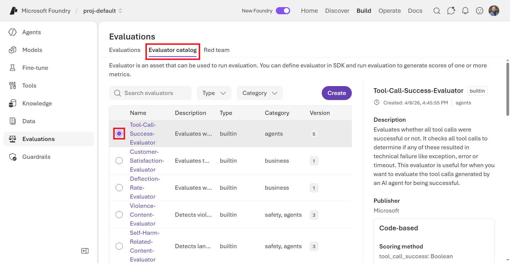{#fig-CB0B}

Lastly, to automate the identification of safety and security risks, Foundry provides a *Red team* feature that simulates adversarial attacks on your agents to identify vulnerabilities. More specifically, it probes for novel risks (both content and security-related) by attempting to cause your AI system to misbehave.

### Batch Jobs

Usually, when we're talking about using LLMs, we think about real-time interactions, such as a user asking a question and the model generating a response. However, there are also many use cases where you might want to use LLMs in a batch processing mode asynchronously. For example, you might want to analyze a large corpus of documents, generate summaries for a set of articles, or perform data transformation on a big dataset.

The *Batch Jobs* feature in Microsoft Foundry allows you to run LLM workloads in a batch processing mode, which can be more efficient and cost-effective for certain types of tasks that don't require real-time responses.

To create a batch job, navigate to the *Models* screen from the left-hand menu of the Foundry Portal under *Build* and click the *Batch jobs* tab, as shown in @fig-17AA. Then, you can click the *Create batch job* button to set up a new batch job.

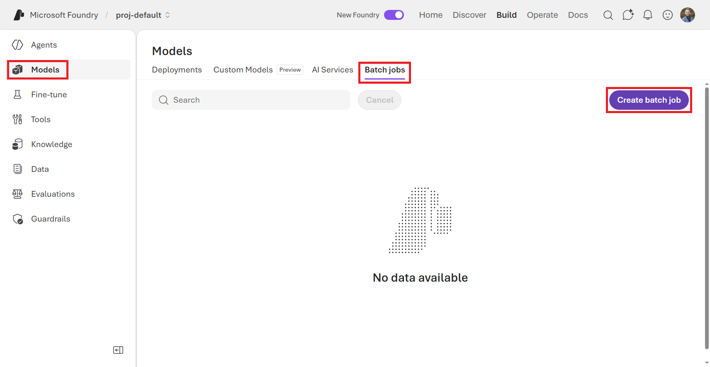{#fig-17AA}


Just like when we were fine-tuning a model, batch jobs also use `.jsonl` formatted files. Each line of the file represents a separate request to the model, and you can include any input that you would normally send to the model in a real-time interaction. The difference is that instead of sending these requests one at a time, you can send them all at once as part of a batch job. This allows you to process large volumes of data more efficiently.

```jsonl
{"custom_id": "task-0", "method": "POST", "url": "/v1/chat/completions", "body": {"model": "gpt-5.1", "messages": [{"role": "system", "content": "You are an AI assistant that helps data scientists learn about machine learning."}, {"role": "user", "content": "What is a convolutional neural network?"}]}}
{"custom_id": "task-1", "method": "POST", "url": "/v1/chat/completions", "body": {"model": "gpt-5.1", "messages": [{"role": "system", "content": "You are an AI assistant that helps data scientists learn about machine learning."}, {"role": "user", "content": "What is a transformer model?"}]}}
{"custom_id": "task-2", "method": "POST", "url": "/v1/chat/completions", "body": {"model": "gpt-5.1", "messages": [{"role": "system", "content": "You are an AI assistant that helps data scientists learn about machine learning."}, {"role": "user", "content": "What is the difference between supervised and unsupervised learning?"}]}}
```

There's not much to configure on the *Create a batch job* screen, as the main thing is just to upload your `.jsonl` file, which defines everything, and then kick off the job. Once the job is running, you can monitor its progress and view the results once it's complete. See @fig-E07D for an example of what the batch job creation screen looks like with the sample `.jsonl` file from the accompanying GitHub repo under [data/ch09/tiny_batch_data.jsonl](data/ch09/tiny_batch_data.jsonl) is uploaded.

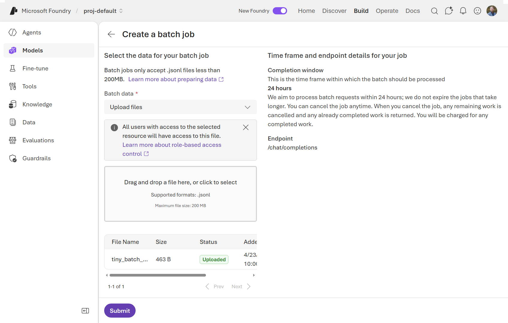{#fig-E07D}


### AI Services

For the majority of this book, we've been focused on LLMs, but there are certainly many other AI models that can be deployed and used within Microsoft Foundry. In addition to LLMs, Foundry also supports a variety of other AI services, such as text-to-speech, translation, language detection, personally identifiable information (PII) detection, content understanding, and more. These services can be used in conjunction with your agents to provide additional capabilities and enhance the overall user experience.

As shown in @fig-2CED, you can find the *AI Services* options under the *Models* section of the Foundry Portal. From there, you can explore the different services that are available and how to use them. Clicking on any of these services will open up a Playground for you to test out the service and see how it works. (Also, if you click the bullet beside the service name, it will show you the Target URI and Key to call the service programmatically.) For example, let's click on one of the newer AI Services: *Azure Speech - Voice Live*.

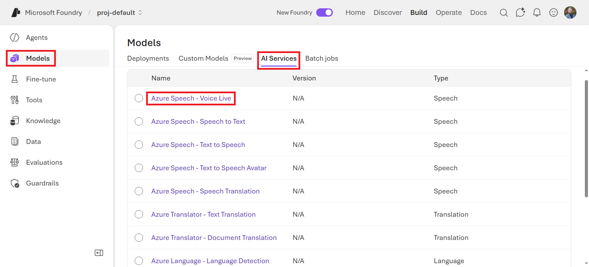{#fig-2CED}

In the Playground for the *Azure Speech - Voice Live* service, you can scroll through a few sample configurations such as customer service, language learning, or casual chat. Then, after clicking the *Start* button, you can have a live conversation with the model using your microphone, and it will respond back to you in real-time using text-to-speech. Try tweaking the response instructions, temperature, or even the voice that's being used. You can get some pretty comical (or weird) voice agents this way.

This is a really fun way to experience the capabilities of these AI services and to see how they can be used in different scenarios. You could even integrate this service into your agents (by clicking the *Add to agent* button) to enable voice interactions for users, which could be especially useful for accessibility or for use cases where typing is not ideal, like in a mobile app.

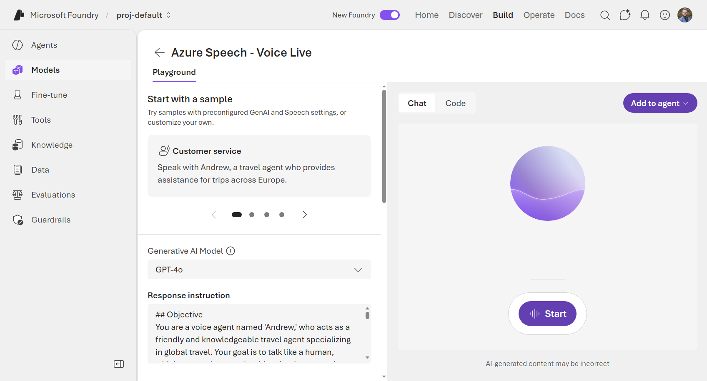{#fig-C30F}


Try out a few of the AI Services to get a feel for what other AI capabilities exist outside the realm of LLMs. You might find some that are really useful for your agents or for other applications you'll need for future projects.

## Related Open-Source Projects

In addition to the features available today in Microsoft Foundry, Microsoft has also released a number of open-source projects that are related to agentic workloads. These projects can be used in conjunction with Foundry or independently, depending on your needs. I'm mentioning a few here as I think they could be useful in certain scenarios, but this is not an exhaustive list of all the agent-related projects that Microsoft has released.

### GraphRAG

You may recall in the Knowledge Bases chapter we built a Retrieval Augmented Generation (RAG) system using Azure AI Search and connected an agent to our data. There are many RAG-based architectures and approaches to building intelligent agents, each with their own strengths and weaknesses.

Normal RAG may struggle to connect the dots well enough for an LLM to synthesize a coherent response when answering a question requires traversing disparate pieces of information. There's also the limitation that traditional RAG systems may struggle to summarize semantic concepts when given a very large collection of data. This is where GraphRAG comes in.

GraphRAG is an open-source framework that simplifies the process of building RAG systems by providing a set of tools and libraries for integrating graph databases with LLMs. It allows you to create knowledge graphs from your data and use them to enhance the retrieval capabilities of your agents. GraphRAG uses LLM-generated knowledge graphs to provide substantial improvements in question-and-answer performance when conducting document analysis of complex information.

Here are some terms to know when working with GraphRAG:

- Entities & Relations: Extract key concepts and how they connect
- Communities: Cluster strongly-related entities together into groups that represent a piece of knowledge
- Hierarchy: Organize information into multiple levels of granularity, from topic-specific details to high-level overviews.

When running GraphRAG, it has two main steps: 

1. *Index:* Slices up the input corpus into a series of TextUnits, then extracts all entities, relationships, and key claims. It then performs hierarchical clustering of the graph and generates summaries of each community and its constituents from the bottom-up.
2. *Query:* Retrieves the most relevant graph nodes based on the query and flattens the graph into a prompt for the LLM. The LLM can then use the structured information in the graph to generate more accurate and coherent responses. There are multiple query modules in GraphRAG, including:
  - *Global Search:* Enables reasoning about holistic questions about the corpus by leveraging the community summaries.
  - *Local Search:* Enables reasoning about specific entities by fanning-out to their neighbors and associated concepts.
  - *DRIFT Search:* Enables reasoning about specific entities by fanning-out to their neighbors and associated concepts, but with the added context of community information.
  - *Basic Search:* Better for situations where your query is best answered by baseline RAG (standard top `k` vector search).

GraphRAG can also generate domain-adapted prompts for improved interactions with the LLM using the `graphrag prompt-tune` command. This tunes the prompt to find a better template for your specific dataset and use case, which can improve how the LLM organizes your data in the graph.

You can install GraphRAG and try it out yourself using the commands below. The initialization process will create two files, `.env` and `settings.yaml`, and an `input/` directory, in the current directory. The `.env` file is where you can set your environment variables to connect to models in Microsoft Foundry or to GPT model using OpenAI's API.

```bash
## Install GraphRAG
pip install graphrag

## Initialize
graphrag init

```

Once the initialization is complete, you can place your documents in the `input/` directory and then run the `index` command to build your graph. After that, you can run queries against your graph using the `query` command, specifying the search method using `--method`. For example, if I had a corpus of the text from all of O'Reilly's books and I wanted to know which of those books cover generative AI, I could run the following command:

```bash
## Index
graphrag index

## Query
graphrag query \
  "Which O'Reilly books cover generative AI?" \
  --method local
```

Since this open-source package sits outside of Foundry (at least for now), you'll have to get creative to integrate it with your Foundry agents. One approach could be to deploy GraphRAG as a microservice in Azure (e.g., using Azure Functions or Azure App Service) and then connect your Foundry agents to it via API calls. This way, you can leverage the enhanced retrieval capabilities of GraphRAG within your Foundry agents without having to wait for native integration.

To learn more about GraphRAG and how to use it, check out the GitHub repository: [https://github.com/microsoft/graphrag](https://github.com/microsoft/graphrag).

### Microsoft Agent Framework

The Microsoft Agent Framework is an open-source project that is touted as the "comprehensive multi-language framework for building, orchestrating, and deploying AI agents". It includes components for natural language understanding, dialogue management, and tool integration. The framework is available for Python, C#, and .NET and is designed to be flexible and extensible, allowing developers to create agents that can interact with a wide range of tools and services.

For example, in the code block below, we can quickly make an comedian agent:

```python
# pip install agent-framework
from agent_framework.foundry import FoundryChatClient
from azure.identity import AzureCliCredential

credential = AzureCliCredential() ## Uses your local Azure CLI credential
client = FoundryChatClient(
    project_endpoint="https://<FOUNDRY-RESOURCE>.services.ai.azure.com/api/projects/<FOUNDRY-PROJECT>",
    model="gpt-5.4-mini",
    credential=credential,
)

agent = client.as_agent(
    name="ComedianAgent",
    instructions="You are a comedian assistant. Make all of your responses funny, and always include a joke in your answer.",
)

## Get response (non-streaming)
result = await agent.run("Tell me a joke about computers.")
print(f"Agent: {result}")
## Agent: Why did the computer go to the doctor? Because it had a virus!
```

Parts of the Microsoft Agent Framework will feel familiar because they use the same services that power Microsoft Foundry. However, the Agent Framework is a separate project that can be used independently of Foundry. It provides a more code-centric approach to building agents, while Foundry provides a low-code/no-code interface for building and managing agents at scale. Depending on your needs and preferences, you may choose to use one or both of these tools in your AI agent development process.

For more information about the Microsoft Agent Framework, check out their GitHub repository: [https://github.com/microsoft/agent-framework](https://github.com/microsoft/agent-framework).

### Microsoft Agent Governance Toolkit

The Microsoft Agent Governance Toolkit is an open-source project that provides a set of tools and best practices for governing AI agents in production. It includes components for monitoring agent behavior, enforcing policies, and managing risks associated with AI agents. The toolkit is designed to help organizations ensure that their AI agents operate safely, ethically, and in compliance with regulatory requirements. This includes policy enforcement, zero-trust identity, execution sandboxing, and reliability engineering for autonomous AI agents.

The toolkit is agent framework-agnostic (i.e., use OpenAI or LangChain or whatever) and provides multiple layers of governance checks that cover all of the Open Web Application Security Project (OWASP) Agent Top 10 security risks with over 9,500 built-in tests. As shown in @fig-1FED, the governance workflow includes multiple steps that result in either allowing or denying an agent's action. This is not content moderation or prompt guardrails. This governs and agent's actions rather than model inputs or outputs.

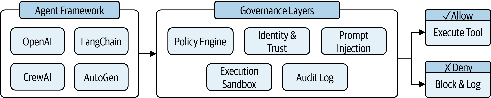{#fig-1FED}

Similar to zero-trust paradigms for human users, this toolkit also includes a zero-trust model for agent identity and access management. The toolkit defines 4 privilege rings for agent identity, which are shown in @fig-5BE2. Each ring has different levels of access and permissions, with Ring 0 being the most privileged and Ring 3 being the least privileged. All agents start at Ring 3, which locks the agent's capabilities to a sandbox. Then, after earning trust through safe actions, an agent can be granted access to higher privilege rings with more capabilities. This approach helps to mitigate risks by ensuring that agents only have access to the resources and permissions they need to perform their tasks, and that they must earn trust over time through their behavior.

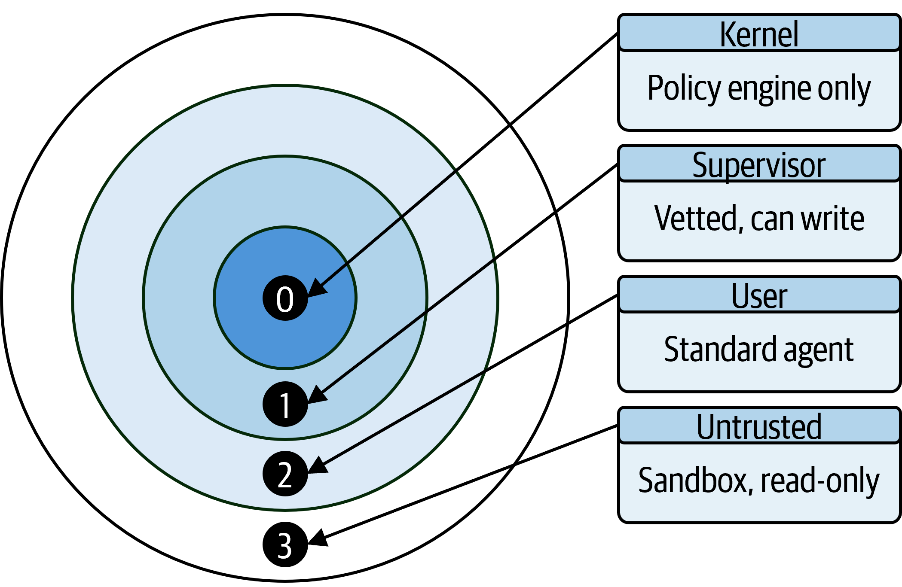{#fig-5BE2}

An example of how to use the policy evaluation component of the Microsoft Agent Governance Toolkit is shown in the code block below. In this example, we create a simple policy that blocks any tool calls to "execute_code" or "delete_file". We then evaluate two different tool calls against this policy, one that is allowed and one that is blocked.

```python
## pip install agent-governance-toolkit[full]
from agent_os.policies import *

evaluator = PolicyEvaluator(policies=[PolicyDocument(
    name="my-policy", version="1.0",
    defaults=PolicyDefaults(action=PolicyAction.ALLOW),
    rules=[PolicyRule(
        name="block-dangerous-tools",
        condition = PolicyCondition(
          field="tool_name",
          operator=PolicyOperator.IN,
          value=["execute_code", "delete_file"]
        ),
        action=PolicyAction.DENY, priority=100,
    )],
)])

result = evaluator.evaluate({"tool_name": "web_search"})    ## Allowed
result = evaluator.evaluate({"tool_name": "delete_file"})   ## Blocked
```

For more information about the Microsoft Agent Governance Toolkit, check out their GitHub repository: [https://github.com/microsoft/agent-governance-toolkit](https://github.com/microsoft/agent-governance-toolkit).


## Best Practices in Azure

As we've traversed through the various chapters of this book, we've touched on different technical considerations for building agents with Microsoft Foundry. However, I wanted to take a moment here at the end to summarize some of the best practices for cloud architecture that you can use as a starting point when designing your own Azure architecture for Foundry agents.

### Infrastructure and Configuration Management

When designing an Azure-based architecture for your AI use cases, treat your infrastructure as software from day one. Use Azure Resource Manager (ARM) templates, Bicep, or Terraform to define your infrastructure as code. This allows you to version control your infrastructure, easily replicate it across environments, and avoid the painful "works in dev, broken in prod" problem that plagues manually provisioned systems. For Foundry-specific resources (model deployments, agent configurations, and knowledge base connections) consider keeping these definitions alongside your application code in source control so that infrastructure changes go through the same review process as code changes.


### Security and Identity

AI agents can be surprisingly powerful actors in your organization, and with that power comes risk. Leverage Azure's native security and identity services such as Microsoft Entra ID for authentication and Azure Key Vault for secrets management. Never embed API keys or connection strings directly in your agent's instructions or tool definitions — these will inevitably end up in logs, conversation histories, and screenshots. Instead, use managed identities wherever possible so that your agents authenticate to downstream services without any credentials ever being stored.

Follow the principle of least privilege rigorously: an agent that only needs to read from a database should never be granted write access, even if it's "more convenient." If you're using the Microsoft Agent Governance Toolkit discussed earlier in this chapter, the privilege ring model provides a concrete framework for operationalizing this principle across your agent fleet.


### Observability
You cannot improve what you cannot see. Use Azure Monitor and Application Insights to set up end-to-end observability for your agents. At a minimum, you should be tracking latency per tool call, token consumption per session, error rates by agent and by model, and the ratio of successful task completions to abandoned sessions. Foundry's native tracing integrates with Application Insights, so you can correlate a user-facing error all the way back to the specific tool call or model response that caused it.

Beyond standard telemetry, consider instrumenting your agents with semantic logging — capturing not just that a tool was called, but what the agent was trying to accomplish when it called it. This makes post-incident analysis and prompt tuning significantly easier.
Compute and Integration Patterns

Azure Functions and Azure Logic Apps are natural complements to Foundry agents for anything that needs to happen asynchronously or event-driven. For instance, when an agent kicks off a long-running document analysis job (perhaps using the Batch Jobs feature covered earlier), an Azure Function can handle the completion callback and notify the user rather than keeping an agent session alive and waiting. Logic Apps are particularly useful for orchestrating multi-step integrations with third-party services — connecting your agent's outputs to CRM systems, ticketing platforms, or notification pipelines without writing bespoke integration code.

Azure API Management (APIM) deserves special attention when your agents expose capabilities to external consumers or when they call external APIs. APIM gives you a centralized layer for rate limiting, authentication enforcement, request transformation, and usage analytics. This is especially important if you're building agents that serve multiple business units or external customers, where you need fine-grained control over who can call what and at what volume.

### Scalability and Cost Management

Design for scalability by leaning on Azure's managed services. These include Azure Kubernetes Service (AKS) for containerized workloads, Azure App Service for web-facing components, and Azure Service Bus or Event Grid for decoupling high-throughput agent pipelines. However, resist the urge to over-engineer upfront. Start with simpler, fully-managed services and migrate to more complex orchestration only when you have real workload data justifying the operational overhead.

Cost management is often an afterthought with AI workloads, but it shouldn't be. Token costs compound quickly at scale. Set up Azure Cost Management budgets and alerts scoped to your Foundry resources from the very beginning. Tag all Foundry-related resources consistently (e.g., `workload: foundry-agents`, `env: prod`) so you can slice cost reports by agent, by team, or by environment without guesswork.


## Final Thoughts

I suppose all good things must come to an end, but the party has just begun! As we conclude this journey through Microsoft Foundry, remember that AI is not just about technology. It's about empowering people to accomplish more. The patterns, practices, and architectures presented in this book provide a foundation, but your creativity and domain expertise will ultimately determine success. I encourage you to experiment, iterate, and share your learnings with the community. The future of enterprise AI is being formed now with Microsoft Foundry at the center.

Key Takeaways:

1. *Start Simple*. Begin with a focused use case and expand gradually
2. *Security First*. Build security and compliance in from the start
3. *Measure Everything*. Use observability to understand and improve
4. *Iterate Rapidly*. Collect feedback and continuously refine
5. *Scale Thoughtfully*. Plan for growth but don't over-engineer initially
6. *Stay Current*. AI technology evolves rapidly; keep learning

As AI continues to evolve, Microsoft Foundry will evolve with it, providing new capabilities, models, and tools. The fundamentals of good engineering—clear requirements, solid architecture, comprehensive testing, and continuous improvement—remain constant.

I encourage you to experiment, build, and share your learnings with the community. Be sure to show off what you've built online.

Next Steps:

* Visit the [Microsoft Foundry portal](https://ai.azure.com) to start building
* Join the [Microsoft Foundry community](https://aka.ms/foundry/community)
* Keep an eye on the Dev Blog: [https://devblogs.microsoft.com/foundry](https://devblogs.microsoft.com/foundry) for updates and best practices.
* Explore the [documentation](https://learn.microsoft.com/azure/ai-foundry/)
* Work through the Foundry examples on GitHub: [https://github.com/microsoft-foundry/foundry-samples](https://github.com/microsoft-foundry/foundry-samples)
* Share your success stories and learn from others

Thank you for reading and, as always, stay curious...